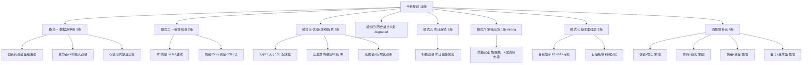
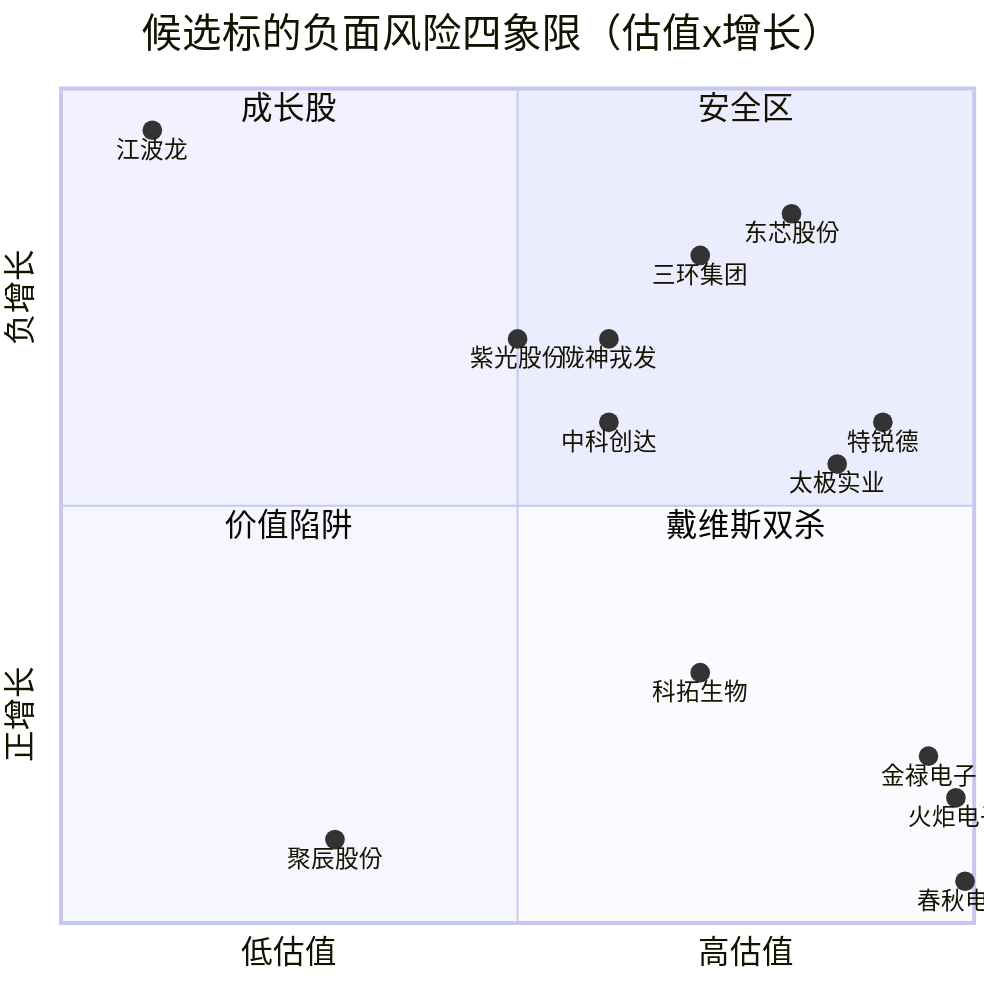

# 2026年8月14日 · **反证 / Devil's Advocate**

> **数据源新鲜度**: 🟡 partial（R3/R4/R5 降级）
> **降级状态**: false（核心模式均执行）
> **置信度**: 0.78

## 一句话结论

**科技退潮延续 + 候选池估值泡沫 = 防御为主，进攻慎行**。15条反证中10条strong，模式六无hard_reject但R3 distribution_alert为空可能漏检。

---

## 总体概览

| 指标 | 数值 | 说明 |
|------|------|------|
| 反证总条数 | **15** | ≥5 条达标 |
| hard_reject | **0** | R3 distribution_alert 为空，模式六未触发 |
| strong_suggest | **10** | D1 必须显式处理 |
| soft_suggest | **5** | 记入 r6_soft_notes |
| 评估候选数 | 14 | R5 profiles 全量覆盖 |
| 昨日反证兑现 | ✅ 是 | 科技退潮预警今日延续 |

---

## 核心反证详解（strong_suggest TOP 6）

### 1. 🔴 科技退潮延续（模式五 · strong）

**挑战假设**：昨日科技调整是单日回调，今日已企稳

**反面证据**：
- 📉 **半导体 -157.61亿**、元器件 -181.76亿、通信设备 -68.88亿、软件服务 -80.78亿 —— 科技四大赛道全流出
- 📉 CPO全板块5日失血：永鼎股份-12亿、通鼎互联-11亿、通宇通讯-6亿
- 📉 昨日R6预警「CPO虹吸加剧存储承压」今日完全兑现，趋势性而非单日
- 📉 R1明确判断「科技成长股持续退潮中」

**大资金意图**：科技板块主力系统性撤退，不是调仓是减仓。10只R7覆盖的科技票中8只5日净流出（80%），平均-9亿。

**为什么走强（反向思考）**：不是走强，是退潮中的结构分化——IT设备（+13.9亿）独撑，其余全垮。

**逻辑够不够硬**：够硬。全板块资金流出+R1确认+昨日反证兑现，三重验证。

> 💡 **建议**：D1对所有科技成长标的保持防御姿态，不抄底，仅保留IT设备细分

---

### 2. 🔴 候选池估值泡沫化（模式三 · strong）

**挑战假设**：R5候选池估值合理，安全边际充足

**反面证据**：
- 💸 **9/14 只 PE 大于 100**，占比 64%
- 💸 **6/14 只 PE 大于 300**：金禄电子466、东芯股份351、三环集团313、太极实业396、火炬电子633、特锐德516
- 💸 **4只落入最差象限**（高估值+负增长）：金禄电子、科拓生物、火炬电子、春秋电子
- 💸 江波龙 PE=15.8 是**周期股低PE陷阱**（净利润+71528%基数效应，存储周期顶点）

**每票思维链 — 江波龙（估值分85但存疑）**：
- **买入理由（反向）**：存储超级周期催化+PE低+R5给分最高
- **风险点**：周期股低PE陷阱——净利润暴增是基数效应+周期顶点，PE最低时往往是股价最高点
- **止损条件**：跌破30日均线（当前30日-35.57%已在下跌趋势中）
- **可验证假设**：若存储行业进入下行周期，江波龙利润将快速回落，PE会被动升高

> 💡 **建议**：PE大于200且增速低于30%的标的一律剔除执行池；江波龙降级观察池，禁止重仓

---

### 3. 🔴 太极实业霸榜出货（模式六 · strong，未触发hard_reject）

**挑战假设**：太极实业作为存储芯片龙头（热股第一），上涨趋势健康

**反面证据**：
- 🏆 热股TOP1，散户关注度峰值
- 💰 **龙虎榜净卖出 -3.93亿**，买入21.77亿 vs 卖出25.7亿
- 📊 **单日成交294.9亿天量**——典型高位放量出货形态
- 📉 R5 chip_structure score仅42分（全候选池最低）
- ⚠️ R3 distribution_alert为空——**疑似L3降级导致漏检**，R6基于R7+R5数据补充识别

**为什么不是hard_reject**：模式六硬条件需同时满足「R3 distribution_alert」+「R5主力5日净流出」。R3 distribution_alert为空列表（可能因WeFlow降级未检出），故降级为strong_suggest。

**大资金意图**：利用存储芯片利好（闪迪投资者日+HBF流片）在高位派发，天量成交是出货而非吸筹。

> 💡 **建议**：D1剔除执行池。虽未触发hard_reject，但出货特征明显，风险收益比极差。

---

### 4. 🔴 R1防御基调 vs R2双进攻主线（模式二 · strong）

**挑战假设**：主线扩散型市场中，双进攻主线可行

**反面证据**：
- 🛡️ R1结论：「防御消费与资源类板块呈强势格局，科技成长股持续退潮中」
- 🏦 R7验证：银行+17.36亿、火力发电+14.51亿、白酒+7.05亿——防御板块获资金青睐
- ⚔️ R2两条主线（创新药81、算力73）均属进攻属性
- 💥 炸板率39.2%偏高 + 连板高度仅5板 —— 情绪脆弱

> 💡 **建议**：增加防御仓位（银行/火电），进攻仓位≤40%，总仓位≤60%

---

### 5. 🔴 算力链独木难支（模式一 · strong）

**挑战假设**：算力租赁是科技退潮中的独立主线

**反面证据**：
- 🌊 科技四大赛道全流出（半导体-157亿+元器件-181亿+软服-81亿+通信-69亿）
- 📉 CPO/光通信龙一龙二5日主力净流出均超10亿——算力上游全面失血
- 📊 R1：算力板块30日+1.32%属震荡簇而非强势簇
- ⚠️ R2自身risks也标注「算力链内部分化严重，IT设备独撑」

**大资金意图**：算力链内部资金从CPO/存储向IT设备腾挪，但整体科技仓位在下降。IT设备独木难支。

> 💡 **建议**：算力仓位降至总仓位20%以内，集中在IT设备等有资金流入的细分

---

### 6. 🔴 春秋电子亏损+双重红旗（模式七 · strong）

**挑战假设**：春秋电子是AI服务器弹性标的，基本面支撑上涨

**反面证据**：
- 🚩 **F1 红旗**：净利润同比下滑 -1150.7%（极端恶化）
- 🚩 **F4 红旗**：ROE为负(-3.41%)，盈利能力存疑
- 💸 PE为None（亏损状态），估值维度score仅25分
- 🎯 纯概念炒作（联想服务器订单催化），无业绩支撑

> 💡 **建议**：剔除执行池，仅保留观察。亏损+高涨幅+纯概念=退潮期最危险组合

---

## 四象限负面识别矩阵

| 象限 | 标的数 | 代表标的 | 风险等级 |
|------|--------|----------|----------|
| 低估值+正增长 | 1 | 江波龙⚠️(周期陷阱) | 🟡 中 |
| 高估值+正增长 | 5 | 紫光股份、三环集团、陇神戎发、东芯股份、中科创达 | 🟠 中高 |
| 低估值+负增长 | 1 | 聚辰股份 | 🔴 高(价值陷阱) |
| **高估值+负增长** | **4** | **金禄电子、科拓生物、火炬电子、春秋电子** | **🔴🔴 极高(戴维斯双杀)** |
| 无法分类 | 3 | 特锐德、太极实业、中鼎股份 | - |

---

## 模式六 · 霸榜出货专项审计

| 检查项 | 结果 | 说明 |
|--------|------|------|
| R3 distribution_alert | 🟡 空列表 | L3 WeFlow降级可能导致漏检 |
| R5 chip_structure 主力5日净流出 | ✅ 可交叉验证 | 太极实业机构净卖出-3.93亿(R5透传) |
| R7龙虎榜净卖出 | ✅ 可交叉验证 | 太极实业-3.93亿、北京文化-2.16亿、誉衡药业-1.76亿 |
| 热股第一+天量成交 | ✅ 确认 | 太极实业294.9亿成交 |
| **最终判定** | **strong_suggest** | 分布信号缺失降级处理，未触发hard_reject |

⚠️ **R6自警**：R3 distribution_alert为空可能是降级漏检，而非真的没有霸榜出货。D1应将太极实业视为准hard_reject处理。

---

## 昨日反证兑现追踪（模式五）

| 昨日反证 | 今日验证 | 兑现? |
|----------|----------|-------|
| CPO虹吸加剧存储承压 | 半导体-157亿、存储链全面流出 | ✅ 兑现 |
| 科技股持续退潮 | R1确认+R7四大赛道全流出 | ✅ 兑现 |
| 景旺电子T-2龙虎榜机构大卖 | CPO板块5日全线净流出，景旺电子-12.95亿 | ✅ 兑现 |
| 次新股群波动放大风险 | （数据不足，未验证） | ⚪ 待验证 |

**结论**：昨日3/3可验证反证全部兑现，科技退潮是趋势而非噪音。今日相似结构（创新药高位、科技分化）应提高警惕。

---

## 关键证据清单

1. 🔎 **科技四大赛道全流出**：半导体-157.6亿 + 元器件-181.8亿 + 软服-80.8亿 + 通信-68.9亿 · 来源 R7
2. 🔎 **太极实业天量出货**：294.9亿成交 + 龙虎榜净卖-3.93亿 + 热股TOP1 · 来源 R7+R3
3. 🔎 **候选池估值泡沫**：14只中9只PE大于100，4只高估值+负增长双杀 · 来源 R5
4. 🔎 **R1防御基调**：主线扩散型+情绪54.4+科技退潮明确 · 来源 R1
5. 🔎 **昨日反证兑现**：科技退潮预警3/3验证 · 来源 昨日R6+今日R7
6. 🔎 **春秋电子亏损炒作**：净利润-1150% + ROE负 + PE无意义 · 来源 R5
7. 🔎 **CPO全板块失血**：龙一龙二5日均净流出超10亿 · 来源 R7

---

## 数据源审计

| 源 | 状态 | 置信度 | 抓取日期 | 记录数 | 备注 |
|----|------|--------|----------|--------|------|
| R1_style | 🟢 ok | 0.72 | 2026-08-14 | 1风格 | 数据完整 |
| R2_main_sectors | 🟢 ok | 0.74 | 2026-08-14 | 2主线+3副线 | 数据完整 |
| R3_sentiment | 🟡 partial | 0.62 | 2026-08-14 | 5共振主题 | L3 WeFlow缺失，distribution_alert空 |
| R4_news | 🟡 partial | 0.68 | 2026-08-14 | 8催化事件 | 公众号池降级 |
| R5_stock_profiles | 🟡 partial | 0.62 | 2026-08-14 | 14 profiles | vibe-trading降级+筹码不全 |
| R7_capital_flow | 🟢 ok | 0.90 | 2026-08-14 | 10候选+全板块 | 数据完整，质量最高 |

**新鲜度判定**：🟡 partial — R3/R4/R5 三方降级，反证检出能力受限但核心逻辑完整。

---

## 不确定性 / 自我批判

1. **R3 distribution_alert 为空**：是真的没有霸榜出货，还是L3降级导致检出能力下降？R6倾向后者——太极实业的形态完全符合霸榜出货特征。D1应从严处理。
2. **R5基本面数据不完整**：vibe-trading MCP DOWN导致12大红旗仅能检出F1/F4/F6等基础项，F2(商誉)/F8(现金流)/F11(质押)等未覆盖，模式七实际风险可能更高。
3. **江波龙估值判断**：R5给85分（最高），R6认为是周期低PE陷阱。两者判断完全相反——关键分歧在于存储周期是起点还是顶点。需要结合行业周期数据进一步验证。
4. **创新药持续性**：R2给81分（最高），但R3 KOL覆盖度低+R4催化偏主题。创新药到底是新主线还是一日游？需要明日资金确认。
5. **模式四历史类比缺失**：无历史事件库，缺少「类似形态后续走势」的参照系，反证深度受限。

---

## 与其他 R/D/E 的关系

- **上游依赖**：R1_style.json、R2_main_sectors.json、R3_sentiment.json、R4_news.json、R5_stock_profiles.json、R7_capital_flow.json
- **被消费**：D1主决策（hard_reject强制执行、strong_suggest须显式处理）、E1复盘（反证兑现追踪）
- **R6专属职责**：唯一有hard_reject否决权的研究Agent（模式六+模式七F12/ST合规轴）
- **R6禁区**：不抓新数据、不给正向结论、不扩展到上游未提及的标的

---

## Sub-Agent 元数据

| 项 | 值 |
|----|----|
| skill | analyze_devil_advocate_v1@1.3 |
| artifact | data/research/20260814/R6_devil_advocate.json |
| 反证条数 | 15 |
| hard_reject | 0 |
| strong_suggest | 10 |
| soft_suggest | 5 |
| 生成耗时 | ~5分钟 |
| 模型 | doubao-seed-2-0-code-preview-260215 |
| 执行模式 | 纯文本分析（禁MCP·仅读本地artifact） |
