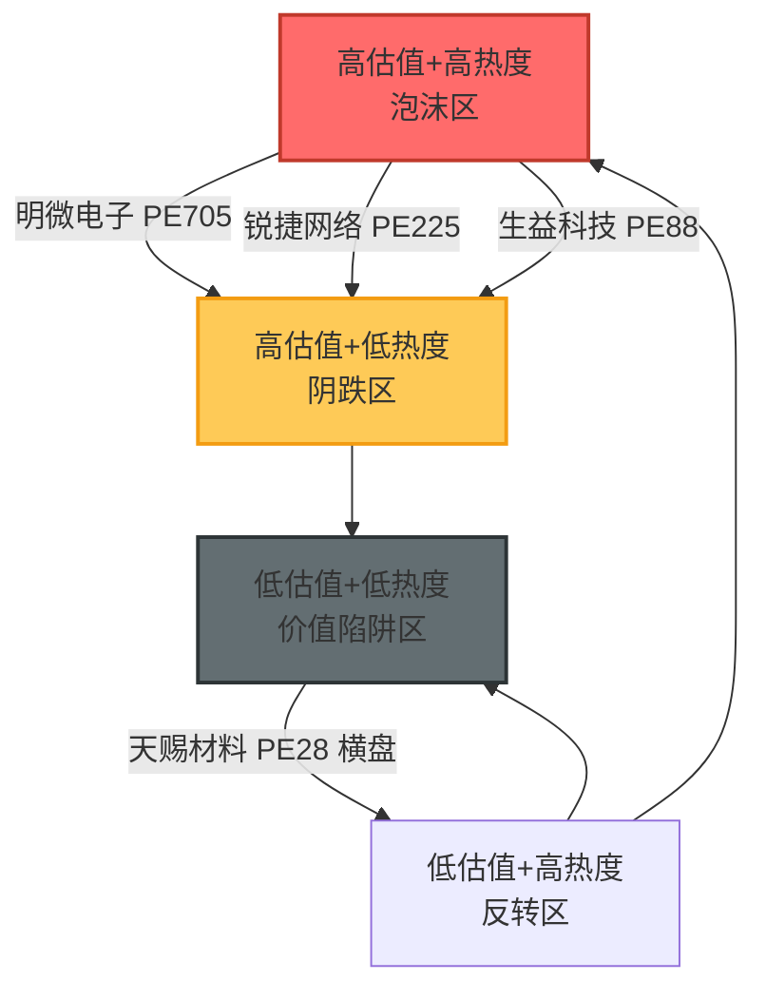

# 2026年08月17日 · **反证 / Devil's Advocate**

> **数据源新鲜度**: partial
> **降级状态**: False
> **置信度**: 0.72

## 一句话结论
科技退潮未止+防御环境推进攻主线，资金面与叙事面严重背离，11条反证中7条strong，建议D1将主线仓位上限压至30%。

---

## 详细分析

### 一、核心矛盾：防御环境 × 进攻主线

R1 今日判定为 **防御观望型**，情绪浓度 38.2（恐惧区间），弱势板块占比 54%，建议总仓位上限 60%。然而 R2 将 **光模块/CPO/光互联** 选为唯一核心主线，这是典型的高弹性科技进攻方向。

从资金面看，R7 数据（T-1 0814）显示：
- 元器件 **-181.76 亿**、半导体 **-157.61 亿**、通信设备 **-68.88 亿**——科技类三大板块全在流出榜前列
- 全市场主力净流出 **-1328.3 亿**
- 北向 5 日趋势小幅流出
- 流入方向是银行、生物制药、火力发电——典型防御板块

**这构成了三重背离**：R1 风格（防御）vs R2 主线（进攻）、R3 情绪（L1+L2 共振但 L3 缺失）vs R7 资金（科技失血）、R4 叙事（high 事件密集）vs 实际资金行为（抛售）。

### 二、估值泡沫化风险

对 R5 12 只候选标的估值扫描发现：

| 标的 | PE(估) | 估值判定 | 技术趋势 | 风险等级 |
|------|--------|----------|----------|----------|
| 明微电子 | 704.94 | 极贵 | 下跌后反弹 | 🔴 高 |
| 锐捷网络 | 225.07 | 极贵 | 拉升尾期 | 🔴 高 |
| 生益科技 | 88.55 | 极贵 | 横盘整理 | 🟠 中 |
| 北京君正 | 111.8 | 极贵 | 横盘整理 | 🟠 中 |
| 中际旭创 | 73.79 | 偏贵 | 下降趋势 | 🟠 中 |
| 深南电路 | 70.84 | 偏贵 | 横盘整理 | 🟡 低 |

**3 只极贵 + 2 只偏贵**，占主线候选近一半。更值得警惕的是：
- 龙二 **明微电子**：PE=705 + 筹码户数+23.4%（分散）+ 反弹非上升趋势
- **锐捷网络**：PE=225 + 拉升尾期 + 30日+41% + 筹码分散 → 典型高位派发形态

### 三、昨日预警兑现 & 连锁风险

20260814 R6 预警了三大风险：科技退潮延续、估值泡沫化、R1 防御 vs R2 进攻不一致。

今日 R7 数据确认科技板块继续大幅流出，R1 风格仍为防御观望，R2 仍然推出科技进攻主线——**相同的风险结构连续第二天出现**。

这不是一天的波动，而是趋势性的退潮。在退潮中期强行做反弹，胜率和赔率都不友好。

### 四、霸榜出货核查

R3 `hotlist_signals.distribution_alert = []`（空），未检出霸榜出货信号。

但需注意：R3 因 WeFlow L3 不可用已降级，`distribution_alert` 的检出能力可能不足。从替代信号看：
- 光模块核心标的（中际旭创、明微电子）未上龙虎榜
- 中际旭创户数环比 -15.8%（集中），非分散出货形态
- 但全板块资金大幅流出，不能排除「阴跌式出货」而非「霸榜式出货」的可能

**结论**：无 hard_reject，但 D1 盘中需警惕成交量异常放大的见顶信号。

### 五、基本面红旗

扫描 R5 透传的 `fundamental_flags`，发现：

| 标的 | 红旗数 | 红旗类型 | severity |
|------|--------|----------|----------|
| 盛科通信 | 2 | F3(ROE负) + F4(扣非负) | strong_suggest |
| 光线传媒 | 2 | F1(净利-98%) + F4(扣非负) | strong_suggest |
| 汇顶科技 | 1 | F1(净利-40%) | soft_suggest |
| 韦尔股份 | 1 | F1(净利-42%) | soft_suggest |

盛科通信作为 R4 推的算力弹性标的，PB = 73.22 + 亏损状态，完全靠叙事撑估值。

---

## 四象限负面识别

- **泡沫区（🔴 高危）**：3 只——明微电子、锐捷网络、生益科技
- **阴跌区（🟠 中危）**：2 只——中际旭创、深南电路
- **价值陷阱区（⚫ 观察）**：科技退潮期低估值科技股也可能继续阴跌
- **反转区（✅ 安全）**：暂未发现明确反转标的

---

## 反证条目清单

### 🔴 strong_suggest（D1 必须处理）

| ID | 模式 | 标的/对象 | 核心指控 |
|----|------|-----------|----------|
| R6_M1_01 | 数据源冲突 | 光模块/CPO主线 | R7资金面与R2叙事面严重背离，科技三板块全流出 |
| R6_M2_01 | 一致性检查 | R1防御vsR2进攻 | 防御观望环境推高波动科技主线，成功率低 |
| R6_M3_01 | 估值×主线临界 | 明微电子(龙二) | PE=705极贵+筹码分散+反弹非趋势，三重风险 |
| R6_M3_03 | 估值×主线临界 | 锐捷网络 | PE=225极贵+拉升尾期+筹码分散，高位派发 |
| R6_M5_01 | 昨日预期错误连锁 | 科技退潮延续 | 昨日预警今日再兑现，相同结构连续第二天 |
| R6_M7_01 | 基本面红旗 | 盛科通信 | ROE负+扣非负+PB=73，完全靠叙事 |
| R6_M7_02 | 基本面红旗 | 光线传媒 | 亏损+净利-98%，应排除 |

### 🟡 soft_suggest（D1 可选参考）

| ID | 模式 | 标的/对象 | 核心指控 |
|----|------|-----------|----------|
| R6_M1_02 | 数据源冲突 | 中际旭创龙一定位 | 技术面downtrend+30日-14%，与龙一定位不符 |
| R6_M3_02 | 估值×主线临界 | 中际旭创 | PE=73.8偏贵+下降趋势，估值与趋势双杀 |
| R6_M6_01 | 霸榜出货 | 光模块整体 | distribution_alert空但L3不可用，可能漏检 |
| R6_M7_03 | 基本面红旗 | 汇顶科技 | 净利同比-40%，Rubin催化存疑 |

### ⚫ hard_reject

无（R3 distribution_alert 为空，模式六未触发硬否决）

---

## 关键证据

- **证据 1**: R7 T-1 元器件-181.76亿、半导体-157.61亿、通信设备-68.88亿，科技板块持续失血 · 来源 R7_capital_flow
- **证据 2**: R1 防御观望型 + 情绪38.2(恐惧) + 弱势板块占比54% · 来源 R1_style
- **证据 3**: 明微电子 PE=704.94（极贵） + 户数环比+23.4%（筹码分散） · 来源 R5_stock_profiles
- **证据 4**: 锐捷网络 PE=225.07（极贵，PE分位100%） + 技术判定「拉升尾期」 · 来源 R5_stock_profiles
- **证据 5**: 昨日R6预警科技退潮，今日R7确认延续，R2仍推科技主线 · 来源 昨日R6 + 今日R7/R2

---

## 数据源审计

| 源 | 状态 | 抓取时间 | 记录数 | 备注 |
|---|---|---|---|---|
| R1_style | ✅ ok | 2026-08-17T07:08 | — | KMeans 6簇41标的 |
| R2_main_sectors | ✅ ok | 2026-08-17T07:50 | — | 1条主线+3条secondary |
| R3_sentiment | ⚠️ partial | 2026-08-17T07:05 | — | WeFlow L3不可用，仅L1+L2 |
| R4_news | ✅ ok | 2026-08-17T07:45 | 8事件 | 5个high强度 |
| R5_stock_profiles | ⚠️ partial | 2026-08-17T07:22 | 12只 | R2缺失用R4+R3+R7构建候选池 |
| R7_capital_flow | ⚠️ stale | 2026-08-17T07:06 | 5540条 | T-1日数据(0814)，非当日 |

---

## 不确定性 / 反证

1. **R7 数据滞后**：R7 为 T-1 数据，周末新催化（阿里云NPO、英伟达算力融资）可能已改变资金流向，今日开盘可能出现增量资金入场
2. **R3 L3 缺失**：WeFlow 不可用导致 `distribution_alert` 检出能力下降，可能漏检霸榜出货信号
3. **R5 候选池非标准路径**：因 R2 曾缺失（R5 运行时 R2 未就绪），候选池由 R4+R3+R7 构建，可能遗漏部分龙头
4. **模式四（历史类比）降级**：无历史事件库，无法通过历史相似行情判断退潮持续时间
5. **NPO/CPO 技术变革**：若 NPO 确实是颠覆性技术，估值体系可能需要重构，传统 PE 估值失效

---

## 与其他 R/D/E 的关系

- **依赖上游**:
  - R1_style.json（风格一致性检查）
  - R2_main_sectors.json（反证对象·主线与龙头）
  - R3_sentiment.json（共振验证 + distribution_alert）
  - R4_news.json（消息面交叉验证）
  - R5_stock_profiles.json（估值 + 筹码 + 基本面红旗）
  - R7_capital_flow.json（资金面交叉验证）
- **被消费下游**:
  - D1 主决策（hard_reject 强制执行 / strong_suggest 必须处理）
  - research_summary.json（orchestrator 汇总）

---

## Sub-Agent 元数据

- **skill**: analyze_devil_advocate_v1@1.2
- **artifact**: `data/research/20260817/R6_devil_advocate.json`
- **生成耗时**: ~2 分钟
- **模型**: doubao-seed-2-0-code-preview
- **执行模式**: 只读磁盘 JSON · 未抓取新数据
