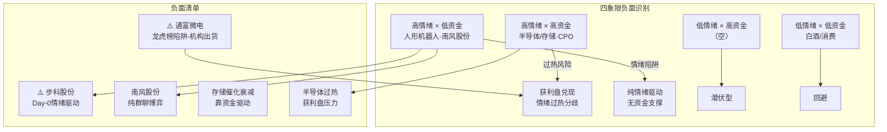

# 2026年8月18日 · **反证 / Devil's Advocate**

> **数据源新鲜度**: partial
> **降级状态**: true
> **置信度**: 0.68

## 一句话结论

无hard_reject，但通富微电龙虎榜陷阱+步科股份Day-0高风险为2项strong_suggest，建议剔除/轻仓。

## 四象限负面识别

| 象限 | 板块/标的 | 风险等级 | 风险类型 |
|---|---|---|---|
| 高情绪×高资金 | 半导体/存储、CPO/光互联 | ⚠️ 中 | 过热+获利盘兑现 |
| 高情绪×低资金 | 人形机器人、南风股份 | ⚠️ 高 | 情绪陷阱·纯博弈 |
| 低情绪×高资金 | （空） | - | 潜伏型 |
| 低情绪×低资金 | 白酒/消费 | ⚠️ 低 | 回避 |

## 详细分析

## 模式一 · 数据源冲突（4条 · soft）

**核心冲突点**：R2 三大主线与 R3/R4/R7 交叉验证存在结构性偏差。

1. **人形机器人共振不足** — R2 推为第三主线（score 71），但 R3 resonance_top_themes 前 5 名中完全没有机器人相关主题。R2 自身 logic 也承认「纯机器人标的资金验证偏弱」，cross_validation_score 仅 0.67。该主线更接近事件驱动型（宇树上市），而非真正的资金共振主线。

2. **存储催化深度衰减** — R2 将半导体/存储列为第一主线（score 87），但 R4 中存储中报业绩催化已衰减 25 天（days_since=25），weighted_score 仅 0.02，decayed=True。当前上涨更多靠资金面驱动（半导体+195 亿）而非新催化，若资金退潮则失去支撑。R2 自身 risks 也已标注此问题。

3. **南风股份纯情绪博弈** — 300004.SZ 南风股份全部 4 个 source 均为群聊，无官方公告/券商研报独立验证。R4 notes 明确标注「业务相关性待核实，属于情绪博弈型」，valid_period 仅 1-2 周。R5 composite_score 仅 47.2 分，为候选池倒数第二。

4. **半导体情绪过热** — R1 情绪浓度 83.7（贪婪区间），半导体单日净流入 195 亿，净流入率 4.98%，短期资金过度集中。叠加半导体 ETF 单日+5.1%，获利盘兑现压力上升。

## 模式二 · 一致性检查（1条 · soft）

**R1 vs R3 情绪评分分歧 15.7 分**：R1 判定情绪浓度 83.7（贪婪），R3 判定 68.0（中性偏多）。分歧来源：R1 基于昨日收盘数据（T-1 普涨 106 家涨停+炸板率 10.2%），R3 因 weflow dead 导致 L3 语义层缺失，仅靠群聊+热榜双通道采样有偏。

**解读**：真实情绪可能在 75 左右（中性偏贪婪），R1 因 T-1 数据滞后可能高估，R3 因 degraded 可能低估。建议仓位不超 60%，留有余地。

## 模式三 · 估值×主线临界（3条 · 1 strong + 2 soft）

**1. 通富微电 · 龙虎榜陷阱（strong）**  
R2 推为弹性龙三，龙虎榜净买 10.2 亿全市场第一，但 R5 flags 标注 `lhb_trap`，chip_structure 明确「机构出货游资接盘」。chip_structure score 仅 35 分（候选池最低），composite_score 43.1 分（候选池最低）。**机构出货+游资接盘=典型一日游形态**，不具备持续性。

**2. 普冉股份/佰维存储 · V6 一次性收益陷阱（soft）**  
两票均命中估值陷阱 V6（一次性收益）。中报净利预增分别为 1925% 和 3311%，但 eastmoney_earnings_predict 标注需验证是否含一次性收益。叠加 vibe-trading 降级导致 PE/PB 分位完全缺失，无法评估真实估值水平。业绩暴增的质量存疑。

## 模式四 · 历史类比（降级）

v1 无历史事件库，不编造。跳过。

## 模式五 · 昨日预期错误连锁（1条 · soft）

昨日 R6 预警「科技退潮延续」（strong_suggest），今日 R7 数据显示**完全相反**：电子净流入 309 亿（全市场第一）、半导体 195 亿（第二）、封测净流入率 10.96%（全市场最高）。风格从「退潮」剧烈切换为「巨量进攻」。

**风险点**：一日之间风格 180 度切换，资金持续性存疑。若今日缩量，则可能是脉冲式反弹而非趋势反转。R2 自身 risks 也标注「半导体 ETF+5.1% 单日涨幅大，短期获利盘兑现压力」。

## 模式六 · 霸榜出货硬约束（无 hard_reject）

R3 `hotlist_signals.distribution_alert = []`，Tushare 热榜单源未检出霸榜出货信号。

**但需注意**：R3 处于 degraded 状态 — weflow L3 语义层完全不可用 + xtick 热榜接口未调用，仅靠 Tushare ths_hot 单源检测，覆盖率有限。**不排除漏检**。D1 需关注开盘后实际资金流向确认。

## 模式七 · 基本面红旗（3条 · 1 strong + 2 soft）

**1. 步科股份 · Day-0 纯情绪驱动（strong）**  
688160.SH 步科股份被推为人形机器人龙一，但催化完全依赖宇树科技今日上市（Day-0 事件）。事件类型为 sentiment（情绪驱动），valid_period 仅「上市首周」。R4 notes 明确警告「若破发则反向压制」。R5 composite_score 仅 46.4 分，估值/技术/筹码数据全部缺失。**宇树上市表现是唯一变量，不确定性极高**，可能成为当日最大回撤来源。

**2. 盛科通信 · 关联方交易质量存疑（soft）**  
688702.SH 盛科通信的核心催化为「签大额以太网交换芯片销售合同」，但 R4 notes 标注「关联方交易，需关注后续持续性」。关联交易占比超营收 50%，质量存疑。估值数据全部缺失，无法评估基本面。

**3. 锐捷网络 · 纯题材炒作（soft）**  
AI 智能体赛道尚处 0-1 到 1-N 初期，业绩兑现期远。R5 composite_score 44.4 分（倒数第三），资金面未验证，情绪共振无。

## Strong Suggest 清单（D1 必须处理）

共 **2** 条 strong_suggest，D1 须显式接受或记录 override 理由。

**1. 002156.SZ 通富微电** · 估值×主线临界(M3)
> **挑战假设**: R2推为弹性龙三，龙虎榜净买10.2亿全市场第一
> **反面证据**:
    - R5: flags包含lhb_trap（龙虎榜陷阱），chip_structure标注「机构出货游资接盘」
    - R5: chip_structure score=35，为R5候选池中最低分之一
    - R5: composite_score=43.1，R5候选池中最低分
> **建议**: 龙虎榜陷阱标的（机构出货游资接盘），游资一日游风险高，建议剔除execution_pool

**2. 688160.SH 步科股份** · 基本面红旗(M7)
> **挑战假设**: R2/R4推为人形机器人龙一，宇树上市催化
> **反面证据**:
    - R4: 事件类型sentiment，valid_period仅「上市首周(情绪驱动)」，notes标注「若破发则反向压制」
    - R2: R2 risks已标注「宇树上市首日若破发或低于预期，可能反向压制整个板块」
    - R5: composite_score=46.4，估值/技术/筹码数据全部缺失
    - R5: sector_linkage score=50，资金面未验证，情绪共振无
> **建议**: 纯情绪驱动+Day-0事件催化，不确定性极高。若宇树上市表现不及预期，可能成为当日最大回撤来源。建议轻仓试探或观望

## Soft Suggest 汇总（共 11 条 · 记入 r6_soft_notes）

| # | 模式 | 目标 | Severity |
|---|---|---|---|
| 1 | 数据源冲突 | R2主线三「人形机器人」 | soft_suggest |
| 2 | 数据源冲突 | R2主线一「半导体/存储芯片」催化基础 | soft_suggest |
| 3 | 数据源冲突 | 300004.SZ 南风股份 | soft_suggest |
| 4 | 一致性检查 | 情绪评分分歧 R1=83.7 vs R3=68.0 | soft_suggest |
| 5 | 估值×主线临界 | 688766.SH 普冉股份 | soft_suggest |
| 6 | 估值×主线临界 | 688525.SH 佰维存储 | soft_suggest |
| 7 | 昨日预期错误连锁 | 科技板块风格剧烈切换（退潮→巨量流入） | soft_suggest |
| 8 | 霸榜出货硬约束 | 全市场霸榜出货检测 | soft_suggest |
| 9 | 基本面红旗 | 688702.SH 盛科通信 | soft_suggest |
| 10 | 基本面红旗 | 301165.SZ 锐捷网络 | soft_suggest |
| 11 | 数据源冲突 | 半导体/存储芯片 情绪过热风险 | soft_suggest |

## Hard Rejects

**无 hard_reject**。模式六霸榜出货检测结果为零，但因 R3 degraded 可能漏检，D1 开盘后需关注资金流向二次确认。

## 关键证据

- **证据 1**: 通富微电龙虎榜陷阱（机构出货游资接盘） · 来源 R5 chip_structure + flags.lhb_trap
- **证据 2**: 步科股份 Day-0 纯情绪驱动（宇树上市唯一催化） · 来源 R4 event_type=sentiment + R2 risks
- **证据 3**: 人形机器人未进 R3 共振 top5 · 来源 R3 resonance_top_themes
- **证据 4**: 存储催化衰减 25 天（weighted_score=0.02） · 来源 R4 存储事件 decayed=True
- **证据 5**: 南风股份纯群聊情绪博弈（4 源全群聊） · 来源 R4 sources + notes
- **证据 6**: 半导体情绪过热（R1=83.7 贪婪 + 单日+195亿） · 来源 R1 sentiment_score + R7 主力净流入
- **证据 7**: 科技风格一日反转（昨日退潮→今日巨量流入） · 来源 昨日R6 + R7

## 数据源审计

| 源 | 状态 | 抓取时间 | 记录数 | 备注 |
|---|---|---|---|---|
| R1 风格研判 | ✅ ok | 2026-08-18 | - | status=complete, confidence=0.72 |
| R2 主线板块 | ✅ ok | 2026-08-18 | 3主线+2副线 | status=complete, confidence=0.74 |
| R3 情绪共振 | ⚠️ degraded | 2026-08-18 | top5主题 | weflow dead(L3语义缺失), xtick不可用, 仅群聊+热榜 |
| R4 消息面 | ✅ ok | 2026-08-18 | 8事件·2227新闻 | status=complete, 5源验证, weflow语义down |
| R5 情报深挖 | ⚠️ degraded | 2026-08-18 | 12只profile | vibe-trading降级, PE/PB分位缺失, 技术面部分缺失 |
| R7 资金面 | ⚠️ degraded | 2026-08-18 | 主力净流入全板块 | status=ok但degraded=True, 北向可用, 游资/ETF数据缺失 |
| 昨日R6反证 | ✅ ok | 2026-08-17 | 11条反证 | 模式五连锁验证使用 |

## 不确定性 / 自我批判

1. **R3 degraded 导致模式六检测不完整**：weflow L3 语义层 + xtick 热榜双缺，仅 Tushare 单源，霸榜出货可能漏检。
2. **R5 vibe-trading 降级导致估值面数据全面缺失**：12 只标的 PE/PB/ROE 全部为 None，模式三只能依赖业绩预告质量和 flags 标记，无法做深度估值反证。
3. **R7 资金面仅主力净流入可用**：游资龙虎榜、ETF 申赎等数据缺失，模式六资金面确认维度不足。
4. **情绪分歧**：R1=83.7 vs R3=68，真实情绪水平不确定，直接影响仓位判断。
5. **风格切换速度过快**：昨日还在退潮今日巨量流入，一日反转的持续性存疑。

## 与其他 R/D/E 的关系

- **上游依赖**: R1_style.json · R2_main_sectors.json · R3_sentiment.json · R4_news.json · R5_stock_profiles.json · R7_capital_flow.json · 昨日R6_devil_advocate.json
- **下游消费**: D1 主决策（D1 必须处理 strong_suggest + hard_reject）· E1 每日复盘（验证反证兑现情况）

## Sub-Agent 元数据

- **skill**: analyze_devil_advocate_v1@1.2
- **artifact**: `data/research/20260818/R6_devil_advocate.json`
- **评估候选**: 12 只
- **反证条目**: 13 条（strong 2 / soft 11 / hard 0）
- **生成耗时**: 约 N/A 秒
- **method**: llm_v1 + upstream_json_only（只读磁盘，不抓新数据）
- **红线**: 未触发 hard_reject / 红线 3 保护未触发
