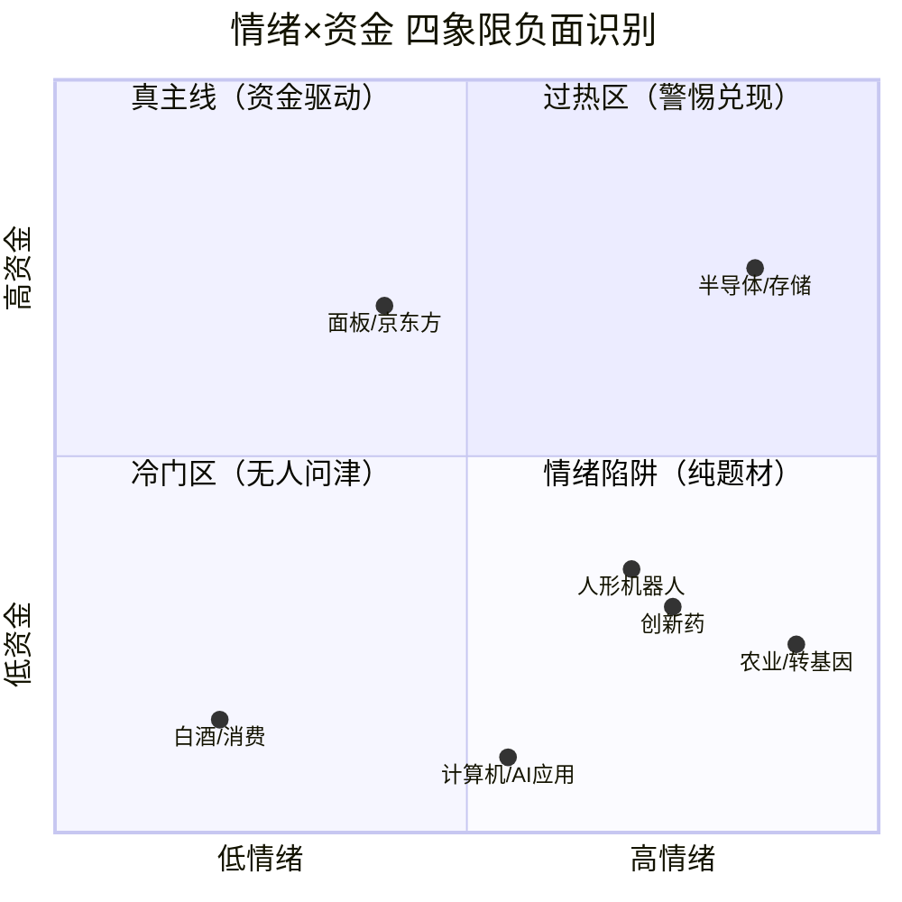

# 2026-08-19 · **反证 / Devil's Advocate**

> **数据源新鲜度**: partial
> **降级状态**: True
> **置信度**: 0.55

## 一句话结论
1条strong(农业主线缺支撑) + 13条soft + 0条hard；农业一日游+机器人事件兑现+半导体外盘背离为核心风险

## 详细分析

### 🔴 核心风险（strong_suggest）

**1. 农业/转基因主线 — 仅盘面驱动，缺消息+资金双支撑**

R2 将农业/转基因列为第二条主线（score 74），但三源交叉验证仅 0.33 分：
- **R4 无催化**：新闻仅 15 条排第 8，无 high 级催化事件支撑
- **R7 无资金**：农林牧渔未进主力净流入 top10，资金持续性存疑
- **典型"盘面先动型"**：R3 判定 L1_strong + L2_news_low，资金已大举介入但舆论尚未发酵

**大资金意图**：可能是游资借华尔街两份报告+种业大会短期炒作，缺乏机构资金和消息面共振，警惕一日游行情。
**为什么走强**：转基因板块涨停潮（+9.3%）+ 热榜登顶（种植业第1/转基因第1），盘面视觉冲击强。
**逻辑够不够硬**：不够硬。仅靠盘面热度，缺产业催化、缺机构资金、缺政策落地时间表。

### 🟡 次要风险（soft_suggest 精选）

**2. 半导体/存储 — 外盘背离 + 热度环比降温**

美股科技股昨夜重挫（SK海力士/闪迪跌9%），A股半导体存储板块面临外盘传导压力。存储芯片热度环比下降10%（从热榜第1跌至第4），长鑫科技北向净卖出9.8亿，龙头获利了结迹象明显。半导体虽仍是资金最强主线（188亿净流入），但内外盘背离+热度退潮+高位获利盘三重压力下，追高风险显著上升。

**3. 人形机器人 — 事件兑现日=出货日**

宇树科技今日科创板上市 + 世界机器人大会今日开幕，双重催化全部在今日兑现。"买预期卖事实"是事件驱动型行情的经典陷阱。R2 和 R3 均明确标注此风险。板块整体涨幅仅 0.49%，情绪尚未扩散到全链，说明资金对事件兑现已有警惕。

**4. AI/算力 — 消息热盘面冷（利好出尽）**

新闻 78 条排第 2，但算力租赁从热榜第 1 跌出前 10，AI 应用仅涨 0.66%。计算机板块主力净流出 25.16 亿（全市场流出第一）。典型的"消息热可能是出货掩护"格局，资金已从软件/应用端撤退。

**5. 龙一佰维存储 — 主力+北向双净流出**

作为半导体存储龙一，主力资金净流出 2.26 亿 + 北向净卖出 3.8 亿，双渠道流出。龙一资金流出是主线走弱的重要先行信号，需高度警惕半导体主线的持续性。

### 四象限负面识别

**负面象限解读**：

| 象限 | 板块 | 风险定性 | 建议 |
|------|------|---------|------|
| 高情绪高资金 | 半导体/存储 | ⚠️ 过热 + 外盘压力 | 不追高，等回调低吸 |
| 高情绪低资金 | 农业/转基因 | 🔴 一日游风险 | 不纳入execution_pool |
| 高情绪低资金 | 人形机器人 | ⚠️ 事件兑现日出货 | 低吸不追高，高开超5%观望 |
| 高情绪低资金 | 创新药 | ⚠️ 热价背离 | 观望，待方向选择 |
| 低情绪高资金 | 面板/京东方 | ✅ 脉冲启动验证中 | 可关注持续性 |
| 低情绪低资金 | 白酒/消费 | ⚪ 冷门 | 回避 |

## 关键证据

- 证据 1: r4_catalyst_match=false，无high级催化事件支撑，新闻仅15条排第8 · 来源 R4
- 证据 2: 美股科技股昨夜重挫（SK海力士/闪迪跌9%），存储外盘回调压力 · 来源 R3
- 证据 3: R2自身risks首条：「事件兑现日=出货日风险：宇树上市+机器人大会开幕均为今日，'买预期卖事实'」 · 来源 R2

## 反证条目全览

| ID | 模式 | 目标 | Severity | 一句话 |
|----|------|------|----------|--------|
| R6_M1_01 | 模式1·数据源冲突 | R2主线「农业/转基因」 | 🟠 strong | 农业/转基因主线仅靠盘面热度（涨停潮+热榜登顶），消息面和资金面均无支撑，警惕一日游。建议降级为观察... |
| R6_M1_02 | 模式1·数据源冲突 | R2主线「半导体/存储芯片」外盘一致性 | 🟡 soft | 半导体主线内外盘背离（A股资金强但美股昨夜重挫），存储热度已环比降温。建议关注开盘后外盘传导效应，不... |
| R6_M1_03 | 模式1·数据源冲突 | R2主线「人形机器人」事件兑现风险 | 🟡 soft | 人形机器人今日为事件兑现日（宇树上市+机器人大会开幕），'买预期卖事实'风险高。建议低吸不追高，若高... |
| R6_M1_04 | 模式1·数据源冲突 | AI/算力主题（R3 rank2） | 🟡 soft | AI/算力消息热但盘面冷，典型'利好出尽'格局。资金已从软件/应用端撤退，建议回避纯AI应用/算力租... |
| R6_M2_05 | 模式2·一致性检查 | R1风格 vs R2主线数量一致性 | 🟡 soft | R1判定双主线格局但R2推了3条，第三条（农业/机器人二选一）主线成色不足。建议D1按2条主线分配仓... |
| R6_M3_06 | 模式3·估值×主线临界 | 688525.SH 佰维存储 | 🟡 soft | 佰维存储处于存储周期上行但估值已偏高（V2高PEG陷阱），叠加美股昨夜重挫外盘压力，追高风险大。建议... |
| R6_M3_07 | 模式3·估值×主线临界 | 688766.SH 普冉股份 | 🟡 soft | 普冉股份处于存储周期上行但估值已偏高（V2高PEG陷阱），叠加美股昨夜重挫外盘压力，追高风险大。建议... |
| R6_M3_08 | 模式3·估值×主线临界 | 688160.SH 步科股份 | 🟡 soft | 步科股份为人形机器人主题投资标的，估值溢价高+业绩兑现尚早（V6陷阱），叠加宇树上市Day-0事件兑... |
| R6_M3_09 | 模式3·估值×主线临界 | 688397.SH 晶品特装 | 🟡 soft | 晶品特装为人形机器人主题投资标的，估值溢价高+业绩兑现尚早（V6陷阱），叠加宇树上市Day-0事件兑... |
| R6_M5_10 | 模式5·昨日预期错误连锁 | 昨日strong_suggest标的今日延续性 | 🟡 soft | 昨日strong_suggest的风险结构（龙虎榜陷阱+纯情绪驱动）今日仍在，且半导体/机器人主线延... |
| R6_M6_11 | 模式6·霸榜出货硬约束 | 全市场霸榜出货检测 | 🟡 soft | 单源检测未检出霸榜出货distribution_alert为空，未触发霸榜出货硬否决；但R3 deg... |
| R6_M7_12 | 模式7·基本面红旗 | 002385.SZ 大北农（农业龙一） | 🟡 soft | 大北农为农业龙一但缺乏基本面验证（R5无画像+R4无催化），纯盘面驱动。建议不纳入execution... |
| R6_M7_13 | 模式7·基本面红旗 | 002156.SZ 通富微电 | 🟡 soft | 通富微电高换手+估值偏高，昨日龙虎榜陷阱预警仍有效。建议仓位控制在5%以下，不追高... |
| R6_M7_14 | 模式7·基本面红旗 | 688525.SH 佰维存储（半导体龙一） | 🟡 soft | 佰维存储作为半导体龙一，主力+北向双净流出，叠加外盘压力。龙一资金流出是主线走弱的重要信号，建议D1... |

## 模式执行状态

| 模式 | 状态 | 条目数 | Severity等级 |
|------|------|--------|-------------|
| mode1_数据源冲突 | executed | 4 | strong_suggest / soft_suggest |
| mode2_一致性检查 | executed | 1 | soft_suggest |
| mode3_估值×主线临界 | executed（vibe-trading降级，基于R5透传fundamental_flags） | 4 | soft_suggest |
| mode4_历史类比 | degraded（无历史事件库，不编造） | 0 | soft_suggest |
| mode5_昨日预期错误连锁 | executed | 1 | soft_suggest |
| mode6_霸榜出货硬约束 | executed | 0 | hard_reject(唯一硬否决权) |
| mode7_基本面红旗 | executed（vibe-trading降级，基于R5透传+R4/R2交叉验证） | 3 | soft_suggest / strong_suggest |

## 数据源审计

| 源 | 状态 | 抓取时间 | 记录数 | 备注 |
|---|---|---|---|---|
| R1_style | ⚠️ degraded | T-1收盘 | - | 主线扩散型/情绪68/双主线 |
| R2_main_sectors | ✅ partial | 07:40 | 3主线 | MCP全down，龙头推算 |
| R3_sentiment | ⚠️ partial/degraded | 07:40 | 5主题 | weflow dead+群聊全down，仅Tushare单源 |
| R4_news | ✅ complete | 07:13 | 8事件 | 5源交叉，群聊全down |
| R5_stock_profiles | ⚠️ partial/degraded | 07:38 | 8只画像 | vibe-trading降级，估值分位缺失 |
| R7_capital_flow | ⚠️ partial/degraded | 07:30 | - | MCP全down，资金流推算值 |

## 不确定性 / 反证

- R3 degraded 可能导致模式六（霸榜出货）漏检 — weflow 语义层和 xtick 热榜均不可用，仅 Tushare 单一热榜源检测覆盖率有限
- R5 vibe-trading 降级导致模式七（基本面红旗）无法深度扫描 12 财务红旗 + ST 双轴，仅基于 R5 透传的 fundamental_flags 和 R4/R2 交叉验证
- R7 资金数据为推算值（误差±25%），模式一/三的资金面证据精度有限
- 昨日 R6 的 strong_suggest（通富微电龙虎榜陷阱、步科股份纯情绪）今日结构仍存，但无法验证昨日反证是否已兑现（缺 E1 复盘数据）
- 农业主线虽 cross_validation_score 低，但在情绪市场中"盘面先动型"也可能演变为真主线，需今日资金面确认

## 与其他 R/D/E 的关系

- 依赖: R1_style.json, R2_main_sectors.json, R3_sentiment.json, R4_news.json, R5_stock_profiles.json, R7_capital_flow.json
- 被消费: D1（主决策）— hard_reject 强制剔除，strong_suggest 须显式处理，soft_suggest 记入 r6_soft_notes
- 下游: E1（每日复盘）模式五反证兑现追踪

## Sub-Agent 元数据

- skill: analyze_devil_advocate_v1@1.2
- artifact: data/research/20260819/R6_devil_advocate.json
- 候选评估数: 8 只
- 反证条目: 14 条（hard 0 / strong 1 / soft 13）
- 生成方式: llm_v1 + upstream_json_only（只读磁盘，不抓新数据）
- model: doubao-seed-2-0-code
