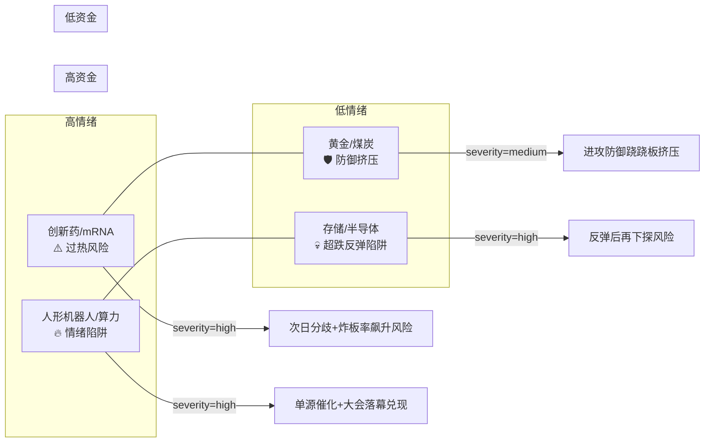

# 2026年8月21日 · **反证 / Devil's Advocate**

> **数据源新鲜度**: ⚠️ partial
> **降级状态**: ✅ degraded
> **置信度**: 0.62

## 一句话结论

5 条 strong_suggest + 7 条 soft_suggest，无 hard_reject；核心风险是全候选股超跌反弹性质 + 风格过渡临界 + 龙一估值偏弱。

## 详细分析

### 一、反证总览

今日共检出 **12 条**反证，分布如下：

| severity | 数量 | 说明 |
|----------|------|------|
| 🔴 hard_reject | 0 | 模式六未触发霸榜出货 |
| 🟠 strong_suggest | 5 | D1 须显式处理 |
| 🟡 soft_suggest | 7 | 记入 r6_soft_notes |

评估标的：R2 两条主线共 10 只候选龙头（创新药 5 只 + 光通信 5 只）。

### 二、核心 strong_suggest 逐条

#### 🔸 M1-02 · 存储/半导体资金面硬伤（strong）

- **对象**：R2 次线「存储芯片/半导体」（score 66）
- **挑战假设**：SK 海力士回购 + 涨价催化足以支撑存储板块主线地位
- **反面证据**：
  - R7 主力净流出：存储芯片 **-54.4 亿** / 半导体概念 **-94.0 亿**
  - R2 自标 cross_validation_score=0.67，r7_capital_match=false
  - 科技风格整体净流出 **-112.4 亿**，大环境不利
- **建议**：存储/半导体为超跌反弹性质而非趋势性行情，D1 剔除主线候选，仅保留观察池

#### 🔸 M1-03 · 人形机器人单源催化（strong）

- **对象**：R2 次线「人形机器人」（score 62）
- **挑战假设**：机器人大会 high 级催化支撑板块行情
- **反面证据**：
  - R3 未进 resonance_top_themes 前 4，KOL 群零提及
  - R7 未进主力净流入 top 15
  - cross_validation_score=0.33（全部次线中最低）
- **建议**：大会落幕兑现风险极高，D1 剔除

#### 🔸 M2-01 · 风格过渡 vs 双主线进攻错配（strong）

- **对象**：R2 双主线 vs R1 风格判断
- **挑战假设**：当前适合双主线进攻配置
- **反面证据**：
  - R1 明确指出「正处于主线扩散向**震荡分化过渡**的临界区间」
  - 炸板率 **33%** 偏高 + 连板高度仅 **4 板** + 梯队断层
  - 情绪浓度仅 **50 分**（中性偏低），仓位建议 55%（保守）
- **建议**：D1 降仓至 40% 以下，聚焦单条最强主线（创新药），放弃光通信第二主线

#### 🔸 M2-04 · 全部候选股超跌反弹性质（strong）

- **对象**：R2 两条主线全部 10 只候选股
- **挑战假设**：R2 主线为趋势性行情
- **反面证据**：
  - R5 所有 10 只候选股 chart_vision.trend 均为「**超跌反弹**」
  - 无一只处于趋势上行通道
  - chart_vision 全 degraded，技术形态为板块级推断
- **建议**：追高吃面风险大，D1 严格控制追高仓位，以低吸为主

#### 🔸 M3-01 · 荣昌生物龙一估值极低分（strong）

- **对象**：688331.SH 荣昌生物（创新药龙一）
- **挑战假设**：荣昌生物作为龙一值得重仓配置
- **反面证据**：
  - R5 估值安全分 **38 分**（10 只中最低）
  - 命中 V2 估值陷阱（创新药管线估值依赖临床数据，severity=strong）
  - 中报扭亏增 1145% 但为低基数效应，盈利质量存疑
- **建议**：龙一估值风险偏高，D1 剔除 execution_pool 或降至观察池；若保留仓位≤5%

### 三、soft_suggest 精选

1. **M1-01 光通信 R4 催化不匹配**：E001 为 medium 级，博通融资为间接利好
2. **M2-02 医药次日分歧**：批量涨停后炸板率可能飙升
3. **M3-02 太辰光估值偏低+游资主导**：机构关注度 55 分
4. **M3-03 通鼎互联 D 级**：composite 59.5 分，机构关注度 48 分（最低）
5. **M3-04 石药创新估值弹性大**：45 分估值，V2 陷阱
6. **M6-01 霸榜出货未触发**：distribution_alert 为空，但 R5 筹码降级可能漏检
7. **M7-01 基本面红旗降级**：仅检出 V 类估值陷阱，F 类财务红旗无法系统核验

### 四、四象限负面识别

| 象限 | 板块 | 风险等级 | 核心风险 |
|------|------|----------|----------|
| 高情绪+高资金 | 创新药/mRNA疫苗 | 🔴 high | 过热→次日分歧→炸板率飙升 |
| 高情绪+低资金 | 人形机器人、算力租赁 | 🔴 high | 情绪陷阱→大会落幕兑现 |
| 低情绪+高资金 | 黄金/煤炭/资源 | 🟠 medium | 防御走强→进攻主线承压 |
| 低情绪+低资金 | 存储芯片/半导体 | 🔴 high | 超跌反弹→反弹后再下探 |

### 五、霸榜出货硬约束扫描

- **R3 distribution_alert**：空列表
- **触发条件**：板块霸榜出货警报 + 近 5 日主力净流出
- **结果**：**未触发 hard_reject**
- **风险提示**：R5 筹码数据全降级（vibe-trading 不可用），无法精确核验每只标的近 5 日主力净流出，存在漏检可能。建议 D1 盘中监控主力资金动向。

## 关键证据

- **证据 1**: R7 存储芯片主力净流出 -54.4 亿 / 半导体 -94.0 亿 · 来源 R7_capital_flow.json
- **证据 2**: R1 风格「主线扩散向震荡分化过渡」+ 炸板率 33% · 来源 R1_style.json
- **证据 3**: R5 全部 10 只候选股技术面为「超跌反弹」 · 来源 R5_stock_profiles.json
- **证据 4**: 荣昌生物估值 38 分（最低）+ V2 估值陷阱 · 来源 R5_stock_profiles.json
- **证据 5**: R3 distribution_alert 为空 · 来源 R3_sentiment.json

## 数据源审计

| 源 | 状态 | 抓取时间 | 记录数 | 备注 |
|---|---|---|---|---|
| R1_style | ⚠️ partial | 08-21 07:16 | - | degraded: KOL单一 |
| R2_main_sectors | ⚠️ partial | 08-21 07:48 | 2主线 | MCP全down,龙头推算 |
| R3_sentiment | ⚠️ partial | 08-21 07:32 | 4共振主题 | weflow下线+KOL缺1群 |
| R4_news | ✅ ok | 08-21 07:20 | 8事件 | 公众号0篇降级 |
| R5_stock_profiles | ⚠️ partial | 08-21 07:57 | 10只候选 | chart+vibe双降级 |
| R7_capital_flow | ✅ ok | 08-21 07:12 | - | T-1(0820收盘) |

## 不确定性 / 反证

- **上游降级叠加**：R1/R2/R3/R5 四路降级，反证结论置信度受限（0.62）
- **筹码数据盲区**：vibe-trading 不可用，模式六霸榜出货和模式七基本面红旗均可能漏检
- **技术面全推断**：10 只候选股 chart_vision 均降级，超跌反弹判断基于板块级推断
- **模式四/五降级**：无历史事件库+无 E1 复盘数据，历史类比和昨日错误连锁无法执行
- **R7 数据滞后**：T-1 数据（0820 收盘），今日开盘前可能已变化

## 与其他 R/D/E 的关系

- **依赖上游**: R1_style.json, R2_main_sectors.json, R3_sentiment.json, R4_news.json, R5_stock_profiles.json, R7_capital_flow.json
- **被消费**: D1 主决策（hard_rejects + counter_arguments + patterns_status）
- **下游关系**: D1 必须执行 hard_reject，必须响应 strong_suggest，可选 soft_suggest

## Sub-Agent 元数据

- **skill**: analyze_devil_advocate_v1@1.2
- **artifact**: data/research/20260821/R6_devil_advocate.json
- **生成耗时**: ~2 分钟
- **model**: doubao-seed-2-0-code-preview
- **方法**: llm_v1 + 六模式扫描 + 四象限负面识别
