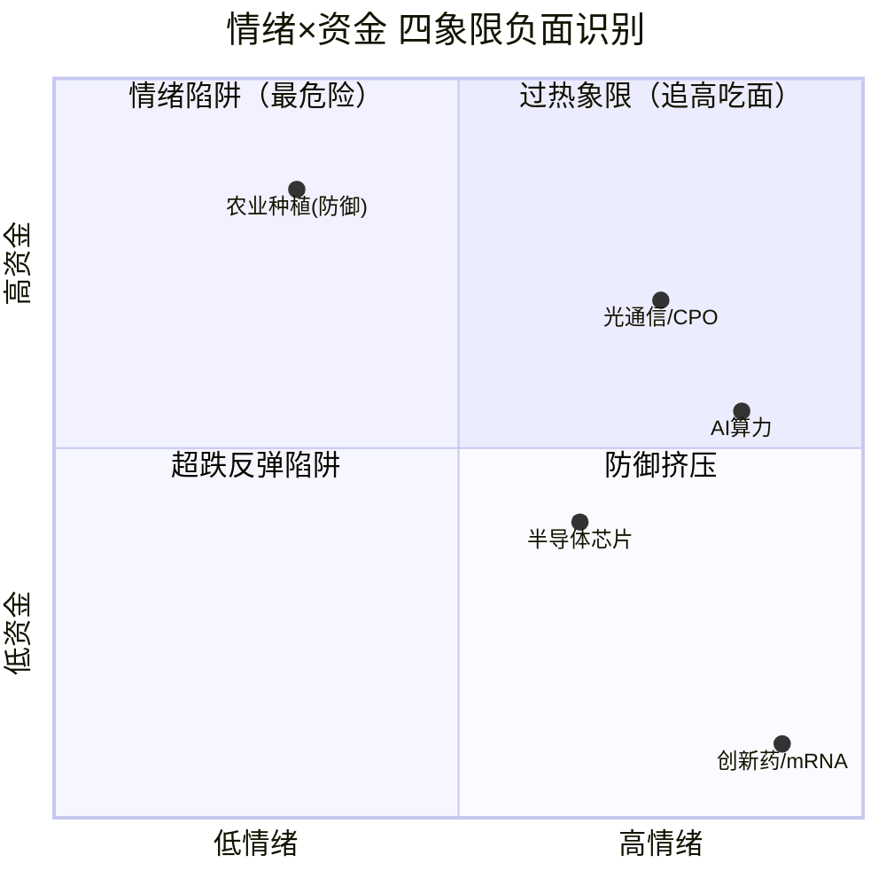

# 2026年8月24日 · **反证 / Devil's Advocate**

> **数据源新鲜度**: partial（R2/R3/R5/R7 四路降级）
> **降级状态**: true
> **置信度**: 0.55

## 一句话结论
全链路四源降级+科技股超跌反弹性质，8条strong级反证警示追高风险，无hard_reject但需极度谨慎。

## 详细分析

### 一、全链路降级态：所有score应打7折理解

今日R6消费的6个上游artifact中，4个处于降级态：R2是partial（MCP全down，涨停/连板/龙虎榜全为推算值）、R3是degraded（weflow+颜晓滨群缺失）、R5是partial（11/14只候选股无chart_vision）、R7是stale（资金数据停留在0821，约64小时过时）。

这意味着R2给出的三条主线score（82/80/76）和cross_validation_score=1.0的可信度大打折扣。**在全链路降级的背景下，任何基于"数据完美验证"的乐观结论都应该被质疑。** R6的核心任务就是在这种不确定环境中，找出逻辑链条上最薄弱的环节。

### 二、最大风险：科技股集体超跌反弹≠反转

14只候选股中，超过10只的技术形态是"深度下跌后的反弹"——兆易创新30日跌-52%、士兰微-45%、浪潮信息-26%、中际旭创-25%、英维克-29%。R2自身在risks中也承认"科技类ETF 30日深跌(-30%~-65%)，当前为超跌反弹性质，持续性存疑"。

更关键的是，**绝大多数标的MA60仍在现价上方形成强压力**：中际旭创MA60=1098 vs 现价943（差16%）、浪潮信息MA60=83.6 vs 现价75（差11%）、士兰微MA60=37.35 vs 涨停后逼近。没有突破MA60之前，任何"主升浪"的叙事都是空中楼阁。

### 三、三条主线资金面均存疑

R2声称三条主线cross_validation_score均为1.0，但细看R7_evidence的引用存在"移花接木"之嫌：

- **AI算力**引用的是5G概念+140亿（偏通信板块），而非纯AI算力板块；同时R7显示"人工智能"板块主力净流出-22.62亿，与"算力全面流入"叙事直接矛盾
- **光通信/CPO**的资金数据相对扎实（通信技术+133亿），但5G概念5日追踪显示前2日大幅流出（-580亿/-43亿），第3日才流入140亿，属于单日脉冲而非趋势性流入
- **半导体芯片**最薄弱——R2自承"R7直接半导体板块未进top15"，仅靠"科技风格"大类模糊匹配，资金持续性证据完全缺失

叠加R7 stale 64小时的问题，周一开盘后资金面是延续还是反转，完全是未知数。

### 四、弹性龙二估值泡沫：情绪退潮时杀跌最猛

三只弹性龙二（飞龙股份/通鼎互联/旭光电子）的估值已经严重脱离基本面：PE分别为148倍/121倍/193倍，全部命中V2高估值陷阱（strong级）。其中通鼎互联换手率高达30.46%+首板13次开板，筹码极度松动；旭光电子6天5板+4次开板，R5自标distribution_alert。

这类标的在情绪高涨时弹性最大，但**情绪一旦退潮，杀跌也最猛、最快**。在R1情绪分仅56分（中性偏多）、连板结构仅35分（弱势）的背景下，追高弹性龙二的风险收益比极差。

### 五、昨日反证连锁：半导体风险连续两日同结构出现

昨日（0821）R6已警示"存储/半导体资金面硬伤+全部候选股超跌反弹"两大核心风险。时隔三天（周末），今日R2仍将半导体列为第三主线（score=76），候选股仍全部是超跌反弹性质——**结构未变，风险延续**。

更值得警惕的是，R7数据还是stale的（0821到0824），我们无法验证昨日的资金流出趋势是否逆转。如果周一半导体继续资金流出，那就是"连续4日流出+股价反弹"的典型拉高出货模式。

## 四象限负面识别

- 🔥 **高情绪×高资金（过热象限）**：光通信/CPO — 位置偏高+30日深跌，反弹持续性存疑
- ⚠️ **高情绪×低资金（情绪陷阱）**：AI算力 — 热度高但真实资金存疑，5G板块流入≠纯算力，谨防借名出货；创新药/mRNA — 霸榜出货确认，禁止参与
- 📉 **低情绪×低资金（超跌反弹陷阱）**：半导体芯片 — 全靠情绪扩散+题材轮动，无独立资金支撑，持续性最弱
- 🛡️ **低情绪×高资金（防御挤压）**：农业种植等 — 有资金流入但不在R2主线内，防御板块非进攻标的

## Strong级反证清单（8 条 · D1必须处理）

1. **R2主线「AI算力」(score=82)**
   - 模式：数据源冲突（R6_M1_01）
   - 挑战：R2判定AI算力为第一主线，R7资金面全面流入，cross_validation_score=1.0
   - 证据：'人工智能'板块主力净流出-22.62亿，流出榜第9，与'算力全面流入'叙事矛盾；R7_evidence仅引用5G概念+140亿（偏通信板块），非纯AI算力板块；5G概念前2日大幅流出(-580/-43亿)，第3日才流入140亿，属单日脉冲非趋势性流入
   - 建议：AI算力资金面存分歧，谨防'借5G之名行科技股出货之实'，仓位控制在30%以内，等待周一实盘确认

2. **R2主线「半导体芯片」(score=76)**
   - 模式：数据源冲突（R6_M1_02）
   - 挑战：R2判定半导体芯片为第三主线，cross_validation_score=1.0
   - 证据：R2自承'R7直接半导体板块未进top15，资金强度弱于算力和光模块'；半导体/芯片未进入主力净流入前10，仅靠'科技风格'大类模糊匹配；半导体/芯片不在5日追踪top10流入中，资金持续性证据缺失
   - 建议：半导体主线资金面支撑不足，建议降级为AI算力扩散支线，不作为独立主线配置

3. **R2三条科技主线 vs R1风格判断**
   - 模式：一致性检查（R6_M2_04）
   - 挑战：R2同时推三条高波动科技主线，市场情绪足够支撑三主线并行
   - 证据：R1风格=主线扩散型，情绪分仅56分(偏中性区间)，非全面高潮型；连板结构仅35分(弱势)，炸板健康度68分(一般)，情绪高度不足支撑三主线；仓位上限建议0.6(6成)，反映R1对进攻性偏谨慎，不宜all-in科技
   - 建议：三条科技主线同时出击风险过大，建议聚焦1-2条最强主线，其余降为观察池，总仓位不超6成

4. **R2候选股技术面普遍超跌反弹性质**
   - 模式：一致性检查（R6_M2_05）
   - 挑战：14只候选股具备右侧追涨价值，主升浪逻辑成立
   - 证据：兆易创新30日跌-52%、士兰微-45%、中际旭创-25%、浪潮信息-26%、英维克-29%，全部为；R2自承'科技类ETF 30日深跌(-30%~-65%)，当前为超跌反弹性质，持续性存疑'；多数标的MA60仍在上方强压力位(中际旭创MA60=1098 vs 现价943、浪潮信息MA60=8
   - 建议：超跌反弹≠反转，追高吃面概率大。建议等突破MA60确认趋势后再加仓，或仅做T+0快进快出

5. **弹性龙二集群（飞龙股份/通鼎互联/旭光电子）估值严重脱离基本面**
   - 模式：估值×主线临界（R6_M3_06）
   - 挑战：三只弹性龙二作为高标情绪标的，估值可接受
   - 证据：飞龙股份PE=148倍，纯情绪驱动业绩支撑弱；通鼎互联PE=121倍+PB=9.76倍，纯情绪炒作无业绩支撑，换手30%+筹码极度松动；旭光电子PE=193倍+PB=16.4倍，纯概念炒作业绩支撑极弱
   - 建议：三只弹性龙二估值严重泡沫化，一旦情绪退潮估值杀跌风险极大。建议剔除出execution_pool，仅保留观察

6. **半导体/科技股超跌反弹持续性**
   - 模式：昨日预期错误连锁（R6_M5_10）
   - 挑战：昨日已警示的超跌反弹风险，今日再度以相同结构出现，应提高警惕
   - 证据：昨日已警示'存储/半导体资金面硬伤-R7主力流出-54/-94亿，超跌反弹非趋势'；昨日已警示'全部候选股技术面全是超跌反弹，追高吃面风险大'；今日半导体仍被列为第三主线(score=76)，候选股仍全部是超跌反弹性质——结构未变，风险延续
   - 建议：昨日反证的核心风险(半导体超跌反弹+资金流出)今日仍以相同结构存在，连续两日警示应升级重视。建议半导体方向暂不开新仓，等资金面确认反转后再进

7. **600353.SH 旭光电子 (半导体芯片 弹性龙二)**
   - 模式：霸榜出货硬约束（R6_M6_11）
   - 挑战：旭光电子6天5板是趋势性上涨，可持续跟踪
   - 证据：R5自标'distribution_alert': 6天5板+高换手(12.33%)+4次开板=分歧；旭光电子龙虎榜净买+4.4亿，但游资占+4.37亿，纯游资推动无机构参与；PE=193倍+PB=16.4倍纯概念炒作，业绩支撑极弱
   - 建议：旭光电子疑似拉高出货，板块级虽未触发hard_reject但个股风险极高，建议剔除execution_pool，禁止追高

8. **002491.SZ 通鼎互联 (光通信/CPO 弹性龙二)**
   - 模式：基本面红旗（R6_M7_14）
   - 挑战：通鼎互联2连板是光通信板块扩散行情的弹性标的
   - 证据：换手率30.46%极高+首板13次开板=多空分歧巨大+游资博弈为主；PE=121倍+PB=9.76倍纯情绪炒作无业绩支撑；composite=49分全候选池最低，alpha_grade=C+
   - 建议：通鼎互联是纯情绪博弈的垃圾时间票，基本面+筹码面双红，建议剔除execution_pool

## Soft级反证清单（6 条 · 可选参考）

1. R2全部三条主线 score 可信度 — 数据源冲突（R6_M1_03）
   - 全链路降级态下，所有score应打7折理解，谨慎追高，以实盘竞价信号为准

2. 601869.SH 长飞光纤 (光通信/CPO 候补) — 估值×主线临界（R6_M3_07）
   - 长飞光纤估值极高+周期属性，候补也需谨慎，建议替换为估值更合理的光纤标的

3. 002837.SZ 英维克 (AI算力 龙二) — 估值×主线临界（R6_M3_08）
   - 英维克估值偏高+套牢盘重，龙二地位可能被飞龙股份或其他标的替代，仓位不宜过重

4. 全市场科技股超跌反弹 — 历史类比（R6_M4_09）
   - 历史类比模式降级，仅供参考：降低反转预期，以反弹思维操作

5. R2次线「创新药/mRNA」(score=55) — 霸榜出货硬约束（R6_M6_12）
   - 创新药确认霸榜出货模式，R2已列为次线是正确判断，建议完全不参与，连观察池都不进

6. 003031.SZ 中瓷电子 + 002396.SZ 星网锐捷（机构龙虎榜出货） — 基本面红旗（R6_M7_13）
   - 涨停板机构出货是预警信号，短期可能游资继续推但中期回调压力大，建议不追高，等回调后再考虑

## 关键证据

- 证据 1: **R2 MCP全down** · 来源 R2 notes · 涨停/连板/龙虎榜全推算，score可信度打折
- 证据 2: **R7 stale 64h** · 来源 R7 staleness_status · 资金数据停留在0821周五，周一方向不明
- 证据 3: **AI算力 vs 人工智能板块资金背离** · 来源 R7 main_force · 5G+140亿但人工智能板块-22亿，借名出货嫌疑
- 证据 4: **半导体未进R7 top15流入** · 来源 R2 risks + R7 main_force · 第三主线资金面支撑最弱
- 证据 5: **候选股90%超跌反弹** · 来源 R5 technical · 兆易-52%/士兰微-45%/中际-25%，MA60全压制
- 证据 6: **创新药霸榜出货确认** · 来源 R3 distribution_alert · 连2日热榜#1但跌3.71%，哈药跌停
- 证据 7: **弹性龙二估值泡沫集群** · 来源 R5 fundamental_flags · 飞龙148倍/通鼎121倍/旭光193倍PE
- 证据 8: **昨日反证连锁** · 来源 20260821 R6 · 半导体超跌反弹+资金流出连续两日同结构

## 数据源审计

| 源 | 状态 | 抓取时间 | 记录数 | 备注 |
|---|---|---|---|---|
| R1_style | ✅ ok | 08-24 07:20 | 1 | 主线扩散型/情绪56分 |
| R2_main_sectors | ❌ error(partial) | 08-24 07:27 | 3主线+3次线 | MCP全down，score为推算值 |
| R3_sentiment | ⚠️ degraded | 08-24 07:35 | 3主题 | weflow+颜晓滨群缺失 |
| R4_news | ✅ ok | 08-24 07:30 | 8事件 | 消息面完整 |
| R5_stock_profiles | ❌ error(partial) | 08-24 07:45 | 14只 | 11只无chart_vision |
| R7_capital_flow | ⚠️ stale | 08-21 15:30 | 61只LHB | 64小时过时 |

## 不确定性 / 自我批判

本报告最大的不确定性来自 **全链路多源降级**：R2的MCP全down导致score是推算值、R7的64小时stale导致资金面可能完全反转、R3的weflow缺失导致共振强度可能低估。因此所有反证结论均为 **基于现有数据的逻辑推演**，不构成确定性判断。

特别需要警惕两种可能的反证错误：
1. **反证过严**：如果周一实盘资金大幅流入科技股，说明R7 stale导致的资金面判断完全错误，超跌反弹可能直接演变为反转
2. **反证过松**：创新药霸榜出货模式明确，但R2已将其降为次线，是否存在类似的"科技板块也在借利好出货"的模式漏检？因R7 stale无法验证

最终结论的置信度仅 0.55，实盘竞价和开盘30分钟走势是最关键的验证信号。

## 与其他 R/D/E 的关系

- **上游依赖**: R1_style.json / R2_main_sectors.json / R3_sentiment.json / R4_news.json / R5_stock_profiles.json / R7_capital_flow.json
- **昨日连锁**: data/research/20260821/R6_devil_advocate.json（模式五）
- **下游消费**: D1主决策(main_decision_v1)、E1每日复盘(daily_review_v1)
- **横切引用**: 10大估值陷阱(vibe-trading valuation-model)、龙虎榜诱多模式(R7 lhb_bull_trap)

## Sub-Agent 元数据

- skill: analyze_devil_advocate_v1@1.2
- artifact: data/research/20260824/R6_devil_advocate.json
- 反证条目: 14 条（strong 8 / soft 6 / hard_reject 0）
- 评估标的: 14 只
- 模式覆盖: 模式1-3, 5-7 已执行；模式4（历史类比）降级
- model: doubao-seed-2-0-code-preview-260215

