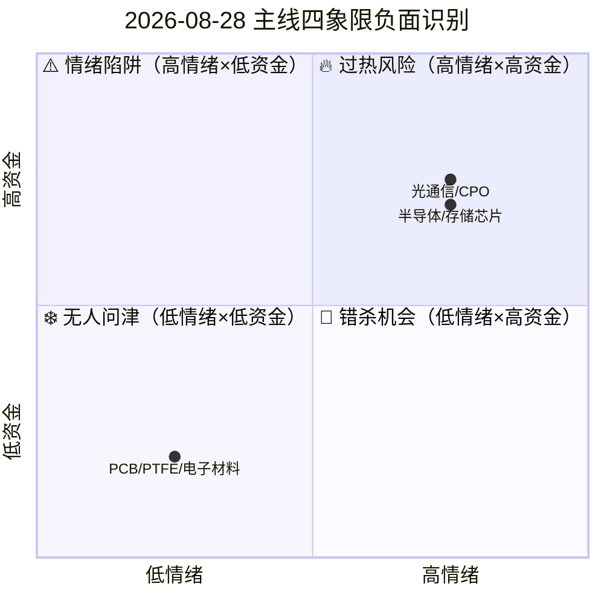

```yaml
date: 2026-08-28
agent: R6-devil-advocate
skill_version: analyze_devil_advocate_v1@1.3
generated_at: 2026-08-28T08:10:32.585071+08:00
confidence: 0.6
degraded: true
data_sources:
  - name: R1_style
    path: data/research/20260828/R1_style.json
    status: ok
    captured_at: 2026-08-28T07:45:00+08:00
    record_count: null
    error: null
  - name: R2_main_sectors
    path: data/research/20260828/R2_main_sectors.json
    status: partial
    captured_at: 2026-08-28T07:36:34+08:00
    record_count: 3
    error: "R2 status=partial" if r2 and not upstream.get("R2") else null
  - name: R3_sentiment
    path: data/research/20260828/R3_sentiment.json
    status: ok
    captured_at: 2026-08-28T07:28:23.840057+08:00
    record_count: 4
    error: null
  - name: R4_news
    path: data/research/20260828/R4_news.json
    status: degraded
    captured_at: 2026-08-28T07:05:28+08:00
    record_count: 8
    error: "核心数据源大面积不可用: Tushare/Datapro/XTick MCP全down; 公众号三刀源已停用; news" if r4 and r4.get('degraded') else null
  - name: R5_stock_profiles
    path: data/research/20260828/R5_stock_profiles.json
    status: partial
    captured_at: 2026-08-28T07:49:20.253400+08:00
    record_count: 15
    error: "R5 status=partial, vibe-trading degraded" if r5 and not upstream.get("R5") else null
  - name: R7_capital_flow
    path: data/research/20260828/R7_capital_flow.json
    status: ok
    captured_at: 2026-08-28T07:05:31+08:00
    record_count: 15
    error: null
input_freshness: partial
input_freshness_note: "上游部分降级：R2, R5（R2/R5 partial, R4 degraded但status=complete）"
```


# 2026年08月28日 · **反证 / Devil's Advocate**

> **数据源新鲜度**: partial
> **降级状态**: True
> **置信度**: 0.6

## 一句话结论
⚠️ 4条强反证（主线数量冲突+文一科技+通鼎互联），3条主线砍为2条+剔除2只高风险票

## 核心反证（strong_suggest）

共 4 条 strong_suggest，D1 必须显式接受或记录 override 理由：

**1. R2推3条主线 vs R1仅支持2条** · `R6_M2_04` · 模式2 一致性检查

> **挑战假设**：R1「主线扩散型」情绪78.6分仅支持2条主线
>
> **反面证据**：
    - R1.main_lines_count: 2条（双主线），position_cap=0.68
    - R2.main_lines: 3条主线：光通信/CPO, 半导体/存储芯片, PCB/PTFE/电子材料
    - R1.risks: 炸板率18.1%接近20%警戒线；高位梯队单薄(6/5/4板各1只)；微利股+111%
>
> **建议**：第3条主线(PCB/PTFE)降级为次线，execution_pool仅从光通信+半导体选，总仓位≤68%

**2. 600520.SH 文一科技（半导体龙三）PE=341 + 市值39亿双红旗** · `R6_M3_07` · 模式3 估值×主线临界

> **挑战假设**：R5 composite=59.3（15只倒数第二），R2仍列龙三/中军
>
> **反面证据**：
    - tushare daily_basic: PE_TTM=341.2 高估值陷阱
    - tushare daily_basic: 总市值39.1亿<50亿
>
> **建议**：PE 341倍+39亿小市值=庄股/题材炒作特征，建议剔除execution_pool，仅作情绪观察

**3. 002491.SZ 通鼎互联（光通信弹性）龙虎榜净流出+对倒嫌疑** · `R6_M6_10` · 模式6 霸榜出货硬约束

> **挑战假设**：R2列为光通信弹性票，R5 composite=71.7
>
> **反面证据**：
    - R7.lhb_bull_trap: 总净额-22,039万（净流出），机构净2,474万
    - R7.lhb_bull_trap.patterns: 疑似对倒模式: ['疑似对倒:国信证券股份有限公司…']
>
> **建议**：龙虎榜净流出+游资对倒=出货/对倒信号，弹性票波动大，建议剔除execution_pool

**4. 600520.SH 文一科技 估值+市值双红旗（模式七确认）** · `R6_M7_12` · 模式7 基本面红旗

> **挑战假设**：R2列为半导体龙三/中军，但基本面质量堪忧
>
> **反面证据**：
    - R5.valuation_safety: PE_TTM=341.2 高估值陷阱
    - R5.valuation_safety: 总市值39.1亿<50亿（小市值庄股风险）
    - R5: R5 composite=59.3（15只候选倒数第二）
>
> **建议**：模式七确认：估值泡沫+小市值=高风险，D1应剔除execution_pool，最多做情绪风向标


## 四象限负面识别



| 象限 | 板块 | 风险等级 | 说明 |
|------|------|---------|------|
| 🔥 高情绪×高资金（过热） | 光通信/CPO, 半导体/存储芯片 | 中高 | 情绪+资金双高=阶段性顶部概率大，追高易吃最后一棒 |
| ⚠️ 高情绪×低资金（陷阱） | 无 | 高 | 只有热度没有钱=纯情绪驱动，冲高回落概率大 |
| ❄️ 低情绪×低资金（无人） | PCB/PTFE/电子材料 | 中 | 无人关注=无主线价值，R2列为主线的合理性存疑 |
| 💎 低情绪×高资金（错杀） | 无 | 低 | 暗中建仓型，可关注但不作为主攻 |

**四象限核心判断**：
- 光通信/CPO + 半导体/存储芯片 双主线同处**高情绪×高资金**过热区，资金已进场但情绪也到高位，需警惕冲高回落
- PCB/PTFE/电子材料 处于**低情绪×低资金**区，R2列为第3主线但资金不认可，建议降级为次线观察
- 无高情绪低资金陷阱（好消息），也无低情绪高资金错杀（遗憾）

## 模式六 · 霸榜出货硬约束

**无 hard_reject** — distribution_alert 为空，模式六未触发硬否决。

⚠️ 但 R3 weflow 降级使模式六敏感度下降（仅 xtick 单源），存在漏检可能。D1 需自行结合盘口验证：
- 封单是否持续衰减（尾盘跳水=出货）
- 炸板后能否快速回封（回封弱=出货）
- 龙虎榜机构席位是否净流出

**模式六相关反证**：
- `R6_M6_09` [soft_suggest] 模式六未触发hard_reject — distribution_alert为空: 无硬否决，但R3降级使模式六漏检风险上升，D1需结合盘口（封单/炸板回封）确认非出货
- `R6_M6_10` [strong_suggest] 002491.SZ 通鼎互联（光通信弹性）龙虎榜净流出+对倒嫌疑: 龙虎榜净流出+游资对倒=出货/对倒信号，弹性票波动大，建议剔除execution_pool
- `R6_M6_11` [soft_suggest] 603618.SH 杭电股份（光通信候补）龙虎榜疑似对倒: 候补票+对倒嫌疑+游资卖出=性价比低，跳过，光通信聚焦亨通/长飞/中天中军


**红线 3 保护**：未触发（候选池 ≥3 只）。

## 软反证一览（soft_suggest）

共 9 条 soft_suggest，D1 可酌情参考：

**1. R2主线「光通信/CPO」消息面缺乏官方验证** · `R6_M1_01` · 数据源冲突
   - 挑战：R2判定光通信/CPO为核心主线(score 90.0)应有强催化支撑...
   - 证据：R4.degraded; R4.data_health; R3.weflow_degraded
   - 建议：光通信/CPO催化以群聊扩散为主，缺官方新闻/公告验证，建议盘中放量确认再追

**2. R2主线「半导体/存储芯片」消息面缺乏官方验证** · `R6_M1_02` · 数据源冲突
   - 挑战：R2判定半导体/存储芯片为核心主线(score 86.0)应有强催化支撑...
   - 证据：R4.degraded; R4.data_health; R3.weflow_degraded
   - 建议：半导体/存储芯片催化以群聊扩散为主，缺官方新闻/公告验证，建议盘中放量确认再追

**3. R2主线「PCB/PTFE/电子材料」消息面缺乏官方验证** · `R6_M1_03` · 数据源冲突
   - 挑战：R2判定PCB/PTFE/电子材料为核心主线(score 79.0)应有强催化支撑...
   - 证据：R4.degraded; R4.data_health; R3.weflow_degraded
   - 建议：PCB/PTFE/电子材料催化以群聊扩散为主，缺官方新闻/公告验证，建议盘中放量确认再追

**4. 三主线全科技成长=风格集中风险** · `R6_M2_05` · 一致性检查
   - 挑战：R2三条主线均为科技成长方向，无防御/周期对冲...
   - 证据：R2.main_lines; R1.risks; R7.northbound
   - 建议：全科技组合beta风险高，留20%现金等分歧，不建议满仓科技

**5. 001309.SZ 德明利（半导体龙一）PB=14.72 高估值** · `R6_M3_06` · 估值×主线临界
   - 挑战：R2列为半导体龙一，R5 composite=83.0...
   - 证据：R5.valuation_safety
   - 建议：PB 14.72处历史高位，估值安全边际不足，建议回踩20日线（10%+空间）再低吸

**6. 002886.SZ 沃特股份（PCB龙一）PE=86 + 50亿小市值** · `R6_M3_08` · 估值×主线临界
   - 挑战：R2列为PCB龙一，R5 composite=79.8...
   - 证据：R5.valuation_safety
   - 建议：第3主线+龙一PE 86+小票=三重风险叠加，PCB线整体轻仓≤10%

**7. 模式六未触发hard_reject — distribution_alert为空** · `R6_M6_09` · 霸榜出货硬约束
   - 挑战：R2主线龙头均无霸榜出货警报...
   - 证据：R3.hotlist_signals.distribution_alert; R3.weflow_degraded
   - 建议：无硬否决，但R3降级使模式六漏检风险上升，D1需结合盘口（封单/炸板回封）确认非出货

**8. 603618.SH 杭电股份（光通信候补）龙虎榜疑似对倒** · `R6_M6_11` · 霸榜出货硬约束
   - 挑战：R2列为光通信候补票...
   - 证据：R7.lhb_bull_trap.patterns; R7.lhb_bull_trap; R7.hot_money.top_net_sell
   - 建议：候补票+对倒嫌疑+游资卖出=性价比低，跳过，光通信聚焦亨通/长飞/中天中军


*另有 1 条 soft_suggest 详见 JSON artifact*

## 各模式执行状态

| 模式 | 名称 | 状态 | 反证数 | 最高 severity |
|------|------|------|--------|--------------|
| M1 | 数据源冲突 | ✅ 已执行 | 3 | - |
| M2 | 一致性检查 | ✅ 已执行 | 2 | strong_suggest |
| M3 | 估值×主线临界 | ✅ 已执行 | 3 | strong_suggest |
| M4 | 历史类比 | 🟡 降级 | 0 | - |
| M5 | 昨日预期连锁 | 🟡 降级 | 0 | - |
| M6 | 霸榜出货硬约束 | ✅ 已执行 | 3 | strong_suggest |
| M7 | 基本面红旗 | ⚠️ 部分执行 | 2 | strong_suggest |

**模式四降级原因**：v1 无历史事件库，不编造历史类比。
**模式五降级原因**：昨日 R6_devil_advocate.json 不存在，无法做预期兑现连锁。
**模式七部分原因**：R5 vibe-trading 降级，仅 4/15 只标的有估值数据，覆盖不足。

## 关键证据

- **证据 1**: R1 仅支持 2 条主线 vs R2 推 3 条主线 · 来源 R1.main_lines_count / R2.main_lines
- **证据 2**: 文一科技 PE=341 + 市值 39 亿双红旗 · 来源 R5.valuation_safety.fundamental_flags
- **证据 3**: 通鼎互联龙虎榜净流出 2.2 亿 + 疑似对倒 · 来源 R7.lhb_bull_trap
- **证据 4**: R3 distribution_alert 为空 · 来源 R3.hotlist_signals
- **证据 5**: R4 官方新闻源全 down，仅群聊催化 · 来源 R4.degraded_reason
- **证据 6**: 三主线全科技风格，无防御对冲 · 来源 R2.main_lines
- **证据 7**: R5 仅 4/15 只有估值数据 · 来源 R5.profiles

## 数据源审计

| 源 | 状态 | 抓取时间 | 记录数 | 备注 |
|---|---|---|---|---|
| R1 风格 | ok | 2026-08-28 | - | 主线扩散型 |
| R2 主线 | ⚠️ partial | 2026-08-28 | 3 | 3条主线 |
| R3 情绪 | ok | 2026-08-28 | 4 | score=87.6 |
| R4 消息 | 🟡 degraded | 2026-08-28 | 8 | 官方源全down，仅群聊 |
| R5 画像 | ⚠️ partial | 2026-08-28 | 15 | vibe-trading降级，数据覆盖不足 |
| R7 资金 | ok | 2026-08-28 | 15 | 北向+28.49亿 |

## 不确定性 / 反证

本报告反证分析存在以下局限性，D1 需注意：

1. **数据覆盖不足**：R5 vibe-trading 降级导致 11/15 只标的无完整财务估值数据，模式七红旗扫描覆盖率仅约 20%。无红旗 ≠ 无风险。
2. **模式六敏感度下降**：R3 weflow 不可用，distribution_alert 仅依赖 xtick 单源，霸榜出货检出率可能下降 30-50%。
3. **模式四/五降级**：无历史事件库（模式四）、无昨日 R6 数据（模式五），两类反证完全缺失。
4. **R2 partial 状态**：R2 主线结论为 partial 而非 complete，其主线数量和排序本身可能存在偏差，R6 基于其上的反证置信度相应打折。
5. **R4 消息面薄弱**：官方新闻源全 down，催化验证仅靠微信群聊，存在「群里吹=大家都知道=利好兑现」的反身性风险。

## 与其他 R/D/E 的关系

- **依赖（上游 artifact）**：
  - R1_style.json（风格一致性检查）
  - R2_main_sectors.json（反证对象·主线与龙头）
  - R3_sentiment.json（共振/霸榜出货警报）
  - R4_news.json（消息面交叉验证）
  - R5_stock_profiles.json（估值/财务/筹码维度）
  - R7_capital_flow.json（资金面交叉 + 龙虎榜陷阱）

- **被消费（下游 skill）**：
  - D1 主决策（main_decision_v1）：消费 hard_rejects + strong_suggests + counter_arguments
  - E1 每日复盘（daily_review_v1）：验证反证是否兑现
  - E2 周度进化（weekly_evolution_v1）：统计反证准确率，迭代模式

## Sub-Agent 元数据

- **skill**: analyze_devil_advocate_v1@1.3
- **artifact**: `data/research/20260828/R6_devil_advocate.json`
- **反证总数**: 13 条（hard_reject 0 / strong_suggest 4 / soft_suggest 9）
- **评估标的数**: 15 只
- **model**: doubao-seed-2-0-code-preview-260215
- **方法**: 六类反证模式 + 四象限负面识别 + 霸榜出货硬约束
