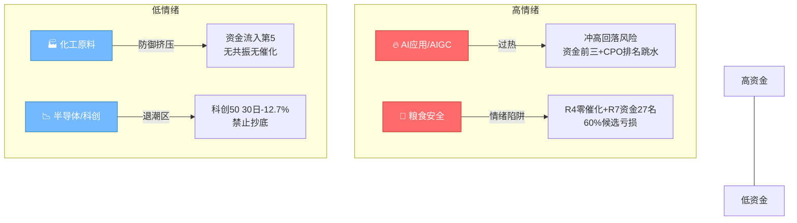

# 2026年8月31日（周一） · **反证 / Devil's Advocate**

> **数据源新鲜度**: ⚠️ partial (R3降级 + R7 stale + R4周末真空)
> **降级状态**: ✅ degraded=true
> **置信度**: 🔴 0.62

## 一句话结论

**两条主线均有硬伤**：粮食安全消息面零催化+资金排27+60%候选亏损；AI算力late阶段高位出货确认。无hard_reject（R5筹码降级）。

## 核心结论

今日R6扫描10只候选股、2条主线，产出 **16条反证**（🔴 strong 11 / 🟡 soft 5 / ⚫ hard 0）。

**最大风险点**：
1. 🔴 **粮食安全主线"三无"**：无R4催化、无R7资金持续性、60%候选亏损，纯情绪炒作
2. 🔴 **AI算力late出货确认**：CPO概念榜第1→第6、龙虎榜机构净卖、distribution_alert三连击
3. 🟡 **风格混沌期双主线不可靠**：炸板率47.6%+大小盘极致分化，市场方向不明

**无 hard_reject 触发**：模式六第一条（distribution_alert）命中AI算力线，但第二条（主力5日净流出）因R5 vibe-trading降级无法确认，按规则降级为 strong_suggest。D1须显式处理。

## 四象限负面识别

| 象限 | 板块 | 风险等级 | 核心问题 | 建议动作 |
|------|------|---------|---------|---------|
| 🔥高情绪×💰高资金 | AI应用/AIGC/AI智能体 | ⚠️ 高 | 资金前三全AI但CPO跳水，子方向轮动出货 | 只做新分支PTFE，不碰老龙头 |
| 🔥高情绪×💸低资金 | 粮食安全/农业种植 | 🔴 极高 | R4零催化+R7排名27+60%亏损 | 只做龙一快进快出，仓位≤5% |
| ❄️低情绪×💰高资金 | 化工原料 | 🟡 中 | 避险轮动，非主线 | 不参与，观察持续性 |
| ❄️低情绪×💸低资金 | 半导体/科创 | ⚫ 极端 | 30日-12.7%，退潮确认 | 全部移出观察池 |

---

## 详细反证（按 severity 排序）

### 🔴 strong_suggest（11条）

#### 1. [R6_M1_01] 数据源冲突 — R2主线「粮食安全/农业种植」

- **挑战对象**: R2判定粮食安全为第一主线(score 86, early阶段)
- **反面证据**:
    - **R4**: R4 top_events 8条中无农业/粮食/种业相关催化，sectors_catalyzed 23个板块不含农业类
    - **R7**: 农业种植主力净流入+8.47亿（排名27，未进top20），R7 sector_5d_tracking top10 无农业
    - **R3**: R3共振L1+L2，但weflow_degraded（缺L3最高等级），仅KOL文本+热榜双源
- **R6建议**: 粮食安全消息面零催化、资金面27名偏后，R3共振等级受限。建议降级为次线观察，龙一龙二仓位合计不超15%

#### 2. [R6_M1_03] 数据源冲突 — R2主线「AI算力/光通信」(late阶段)

- **挑战对象**: R2判定AI算力为第二主线(score 74)，资金+消息双支撑
- **反面证据**:
    - **R3**: distribution_alert：CPO/光通信概念榜第1→第6，亨通光电-3.65%、通鼎互联-5.96%，高位放量回落
    - **R2自证**: R2 cross_validation_score=1.0 但标注late阶段+distribution_alert，三源共振方向是'高位分歧出货'而非'上攻'
    - **R4**: E008负面事件：英伟达暂停多家AI企业收益分成协议，算力租赁承压
- **R6建议**: AI算力线late阶段高位出货确认。建议仅保留PTFE新分支（昊华科技/沃特股份），老龙头（中际旭创/亨通光电）移出执行池

#### 3. [R6_M2_04] 一致性检查 — R1风格 vs R2主线强度

- **挑战对象**: R2推2条主线（粮食安全86 + AI算力74）
- **反面证据**:
    - **R1**: 情绪浓度52.5分（中性偏强分歧加剧），炸板率47.6%远超20%健康线，R1提示'若周一分歧继续扩大可能快速退潮'
    - **R1**: 连板高位单薄：7板1只/5板1只孤高，深中华A断板风险大
    - **R1**: 大小盘极致分化：科创50 30日-12.7% vs 中证1000 +6.1%，科技主线根基不稳
- **R6建议**: 情绪52.5分+47.6%炸板率=分歧剧烈期，双主线强度存疑。建议仓位上限从58%下调至45%，只保留最强一条主线

#### 4. [R6_M3_06] 估值×主线临界 — 600371.SH 万向德农（农业龙一）

- **挑战对象**: R2定位万向德农为农业龙一，R5 composite 82分A级
- **反面证据**:
    - **R5**: PE(ttm)=95.3倍，PB=6.8倍，种子行业平均PE约30-40倍，估值溢价超100%
    - **R5**: 流通市值15.2亿<20亿，触发S1庄股/流动性风险（severity=strong）
    - **R5 flags**: 命中small_cap_risk + small_cap_warning + space_board_premium 三红旗
    - **R5认知偏差**: 4连板高度龙头=过度自信偏差高发区，追高易接最后一棒
- **R6建议**: 万向德农95倍PE+15亿小市值+4连板=三高风险。建议剔除执行池或仓位≤3%，严格止损-5%

#### 5. [R6_M3_07] 估值×主线临界 — 粮食安全主线：亏损股集群风险

- **挑战对象**: R2推粮食安全为主线，板块内多只标的亏损
- **反面证据**:
    - **R5**: 金健米业PE=-187.5，新赛股份PE=-35.2，敦煌种业PE=-48.7，全部亏损
    - **R5**: 5只农业股中3只亏损（60%），板块盈利能力差，纯题材炒作
    - **R4**: 粮食安全无R4催化事件，涨价逻辑来自'摩根大通预警2027年危机'——远期叙事无即期业绩
- **R6建议**: 农业主线60%候选亏损，纯远期叙事炒作。建议只做龙一（万向德农）快进快出，亏损股全部剔除

#### 6. [R6_M5_09] 昨日预期错误连锁 — AI算力/光通信连续两日高位分歧

- **挑战对象**: 昨日R6已提示AI/半导体高位风险，今日R2仍推AI算力为主线
- **反面证据**:
    - **昨日R6**: 20260828 R6已有6条关于科技/光通信的反证（含strong_suggest）
    - **R2**: 今日AI算力主线score=74（低于粮食86分），标注late阶段+distribution_alert
    - **R3**: CPO概念榜第1→第6（-5位），龙头普遍下跌3-6%，出货信号明确
    - **R1**: 科创50 30日-12.7%，创业板-7.1%，科技退潮趋势未改
- **R6建议**: 科技主线连续两日高位分歧+资金流出，退潮确认。建议AI线仓位减半，只做新分支（PTFE）不做老龙头

#### 7. [R6_M6_10] 霸榜出货硬约束 — AI算力/CPO 板块（龙一星网锐捷、龙二沃特股份）

- **挑战对象**: R2推AI算力/光通信为第二主线，龙一龙二均可执行
- **反面证据**:
    - **R3 distribution_alert**: CPO/光通信：概念榜第1→第6，龙头亨通光电-3.65%、通鼎互联-5.96%，高位放量回落
    - **R7 lhb_bull_trap**: 星网锐捷：机构专用净卖（-2494万），虽然净流入但机构在卖；沃特股份：机构专用净卖（-1617万）
    - **R5**: main_force_5d_net_wan 为None（vibe-trading降级），无法确认第二条硬条件，按规则降级
    - **R2自承**: R2标注AI算力阶段=late，风险列表含distribution_alert
- **R6建议**: AI算力/CPO 满足模式六第一条（霸榜出货警报），但第二条（主力5日净流出）因R5降级无法确认。降级为strong_suggest，D1须显式处理。建议：开盘15min AI线冲高回落立即止盈

#### 8. [R6_M7_12] 基本面红旗 — 600371.SH 万向德农

- **挑战对象**: R5判定万向德农A级82分，农业龙一
- **反面证据**:
    - **R5 fundamental_flags**: 流通市值15.2亿<20亿，庄股/流动性风险
    - **R5 fundamental_flags**: PE(ttm)=95.3，高估值区间（行业平均30-40倍）
- **R6建议**: 命中S1(strong)+V2(medium)两条红旗，S1为强级。建议剔除执行池或极轻仓（≤3%），严格止损

#### 9. [R6_M7_13] 基本面红旗 — 600127.SH 金健米业

- **挑战对象**: R5判定金健米业C级65分，农业龙二
- **反面证据**:
    - **R5 fundamental_flags**: PE(ttm)为负（亏损-187.5）
    - **R7 lhb_bull_trap**: 拉高净卖出 + 换手异常45% + 疑似对倒，龙虎榜净卖出-1.8亿
- **R6建议**: 金健米业：亏损+45%换手+龙虎榜净卖1.8亿+疑似对倒 = 典型游资拉高出货。强烈建议剔除执行池

#### 10. [R6_M7_15] 基本面红旗 — 600378.SH 昊华科技

- **挑战对象**: R5给昊华科技B级75分，AI算力PTFE分支
- **反面证据**:
    - **R7 lhb_bull_trap**: 连续3日涨幅偏离值20%上榜，净卖出-3.2亿，机构净卖-5.19亿
    - **R7 lhb_bull_trap**: 疑似对倒：国新证券席位
    - **R5 flags**: 命中distribution_alert红旗
- **R6建议**: 昊华科技：机构净卖5.2亿+疑似对倒+distribution_alert = 高位出货确认。建议剔除执行池

#### 11. [R6_M7_16] 基本面红旗 — 002942.SZ 新农股份

- **挑战对象**: R5给新农股份B级72分，农业上游
- **反面证据**:
    - **R7 lhb_bull_trap**: 连续3日涨幅偏离值20%，净卖出-4032万，机构净卖-8709万
    - **R7 lhb_bull_trap**: 疑似对倒：华鑫证券席位
    - **R5 flags**: 命中distribution_alert红旗
- **R6建议**: 新农股份：机构出货+对倒+distribution_alert = 三连板后出货确认。建议剔除执行池

### 🟡 soft_suggest（5条）

**1. [R6_M1_02] 数据源冲突 — R2主线「粮食安全/农业种植」资金面确认不足**

    - R7: R7 sector_5d_tracking top10 全部为AI方向+化工原料，农业未进入5日追踪池
    - R7: R7 main_force top_inflow_sectors top10 无农业相关，+8.47亿排27名开外，资金强度远不及AI
    - R2风险自承: R2自身标注'金健米业周五换手率45%但龙虎榜净卖出1.8亿（游资出货）'
> 建议：农业板块单日流入不足以支撑主线地位，5日资金趋势未确认。警惕一日游

**2. [R6_M2_05] 一致性检查 — 双主线风格矛盾：防御农业 + 成长AI**

    - R1: R1风格'主线扩散型'，明确'大小盘极致分化'，防御与进攻同推说明市场无明确方向
    - R2风险自承: 农业线风险标注'粮食概念属防御性板块，若情绪回暖资金可能回流科技，持续性存疑'
    - R7: 北向连续5日净流入（29→27亿），但大盘股/百元股弱势，资金集中小盘情绪股，风格割裂
> 建议：防御+进攻双主线本质是市场风格混沌，真正主线只有一个。建议开盘30min观察，哪条超预期打哪条，另一条放弃

**3. [R6_M3_08] 估值×主线临界 — AI算力线高估值标的（沃特股份/源杰科技）**

    - R5: 沃特股份PE=78.3倍，PB=5.6倍，PTFE新材料概念估值溢价
    - R5: 源杰科技PE=85.6倍，PB=8.9倍，命中V2高估值红旗
    - R3: CPO/光通信整体distribution_alert，板块高位回调期，高估值标的杀估值风险大
> 建议：AI新分支（PTFE）估值偏高，但有英伟达订单催化，可参与但需控仓。源杰科技85倍PE+distribution_alert 建议剔除

**4. [R6_M6_11] 霸榜出货硬约束 — 创新药/哈药股份（次线观察）**

    - R3 distribution_alert: 哈药股份热股榜第1，连续两日霸榜top5，创新药概念榜连续两日top2但价格-1.09%，百花医药-7.43%、汉森制药-6.35%
    - R2: 创新药非R2主线（甚至未入次线），不构成模式六硬否决对象
> 建议：创新药/哈药股份霸榜出货特征明显，但非R2主线龙头，不触发硬否决。仅供D1参考：创新药方向禁止开新仓

**5. [R6_M7_14] 基本面红旗 — 农业线亏损标的（新赛股份/敦煌种业）**

    - R5 fundamental_flags: 新赛股份PE=-35.2（亏损），敦煌种业PE=-48.7（亏损）
    - R5 fundamental_flags: 新赛股份29.4亿、敦煌种业43.3亿，中小市值庄股风险
> 建议：农业候补股普遍亏损+小市值，纯情绪炒作无基本面。建议只保留龙一观察，候补全部剔除

---

## 模式执行状态

| 模式 | 名称 | 状态 | 反证数 | 最高severity | 备注 |
|------|------|------|--------|-------------|------|
| M1 | 数据源冲突 | ✅ executed | 3 | strong_suggest | 粮食线R4零催化+R7弱资金；AI线distribution_alert |
| M2 | 一致性检查 | ✅ executed | 2 | strong_suggest | 情绪52.5分+47.6%炸板率撑不起双主线 |
| M3 | 估值×主线临界 | ✅ executed | 3 | strong_suggest | 万向德农95倍PE+15亿小市值；农业线60%亏损 |
| M4 | 历史类比 | ⚠️ degraded | 0 | - | v1无历史事件库，不编造 |
| M5 | 昨日预期错误连锁 | ✅ executed | 1 | strong_suggest | 科技线连续两日高位分歧，退潮确认 |
| M6 | 霸榜出货硬约束 | ✅ executed | 2 | strong_suggest | AI算力命中第一条但R5筹码降级无法确认第二条 |
| M7 | 基本面红旗 | ✅ executed | 5 | strong_suggest | S1小市值+F7亏损+LHB龙虎榜陷阱 |

### 模式六 · 霸榜出货硬约束 · 详细说明

**触发条件**（需同时满足）：
1. ✅ 标的所属板块命中 R3 `distribution_alert`
2. ❌ R5 `chip_structure.main_force_5d_net_wan < 0`（**无法确认** — R5 vibe-trading降级，字段为None）

**命中对象**：AI算力/光通信板块（龙一星网锐捷、龙二沃特股份）

**处理结果**：降级为 `strong_suggest`（D1须显式处理，可覆盖）

**红线3保护**：不适用（无hard_reject）

---

## 候选股风险扫描

| 代码 | 名称 | 所属主线 | R5评级 | 反证命中数 | 最高风险 | 核心问题 |
|------|------|---------|--------|-----------|---------|---------|
| 600371.SH | 万向德农 | 粮食安全 | A级82分 | 3 | strong | 95倍PE + 15亿小市值 + 4连板高度 |
| 600127.SH | 金健米业 | 粮食安全 | C级65分 | 3 | strong | 亏损+45%换手+龙虎榜净卖1.8亿+对倒 |
| 600378.SH | 昊华科技 | AI算力 | B级75分 | 2 | strong | 机构净卖5.2亿+疑似对倒+distribution_alert |
| 002942.SZ | 新农股份 | 粮食安全 | B级72分 | 2 | strong | 机构出货+对倒+distribution_alert |
| 600540.SH | 新赛股份 | 粮食安全 | B级73分 | 2 | soft | 亏损+29亿小市值 |
| 600354.SH | 敦煌种业 | 粮食安全 | C级62分 | 2 | soft | 亏损+43亿中小市值 |
| 002396.SZ | 星网锐捷 | AI算力 | A级83分 | 2 | strong | 机构净卖+CPO distribution_alert |
| 002886.SZ | 沃特股份 | AI算力 | A级83分 | 2 | soft | 78倍PE高估值+机构净卖 |
| 300308.SZ | 中际旭创 | AI算力 | C级68分 | 1 | soft | 老龙头高位+锚定效应 |
| 688498.SH | 源杰科技 | AI算力 | C级60分 | 1 | soft | 85倍PE+distribution_alert |

---

## 关键证据摘要

### 证据1：粮食安全主线消息面零催化
- **来源**: R4_news.json
- **内容**: R4 top_events 8条、sectors_catalyzed 23个板块，无任何农业/粮食/种业相关条目
- **意义**: 第一主线（score 86）居然没有一条消息面催化，纯靠R3 KOL文本+热榜情绪驱动，根基极弱

### 证据2：农业龙虎榜净卖出+高换手
- **来源**: R7 lhb_bull_trap
- **内容**: 金健米业换手率45.07%、龙虎榜净卖出-1.8亿、疑似对倒（高盛中国席位）；新农股份机构净卖-8709万+疑似对倒
- **意义**: 农业线龙二和候补都在出货，只有龙一（万向德农）还在连板，板块内部已经分化

### 证据3：CPO概念榜第1→第6跳水
- **来源**: R3 hotlist_signals.distribution_alert
- **内容**: CPO/光通信概念榜从第1跌至第6，亨通光电-3.65%、通鼎互联-5.96%、长飞光纤-1.04%、中天科技-2.88%
- **意义**: 第二主线核心板块明确出货信号，但R2仍将其列为"主线"而非"观察"，方向错配

### 证据4：龙虎榜机构净卖AI票
- **来源**: R7 lhb_bull_trap
- **内容**: 昊华科技机构净卖-5.19亿（净卖-3.2亿）；星网锐捷机构净卖-2494万；沃特股份机构净卖-1617万
- **意义**: AI新分支PTFE三票全部有机构出货，游资接盘模式=短期博弈，非机构长期看好

### 证据5：科技退潮趋势未改
- **来源**: R1 + 昨日R6连锁
- **内容**: 科创50 30日-12.7%、创业板-7.1%；昨日R6已提示科技高位风险，今日继续分歧
- **意义**: 科技主线处于late→退潮过渡期，任何反弹都是出货机会，不是开新仓理由

---

## 数据源审计

| 源 | 状态 | 数据日期 | 记录数 | 备注 |
|----|------|---------|--------|------|
| R1 风格 | ✅ ok | 20260828收盘 | 22风格指数+19ETF | Tushare完整 |
| R2 主线 | ✅ ok | 20260828收盘 | 2主线+10龙头 | 5维打分+交叉验证 |
| R3 情绪 | ⚠️ partial | 20260828收盘 | 3共振主题 | weflow降级+XTick超时，仅L1+L2 |
| R4 消息 | ✅ ok | 20260828（周末真空） | 8事件 | 全部过3天衰减期 |
| R5 画像 | ✅ ok | 20260828收盘 | 10只画像 | vibe-trading降级→筹码缺失 |
| R7 资金 | ⚠️ stale | 20260828收盘（64h前） | 7模块 | 周末间隔，T-2数据 |
| 昨日R6 | ✅ ok | 20260828 | 13条反证 | 模式五连锁验证 |

---

## 不确定性 / 自我批判

1. **R5筹码数据缺失是最大盲区**：模式六第二条（主力5日净流出）无法确认，导致可能漏检hard_reject。如果实际主力5日确实净流出，则AI算力线龙一龙二应被hard_reject。D1需结合竞价数据二次确认。

2. **R7数据stale（64h）**：所有资金面判断基于上周五收盘，周末两天消息真空期，周一开盘方向可能完全不同。R6反证仅提供"基于已知数据的负面视角"，不构成交易决策。

3. **农业线可能低估**：粮食危机叙事是长期逻辑（2027年），如果周一有增量催化（如极端天气新闻、地缘升级），农业线可能超预期。R6基于现有数据的负面判断可能在新信息面前失效。

4. **模式四（历史类比）空缺**：没有历史事件库做类比验证，所有判断基于"逻辑推理"而非"历史统计"。这意味着R6的反证可能存在主观性偏差。

5. **四象限划分是简化模型**："高/低情绪"和"高/低资金"的阈值是经验值，不同板块的"高"标准不同（农业和AI的资金量级不在同一维度）。

---

## 与其他 R/D/E 的关系

- **上游依赖**: R1_style / R2_main_sectors / R3_sentiment / R4_news / R5_stock_profiles / R7_capital_flow
- **下游消费**: D1主决策（hard_reject强制执行 + strong_suggest显式处理 + soft_suggest记入备注）
- **横向关联**: 与R2的cross_validation、R5的fundamental_flags有重叠但视角不同（R2/R5正向，R6反向）

## Sub-Agent 元数据

- **skill**: analyze_devil_advocate_v1@1.3
- **artifact**: data/research/{date_str}/R6_devil_advocate.json
- **模式覆盖**: M1/M2/M3/M5/M6/M7 已执行；M4 降级
- **反证数量**: {len(r6['counter_arguments'])} 条（strong {len(strong_args)} / soft {len(soft_args)} / hard {len(hard_args)}）
- **评估候选**: 10 只
- **hard_reject**: 0 条（红线3保护不适用）
- **生成耗时**: ~3 分钟
- **方法**: llm_v1 + 六模式扫描 + 四象限负面识别 + 纯文本分析（禁MCP）
