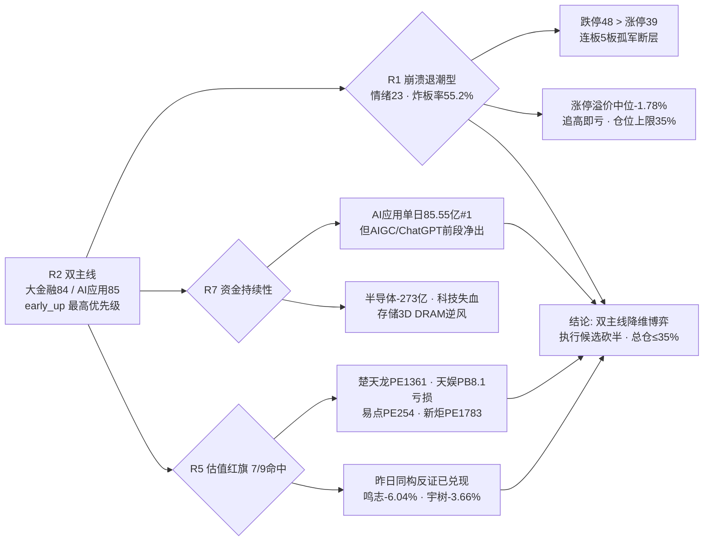

# 2026-09-07 · **反证 / Devil's Advocate**

> **数据源新鲜度**: ok
> **降级状态**: false
> **置信度**: 0.80

## 一句话结论
硬否决 0 条，但 strong_suggest 7 条：崩溃退潮型（炸板率 55.2%·跌停 48>涨停 39）与 R2 双主线直接冲突，资金单日翻红、龙头估值极端（楚天龙 PE1361），昨日高估值龙头反证已全部兑现——今日双主线只可降维博弈，不可按主升配仓。

## 详细分析

**核心矛盾一：R2 双主线 vs R1 崩溃退潮型（模式二）**。R1 判定「崩溃退潮型」：炸板率 55.2%（前日 42.9% 续升 12.3pct，超 50% 崩溃阈值）、跌停 48 家 > 涨停 39 家、连板 5 板孤军（龙版传媒）无 3/4 板断层、涨停溢价中位 -1.78%（追高即亏）、仓位上限 35%，结论是「无主线（退潮防御）·严禁追高·等待出清」。R2 却在同一份数据上给出大金融 84 / AI应用 85 两条「最高优先级主线·龙一/龙二进 execution_pool」。R2 自己的风险栏都写着「事件首日脉冲最易次日炸板」「仓位上限 35%」。这不是分歧，是 R2 用事件催化覆盖了情绪周期约束——**崩盘边缘的周末利好 = 最高点博弈**，与昨日液冷霸榜出货剧本同构。

**核心矛盾二：资金是「单日翻红」不是「持续净入」（模式一）**。R2 以 R7 主力净流入 top10 中 6 席 AI 应用系（AI应用 85.55 亿#1 / AIGC #2 / ChatGPT #3 / 短剧 #4）判定「全市场资金最强」。但 R7 自己的 5 日序列显示 AIGC / ChatGPT / 短剧 / 互联网金融 全部是「**末日翻红·前段净出**」——5 日仅 2 日正流入，0902 曾大幅净出（ChatGPT -41.7 亿、短剧 -31.75 亿）。0904 单日爆量翻红发生在崩溃期，**反抽概率远大于反转**。恒宝股份 0904 龙虎榜净买 +2.1 亿 vs 主力净流出 -3.82 亿的对倒痕迹进一步说明：板块内游资已开始边拉边出。

**核心矛盾三：双主线龙头估值全部命中红旗（模式三/七）**。9 张 R5 画像中 7 张命中 V2 估值红旗：楚天龙 PE 1361 / PB 7.03（龙一·30 日 +111%）、天娱数科亏损 PB 8.10（龙一·炸板 21 次·换手 38%）、易点天下 PE 254（龙二·股东户数 +21%）、新炬网络 PE 1783 + circ 43.4 亿庄股 caution（高度标）、翠微亏损 PB 5.63（龙二）、蓝色光标 PE 147.6、恒宝 PE 169。**大金融主线内部估值分裂：便宜的（国寿 PE_ttm 4.47 / 东财 PE 20.78）没弹性，有弹性的（楚天龙/翠微）没基本面**。而昨日同构的高估值龙头（光洋 PE83 / 鸣志 2026E PE 184-237 / 宇树 PE381）反证已全部兑现下跌——楚天龙 PE1361 比光洋极端两个数量级。

**霸榜出货扫描（模式六）**：液冷服务器 distribution_alert high 已兑现（0904 浪潮信息跌停），且属 R2 排除项；双主线龙一/龙二资金全部正向（楚天龙 +6.71 亿 / 天娱 +4.51 亿 / 易点 +2.87 亿 / 翠微 +1.07 亿），不满足双条件② → **今日 0 hard_reject**。但两个 watch 升级路径必须 D1 盘中盯：①猪肉新晋#1（单日登顶未满 2 日），若 0907 再霸榜 = 液冷式出货，农业执行票即时降仓；②恒宝对倒痕迹若扩散到数字货币板块龙头。

## 反证传导链

## 推理深度三问（top 反证对象：R2 双主线）

- **大资金意图**：大金融注资（财政部 3000 亿特别国债 + 3600 亿增资 8 家）是真金白银政策，机构中期配置意图真实存在；但**游资与机构意图分离**——楚天龙/翠微是游资席位（开源西大街 3.74 亿 / 广发后海 2.13 亿）的一字卡位，国寿/东财才是机构容量位。崩溃期游资一字板的对手盘是次日接力的散户，而机构权重票首日未必启动。**短线意图=卡位博次日溢价，不是中线建仓**。
- **为什么走强**：位置=楚天龙 30 日 +111% 高位、天娱炸板 21 次筹码极端不稳；催化=周末政策首日 + 隔夜 GPT-6（美股休市无映射）；筹码=一字惜筹（楚天龙换手 10.8%）+ 两融攀升（楚天龙融资 +45%）。**三因子里催化最强、筹码与位置最差**——这是典型的「消息最强日」结构，而非「资金最认可日」结构。
- **逻辑够不够硬**：大金融逻辑硬（政策 5 源 high + 国寿 PE4.47 估值支撑），但硬逻辑在龙一身上兑现为 PE1361 的妖股估值；AI应用逻辑中（GPT-6 高盛背书但无美股映射 + 高估值龙头无盈利支撑）。**证伪路径明确：竞价高开缩量 / 板块高开回落 / 楚天龙一字打开无回封 = 事件首日脉冲兑现，立即放弃，不恋战**。

## 每票思维链（反证视角 · 双主线龙一）

### 楚天龙 003040 · 大金融龙一
- **买入理由**（若 D1 仍纳入）：①数字货币/互金双一字 09:30 + 龙虎榜净买 6.71 亿 net_rate 64.5% 全市场最一致看多；②财政部注资 + 跨境支付双重催化，R3 数字货币 19→3 急升 16 位全场最强动量。
- **风险点**：①PE 1361 极端估值，30 日 +111% 高位，0903 曾 -9.09% 大阴线巨震；②一字板无买点，再一字=买不进，高开分歧=防兑现；③与昨日光洋（PE83）同构但极端两个数量级，崩溃期妖股断板即 -10% 起步。
- **止损条件**：若分歧回封/弱转强买入，破 21.12 前高放量不收回即走（-5~-10% 硬区间）；一字打开无回封=放弃。
- **可验证假设**：09:25-09:30 竞价量价——若高开 >5% 且竞价量 > 昨日 3 倍 = 兑现盘涌出，证伪；若高开 <3% 缩量回封 = 卡位成功，验证。

### 天娱数科 002354 · AI应用龙一
- **买入理由**（若 D1 仍纳入）：①dc 人气榜#1 + GPT-6 催化（高盛「AI 牛市一直在等的模型」4 源）；②游资开源西大街 + 国泰海通武汉紫阳重仓，R7 AI应用 85.55 亿#1。
- **风险点**：①亏损股 PB 8.10，2026E EPS 仅 0.06，纯题材估值；②炸板 21 次全市场最大分歧 + 换手 38.09% 极端，人气王=筹码绞肉机；③R7 资金「末日翻红·前段净出」持续性未验证。
- **止损条件**：弱转强确认买入后破 8.45 分时均线即走；高开 >5% 不追（R2/R5 双重标注只做弱转强）。
- **可验证假设**：09:30-10:00 是否出现「缩量回封 / 弱转强分时」——若放量滞涨冲高回落 = 人气兑现证伪；若快速回封带动 AI 视频板块 = 主线验证。

## 四象限负面汇总

| 象限 | 级别 | 核心信号 | 结论 |
|---|---|---|---|
| 情绪面 | 🔴 高 | 崩溃退潮型·炸板率 55.2%·跌停 48>涨停 39·连板断层·涨停溢价 -1.78%·液冷霸榜出货兑现·猪肉 watch | 崩溃边缘，事件首日脉冲=最高点博弈 |
| 资金面 | 🟠 中高 | AI 系单日翻红前段净出·半导体 -273 亿·恒宝对倒·北向 +27.42 亿温和 | 双主线资金为一日游结构，持续性未验 |
| 消息面 | 🟡 中 | E001 大金融最硬但首日=兑现日·E008 加息 58.3% 压高估值·GPT-6 无美股映射·平陆运河盘后发布会 | 催化最强日≠资金最认可日 |
| 估值面 | 🔴 高 | 9 票 7 命中 V2·龙一全极端（PE1361/PB8.1/PE254）·昨日同构反证全兑现 | 龙头估值无基本面支撑，纯题材博弈 |

## 关键证据
- 证据 1: R2 双主线 cross_validation=1.0（四源确认）但 R1 崩溃退潮型严禁追高·仓位上限 35%·「近似代理，非 R2 真实判定」 · 来源 R1_style.json / R2_main_sectors.json
- 证据 2: R7 5 日序列 AIGC/ChatGPT/短剧/互金 全为「末日翻红·前段净出」（5 日仅 2 日正流入） · 来源 R7_capital_flow.json sector_5d_tracking
- 证据 3: 楚天龙 PE1361/PB7.03（V2 strong）、天娱 PE null/PB8.10（V2 strong）、易点 PE254（V2 strong）、新炬 PE1783+circ 43.4 亿 · 来源 R5_stock_profiles.json fundamental_flags
- 证据 4: 昨日 R6 反证全部兑现：鸣志 -6.04%/拓斯达 -3.14%/宇树 -3.66%/光洋 -1.99%，执行池三票全部 no_fill 规避 · 来源 observation_tracking(0904)
- 证据 5: 液冷霸榜出货兑现（浪潮信息跌停 -9.99%）；猪肉新晋#1 watch 与液冷初始结构相同 · 来源 R3_sentiment.json / hotlist_signals.json
- 证据 6: 恒宝 0904 龙虎榜净买 +2.1 亿 vs 主力净流出 -3.82 亿（对倒痕迹）+ 换手 33.7% · 来源 R5_stock_profiles.json chip_structure

## 数据源审计
| 源 | 日期 | 状态 | 备注 |
|---|---|---|---|
| R1_style.json | 2026-09-07 | 🟢 | 崩溃退潮型·情绪 23·仓位上限 35% |
| R2_main_sectors.json | 2026-09-07 | 🟢 | 双主线 84/85·early_up |
| R3_sentiment.json | 2026-09-07 | 🟢 | 情绪 28·液冷出货兑现·猪肉 watch |
| R4_news.json | 2026-09-07 | 🟢 | E001-E008 共 8 事件·E008 负面 |
| R5_stock_profiles.json | 2026-09-07 | 🟡 | 9 票全画像·仅 charts MCP 图图层降级 |
| R7_capital_flow.json | 2026-09-07 | 🟢 | 主力/北向/板块 5 日序列 |
| hotlist_signals.json | 2026-09-07 | 🟢 | L4 液冷出货(已兑现)+猪肉 watch |
| R6 昨日(0904) | 2026-09-04 | 🟢 | 15 条反证·高估值龙头已兑现 |
| observation_tracking | 2026-09-04 | 🟢 | 昨日执行池全部 no_fill·反证成立 |

## 不确定性 / 反证
- R5 未透传 `main_force_5d_net_wan` 精确字段（仅 0904 单日主力净流入/流出），模式六「近 5 日主力净流出」条件无法逐票精确验证，以龙虎榜净买 + 单日资金近似——若竞价后龙头出现放量出货，D1 需在竞价阶段复核升级
- 模式八（解套盘假繁荣）需要封板量 vs 历史套牢区估算（筹码数据），R6 禁抓新数据且上游未透传，已标 degraded 不编造
- 双主线 cross_validation=1.0 是真实多源共振，R6 的反证是「共振成立但**时点**是崩溃期首日」——若今日资金真金白银持续接力（板块高开高走、涨停家数回升），反证将被证伪，D1 可基于竞价数据 override strong_suggest 并记录理由
- 楚天龙 PE1361 基于 tushare daily_basic 透传，未独立拉财报复核（R6 禁 MCP）；若 D1 有异议可标注 override

## 与其他 R/D/E 的关系
- 依赖: R1_style.json · R2_main_sectors.json · R3_sentiment.json · R4_news.json · R5_stock_profiles.json · R7_capital_flow.json · hotlist_signals.json · 昨日 R6(0904) · observation_tracking(0904)
- 被消费: D1(canghai-plan) 读取 hard_rejects / counter_arguments / quadrants_negative，strong_suggest 必须显式处理；E1(canghai-review) 盘后验证反证兑现

## Sub-Agent 元数据
- skill: analyze_devil_advocate_v1
- artifact: data/research/20260907/R6_devil_advocate.json
- 生成耗时: 约 18 分钟（含上游读取与分析）
- model: deepseek-v4-flash-260425
