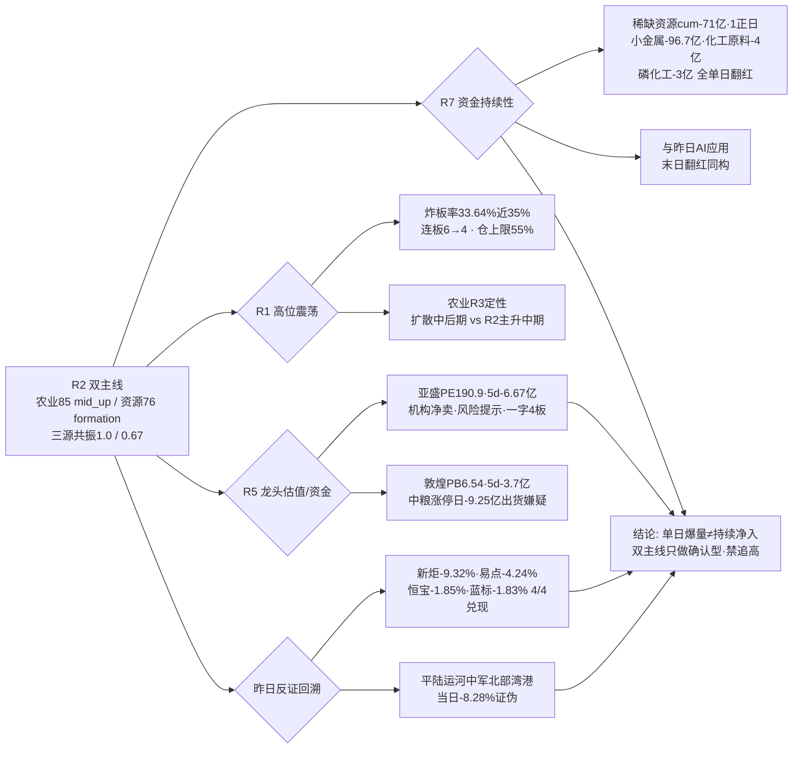

# 2026-09-08 · **反证 / Devil's Advocate**

> **数据源新鲜度**: ok
> **降级状态**: false
> **置信度**: 0.75

## 一句话结论
硬否决 0 条，但 strong_suggest 8 条：双主线（农业/资源）的资金确认全部是「单日翻红·5日累计净流出」，与昨日 AI 应用「末日翻红」同构；农业龙一亚盛 PE190.9 + 主力5日-6.67亿 + 机构净卖 + 风险提示公告，一字 4 板无买点；昨日反证 4/4 兑现、平陆运河中军当日证伪——高位震荡期只做确认型，禁追高位一字与高开一致。

## 详细分析

**核心矛盾一：R2 的「资金确认」是单日爆量，不是持续净入（模式一）**。R2 以 R7 主力净流入 top10 判定农业（磷化工#5+31.87/化工原料#4+33.03/煤化工#8+26.48 亿 proxy）与资源（黄金#1+38.03/稀缺资源#2+37.68/小金属#3+35.77 亿）双主线资金全链霸榜、cross_validation 打满。但 R7 自己的 5 日序列显示这 6 个板块**全部是「0908 单日翻红·前段连续净出」**：稀缺资源 cum -71.09 亿（5 日仅 1 正日）、小金属 cum -96.74 亿（2 正日，0902 曾 -63.3 亿）、黄金 cum -29.7 亿（0902/0904/0907 连续净出）、化工原料 -4.02 亿（1 正日）、磷化工 -3.04 亿（1 正日）、煤化工 +1.34 亿（1 正日）。这跟昨天 R6 对 AI 应用「末日翻红」的反证是**同一套结构**——昨天 AI应用 85.55 亿单日#1 被证明是反抽，今天换成了资源/农业单日#1。**单日霸榜 ≠ 资金持续，D1 不能把 R7 单日 top10 当重仓依据**。

**核心矛盾二：农业线龙头自身资金背离（模式三/六/七叠加）**。板块 proxy 资金单日爆量的同时，执行票本身筹码在恶化：亚盛主力 5 日 -6.67 亿（一字板成交极小，承接断层风险）+ 机构专用净卖（600108 在 R7 机构专用净卖列表）+ 两融 +48.6% 杠杆追高（3.4→5.06 亿）+ 0908 盘后风险提示公告 + PE190.9/ROE0.58%（V2 strong）。敦煌 5 日 -3.7 亿 + 异常波动公告 + 2 次开板。中粮糖业**涨停日当日主力 -9.25 亿**（R5 flag main_force_heavy_outflow，涨停板出货嫌疑）。R7 龙虎榜诱多检测 53/56 只命中「涨停净卖出/换手异常/机构专用净卖/疑似对倒」，农业链神农种业机构专用净卖 -1.09 亿 + 对倒。**机构专用 0908 净卖清单里躺着亚盛/粤桂/金正大/云煤——农业线热门票是游资拉、机构出的结构**。

**核心矛盾三：农业「扩散中后期」与 R2「主升中期」段位冲突（模式二）**。R1 高位震荡（炸板率 33.64% 较 0907 的 16.96% 翻倍、连板高度 6→4 降级、仓位上限 55%、「不追高位」），R3 明确「已发酵 3 日处扩散中后期」，R2 自己的风险栏也写「扩散中后期追高性价比下降」「高位一字不追」「炸板率 33.64% 环境禁追高」——却仍把 4 板一字亚盛列为 execution_eligible 龙一。这不是分歧，是 R2 用板块热度覆盖了段位约束。炸板率距 35% 硬约束仅 1.36pct，若 0909 升破 35% 候选必须砍半。

**霸榜出货扫描（模式六）**：distribution_alert 仅 CPO（watch）与液冷（confirmed），均属 R2 已排除的 AI 算力硬件链；execution_eligible 四票（亚盛/敦煌/紫金/江铜）所属板块均无 alert（条件①不满足）→ **今日 0 hard_reject**，红线 3 保护未触发。亚盛命中条件②（5d 净流出）但板块无 alert，不构成硬否决，已按模式三 strong_suggest 处理。两个 watch 升级路径必须 D1 盘中盯：①代糖#1 单日登顶（若 0909 再霸榜 = 液冷式单日登顶兑现，农业执行票即时降仓）；②农业 7 席霸榜扩散期若 0909 龙头炸板 = 退潮。

**昨日反证兑现回溯（模式五）**：observation_tracking(0908) 验证昨日 R6 判断 4/4 兑现——新炬网络 -9.32%（昨日「只观察不纳入执行池」）、易点天下 -4.24%（昨日高估值+筹码分散）、恒宝 -1.85%、蓝色光标 -1.83%，全部规避。农业 watch 路径正向兑现（0904 猪肉→0907 粮食→0908 7 席霸榜，亚盛 +10%/敦煌 +9.97%/北大荒 +5.63%），扩散真实但已 3 日。同时平陆运河中军北部湾港 0908 -8.28% 破位证伪（R4 E005 high 推荐当日证伪）——**震荡期事件驱动「隔日映射」容错极低**，农业/资源同为事件+资金驱动，必须以竞价承接为介入前提，不能线性「利好=买入」。

## 反证传导链

## 推理深度三问（top 反证对象：R2 双主线）

- **大资金意图**：北向 +26.6 亿连续温和流入（5 日均 25.98 亿）是真金白银的仓位回补，方向在资源/周期（有色 ETF +1.55%/煤炭 +2.52%）；但**场内游资与机构意图分离**——农业热门票是游资席位（开源西安西大街 3.25 亿买粤桂/金正大、华泰总部 3 日 3 次上榜亚盛）在拉，机构专用净卖清单同时躺着亚盛/粤桂/金正大/云煤。**短线意图=卡位博次日溢价，机构在借涨停派发**，这是连板妖股最常见的老主力出货+新资金接力的卡异动结构。
- **为什么走强**：位置=农业扩散 3 日（0904 猪肉→0907 粮食→0908 7 席霸榜），亚盛 4 板一字处扩散中后期高位；催化=六部门乡村振兴+厄尔尼诺超强+泰国糖减产（事件/政策双锚最硬）；筹码=亚盛换手 0.87% 一字惜售但两融 +48.6% 杠杆追高、机构净卖——**催化最硬、筹码与位置最差**，是「消息最强日」结构而非「资金最认可日」结构。
- **逻辑够不够硬**：农业/资源事件+政策逻辑硬，但硬逻辑兑现为亚盛 PE190.9 的妖股估值与资源线「资金与涨停脱节」（黄金资金 #1 但黄金股未涨停）。**证伪路径明确：0909 竞价高开缩量 / 龙头一字打开无回封 / 化肥磷化工 5 日序列仍不转正 = 单日爆量兑现，立即放弃**。

## 每票思维链（反证视角 · 农业线龙一/龙二）

### 亚盛集团 600108 · 农业线龙一（4板一字）
- **买入理由**（仅确认型，若 D1 仍纳入）：①乡村振兴 15 家板块第 1 + 连板高度并列市场第一（4 板）+ 华泰总部 3 日 3 次上榜（最一致游资席位）；②六部门政策 + 厄尔尼诺双锚，一字缩量 0.87% 惜售。
- **风险点**：①PE 190.9/ROE 0.58% 极端高估（V2 strong），纯题材无基本面；②主力 5 日 -6.67 亿 + 机构专用净卖 + 两融 +48.6% 杠杆追高——买盘靠杠杆与惜售而非主力增量；③一字 4 板无买点，再一字买不进，高开分歧防兑现；④风险提示公告=监管降温信号。
- **止损条件**：若 0909 放量分歧后承接回封买入，破当日分时均线/前一日收盘 -5~-10% 硬区间即走；一字打开无回封=放弃，断板=直接剔除并作为农业线退潮观察锚。
- **可验证假设**：09:25 竞价量价——高开 >5% 且竞价量放大 = 兑现盘涌出，证伪；低开缩量回封/换手板弱转强 = 卡位成功，验证。

### 敦煌种业 600354 · 农业线龙二（3板换手）
- **买入理由**（仅龙一分歧时的接力窗口）：①龙虎榜高盛(中国)/国泰海通江苏路/中信多席位（0904/0907 连续净买）+ 净利 yoy+165.7% 基本面最硬；②农业种植涨停 8 家/乡村振兴 15 家板块效应强。
- **风险点**：①PB 6.54 偏高（V2 medium）+ 异常波动公告；②主力 5 日 -3.7 亿 + 3 板 2 次开板（筹码松动）；③R2 自认无独立买点，纯龙一联动位。
- **止损条件**：弱转强/回封确认买入后破 MA5（8.95）即走；高开 >5% 不追（R2/R5 双重标注只做弱转强）。
- **可验证假设**：亚盛（龙一）断板或分歧时，敦煌是否出现缩量回封带动板块——若放量滞涨冲高回落 = 兑现证伪；若快速回封带动化肥/粮食 = 主线接力验证。

## 四象限负面汇总

| 象限 | 级别 | 核心信号 | 结论 |
|---|---|---|---|
| 情绪面 | 🔴 高 | 炸板率 33.64% 近 35%·连板 6→4 降级·溢价 +2.89% 回落·活跃资金前十转负·科技回调 | 高位震荡修复次日分歧，只做确认型，禁追高 |
| 资金面 | 🔴 高 | 双主线全部单日翻红 5 日净流出（稀缺资源 -71/小金属 -96.7/化工 -4/磷 -3 亿）·科技 -110 亿流出·亚盛/中粮资金背离·龙虎榜诱多 53/56·成长 ETF 净赎 | 单日爆量≠持续净入，高标断板风险高 |
| 消息面 | 🟡 中 | E006 农业最硬但资金单日·E007 铜新高但 A 股未涨停·E008 加息 60.4% 压高估值·科技四件 high 与资金背离·平陆运河当日证伪 | 催化最强日≠资金最认可日，事件驱动容错低 |
| 估值面 | 🔴 高 | 亚盛 PE190.9 V2 strong·敦煌 PB6.54·候补金正大/云煤 F11+V2·昨日高估值反证 4/4 兑现 | 贵的没基本面、便宜的不涨停，追龙头=纯题材博弈 |

## 关键证据
- 证据 1: R7 sector_5d_tracking 显示 0908 top10 流入板块 5 日累计多数净流出（稀缺资源 cum -71.09 亿·1 正日 / 小金属 -96.74 亿 / 化工原料 -4.02 亿·1 正日 / 磷化工 -3.04 亿·1 正日 / 煤化工 +1.34 亿·1 正日） · 来源 R7_capital_flow.json
- 证据 2: 亚盛 PE190.9/ROE0.58%（V2 strong）+ 主力 5 日 -6.67 亿 + 机构专用净卖（600108 在 R7 机构专用净卖清单）+ 两融 +48.6% + 风险提示公告 · 来源 R5_stock_profiles.json + R7_capital_flow.json
- 证据 3: 中粮糖业涨停日当日主力 -9.25 亿/5 日 -6.75 亿（R5 flag main_force_heavy_outflow） · 来源 R5_stock_profiles.json chip_structure
- 证据 4: 昨日 R6 反证 4/4 兑现：新炬 -9.32% / 易点 -4.24% / 恒宝 -1.85% / 蓝标 -1.83%；平陆运河中军北部湾港 -8.28% 当日证伪 · 来源 observation_tracking(0908)
- 证据 5: R7 龙虎榜诱多检测 53/56 命中（涨停净卖出/换手异常/机构专用净卖/疑似对倒），农业链神农种业机构净卖 -1.09 亿+对倒 · 来源 R7_capital_flow.json lhb_bull_trap
- 证据 6: R1 炸板率 33.64%（0907 的 16.96% 翻倍）近 35% 警戒线、连板高度 6→4 降级、仓位上限 55%；R3 农业「已发酵 3 日处扩散中后期」· 来源 R1_style.json / R3_sentiment.json

## 数据源审计
| 源 | 日期 | 状态 | 备注 |
|---|---|---|---|
| R1_style.json | 2026-09-08 | 🟢 | 高位震荡·情绪 60·仓上限 55%·炸板率 33.64% |
| R2_main_sectors.json | 2026-09-08 | 🟢 | 农业 85 / 资源 76·mid_up / formation（conf 0.58 全链最低） |
| R3_sentiment.json | 2026-09-08 | 🟢 | 情绪 65·农业 7 席霸榜·代糖#1 watch·液冷 confirmed 出货 |
| R4_news.json | 2026-09-08 | 🟢 | E001-E008 共 8 事件·E008 负面·E006 农业最硬 |
| R5_stock_profiles.json | 2026-09-09 | 🟢 | 10 票全画像·亚盛 V2 strong·候补红旗密集 |
| R7_capital_flow.json | 2026-09-08 | 🟢 | 主力 5 日序列/游资/龙虎榜诱多 53/56（vibe-trading degraded） |
| hotlist_signals.json | 2026-09-08 | 🟢 | L1 代糖#1 watch·CPO watch 出货·液冷 confirmed |
| R6 昨日(0907) | 2026-09-07 | 🟢 | 14 条反证·高估值题材龙头已兑现 |
| observation_tracking | 2026-09-08 | 🟢 | 昨日 4/4 兑现·平陆运河中军证伪·农业 watch 正向兑现 |

## 不确定性 / 反证
- R2/R7 同为 tushare moneyflow_ind_dc 主源存在**同源偏差**：R6 以 R7 5 日序列为硬证据，若 0909 早盘化肥/磷化工/黄金 5 日累计转正（连续 2 日翻红），模式一/二的反证将被部分证伪，D1 可基于竞价与盘中资金复核 override strong_suggest 并记录理由
- 亚盛 PE190.9 基于 tushare daily_basic 透传，R6 未独立拉财报复核（禁 MCP）；「机构专用净卖含 600108」来自 R7 top_inst 席位汇总（机构专用合计 -1.10 亿，逐票归属为近似），若 D1 有异议可标注 override
- 模式八（解套盘假繁荣）需封板量 vs 历史套牢区估算（筹码数据），上游未透传，已标 degraded 不编造；涨停 73/炸板 37 高位震荡下部分涨停存在反抽性质，仅作定性提示
- 昨日反证兑现是「反证成立」的强证据，但样本仅 4 票且集中在 AI 高估值题材——农业/资源这类有真实事件催化的主线，反证的制高点在于「时点」（扩散中后期+单日资金）而非「方向」，若 0909 资金二次接力则该反证被证伪，属正常证伪而非错误

## 与其他 R/D/E 的关系
- 依赖: R1_style.json · R2_main_sectors.json · R3_sentiment.json · R4_news.json · R5_stock_profiles.json · R7_capital_flow.json · hotlist_signals.json · 昨日 R6(0907) · observation_tracking(0908)
- 被消费: D1(canghai-plan) 读取 hard_rejects / counter_arguments / quadrants_negative，strong_suggest 8 条必须显式处理（亚盛/敦煌只做确认型、资源中军低吸禁重仓、候补四票不纳入执行池）；E1(canghai-review) 盘后验证反证兑现

## Sub-Agent 元数据
- skill: analyze_devil_advocate_v1
- artifact: data/research/20260908/R6_devil_advocate.json
- 生成耗时: 约 15 分钟（含上游读取与逐模式分析）
- model: deepseek-v4-flash-260425
