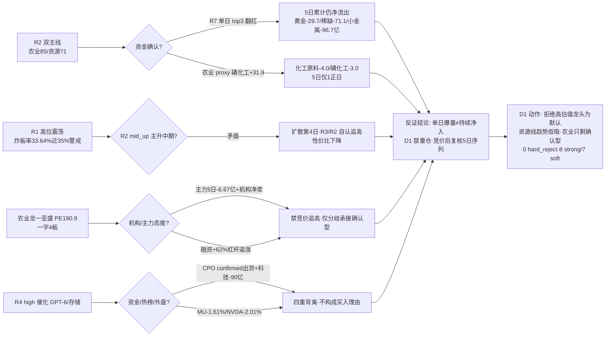

# 2026-09-09 · **反证 / Devil's Advocate**

> **数据源新鲜度**: partial
> **降级状态**: true（R3 weflow down + hotlist T-1 baseline）
> **置信度**: 0.56（0.80 × 0.7 × 1.0，freshness=partial 因 R2/R3 降级）

## 一句话结论

双主线资金「单日爆量翻红」假象延续第 2 日，农业第 4 日扩散 + 龙一 PE190.9 极端 + 中粮涨停板出货嫌疑，科技 high 催化与资金/热榜/外盘四重背离——今日 0 hard_reject，但 10 条 strong_suggest 指向「拒绝高估值龙头当默认动作、资源线只做估值干净趋势低吸、农业线只剩确认型」。

## 详细分析

**资金面裂缝是今日第一反证点（第 2 日延续）**。R7 的 0908 单日 top10 流入板块（黄金#1 +38.03 / 稀缺#2 +37.68 / 小金属#3 +35.77 亿）在 5 日累计口径下全部仍为净流出（黄金 -29.7 / 稀缺 -71.09 / 小金属 -96.74 亿），5 日序列仅 1-2 个正日；农业的 proxy 确认（磷化工 -3.04 / 化工原料 -4.02 亿）同样如此。这并非新发现——昨日 R6 已对同构结构发出 strong_suggest，0908 收盘验证该警示完全成立。R2 用 R7 单日 top3 充当「三源硬共振的资金确认」，等于把一天的数据当成了持续性证据，这是今日所有反证里最需要 D1 在竞价后复核的一条。

**农业线进入第 4 日扩散期，龙头估值极端化**。从 0904 猪肉 → 0907 粮食 → 0908 7 席霸榜，今日是扩散第 4 日。龙一亚盛 PE_ttm 190.9（1 年 100% 分位）+ 主力 5 日 -6.67 亿 + 机构专用净卖 + 融资 15 日 +62% 杠杆追涨 + 风险提示公告，一字 4 板 09:25 封死无上车点；龙二敦煌 PB 6.54 + 3 板开板 2 次 + 龙虎榜分歧。R2 自己 t1_game 都写「高位一字不追，等分歧低吸」——段位判定（mid_up 主升中期）与买点结论自相矛盾。昨日反证的历史胜率摆在那里（新炬 -9.32% / 易点 -4.24% / 恒宝 -1.85% / 蓝标 -1.83%，4/4 全跌），今日同构的高估值农业票没有任何理由破例。

**科技链的「消息最强日 = 资金最不认可日」进入确认出货第 2 日**。R4 给 GPT-6（OpenAI 88 小时攻克千禧年难题）+ 存储短缺实锤（库存 <10 天 / 苹果 NAND 长协）双 high 正面，但 R3 CPO confirmed 出货（0907 #1 → 0908 #5）、R7 华为 -110.75 / AI -89.97 / 液冷 -84.54 亿、外盘 MU -1.61% / NVDA -2.01% 回落——四重背离叠加。R4 首推的中际旭创 / 佰维 / 长鑫 / 普冉绝不能因「消息好」进执行池。

**估值面「贵的没基本面、便宜的没涨停」格局延续**。农业线（亚盛 190.9 / 中粮 34.8·99.6% 分位 / 苏垦 30.5·100% 分位）全命中高估值红旗；资源线（紫金 PE13.3 / 江铜 PE14.5）估值干净但未涨停。候补票红旗密集：金正大亏损无盈利锚、中曼大宗折价分销（7 笔 -7.96%~-10.9%·固定席位派发）、中粮涨停板当日 -9.25 亿出货嫌疑。叠加 E008 美联储加息概率 59.4% + 3 年期美债 4.474% 的宏观逆风，高估值农业妖股是今日最大的「看着热闹但不能碰」。

## 关键证据

- 证据 1: 资源线 top3 流入板块 5 日累计净流出（黄金 -29.7 / 稀缺 -71.09 / 小金属 -96.74 亿），0908 单日翻红为 5 日内唯一正日 · 来源 R7 sector_5d_tracking
- 证据 2: 农业 proxy（磷化工 -3.04 / 化工原料 -4.02 亿）5 日仍净流出，cross_validation=1.0 含 proxy 水分；龙头自身 5 日主力全流出（亚盛 -6.67 / 敦煌 -3.7 / 中粮 -6.75 亿）· 来源 R7 + R5
- 证据 3: 亚盛 PE_ttm 190.9（1 年 100% 分位）+ 机构专用净卖 + 融资 15 日 +62% + 风险提示公告 · 来源 R5 valuation_safety + R7 lhb
- 证据 4: 中曼石油 0810-0818 大宗 7 笔折价 -7.96%~-10.9%（固定卖方席位派发）；中粮糖业涨停日主力 -9.25 亿 · 来源 R5 block_trades / moneyflow
- 证据 5: 昨日反证 4/4 兑现（新炬 -9.32% / 易点 -4.24% / 恒宝 -1.85% / 蓝标 -1.83%）· 来源 0908 R6 回溯 + 0908 收盘数据
- 证据 6: CPO confirmed 出货（0907 #1 → 0908 #5）+ 科技资金 -90 亿级流出 + 外盘 MU/NVDA 回落 · 来源 R3 + R7 + overseas

## 推理深度三问

- **大资金意图**: 双主线的「资金」其实是北向/大权重口径（沪股通 #6 +30.64 / 小盘价值 #7 +26.77 亿）与游资席位（国泰海通成都龙腾东路 2 日连上亚盛）的混合体——前者买的是周期/大盘切换，后者做的是农业妖股接力，两类资金目标不同，R2 把两者都算作「主线资金确认」是口径混用。对手盘是融资盘（亚盛 +62%）与追高的散户。
- **为什么走强**: 农业走强 = 超强厄尔尼诺（WFP 确认）+ 乡村振兴政策（六部门涉农上市）双事件锚 + 热榜 7 席霸榜的扩散正反馈；资源走强 = LME 铜 14617 历史新高 + 中东冲突油价 99 美元的硬价格信号。但筹码端：农业龙头主力 5 日净流出 + 机构净卖，资源股未涨停——走强的是「价格」不是「资金」。
- **逻辑够不够硬**: 农业（厄尔尼诺 + 政策 + 热榜三源共振）、资源（铜价 + 油价 + 资金三源）各有 2-3 个独立源支撑，但**资金持续性**这个唯一硬证据全部是单日翻红——昨日已证伪同构结构（警示成立），今日若第 3 日仍不转正 = 伪主线确认。证伪路径清晰：0909 竞价后看化肥/磷化工 5 日序列是否连续 2 日翻红，龙头是否炸板。

## 霸榜出货 hard_reject 扫描（模式六）

| 标的 | 板块 | distribution_alert 命中(①) | 近5日主力净流出(②) | 双条件 | 结论 |
|---|---|---|---|---|---|
| 亚盛 600108 | 农业/粮食/乡村振兴 | ❌ 无 alert | ✅ -6.67 亿 | 仅② | 不触发（降为模式三 strong） |
| 敦煌 600354 | 农业/粮食 | ❌ 无 alert | ✅ -3.70 亿 | 仅② | 不触发（模式三 soft） |
| 紫金 601899 | 黄金/铜 | ❌ 无 alert | ❌ +6.61 亿 | 无 | 不触发 |
| 江铜 600362 | 铜 | ❌ 无 alert | ✅ -2.12 亿 | 仅② | 不触发 |

**hard_rejects: 0 条**（红线 3 保护未触发）。distribution_alert 仅 CPO（confirmed）与代糖（watch），均非任何主线。⚠️ 两个 watch 升级路径盘中必盯：①代糖 #1 若再霸榜 = 单日登顶兑现 → 农业执行票即时降仓；②农业 7 席霸榜若龙头炸板 = 扩散期退潮 → 全部农业票降级。

## 每票思维链（top 反证对象）

**亚盛集团 600108（农业龙一·4 板一字）**
- **买入理由**: 无独立买入理由——一字 4 板 09:25 封死无上车点，仅存在「放量分歧后承接回封」的确认型机会；R2 自身 t1_game 结论也是「高位一字不追」。
- **风险点**: PE190.9（100% 分位）纯题材定价；主力 5 日 -6.67 亿 + 机构专用净卖 + 融资 +62% 杠杆追涨 = 买盘靠杠杆与惜售；风险提示公告 = 监管降温信号；高位震荡（炸板率 33.64%）环境断板即踩踏。
- **止损条件**: 若做分歧承接：买入价 -5%~-10% 硬区间（R2 stop -5%）；断板 = 直接剔除，并作为农业线退潮观察锚（板块全部降级）。
- **可验证假设**: 0909 竞价是否大幅高开/低开；若一字变 T 字或放量分歧后回封（换手 >0.87% 显著放大）= 资金换手确认；若低开破 5.0 = 断板退潮信号。

**中粮糖业 600737（糖线容量中军·首板）**
- **买入理由**: 泰国减产 17% + 糖业涨停潮 + 中字头容量（流通 388 亿），仅当 0909 资金承接确认（主力转净流入/竞价强）才考虑容量配置。
- **风险点**: 首板当日主力 -9.25 亿 / 5 日 -6.75 亿（涨停板出货嫌疑·R5 flag main_force_heavy_outflow）；PE34.8（99.6% 分位）当期盈利未兑现（净利 yoy -29.86%）。
- **止损条件**: 若做容量承接：买入价 -5%~-10%；周线 16.6 前高未破，跌破 17.5（60 分 MA20）即出。
- **可验证假设**: 0909 竞价后主力资金是否转正；糖价（厄尔尼诺）是否继续上行；若资金 2 日不转正 = 涨停板出货确认，剔除。

**紫金矿业 601899（资源龙一·趋势中军）**
- **买入理由**: 估值干净（PE13.3 / 16.8% 分位 / ROE24.5%）+ 主力 5 日 +6.61 亿（唯一资金健康龙头）+ 铜价历史新高（E003）业绩弹性。
- **风险点**: 未涨停、涨停维缺失（若黄金股不启动主线存疑）；5 日板块累计资金仍净流出（黄金 -29.7 亿）；E008 加息压制资源估值。
- **止损条件**: 买入价 -5%~-10% 硬区间；日 K MA20 33.5 跌破 = 趋势破位。
- **可验证假设**: 0909 是否放量突破 20 日高点 35.47；铜/金价是否续创新高；板块资金 5 日序列是否连续 2 日翻红。

## 数据源审计

| 源 | 日期 | 状态 | 备注 |
|---|---|---|---|
| tushare/ths_daily + limit_list_d | 2026-09-08 | 🟢 | 涨停73/跌停0/炸板37·炸板率33.64% |
| tushare/moneyflow_ind_dc | 2026-09-08 | 🟢 | 504 概念板块 5 日资金序列 |
| tushare/top_list + top_inst | 2026-09-08 | 🟢 | 55 只龙虎榜·35 只 bull_trap 命中 |
| tushare/margin + fund_share | 2026-09-07 | 🟡 | 两融 T+1 最新 0907 |
| tushare/us_daily | 2026-09-08 | 🟢 | MU -1.61% / NVDA -2.01% 已刷新 |
| wechat_cli_5groups | 2026-09-08 | 🟢 | 370 条·5 焦点群（匿名） |
| hotlist_signals (ths_hot) | 2026-09-08 | 🟡 | L1 当日空·用 T-1 baseline |
| weflow_analytics | - | 🔴 | DOWN·R3 降级原因 |
| 公众号源 | - | 🔴 | 用户 2026-08-20 取消·非故障 |
| R5 chart_vision | 2026-09-09 | 🟢 | 10 票 K 线全量 |

## 不确定性 / 反证

1. R2 置信度仅 0.51（freshness partial + agreement 0.85），其「三源共振」判定本身质量打折，今日反证多数建立在「R2 的资金确认不可信」之上——若 0909 竞价后化肥/磷化工 5 日序列连续 2 日翻红，资源/农业的资金面反证需即时降级。
2. R3 无 weflow（L3 缺）+ 热榜为 T-1 baseline，情绪共振有 1 日滞后：代糖 #1 的「单日登顶」判断基于 0908 收盘，0909 当日热榜未生成，存在漏检当日新登顶题材的风险。
3. 模式八（解套盘假繁荣）因缺封板量 vs 套牢区数据 degraded——涨停 73 / 炸板 37 高位震荡下不排除部分涨停为解套/反抽性质，这是定性提示而非量化结论。
4. 反证是概率判断不是预言：昨日农业 watch 路径正向兑现（亚盛 +10%/敦煌 +9.97%），说明高估值龙头在扩散期仍能涨——反证规避的是「追高后的回撤」，不是「上涨本身」；D1 按纪律执行即可，不必因反证错过确认型机会而懊悔。

## 与其他 R/D/E 的关系

- 依赖: R1_style / R2_main_sectors / R3_sentiment / R4_news / R5_stock_profiles / R7_capital_flow / hotlist_signals（均为 20260909 盘前 artifact）
- 被消费: D1(canghai-plan) 消费 hard_rejects[]（强制剔除）与 strong_suggest（须显式处理）；E1(canghai-review) T+N 回填反证兑现度；昨日 R6(20260908) 供 mode5 回溯

## Sub-Agent 元数据

- skill: analyze_devil_advocate_v1
- artifact: data/research/20260909/R6_devil_advocate.json
- 生成耗时: 约 15 分钟（读盘 + 10 模式扫描 + 四象限 + md 渲染）
- model: deepseek-v4-flash-260425
