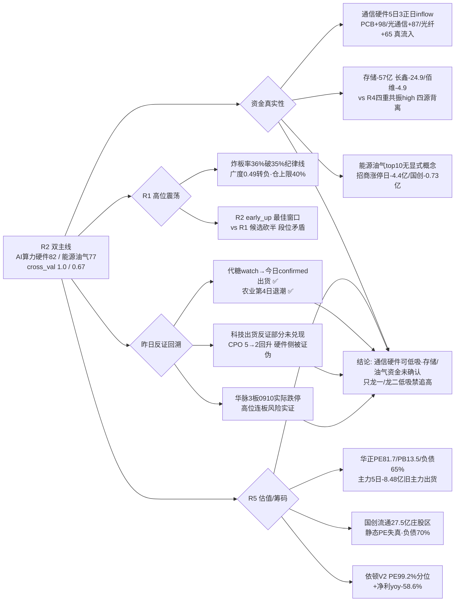

# 2026-09-10 · **反证 / Devil's Advocate**

> **数据源新鲜度**: partial
> **降级状态**: true（R3/R7/hotlist 三源降级 + R5 盘后生成）
> **置信度**: 0.6（0.80 × 0.75 × 1.0 · 核心源 ok 但降级面较宽）

## 一句话结论
硬否决 0 条，strong_suggest 7 条：AI算力硬件链内部分裂（通信硬件资金真流入 vs 存储 -57 亿三源背离）、能源油气链「叙事之王、资金缺席」、高位震荡 vs 主升早期段位矛盾；昨日代糖/农业两个反证全部兑现、华脉 3 板 0910 实际跌停=高位连板风险实证，今日同构高危=培育钻石#1 单日登顶。高位震荡+炸板率 36% 破纪律线，只做龙一/龙二低吸，禁追高。

## 详细分析

**核心矛盾一：AI 算力硬件链是「一真一假」——通信硬件资金真、存储子链三源背离（模式一）**。R2 把整条链列为 score82 第一主线（cross_validation 1.0），但拆开看：通信硬件侧（5G +126 亿/通信 +123/PCB +98/光通信 +87/CPO +80/光纤 +65/铜缆 +55）是资金之王，且 5 日序列 PCB/光通信/光纤为 **3 正日 inflow**——这比昨天资源/农业的「单日爆量翻红」扎实得多，说明通信硬件是真流入、非反抽。但存储子链完全反向：R4 E002 存储四重共振 high（SK海力士新高/摩根大通超配/佰维+3200%/长鑫+2244%）vs R7 存储芯片 **-57.12 亿净流出**（长鑫 -24.88/佰维 -4.89）vs 外盘 MU -1.61% 回落 vs 热榜 rank↑ 但 L3 净额 -57 亿——**四源背离第 2 日延续**。R2 自己都承认「存储子链资金不认，只做通信硬件侧」。反证结论：D1 严禁把 R4 首推（佰维/长鑫/东芯/同兴达）当执行候选；通信硬件可低吸，但「资金先进、涨停未跟」是低位试错特征，0910 必须盘中确认涨停承接，承接失败即退 watch。

**核心矛盾二：能源油气链「叙事之王、资金缺席」（模式一）**。R4 E001 油价破百（布油 101.21/+3.36%·上期所原油夜盘+7%·欧洲天然气两月+75%·7 源 high·weighted 0.78 top）是今日全市场最强事件，R3 也把涨价链列为 rank#1 共振（4 群全覆盖·沥青 30+ 条）。但 R7 top10 资金流入**没有石油/油运/沥青任何显式概念**，只靠周期股 #8（+65.46 亿）和一带一路 #7（+66.74 亿）proxy 撑场；更糟的是龙头资金背离——招商轮船涨停日主力 **-4.4 亿**（炸 8 次回封=先手兑现分歧）+ 5 日 -3.0 亿 + 融资 15 日 -24.5%（追涨资金未进），国创高新涨停日 -0.83 亿 + 5 日 -0.73 亿。cross_validation 只有 0.67（R3✓ R4✓ R7✗）。**事件强度第一 ≠ 资金认可第一**，若 0910 主力仍不流入=纯消息脉冲；地缘缓和（特朗普「中选后战事结束」）即逻辑证伪。

**核心矛盾三：高位震荡 vs 主升早期的段位冲突（模式二）**。R1 判定情绪周期=高位震荡（conf 0.75）·炸板率 36.0% **破 35% 交易纪律警戒线**·广度 0.49 转负·溢价中位 -0.60% 转负·仓上限 40%·「候选数砍半」。R2 却给双主线标 early_up（主升早期）·stage_action 写「最佳参与窗口：第一时间上龙一/龙二」——紧接又自己打补丁「但市场高位震荡+炸板率 36% 破线 → 只做龙一/龙二低吸或半路」。这是第 2 日同构矛盾（0909 R6 已警告过 R2 用板块热度覆盖段位约束）。R3 双共振主题 early_or_late 都是 middle（AI 算力「资金先进涨停未跟」/涨价链「已发酵 2-3 日」），不是主升初段。**高位震荡期没有「第一时间」窗口，只有「低吸确认」窗口**。

**霸榜出货扫描（模式六）**：distribution_alert 仅代糖（confirmed·0908#1→0909#8）与培育钻石（watch·17→1 新晋#1），均非 R2 execution_eligible 四票（新易盛/华正/招商轮船/国创高新）所属板块（光模块/PCB/油运/沥青）→ 条件①不满足 → **今日 0 hard_reject**，红线 3 保护未触发。华正（5 日 -8.48 亿）/招商轮船（-3.0 亿）/国创（-0.73 亿）命中条件②但缺①，已按模式一/三 strong_suggest 处理。watch 升级路径必须盯：**培育钻石#1 单日登顶（若今日再霸榜=代糖剧本重演，市场情绪面整体降仓）**。

**昨日反证兑现回溯（模式五）**：0909 R6 的两个核心反证**全部兑现**——①代糖#1 watch「若 0909 再霸榜=单日登顶兑现」→ 今日 hotlist 确认 0908#1→0909#8 高位滑落 7 位、distribution_alert confirmed ✅；②农业第 4 日扩散退潮「追高危险」→ 今日农业退出主线、R3 农业链 L1 全面下滑（化肥 4→13/农业种植 9→15/猪肉 12→18 掉榜）✅。但 0909 R6 对科技的判断**部分未兑现**：昨日说「CPO 1→5 出货严禁抄底」，今日 CPO 5→2 回升 + 通信硬件资金全面回流——昨日反证把存储子链的出货**过度泛化**到整条硬件链，硬件侧被证伪，必须诚实记录。同时存储警示延续（-57 亿第 2 日），今日反证必须**子链颗粒度**而非整条链泛化。华脉科技（3 板一字高度龙）0910 实际放量跌停收 16.8/-10.02%——R2「只观察不参与」正确，也是高位连板风险的最新实证。

## 反证传导链

## 推理深度三问（top 反证对象：R2 双主线）

- **大资金意图**：北向 +24.61 亿连续 5 日温和流入（5 日均 26.01）但边际递减（26.6→24.61），方向是大权重/周期而非连板妖股——北向在悄悄换仓防御。场内主力意图分化成三股：通信硬件是**机构/北向真配置**（PCB/光通信/光纤 5 日 3 正日，资金与热榜双升）；存储是**老主力高位兑现**（长鑫 -24.88/佰维 -4.89 亿，借 R4 high 消息出货）；油气是**游资事件博弈**（招商轮船炸 8 次回封=先手兑现，双游资在接）。华正龙虎榜双游资大买（龙井路 +4.08 亿）的同时高盛(中国)净卖清单躺 603186——**同票多空席位并存，不是一致**。
- **为什么走强**（或为什么弱）：位置=双主线都是早升早期但嵌套高位震荡（涨停 48 家收缩/炸板率 36% 破线）；催化=油价破百（硬事件·E001 weighted 0.78 top）与存储四重共振（R4 high）都是真消息，但**存储的资金/外盘/热榜三个维度全反向**；筹码=华正高位充分换手（14.41%）+旧主力出货、招商轮船封单 8.2 亿但涨停日主力 -4.4 亿——「消息最强日≠资金最认可日」结构第 2 日延续。
- **逻辑够不够硬**：通信硬件（光/PCB）逻辑最硬——资金（5 日 3 正日）+ 热榜（集体升位）+ 外盘（GLW +7.56%）三源独立共振，且新易盛（PE44 分位 9.1%·净利+91%）基本面干净，**证伪路径=0910 涨停承接失败**；能源油气逻辑硬但资金缺席，**证伪路径=0910 主力仍不流入/地缘缓和**；存储逻辑最弱（资金反向），不做。三条链的硬逻辑与资金密度完全正相关，反证只需盯资金这个单一变量。

## 每票思维链（反证视角 · R2 execution_eligible 四票）

### 华正新材 603186 · AI算力硬件链龙二（0910 收 217.99/+2.8% 逼近前高 223.3）
- **买入理由**（仅低吸）：①PCB/CCL 涨价叙事+PCB 板块资金 +98.45 亿第 3+龙虎榜双游资大买（净 +4.89 亿）；②R5 chart 偏多 0.75 多头排列、MA5 196 为明确低吸位。
- **风险点**：①主力 5 日 -8.48 亿（涨停日 -5.76 亿）=旧主力借板出货、新游资接——龙虎榜净买 vs 主力净流出完全相反；②PE 81.7（65% 分位偏贵）+PB 13.5 极高+负债 65%+212 元高价，E008 美债飙升首当其冲；③0910 已 +2.8% 逼近前高 223.3，追高即赌博。
- **止损条件**：低吸（196/MA5）买入后破 MA5 即走；竞价高开 >5% 放弃；冲前高 223.3 无量突破即高抛。
- **可验证假设**：0910 盘中主力 5 日序列能否转正 + 是否放量突破 223.3——若主力持续流出且冲高回落=旧主力出货兑现，龙二地位降级 watch。

### 招商轮船 601872 · 能源油气链龙一（0910 收 20.58/-1.95% 站所有均线）
- **买入理由**（仅低吸/弱转强）：①油价破百硬催化（R4 E001 weighted 0.78 top）+BDTI 周涨 40%+机构目标价 26.9（现 20.99·空间 28%）；②PE 15.62 合理/ROE 15.5%/净利+227.6% 估值干净，封单 8.2 亿筹码稳。
- **风险点**：①涨停日主力 -4.4 亿（炸 8 次回封）=先手兑现分歧；②R7 资金维未确认（油气链无显式概念）；③融资 15 日 -24.5%（追涨资金未进）+融券 +25.4%（short_pressure）；④地缘缓和（特朗普「中选后战事结束」）即逻辑证伪。
- **止损条件**：低吸（MA5 19.7）破 MA20 18.8 即走；竞价高开 >4% 放弃；止损以买入价 -5~-10% 硬区间为最终基准。
- **可验证假设**：0910 竞价量价+开盘 30 分钟主力是否真流入——若平开缩量走强（弱转强）验证；高开放量冲高回落=先手兑现证伪。

### 国创高新 002377 · 能源油气链龙二（0910 已二连板 收 3.47/+10.16%）
- **买入理由**（仅低吸·非追板）：①沥青期现破 5200 产业级硬涨价（旺季 9-11 月+委油断供+单吨利润 1100-1200 元）；②按吨利润≈3 倍 PE 动态低估（市值 26 亿 vs 年化 7.7 亿）。
- **风险点**：①流通 27.5 亿 ∈[20,50) 亿庄股区+负债 70.3%+换手 19.7% 高换手游资控盘；②0910 已二连板放量，今日三连板=纯游资接力，追二板=接游资筹码；③沥青板块效应弱（独苗涨停·无梯队），依赖独立逻辑；④近 30 日研报 0 篇无机构覆盖。
- **止损条件**：低吸（高开 <3%）买入后破涨停价 -5% 即撤；高开 >5% 放弃；庄股风险区单票 ≤5%。
- **可验证假设**：0910 三连板封板质量（封单/炸板次数）+换手——若换手 >25% 且反复开板=游资接力兑现证伪；缩量快速封板=卡位成功验证。

### 新易盛 300502 · AI算力硬件链龙一（资金最健康·5日+42.47亿）
- **买入理由**（仅低吸）：①主力 5 日 +42.47 亿（全链唯一大额正流入）但股价未跟（0909 收 414.8/-0.38%）=资金价格背离=低位试错预期差；②PE 44.08（9.1% 分位）不贵+ROE 35.7%/净利+91% 基本面最硬+机构高覆盖。
- **风险点**：①PB 23.8 极高+股东户数半年 +65% 筹码大幅分散（散户进场）；②R5 chart 偏空 0.65（日 K 空头/MA60 469 压制）；③「资金先进、涨停未跟」若 0910 涨停承接失败即退 watch。
- **止损条件**：低吸（60 分 395/MA5 403.8）破 60 分支撑 395 即走（下探 378.56 前低）；日 K 突破 MA20 414.7 才转强。
- **可验证假设**：0910 是否放量突破 MA20 414.7 确认转强——突破验证资金兑现；缩量贴 MA20 震荡=蓄势未完成，维持低吸不追。

## 四象限负面汇总

| 象限 | 级别 | 核心信号 | 结论 |
|---|---|---|---|
| 情绪面 | 🔴 高 | 炸板率 36% 破 35% 纪律线·涨停 73→48 收缩·广度 0.49 转负·溢价中位 -0.60%·主线代理 20→4·华脉 3 板 0910 实际跌停 | 高位震荡且破纪律线，候选砍半·仓 40% 上限，只做龙一/龙二低吸 |
| 资金面 | 🔴 高 | 通信硬件 5 日 3 正日真流入 vs 存储 -57 亿三源背离·油气链 top10 无显式概念·招商涨停日 -4.4 亿·华正 5 日 -8.48 亿旧主力出货 | 通信硬件可低吸，存储/油气资金未确认，禁把 R4 首推当主仓 |
| 消息面 | 🟡 中 | E001 油价破百 7 源 high 但资金缺席·E002 存储 high 与资金背离·E004 燧原 9/11 上市=消息兑现日·E008 加息 60.2% 压制成长 | 消息最强两条一条资金未确认一条资金反向，事件驱动容错极低 |
| 估值面 | 🟡 中 | 华正 PE81.7/PB13.5/负债 65%·国创 流通 27.5 亿庄股区/负债 70%·依顿 V2（PE 99.2% 分位+净利-58.6%）·新易盛 PB23.8 但 PE 干净 | 贵的有瑕疵、便宜的不涨停，干净票=招商轮船/中远海能，只低吸禁追高 |

## 关键证据
- 证据 1: 通信硬件 5 日序列 3 正日 inflow（PCB cum+125.27/光通信+235.88/光纤+29.95 亿）vs 存储 -57.12 亿净流出（长鑫 -24.88/佰维 -4.89）· 来源 R7_capital_flow.json sector_5d_tracking / main_force
- 证据 2: 能源油气链 R7 top10 无石油/油运/沥青显式概念（仅周期股 #8+65.46/一带一路 #7+66.74 proxy）；招商轮船涨停日 -4.4 亿/5 日 -3.0 亿；国创高新 -0.83 亿 · 来源 R7_capital_flow.json + R5 chip_structure
- 证据 3: 华正 主力 5 日 -8.48 亿（涨停日 -5.76 亿）+龙虎榜净 +4.89 亿（双游资）vs 高盛(中国)净卖清单含 603186 · 来源 R5 chip_structure + R7 hot_money
- 证据 4: 昨日代糖 watch→今日 confirmed distribution_alert（0908#1→0909#8）；农业第 4 日退潮（今日退出主线·R3 农业链 L1 全面下滑）· 来源 hotlist_signals(0910) + R3_sentiment(0910)
- 证据 5: 华脉 3 板一字 0910 实际放量跌停收 16.8/-10.02%（R5 chart_vision 止损信号 conf 0.8）· 来源 R5_stock_profiles.json technical_readiness
- 证据 6: R1 炸板率 36.0% 破 35% 纪律线·情绪周期=高位震荡(conf 0.75)·仓上限 40%；R4 E008 美债 30Y 破 5.30%+加息概率 60.2% · 来源 R1_style.json / R4_news.json
- 证据 7: 培育钻石 #1 新晋 watch（17→1 单日登顶·未满 2 日）=代糖剧本重演高危 · 来源 R3 hotlist_signals.distribution_alert

## 数据源审计
| 源 | 日期 | 状态 | 备注 |
|---|---|---|---|
| R1_style.json | 2026-09-10 | 🟢 | 高位震荡·情绪 45·仓上限 40%·炸板率 36% 破线（conf 0.70） |
| R2_main_sectors.json | 2026-09-10 | 🟢 | AI算力硬件 82 / 能源油气 77·early_up·execution 4 票（conf 0.65） |
| R3_sentiment.json | 2026-09-10 | 🟡 | 情绪 50·共振 5 主题·代糖 confirmed 出货·培育钻石 #1 watch（weflow down/L1 T-1 baseline） |
| R4_news.json | 2026-09-10 | 🟢 | E001-E008 共 8 事件·E008 唯一负面·油价破百 weighted 0.78 top |
| R5_stock_profiles.json | 2026-09-10 | 🟡 | 9 票全画像·依顿 V2 strong·华脉亏损 0910 跌停·生成于盘后含 0910 收盘 |
| R7_capital_flow.json | 2026-09-10 | 🟡 | 通信硬件 5 日 3 正日/存储 -57 亿/龙虎榜席位分歧（vibe-trading degraded·conf 0.54） |
| hotlist_signals.json | 2026-09-10 | 🟡 | L1 当日空→T-1(0909) baseline·代糖 confirmed/培育钻石 watch |
| R6 昨日(0909) | 2026-09-09 | 🟢 | 16 条反证·代糖/农业兑现·科技硬件侧被证伪 |

## 不确定性 / 反证
- R2/R7 同为 tushare moneyflow_ind_dc 主源存在**同源偏差**：R6 以 R7 5 日序列为硬证据，若 0910 早盘通信硬件/油气板块 5 日累计进一步转强、且油气出现显式资金概念，模式一/二的反证将被部分证伪，D1 可基于竞价与盘中资金复核 override strong_suggest 并记录理由。
- 华正「旧主力出货+新游资接」的判断基于 R5 moneyflow 5 日序列与龙虎榜席位（高盛(中国)净卖清单为席位汇总近似，逐票归属可能有偏差），若 D1 有异议可标注 override。
- R5 生成于 0910 盘后（chart 含 0910 收盘：华脉跌停/国创二连板/招商回踩/华正+2.8%）——本 R6 把这些作为「昨日反证是否兑现」与「高位连板风险」的实证引用，**不构成对 0910 盘中的抢先判断**；若这是 0910 盘前流水线重跑，D1 应只取基本面/资金维度，0910 盘中数据仅作上下文参考。
- 昨日（0909）反证「科技全面出货」在通信硬件侧被证伪——教训：**反证必须子链颗粒度**，把存储子链的出货泛化到整条硬件链是过度泛化错误；今日反证严格区分通信硬件（真流入）与存储（-57 亿）。
- 模式八（解套盘假繁荣）需封板量 vs 历史套牢区估算（筹码数据），上游未透传，已标 degraded 不编造；0909 涨停 48/炸板 27（36%）高位震荡下部分涨停存在反抽/解套性质，仅作定性提示。

## 与其他 R/D/E 的关系
- 依赖: R1_style.json · R2_main_sectors.json · R3_sentiment.json · R4_news.json · R5_stock_profiles.json · R7_capital_flow.json · hotlist_signals.json · 昨日 R6(0909)
- 被消费: D1(canghai-plan) 读取 hard_rejects / counter_arguments / quadrants_negative，strong_suggest 7 条必须显式处理（段位矛盾按高位震荡纪律、华正/国创只低吸禁追高、依顿不纳入执行池、存储子链不做、能源油气资金确认前只龙一/龙二低吸、培育钻石 watch 盘中盯）；E1(canghai-review) 盘后验证反证兑现

## Sub-Agent 元数据
- skill: analyze_devil_advocate_v1
- artifact: data/research/20260910/R6_devil_advocate.json
- 生成耗时: 约 12 分钟（含上游读取与逐模式分析）
- model: deepseek-v4-flash-260425
