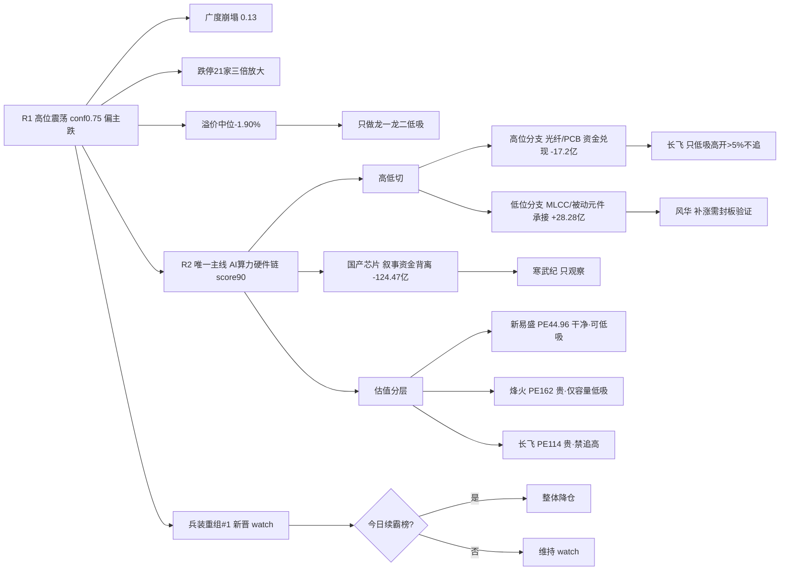

# 2026年9月14日 · **反证 / Devil's Advocate**

> **数据源新鲜度**: partial（T-1 滞后·0911 真实收盘）
> **降级状态**: degraded（R1/R3/R5/R7 均 degraded·MCP 网关 severity=3）
> **置信度**: 0.6

## 一句话结论
高位震荡偏主跌 + 广度崩塌（涨跌比 0.13）下，唯一主线 AI 算力硬件链内部已现**高低切**（光纤/PCB 高位分支资金兑现 vs MLCC 低位分支承接），龙一可低吸、中军/龙二估值贵禁追高；国产算力芯片叙事资金背离第 2 日只观察；**兵装重组 #1 新晋 = 单日登顶出货 watch 同构警报**，今日续霸榜即整体降仓。今日 0 hard_reject。

---

## 详细分析

**一、段位矛盾是本日第一反证。** R1 用 0911 真实指标重算情绪周期 = 高位震荡（conf 0.75·偏主跌）：全市场涨跌比 0.13（涨 643/跌 4870/中位 -2.21%，较 0910 的 0.49 继续崩塌）、跌停 21 家较前日三倍放大、涨停溢价中位 -1.90% 持续转负、打板系列接力端（打二板以上）当日 -4.14% 崩盘、连板高度 5→4 回落。而 R2 给唯一主线标 stage=mid_up（主升中期）「可做龙头分歧低吸或后排补涨」——这是**术语上的段位错配**：高位震荡偏主跌期没有「主升中期」的加仓窗口，只有「低吸确认」窗口。R2 已在 stage_action 里自限「只做龙一/龙二低吸与低位分支补涨、禁追高缩量一字」，属于正确收敛，但 D1 必须按高位震荡纪律把候选数砍半、仓位≤40%，并把 R1 的降档触发线（炸板率破 40% 或跌停≥15 持续）设为硬闸门。

**二、主线内部高低切，不是全面退潮。** R7 资金面显示 AI 算力硬件链整体资金根基扎实：0911 概念净流入 5G +44.88 亿 / 光通信 +43.37 / 被动元件 +33.69 / MLCC +28.28 / CPO +21.16，5 日 5G 累计 469 亿——这是真流入、非单日脉冲。但内部已分化：光纤概念热榜升 12 位（18→6）同时主力净流出 -17.2 亿（热榜升位≠资金确认），PCB/通信涨停端 lhb 诱多命中 29/63=46%（超声电子 -2.04 亿 / 逸豪新材 -2.25 亿机构兑现）。所以反证粒度必须区分：**低位分支（MLCC/被动元件·风华高科）资金承接可做补涨，高位分支（光纤/PCB·长飞/崇达/嘉立创）禁追高**。昨日（0910）反证「科技全面出货」在通信硬件侧被证伪的教训，今天直接用上——反证必须子链颗粒度，不能整条链泛化。

**三、国产算力芯片「叙事之王、资金最大流出」第 2 日。** R4 E003/E005 把国产算力芯片列 positive high 首推（寒武纪/并行/燧原），华创「底部已至」清单点名；但 R7 0911 国产芯片 -124.47 亿 / 存储 -110.3 亿 / 人工智能 -98.36 亿三大板块 top 流出，寒武纪 5 日 -12.39 亿（仅 0911 单日 +1.43 亿微流入）+ 沐曦解禁占流通盘 75%。有叙事无资金 = 只观察不建仓，严禁把 R4 首推当执行候选。这条与昨日同结构，是持续证伪中的反证。

**四、兵装重组 #1 新晋 = 与代糖/培育钻石完全同构的单日登顶出货 watch。** 0909 代糖 #1 单日登顶→0910 升级 confirmed 出货；0910 培育钻石 #1 单日登顶→0911 回落 #14（未升级但结构复现）；0911 兵装重组概念新晋热榜 #1，无 KOL/资金确认（仅地面兵装Ⅲ行业 +13.58 亿 rank8），属题材投机非主线。**若今日续霸榜 = 单日登顶兑现，市场情绪面整体降仓**。D1 严禁追任何高位单日登顶题材。

**五、估值瑕疵集中在中军/龙二。** 烽火（PE 161.8 处于 1 年 79% 分位 + 净利 -32.7% + ROE 1.1% + 负债 61%）是题材驱动定价、安全边际最薄的中军，主线分歧时最先被抛；长飞（PE 113.99 静态贵 + 净利 +889% 低基数扭亏 + PB 23.98）增速含金量低；风华（PE 157.94 周期底部失真 + ROE 2.3%）周期股 PE 无锚。唯独龙一新易盛估值干净（PE 44.96·11% 分位 + ROE 35.7%），但 PB 24.27 + 股东户数半年 +65% 筹码大幅分散 + 30 日回撤 -31.6%，只可低吸不可追高。

## 关键证据
- 证据 1: R1 0911 广度崩塌（涨跌比 0.13/中位 -2.21%）+ 跌停 21 家三倍放大 + 溢价中位 -1.90% + 情绪周期高位震荡（conf 0.75 偏主跌）· 来源 R1_style.json
- 证据 2: 光纤热榜升 12 位主力净流出 -17.2 亿（divergence）+ lhb 诱多 29/63=46%（超声电子 -2.04/逸豪新材 -2.25 亿机构兑现）· 来源 R3_sentiment.json + R7_capital_flow.json
- 证据 3: 主线资金根基真：5G +44.88/光通信 +43.37/被动元件 +33.69/MLCC +28.28/CPO +21.16·5 日 5G 469 亿 · 来源 R7_capital_flow.json
- 证据 4: 国产芯片 -124.47 亿 top1 流出（寒武纪 5 日 -12.39 亿）+ 沐曦解禁占流通盘 75% · 来源 R7_capital_flow.json + R5_stock_profiles.json
- 证据 5: 兵装重组概念新晋热榜 #1（watch·霸榜第一永作反向）· 来源 R3_sentiment.json distribution_alert
- 证据 6: 昨日（0910）R6 反证兑现率 5/7 strong（存储/油气/华正/华脉/依顿），培育钻石 #1 部分兑现（回落 #14），通信硬件侧被证伪 · 来源 data/research/20260910/R6_devil_advocate.json
- 证据 7: 烽火 PE161.8(79% 分位)+净利 -32.7%+ROE1.1% / 长飞 PE113.99+低基数扭亏 / 新易盛 PE44.96 干净但 PB24+股东户数 +65% · 来源 R5_stock_profiles.json valuation_safety

## 推理深度三问 · top 反证对象

**对象：AI算力硬件链唯一主线（score90·三源硬共振）**
- **大资金意图**：机构/北向在 0911 高位分歧日仍以 5G +44.88 / 光通信 +43.37 / 被动元件 +33.69 亿逆势承接，买的是「算力资本开支周期」（E003 中行 3000 亿 + E005 英伟达 100 亿美元参投 + 1.6T 订单排到明年）而非短线情绪——这是配置盘在中继位建仓，对手盘是 0910 追高被套的杠杆盘与 0911 兑现的机构（超声电子 -2.04 亿/逸豪新材 -2.25 亿）。
- **为什么走强**：位置=板块 age 10 天、龙头高度仅 2 板（趋势型非连板型），光模块高位（新易盛 423/长飞 474）但 MLCC/元件在低位（风华 55.99）——高低切结构；催化=光博会 1.6T 供不应求 + 空芯光纤破纪录（硬事件锚）+ 6 券商独立共振（机构群语义一致）；筹码=龙一主力 5 日 +45.12 亿真金 vs 光纤分支 -17.2 亿流出——强的是算力总叙事，弱的是已兑现的高位子链。
- **逻辑够不够硬**：三个独立源（R3 热榜 L1+L2 / R4 事件 high / R7 资金真流入）共振，硬逻辑成立；但**证伪路径清晰**：①0914 光纤/PCB 高位分支资金 5 日序列转负扩大 + 炸板率破 40% = 高低切失败、主线转兑现；②MLCC 分支（风华）首板隔日无封板承接 = 低位补涨证伪；③兵装重组续霸榜 = 情绪面整体降档。D1 只认「低位分支承接 + 龙一低吸」这个具体窗口，不认「主升中期」的宽泛说法。

## 反证目标票思维链 · 执行候选核心票

### 烽火通信 600498 · 中军（估值最贵·业绩最差·模式三 strong）
- **买入理由**（仅容量低吸载体·非进攻）：①通信设备行业 0911 主力 +47.41 亿 #1，板块承接仍在；②位置低（40.75 元 vs 新易盛 423/长飞 474）·float 518 亿容量票，高位震荡期适合低吸。
- **风险点**：①PE 161.8（79% 分位贵）+ ROE 1.1% + 净利 -32.7% + 负债 61%——题材驱动定价、安全边际最薄；②R5 valuation_safety 全池最低 48；③中军弹性有限，主线分歧时最先被抛。
- **止损条件**：回踩 MA5（40.2）低吸，破 MA20（40.2 下方 39.5）即走；止损以买入价 -5~-10% 硬区间为最终基准，单票仓位 ≤5%。
- **可验证假设**：0914 通信设备行业资金是否续净流入——若行业资金转负且烽火放量下跌 = 中军退潮证伪，立即剔除；若资金续净入 + 回踩 40.2 不破 = 容量承接验证。

### 长飞光纤 601869 · 龙二（光纤分支资金背离·模式一 strong）
- **买入理由**（仅低吸·禁追高）：①空芯光纤 0.032dB/km 破纪录为次日增量催化，题材新鲜度高；②主力 5 日 +15.19 亿个股仍净流入，同链烽火 800G 实景验证共振。
- **风险点**：①光纤概念热榜升 12 位但主力净流出 -17.2 亿（divergence）——热榜升位≠资金确认，隔日高开属利好兑现；②PE 113.99 静态贵 + 净利 +889% 低基数扭亏 + PB 23.98；③股东户数半年 +83% 筹码大幅分散。
- **止损条件**：平开/小高开回踩可低吸，高开 >5% 不追；竞价被先手顶高即放弃；破 MA5（434）即走。
- **可验证假设**：0914 光纤板块资金 5 日序列是否转正——若续净流出 + 长飞冲高回落 = 高位子链兑现证伪；若资金回流 + 平开走强 = 空芯光纤独立逻辑验证。

### 新易盛 300502 · 龙一（估值干净·筹码分散·高位）
- **买入理由**（仅低吸）：①主力 5 日 +45.12 亿全链第一 + 0911 单日 +9.36 亿，资金最健康；②PE 44.96（11% 分位）+ ROE 35.7%/净利 +91%，基本面最硬。
- **风险点**：①PB 24.27 极高 + 股东户数半年 +65% 筹码大幅分散（散户进场）；②30 日回撤 -31.6% 后修复中，423 元高位对存量利好钝化；③溢价中位 -1.90% 下追高一半亏钱。
- **止损条件**：回踩 5 日线（-5%~-7%）低吸；高开 >3% 不追；若放量跌破 400 关口则降级观察。
- **可验证假设**：0914 是否放量突破站稳 5 日线上方 + 板块资金续净入——验证资金兑现；缩量贴均线震荡 = 蓄势未完成，维持低吸不追。

## 数据源审计
| 源 | 日期 | 状态 | 备注 |
|---|---|---|---|
| R1_style.json | 2026-09-14 | 🟡 | 高位震荡·仓上限 40%·广度崩塌·conf 0.55（核心KOL群 error） |
| R2_main_sectors.json | 2026-09-14 | 🟢 | 唯一主线 AI算力硬件链 score90·conf 0.62 |
| R3_sentiment.json | 2026-09-14 | 🟡 | 情绪 44·共振 3 主题·兵装重组 #1 watch·conf 0.55 |
| R4_news.json | 2026-09-14 | 🟢 | E001-E008 共 8 事件·E001 加息/E002 油价负面·conf 0.72 |
| R5_stock_profiles.json | 2026-09-14 | 🟡 | 6 票全画像·无 fundamental_flags 透传·conf 0.525 |
| R7_capital_flow_20260914.json | 2026-09-14 | 🟡 | 主力净流入/流出·lhb 诱多 46%·conf 0.5（vibe-trading down） |
| hotlist_signals.json | 2026-09-14 | 🟡 | L1 当日空→T-1(0911) baseline·distribution_alert 空数组 |
| emotion_cycle.json | 2026-09-14 | 🟡 | 降级版 low_test·以 R1 重算高位震荡为准 |
| R6 昨日(0910) | 2026-09-10 | 🟢 | 13 条反证·兑现率 5/7 strong·通信硬件侧被证伪 |

## 不确定性 / 反证
- **T-1 滞后**：全部上游基于 0911 收盘，对 0914 盘前状态有 1 个交易日滞后。R3 L1 热榜当日空、R7 两融 0911 SZSE 未落库——若 0914 早盘主线资金发生方向性变化（如 MLCC 分支也转流出），模式一/三的反证需以竞价与盘中资金复核为准。
- **模式七 degraded**：R5 未透传 fundamental_flags[]，vibe-trading MCP down 无法二次核验财务三表。本日基于 R5 valuation_safety 已有信息做轻量扫描，未发现退市风险类 hard_reject 红旗（各票均标「无 ST/审计红旗」），但烽火/长飞/风华的估值瑕疵仅作 strong/soft 处理，不构成硬否决。
- **模式八 degraded**：无封板量 vs 历史套牢区筹码数据（cyq_chips 未取），仅定性提示涨停结构脆弱。
- **兵装重组 #1 的 watch 判定**依赖「霸榜第一永作反向」的既定红线，若 0914 兵装重组出现实质资金（如 R7 当日 show 地面兵装主力持续流入）而非纯题材投机，watch 可被 D1 复核降级为普通观察。
- R2/R7 同为 tushare moneyflow_ind_dc 主源存在同源偏差：R6 以 R7 5 日序列为硬证据，若 0914 光纤/PCB 资金 5 日累计转强，模式一的强反证将被部分证伪。

## 与其他 R/D/E 的关系
- 依赖: R1_style.json · R2_main_sectors.json · R3_sentiment.json · R4_news.json · R5_stock_profiles.json · R7_capital_flow_20260914.json · hotlist_signals.json · emotion_cycle.json · 昨日 R6(0910)
- 被消费: D1(canghai-plan) 读取 hard_rejects(今日 0) / counter_arguments(strong 5·soft 5) / quadrants_negative——strong_suggest 5 条必须显式处理：①段位矛盾按高位震荡纪律压缩（仓≤40%·候选砍半·只龙一/龙二低吸禁追高）；②烽火只容量低吸禁追涨（估值最贵业绩最差）；③国产算力芯片只观察不建仓（寒武纪盯 MA5 突破）；④兵装重组 #1 watch 盘中盯（续霸榜即整体降仓）；⑤光纤/PCB 高位分支禁追高。E1(canghai-review) 盘后验证反证兑现

## Sub-Agent 元数据
- skill: analyze_devil_advocate_v1
- artifact: data/research/20260914/R6_devil_advocate.json
- 生成耗时: 约 15 分钟（含上游读取与逐模式分析）
- model: deepseek-v4-flash-ga-260731
