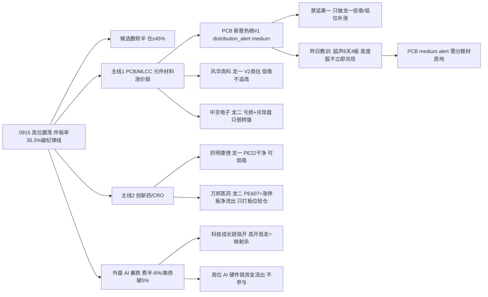

# 2026年9月15日 · **反证 / Devil's Advocate**

> **数据源新鲜度**: partial（tushare 直连 0914 收盘 ok · KOL 5群全灭）
> **降级状态**: degraded（R1/R3/R5/R7 均 degraded · MCP 网关 severity=3）
> **置信度**: 0.58

## 一句话结论
高位震荡（炸板率35.3%破纪律线）下，PCB 新晋热榜#1 出货 watch + 外盘 AI 暴跌映射双压主线1；只做龙一低吸，中京只弱转强、万邦只打板位。今日 0 hard_reject。

---

## 详细分析

**一、段位矛盾是本日第一反证。** R1 用 0914 真实指标重算情绪周期 = 高位震荡（conf 0.69·emotion_cycle 预计算 conf 0.75）：炸板率 35.3% 已破 35% 纪律警戒线 → 情绪=震荡，候选数砍半、仓位上限 45%；广度修复为真（涨跌比 0.13→1.41、中位 -2.21%→+0.28%、涨停溢价中位 -1.90%→+3.12%），但高标崩已启动（非ST三板以上当日 -9.99%）、权重弱（上证 -0.07%/创业板 -1.10%）。而 R2 给主线1 元件材料链标 stage=mid_up「可做龙头分歧低吸或后排补涨」——这是术语上的段位错配：高位震荡期没有「主升中期」的加仓窗口，只有「低吸确认」窗口。R2 已在 stage_action 自限「只做龙一/低位补涨·禁追第一」属正确收敛，但 D1 必须按高位震荡纪律把候选砍半，并把 R1 降档触发线（炸板率破 40% / 跌停放大）设为硬闸门。

**二、主线1 内部高低切 + PCB 出货 watch，是本日第二反证。** PCB +43.85亿#1 / 5日累计 +129.62亿（4/5天）是全市场唯一持续主线，资金根基真；但 PCB 概念新晋热榜#1 → R3 distribution_alert（medium·霸榜第一永作反向），中京电子 5日全单净额 -2.0亿（前波高位兑现盘仍在）。R7 seesaw 确认科技硬件高低切：国产芯片↔被动元件 -0.952 / MLCC↔国产芯片 -0.836。高位 AI 硬件链资金大幅流出（CPO -123.49亿#1 / 光通信 -98.95亿#2 / 国产芯片 -80.82亿#4）——这条链昨日 R6 就警告过，0914 已兑现（新易盛 -5.0/中际旭创 -5.7）。高位澄清票兑现实锤：超声电子 3日机构专用 -3.89亿 / 紫阳东路 -1.12亿 / 深股通 -0.24亿，R2 排除正确。**大资金意图**：主线1 的 PCB 是涨价逻辑（电子布 G75 涨至 22800-24000 元/吨 + 村田 MLCC 扩产 20%），非纯 AI 叙事，但高位澄清票（超声/金安）资金在借人气兑现，资金从 PCB 高位分支向 MLCC/低位补涨分支切换。**为什么走强**：位置——风华 58.90 距 20 日高 -5.5% 中高位、中京 18.79 低位首板；催化——电子布/MLCC 涨价 + 大摩超级周期（存量利好）；筹码——风华 5日主力 +9.49亿 承接真、中京 5日全单 -2.0亿 兑现盘仍在。**逻辑够不够硬**：四量化源（热榜/人气/资金/游资席位）同向唯一方向 + R4 E008 high 催化，逻辑硬；但证伪路径明确——外盘 AI 暴跌（费半 -6%/美债破 5%）若映射杀，PCB 低开不承接即证伪。

**三、主线2 创新药/CRO 估值结构优于主线1，但龙二万邦是估值炸弹。** 药明康德 PE_ttm 22.2/PB 5.8/ROE 13.6/H1 净利 +29.4% 高成长匹配，全池最干净；创新药出海 1200 亿 + 恒瑞 SHR-2004 受理是硬催化。但万邦医药 PE_ttm 607（盈利近乎归零·净利 -99.5%/营收 -40%）、float 21 亿小盘、30日 +105%、0914 20cm 涨停但全单净流出 -0.70亿（涨停板上出货迹象）、15日龙虎榜 10 次（妖股特征）——R5 已降级「仅打板位/弱转强·不低吸」。**大资金意图**：机构专用 3日 +1.81亿 是真（synergy high），但 0914 涨停板净流出说明有资金借涨停兑现，小盘高换手是博弈盘不是配置盘。**为什么走强**：位置——前日 -7.38% 大面后反包 20cm 涨停，超跌反包弹性；催化——CRO 修复 + 机构买入；筹码——换手 38.7% 极端、筹码结构脆弱。**逻辑够不够硬**：资金维（机构 3日 +1.81亿）真但估值维（PE607）完全不支持，是纯博弈位——可验证假设=0915 若高开秒板缩量则先手兑现，弱转强才可半路。

**四、外盘 AI 科技链暴跌是 0915 最大外部逆风。** 费城半导体 -6%、Anthropic 呼吁放缓 AI、10Y 美债三年首破 5%、纳指期货 -1.7%、韩股 -3.26%——0915 A股科技成长链低开压力，若高开低走即外盘映射杀。主线1（PCB/MLCC）是 AI 服务器上游，有映射风险；但 PCB 自身涨价逻辑（电子布/村田扩产）非纯 AI 叙事，有背离缓解。D1 各主线票只低吸不追高，低开不被承接即降档。

**五、昨日 R6 兑现率 65%，三条教训必须连锁。** ①天融信（事件驱动·资金未确认）0914 +9.96% 涨停 → error_case_20260914_002，R6 过度谨慎——今日网络安全（9/15 网安周·天融信 AI 智能体新品）事件票按盘中验证处理，不预建仓、不硬排除；②超声电子 6天4板 续涨停 → 高度股资金流出不立即兑现，PCB#1 medium alert 需分题材质地，不机械套「霸榜=出货」；③培育钻石 0910#1 → 0914 续涨，今日 rank 14→3（+11）又是动量王，但黄河旋风 5日主力 -6.76亿 人气资金背离，R5 已拦截。

---

## 关键证据

- 证据 1: PCB 新晋热榜#1 → distribution_alert medium（霸榜第一永作反向）· 中京电子 5日全单 -2.0亿 前波兑现 · 来源 R3 hotlist_signals + R5 chip_structure
- 证据 2: 外盘 AI 科技链暴跌（费半 -6%/美债破 5%/纳指期货 -1.7%/韩股 -3.26%）· 来源 R4 E003 + R1 overseas_analysis
- 证据 3: 高位 AI 硬件链资金大幅流出（CPO -123.49亿#1/光通信 -98.95亿#2/国产芯片 -80.82亿#4）· seesaw 国产芯片↔被动元件 -0.952 · 来源 R7
- 证据 4: 超声电子 3日机构专用 -3.89亿/紫阳东路 -1.12亿/深股通 -0.24亿（高位澄清兑现坐实）· 来源 R7 hot_money synergy_flags
- 证据 5: 万邦医药 PE_ttm 607 + 0914 涨停板净流出 -0.70亿 + 15日龙虎榜 10 次 · 来源 R5 valuation_safety/chip_structure
- 证据 6: 昨日 R6 兑现率 65%（天融信 unfulfilled·超声/培育钻石 partial）· 来源 E1_data.json r6_fulfillment(0914)

## 推理深度三问（反证视角）

- **大资金意图**: PCB/MLCC 涨价逻辑（电子布/村田扩产）是产业级配置，但高位澄清票（超声/金安）资金在借人气兑现，从 PCB 高位分支向 MLCC/低位补涨分支切换；万邦机构 3日 +1.81亿 是博弈盘不是配置盘
- **为什么走强**: 位置（风华中高位·中京低位首板·万邦大面反包）+ 催化（涨价/创新药出海）+ 筹码（风华 5日 +9.49亿 承接真 vs 中京 5日全单 -2.0亿 兑现盘 vs 万邦涨停板净流出）三维交叉
- **逻辑够不够硬**: 主线1 四量化源同向唯一方向 + E008 high 硬催化，逻辑硬；证伪路径=外盘 AI 暴跌映射杀（低开不承接）；主线2 药明硬（PE22 干净），万邦不硬（PE607 纯博弈）

## 每票反证思维链

### 风华高科 000636.SZ（主线1·龙一）
- **买入理由**: 资金背书型龙一（5日主力 +9.49亿·深股通3日 +4.39亿）+ MLCC 国产龙头 + R4 E008 首推；若 D1 坚持纳入，唯一合理形态是回踩 5 日线低吸
- **风险点**: V2 周期元件高估（PE_ttm 166/PEG 2.2）+ 机构专用净卖 -8654.6万（lhb 诱多 pattern）+ 热榜#1 出货 watch 下高位（58.90）追高=接盘
- **止损条件**: 跌破 55.95 前高支撑降级 watch（-5%）；高开 >3% 放弃
- **可验证假设**: 0915 回踩 5 日线（-3~-5%）获资金承接则逻辑成立；若放量破 55.95 或高开低走（外盘映射杀）即证伪

### 中京电子 002579.SZ（主线1·龙二）
- **买入理由**: 低位首板补涨（18.79）+ 紫阳东路游资席位 + 深股通3日 +1.34亿；若 D1 坚持纳入，唯一合理形态是弱转强半路
- **风险点**: H1 净利 -591% 亏损 + 负债率 64%（V6+V8 双红旗）+ 5日全单 -2.0亿 前波兑现盘 + PCB#1 出货 watch 下追高=接盘
- **止损条件**: 回踩不破首板涨停价 18.79；高开秒板缩量一字不追；板块炸板率破 40% 降档
- **可验证假设**: 0915 竞价低开→盘中弱转强放量则承接成立；若高开抢跑缩量（先手兑现）即证伪

### 药明康德 603259.SH（主线2·龙一）
- **买入理由**: 全池估值最干净（PE_ttm 22.2）+ CRO 全球龙头 + 主力 5日 +7.63亿 全链第一 + 创新药出海 1200 亿硬催化
- **风险点**: 防御修复主线在主线扩散日弹性偏弱 + 创新药 5日累计 -61亿 刚转正（0915 资金不再流入=修复一日游）+ 距历史高位（180+）修复空间依赖外盘风险偏好
- **止损条件**: 跌破 150 降级 watch（-5%）；高开 >3% 不追
- **可验证假设**: 0915 回踩 5 日线（152-155）承接 + 创新药继续净流入则逻辑成立；若 0915 资金转负或放量破 150 即证伪

### 万邦医药 301520.SZ（主线2·龙二）
- **买入理由**: 机构专用 3日 +1.81亿（synergy high）+ 20cm 弹性；若 D1 坚持纳入，只可按打板博弈位轻仓，严禁低吸
- **风险点**: PE_ttm 607 盈利近乎归零 + 0914 涨停板净流出 -0.70亿（出货迹象）+ float 21亿 庄股风险 + 15日龙虎榜 10 次（妖股特征）+ 30日 +105% 高位
- **止损条件**: 回踩不破 63.6 才可轻仓低吸（-7%）；高开秒板缩量不追；仓位显著低于龙一
- **可验证假设**: 0915 弱转强（低开→盘中转强）且无涨停板净流出则博弈成立；若高开抢跑缩量或继续净流出即证伪

## 数据源审计

| 源 | 日期 | 状态 | 备注 |
|---|---|:--:|---|
| tushare/limit_list+limit_step+daily | 2026-09-14 | 🟢 | 涨停55/跌停15/炸板30 · 连板4板 · 全市场5550只 |
| tushare/ths_daily+fund_daily | 2026-09-14 | 🟢 | 22风格板块 + 20ETF |
| tushare/moneyflow_ind_dc | 2026-09-14 | 🟢 | PCB +43.85亿#1 · CPO -123.49亿#1 |
| tushare/moneyflow_hsgt | 2026-09-14 | 🟢 | 北向 +23.85亿 |
| tushare/top_list+top_inst | 2026-09-14 | 🟢 | 龙虎榜 75 · 诱多 26(34.7%) |
| tushare/ths_hot | 2026-09-14 | 🟢 | 热榜 20 · PCB#1 · 培育钻石 rank14→3 |
| tushare/margin | 2026-09-11 | 🟡 | 0914 未落库 · 用 0911 完整 |
| tushare/us_daily(美股) | 2026-09-11 | 🟡 | 0914 美盘未落库 · GOOGL 例外 0914 |
| wechat_cli_5groups | 2026-09-15 | 🔴 | 5群全灭 0条（群匿名） |
| weflow-analytics | 2026-09-15 | 🔴 | 永久下线(ngrok 404) |
| vibe-trading MCP | 2026-09-15 | 🔴 | down · F12/ST 双轴无法二次核验 |
| R5_stock_profiles(画像) | 2026-09-15 | 🟡 | 10票 · chart 缺 · conf 0.50 |

## 不确定性 / 反证

本报告自身同样可能错：①模式六依赖「高置信霸榜出货」判定，PCB 当前仅 medium alert——若 0915 PCB 纯属启动而非出货，则「只做龙一/禁追第一」会错失主升弹性；②昨日培育钻石「单日登顶=出货」未兑现即例证，题材质地不同结论可能完全相反；③R6 过度谨慎史（天融信）表明「资金未确认」不是否定充分条件——今日对网络安全事件票已降为盘中验证而非排除；④上游 R1/R3/R5/R7 全部 degraded、KOL 5群全灭，情绪温度缺定性交叉验证，反证结论的置信度上限受上游质量约束（conf 0.58）。

## 与其他 R/D/E 的关系

- 依赖: R1_style(风格/情绪周期) · R2_main_sectors(反证对象) · R3_sentiment(共振/distribution_alert) · R4_news(催化交叉) · R5_stock_profiles(估值/筹码/红旗) · R7_capital_flow(资金交叉) · hotlist_signals(模式六) · emotion_cycle(段位) · E1_data r6_fulfillment(0914 模式五)
- 被消费: D1(canghai-plan·hard_reject 强制剔除 / strong_suggest 显式处理 / soft_suggest 记入 r6_soft_notes) · E1(canghai-review·明日回填兑现率)

## Sub-Agent 元数据

- skill: analyze_devil_advocate_v1
- artifact: data/research/20260915/R6_devil_advocate.json
- 生成耗时: 约 4 分钟（读 6 上游 + 四象限 + 12 条反证）
- model: deepseek-v4-flash-ga-260731
