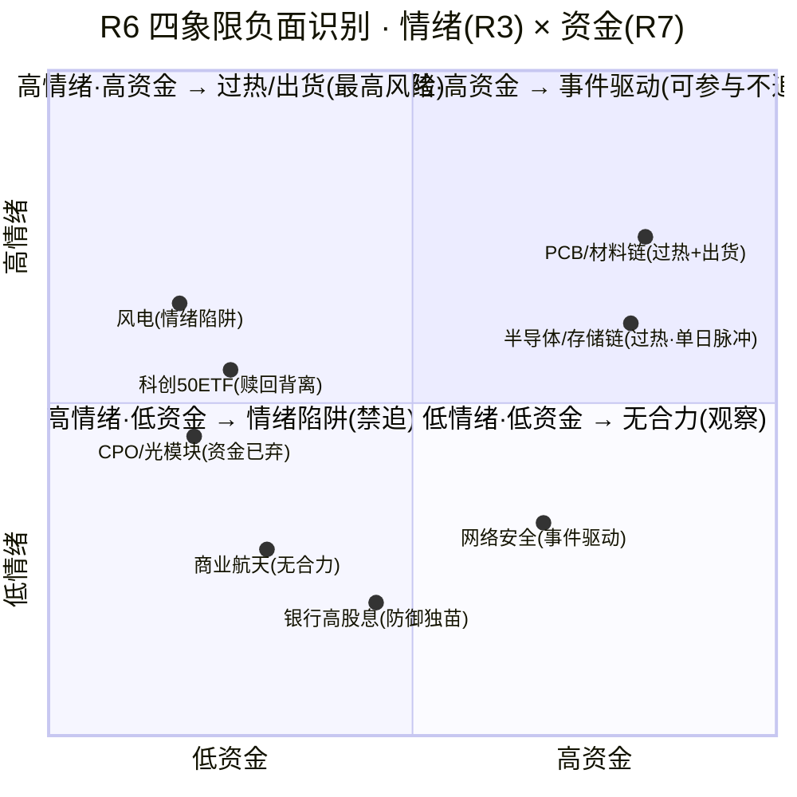

# 2026年9月16日 · **反证 / Devil's Advocate**

> **数据源新鲜度**: ok
> **降级状态**: false
> **置信度**: 0.62

## 一句话结论

退潮边缘别贪板：13 条反证 0 hard_reject，但 R2 双主线 4 只候选全部顶着估值红旗，半导体资金是单日脉冲、PCB 霸榜出货是传染源，D1 只留低吸档、总仓 ≤25%。

## 详细分析

**段位错配是今日最大裂缝。** R1 的情绪钟摆已经摆到高位震荡贴主跌边缘——情绪浓度 32（恐惧区）、炸板率 42.86% 连续破 40% 退潮线和 35% 纪律线、全市场广度 0.26 崩溃级、涨停 32 vs 跌停 27 几乎对半、溢价中位 +0.11% 近零。这是一个"打板赚不到钱、追高大概率挨打"的环境。可 R2 依旧给半导体链 84 分、材料链 73 分，留了 4 只 execution_eligible。R2 已经按 R1 砍半了（每条主线只留龙一龙二），但主线 2 的段位是 climax 高潮期——双星新材 3 板高位、换手 22.25%，在情绪 35 的恐惧区做高潮期票，本身就是一个段位错配。D1 若照单全收 4 只，等于在退潮边缘开了四桌麻将。

**半导体链的"资金确认"是纸糊的。** R7 给半导体概念 +40.75 亿 #1，听着威风，但 5 日累计 -273.95 亿——0915 只是资金转正首日，单日脉冲不能证明主线持续性。更刺眼的是 CPO 概念 -75.06 亿、光通信模块 -77.92 亿，流出全市场前二。R2 主线 1 的共振证据却把 CPO#5 热榜在榜列进去，cross_validation=1.0 的"三源同向"有选择性引用嫌疑：热度在榜 ≠ 资金认可，热榜第一也可能是出货盘口（PCB 就是现成的例子）。科创50ETF 净赎回 -15.53 亿、全场唯一大额流出，大资金对科创板的态度和芯片 ETF 收红是背离的。

**PCB 霸榜 2 日是唯一的高置信出货源，但没触发 hard_reject。** 模式六的双条件：①标的所属板块命中 distribution_alert（PCB概念 high·0914#1→0915#1）；②近 5 日主力净流出。4 只候选里寒武纪/大为是半导体、双星是 PET 铜箔细分、国瓷是氧化锆/MLCC——都不属于 PCB 板块本身；而且 4 只 5 日主力全部为正（+1.55~+9.62 亿）。条件②全员不成立，所以 hard_reject=0 是程序正义。但程序正义不等于没有风险：PCB 出货带崩的是整个材料链情绪，双星 3 板首当其冲，这条传染路径必须由 D1 显式处理。

**估值红旗全中。** 4 只候选无一幸免：寒武纪 PE 203/PB 49.9（V2）、国瓷材料 PE 103.5 + 商誉 16.9%（F2+V2）、大为股份 PE 358.7 纯情绪定价（V2 strong）、双星新材 PE 无意义但 ROE 0.55%（V1）。叠加 E003 美联储 9 月加息 92.4%、30Y 美债破 5.40% 创 2007 年新高——利率冲击下高估值成长是系统性压制，不是个股能扛的事。R1 也点名了"若利率冲击传导 A 股权重，高估值首当其冲"。

**昨天教会我们什么。** 0915 R6 兑现率 65%，最大的 error_case 是天融信 +9.96% 涨停——R6 因为资金未确认而过度谨慎，错杀了一只有 4 大游资席位的事件票。今天的网络安全/信创（中新赛克 4 板、天融信游资 4 席位、R7 +14.1 亿#6）就是同构结构，D1 不得再以"无主线资格"硬排。反过来说，PCB 出货警报从昨日的 medium 升级为今日的 high（霸榜第二日），是警报升级连锁，材料链高位票必须集体降档。

**四象限负面识别。** 高情绪×高资金：半导体/存储（过热，资金单日脉冲+CPO 流出）、PCB/材料链（过热+出货，霸榜 2 日+澄清潮+风华兑现）。高情绪×低资金：风电（涨停维最强但资金未确认，闽东 5 板主力 -0.86 亿背离）。低情绪×高资金：网络安全（事件驱动，游资主导，不可硬排但也不追高）。低情绪×低资金：商业航天（R4 high 催化但全市场不认）、银行高股息（防御独苗但无涨停基因）。负面权重最高的是"高情绪×高资金"里的 PCB——它是 R3 明牌出货源。

## 四象限负面识别

## 关键证据

- 证据 1: 半导体 5 日累计 -273.95 亿 vs 单日 +40.75 亿 · 来源 R7 sector_5d_tracking（资金转正首日，脉冲非趋势）
- 证据 2: CPO -75.06 亿 / 光通信模块 -77.92 亿 流出全市场前二 vs R2 将 CPO#5 列为正向共振 · 来源 R7 top_outflow + R2 main_lines[0].logic
- 证据 3: PCB 热榜#1 霸榜 2 日（0914#1→0915#1）= distribution_alert high · 来源 R3 hotlist_signals.L4_distribution_alerts
- 证据 4: 4 只 execution_eligible 全部命中估值陷阱 flag（寒武纪 V2/国瓷 F2+V2/大为 V2 strong/双星 V1）· 来源 R5 valuation_safety.fundamental_flags
- 证据 5: 风华高科 0915 主力 -4.85 亿 高位兑现 + 股东户数 +23% 筹码分散 · 来源 R5 chip_structure
- 证据 6: 昨日 error_case 天融信 +9.96% 涨停（R6 过度谨慎）· 来源 PREV_R6 20260915
- 证据 7: 量化打板席位总净卖 -1.18 亿 touched 双星新材（游资内部多空分歧）· 来源 R7 hot_money.active_seats

## 数据源审计

| 源 | 状态 | 抓取时间 | 记录数 | 备注 |
|---|---|---|---|---|
| R1_style | ✅ ok | 07:23 | - | 情绪 32/退潮边缘/仓位 25% |
| R2_main_sectors | ✅ ok | 08:30 | - | 双主线 84/73 + 4 只 eligible |
| R3_sentiment | ✅ ok(degraded) | 08:07 | - | KOL 2/5群·WeFlow 下线；热榜 L1 完整 |
| R4_news | ✅ ok | 07:24 | 8 events | E003 美债/E004 存储/E008 PCB 澄清潮 |
| R5_stock_profiles | ✅ ok(degraded) | 09:12 | 10 profiles | vibe/hithink down，tushare 直连补偿 |
| R7_capital_flow | ✅ ok(degraded) | 07:40 | - | 两融用 0914·美股 0914 美盘 |
| hotlist_signals | ✅ ok | 08:00 | 20 rows | PCB high alert |
| PREV_R6_20260915 | ✅ ok | - | 12 | 兑现率 65% |

## 不确定性 / 反证

本反证自身的盲区：①R3 degraded（KOL 2/5 群 + WeFlow 永久下线）意味着情绪共振可能被低估——半导体链若有未被捕获的 KOL 强共振，M1_02 的"脉冲质疑"会变弱；②R5 的估值红旗基于 tushare 直连 daily_basic，vibe-trading 的深度财务红旗（F1/F8/F11 等）未跑，商誉 16.9% 未达 30% P0 阈值，我按 medium 处理，但若按"接近阈值"从严则是 strong；③外盘 AI 硬件链回调（英伟达 -8.42%/美光 -9.11%）是已知背离，但 0916 盘中若外盘反弹，M10_01 会失效；④我判"双星量化打板席位净卖"为游资分歧，但该席位是 net_buy_wan 口径的总计，非个股精确值，需 D1 以 R7 原始 hot_money 明细复核。

## 与其他 R/D/E 的关系

- 依赖: R1_style / R2_main_sectors / R3_sentiment / R4_news / R5_stock_profiles / R7_capital_flow / hotlist_signals / PREV_R6(20260915)
- 被消费: D1(canghai-plan) —— hard_rejects 强制剔除 / strong_suggest 须显式处理或记 d1_override；E1(canghai-review) —— 盘后核对兑现率

## Sub-Agent 元数据

- skill: analyze_devil_advocate_v1
- artifact: data/research/20260916/R6_devil_advocate.json
- 生成耗时: 约 5 分钟
- model: deepseek-v4-flash-ga-260731
