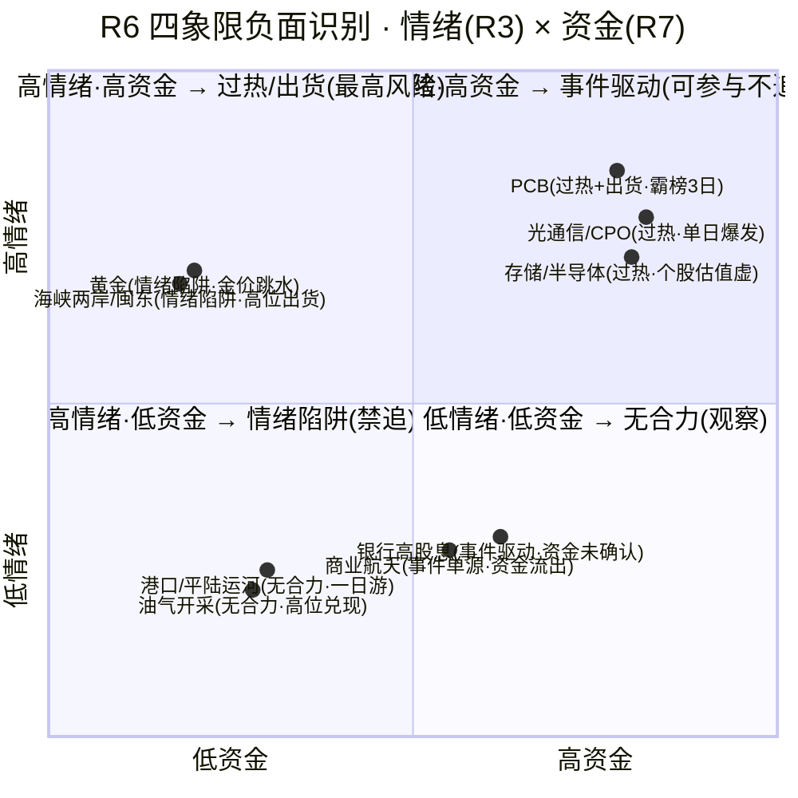

# 2026年9月17日 · **反证 / Devil's Advocate**

> **数据源新鲜度**: partial
> **降级状态**: true
> **置信度**: 0.55

## 一句话结论

主升首日别上头：14 条反证 0 hard_reject，光通信资金是单日爆发、5 日仍净出，4 只候选 3 只 5 日主力流出，D1 只做龙一龙二低吸、总仓 ≤60%。

## 详细分析

**"三源硬共振"是纸糊的。** 今天最大的裂缝藏在 R2 的 cross_validation_score=1.0 里。R3 的 resonance_top_themes 是空数组——KOL 5/5 群全灭、WeFlow 永久下线，红线 4 明文禁止 L1-only 进入共振主题，R3 自己说"仅供 R2/R4/D1 参考，不得视为舆论共振"。R2 用 l1_only_top_observations 替代后给自己打了满分，却在 notes 里承认"若严格按空数组算，双主线只有 0.67"。这不是 R2 不诚实，是降级环境下的必然妥协——但 D1 必须知道：所谓三源硬共振，实际是"热榜+资金+消息"三个量化源同向，缺了市场参与者最真实的文本层确认。主线可以做，信心档要打折。

**光通信的资金分与持续性倒挂。** R2 给光通信资金 19/20、总分 87，压过存储的 84，理由是 R7 通信技术 +223 亿、CPO +157 亿、光模块 +142 亿全线净流入。但把镜头拉远到 5 日：CPO 累计 -73.11 亿（0914 -123 亿、0915 -75 亿，0916 一天 +157 亿回补），光通信模块累计 -55.33 亿，通信技术累计 +56.58 亿但只有 2 个正日、0915 还是 -42.99 亿——这是单日爆发式回流，不是持续净入。真正持续的是存储：5 日 +4.11 亿、3 个正日，科技链唯一。R2 给持续性更强的线打了更低的资金分，这个倒挂 D1 要心里有数：光通信是"昨天刚刚反转"，存储是"一直在流入"。

**4 只候选，3 只 5 日主力净流出。** 光迅 -15.53 亿、通鼎 -6.32 亿、有研硅 -1.34 亿，只有兆易 +4.96 亿为正。光迅顶着全市场龙虎榜净买第 1（10.15 亿）的头衔，5 日主力却是净流出——单日抢筹和中期筹码松动并存，股东户数半年 +68% 也在印证筹码在分散。通鼎更典型：67 亿巨量、开板 6 次、换手 24.5%，LHB 从 0915 净买 +8.35 亿变成 0916 净卖 -386 万，先手资金已经兑现，T 王席位还在同步净卖。模式六的双条件（板块命中 alert + 5 日主力净流出）没有同时成立——4 只候选都不属于 PCB 板块本身，所以 hard_reject=0 是程序正义；但 3/4 候选已经踩中条件②，一旦 PCB 的霸榜出货警报扩散到光通信/存储主线，硬否决随时可以成立。

**昨天教会我们：资金维反证已经连续三天偏悲观。** 0916 R6 兑现率 35.7%（65%→36.4%→36%），唯一硬反证未兑现就是 CPO/光模块"出货盘口、明确排除"——结果光迅涨停 +10%、中际旭创 +5.07%、新易盛 +6.72%。今天 R7 用 CPO +157 亿、光模块 +142 亿、光纤 +86 亿全线转正，把昨天的判断钉死在错误清单上。所以今天 R6 对光通信主线只保留了"5 日累计仍负需承接验证"的软级观察，绝不升级成排除类反证——D1 按主线执行光通信，但仓位在 R1 的 60% 上限内分配，用竞价承接做验证闸门。反过来，PCB 的出货警报从 0916 的"霸榜 2 日"变成今天的"霸榜 ≥3 日"，澳弘电子 L4 机构专用净卖 -2079 万已经在高位板上发生，这个传染源 D1 必须显式处理。

**估值红旗集中在弹性最大的票上。** 有研硅是龙二、是 20cm、是妖股（30 日 8 板），但 PE 285.9 处一年 98.3% 分位、ROE 只有 2.9%，V2 strong 红旗——估值最贵、业绩最虚、筹码最散（股东 +125%），还有 0914 一笔折价 -20% 的对倒大宗。光迅 PE 132.6 处 71.2% 分位偏贵，通鼎 PE 139 绝对值高，兆易 PE 33 历史最低基本面最硬，但 chart_vision 偏空 0.75——日 K 空头排列、MA20 386.58 压在头上，主升早期"猛干"和日 K 空头结构是硬冲突。四只候选没有一只是干干净净的：要么估值贵，要么技术空，要么筹码散。

## 四象限负面识别

## 关键证据

- 证据 1: R3 resonance_top_themes 空数组 vs R2 cross_validation_score=1.0（R2 自认严格口径仅 0.67）· 来源 R3_sentiment + R2_main_sectors.notes
- 证据 2: CPO 5日累计 -73.11 亿 / 光通信模块 -55.33 亿 vs 单日 +157/+142 亿；存储 5日 +4.11 亿 3正日唯一持续 · 来源 R7 sector_5d_tracking
- 证据 3: 光迅/通鼎/有研硅 主力5日 -15.53/-6.32/-1.34 亿（3/4 eligible 净流出）· 来源 R5 chip_structure.main_force_5d_net_yi
- 证据 4: PCB 热榜#1 霸榜≥3日（0914#1→0915#1→0916#1）distribution_alert high + 澳弘 L4 机构净卖 -2079 万 · 来源 R3 hotlist_signals + R7 lhb_bull_trap
- 证据 5: 昨日 R6 兑现率 35.7%，唯一硬反证未兑现=CPO 排除（光迅+10%涨停/中际+5.07%）· 来源 E1 r6_fulfillment
- 证据 6: 有研硅 PE 285.9 一年 98.3% 分位 + ROE 2.9% + V2 strong + 股东户数 +125% + 0914 折价 -20.3% 对倒大宗 · 来源 R5 valuation_safety + chip_structure
- 证据 7: 通鼎 LHB 0915 净买 +8.35 亿 → 0916 净卖 -386 万（先手兑现）· 来源 R5 lhb_detail
- 证据 8: R4 中际旭创价格锚 125.5 vs 0916 实际 907.8（差 7.2 倍），D1 禁用 R4 止损参考价 · 来源 R4 + R5

## 数据源审计

| 源 | 状态 | 抓取时间 | 记录数 | 备注 |
|---|---|---|---|---|
| R1_style | ✅ ok | 07:38 | - | 主升 conf0.60 贴线 · 极贪 84 · 仓位上限 60% |
| R2_main_sectors | ✅ ok | 08:24 | - | 双主线 87/84 · 4 只 eligible · cross_validation 虚高 |
| R3_sentiment | ⚠️ degraded | 08:03 | - | 场景E L1-only · KOL 全灭 · 共振空 · conf 0.45 |
| R4_news | ⚠️ degraded | 07:39 | 8 events | E001 加息/E002 苹果NVLink/E005 存储 · 价格锚过期 |
| R5_stock_profiles | ⚠️ degraded | 09:03 | 10 profiles | chart 快照仅 2/10 · 估值红旗已透传 |
| R7_capital_flow | ⚠️ degraded | 07:46 | - | 5日追踪完整 · vibe down · conf cap 0.5 |
| hotlist_signals | ✅ ok | 08:02 | 20 rows | PCB high alert 霸榜≥3日 |
| PREV_R6_20260916 | ✅ ok | - | 14 | 兑现率 35.7% · CPO 排除被证伪 |
| E1_r6_fulfillment | ✅ ok | - | 14 | unfulfilled=CPO/光模块排除 |

## 不确定性 / 反证

本反证自身的盲区：①R3 场景E L1-only 意味着"光通信单日爆发"的质疑可能被高估——若 0917 盘前出现未被捕获的强 KOL 共识，M1_02 的持续性担忧会减弱，而昨天的 CPO 误判正是同一类错误；②R5 的估值红旗基于 tushare 直连 daily_basic，vibe-trading 的深度财务红旗（F1/F8/F11 等）未跑，有研硅 V2 strong 我按"P0 级单条"处理为 strong_suggest，但若后续财务三表检出新红旗，可升级；③通鼎 LHB 净额 R5(-386万) 与 R7(9.14亿) 冲突，我按 soft 处理并建议 D1 复核，若实际为净买则"先手兑现"论据减弱；④极贪 84 本身就是情绪顶部的反向指标，我的总仓 ≤60% 建议与 R1 一致，但若 0917 早盘溢价续强+炸板率守住 11%，上修 0.70 也是纪律允许的——反证不该变成死空头。

## 与其他 R/D/E 的关系

- 依赖: R1_style / R2_main_sectors / R3_sentiment / R4_news / R5_stock_profiles / R7_capital_flow / hotlist_signals / PREV_R6(20260916) / E1_r6_fulfillment
- 被消费: D1(canghai-plan) —— hard_rejects 强制剔除（今日 0）/ strong_suggest 11 条须显式处理或记 d1_override / soft_suggest 3 条记 r6_soft_notes；E1(canghai-review) —— 盘后核对兑现率

## Sub-Agent 元数据

- skill: analyze_devil_advocate_v1
- artifact: data/research/20260917/R6_devil_advocate.json
- 生成耗时: 约 6 分钟
- model: deepseek-v4-flash-ga-260731
