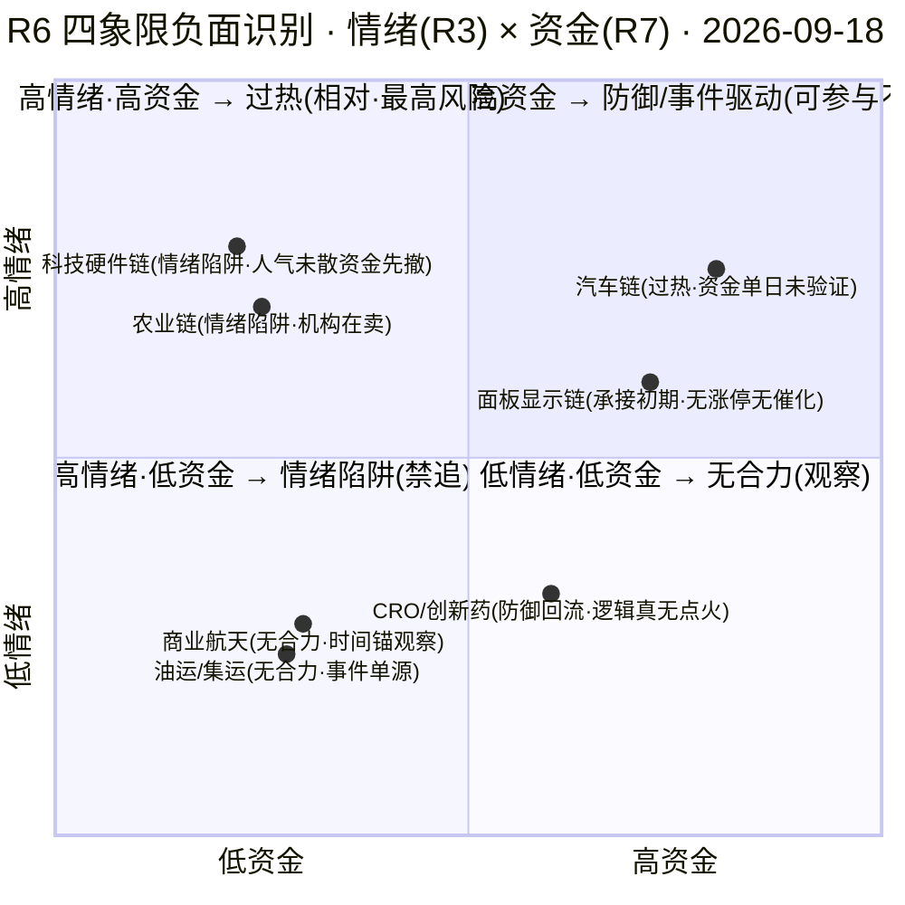

# 2026年9月18日 · **反证 / Devil's Advocate**

> **数据源新鲜度**: partial
> **降级状态**: true
> **置信度**: 0.50

## 一句话结论

高位震荡回吐日别上头：14 条反证 0 hard_reject，汽车链"共振"是纸糊的、资金是单日未验证的，山子双 P0 红旗+高位宽幅震荡，科技硬件高开是陷阱，D1 只做龙一龙二竞价低吸、总仓 ≤50%。

## 详细分析

**"三源硬共振"今天又虚高了一回。** R2 把汽车链判成唯一主线 75 分，扛鼎证据是 cross_validation_score=1.0——但 R3 的 resonance_top_themes 是空数组。KOL 5/5 群全灭、WeFlow 永久下线，红线 4 明文禁止 L1-only 进共振主题，R3 自己说"仅供参考，不得视为舆论共振"。R2 用 l1_only_top_observations 替代后打了满分，却也在 notes 里承认"严格按空数组算只有 0.67"。这和 0917 的"纸糊共振"是同一个病根：所谓三源硬共振，实际是"热榜+资金+消息"三个量化源同向，缺了市场参与者最真实的文本层。主线可以做，信心档必须打折。

**汽车链的资金分是"单日确认"冒充"持续性"。** R2 给汽车链资金 19/20、压过一切，理由是 R7 汽车行业 +37.08 亿 #1、零部件 +30.4 亿 #2、底盘 +18.1 亿 #5。但翻开 R7 的 sector_5d_tracking：它只追踪概念板块 top10（智谱AI/面板/OLED 那一排），**汽车、汽车零部件、底盘三个行业 5 日序列根本没被追踪**。资金持续性=完全未验证，R2 自己在 lifecycle_evidence 里也写"persist=1 未验证多日持续"。昨天光通信 +223 亿单日被 R6 判成"单日爆发待验证"，今天汽车 +37 亿单日却拿了资金满分——同一个口径，两套标准。D1 要清楚：这是"昨天刚进来一天的钱"，不是"持续流入的线"。

**两只执行票，一脏一净，都别追高。** 山子高科（龙一）是今天最危险的对象：R5 估值安全分 25 全池最低，F2 扣非 ROE -12.13% 深度亏损 + 经营现金流为负 + V2 pb 10.42 高估，两条 P0 级 strong 红旗叠在龙一身上；筹码端 5 日 +14.32% 高位宽幅震荡，0916 一根 -9.27% 大阴后 0917 反包，两融 4.18 亿买进又 2.58 亿还出——杠杆盘剧烈分歧。均胜电子（龙二）相对干净，只有 Q2 单季净利 -19.9% 一条 medium 旗，277 亿容量中军尾盘封板，低吸不追高开大阳即可。候补里的众泰是雷：扣非 ROE -98.2%、pb 61.26、司法冻结+破产重整背景三 strong 红旗，R2 已把它过滤出局，R6 追加"禁启用"，D1 任何时候都别碰它。

**昨天的兑现率教会我们两件事。** 0917 R6 兑现率 71.4%（10 fulfilled / 0 unfulfilled），显著优于前日 35.7%：PCB 禁入兑现成华正新材 -9.45% 大面，黄金不参与兑现成湖南黄金 -6.15% 大跌，通鼎弱转强不接兑现成 -3.19% 破位——"限仓、不追高、竞价确认"这套谨慎型反证是有效的，今天继续沿用。但另一条教训同样锋利：资金维排除光通信被证伪（光迅 +3.25/亨通 +4.72，若排除则错过主线内最强光纤分支）。今天科技硬件链就是这个结构的镜像：R7 资金全口径净出（通信 -134.6/存储 -103.7/PCB -96.3 亿）被 R2 用作排除依据，可隔夜美股半导体暴涨（AMD +6.36%/美光 +5.50%）给了它高开起点。**所以今天的正确姿势不是"排除科技硬件"，也不是"追隔夜映射高开"，而是"高开只观察、不追高"**——回吐日高开是最危险形态（R1 同判），竞价溢价转负立即放弃。这个判断在 R6 里是观察级，绝不升级成排除级。

**模式六扫完，hard_reject=0，但背景很脏。** R3 distribution_alert=PCB 连续两日 #1（high 出货警报），可 R2 的两只执行票山子/均胜都在汽车链，不属 PCB（条件①不成立），而且近 5 日主力都为正（山子龙虎榜净买 3.94 亿全市场第 1、均胜 +1.05 亿，条件②也不成立）——程序正义上双条件没同满足。但全市场机构龙虎榜净卖 -22.3 亿、26/53 触发诱多兑现模式，高位板在集体派发；PCB 类票禁入延续昨日，谁盘中想升池科技硬件链的票，硬否决瞬间就能成立。山子虽然 5 日资金为正，却是高位人气票，隔日缩量承接不足照样易炸。

## 重点对象三问 + 思维链

### 山子高科（龙一 · execution_eligible · 最高风险对象）

- **大资金意图**: 游资三席位合力（紫阳东路 +1.78 亿/量化打板/T王）抢的是人气卡位——09:48 早封 + 龙虎榜净买 3.94 亿全市场第 1，做的是"人气票 T+1 接力"的生意，不是基本面下注。对手盘是 0916 追高被套的杠杆盘（两融 4.18 亿买入次日还 2.58 亿）。
- **为什么走强**: 位置=高位宽幅震荡（5 日 +14.32%，0916 -9.27% 大阴后 0917 反包，非趋势加速）；催化=汽车链板块资金 + Robotaxi medium 情绪；筹码=两融剧烈分歧 + 股东户数缺失无法确认集中度——短线靠情绪和封板承接，不靠逻辑。
- **逻辑够不够硬**: 不够硬。R5 估值安全分 25 全池最低，F2 深度亏损 + V2 pb 10.42 双 P0 红旗，机构覆盖 0 篇。证伪路径极短：低开破 3.01（昨收）= 分歧转退潮，反包失败即双头。

**买入理由**：①汽车链唯一人气+资金双核（龙虎榜净买 3.94 亿全市场第 1 + 人气 surge 25→2 双平台）；②09:48 早封=资金抢筹态度明确，弱转强结构有 T+1 溢价空间。
**风险点**：①高位宽幅震荡（0916 -9.27% 大阴）随时二次反杀，5 日 +14.32% 后回吐空间大；②F2+V2 双 P0 红旗+两融剧烈（买 4.18 亿还 2.58 亿再买 1.9 亿）杠杆盘踩踏风险。
**止损条件**：破 3.01（昨收）= 分歧转退潮硬止损；回踩 2.74（0916 低）不收回同样出局，止损距约 -5~-9%。
**可验证假设**：0918 竞价溢价 ≥3% 且 10:00 前不炸板 → 弱转强延续假设成立；若竞价平开低走破 3.01 或炸板率盘中破 35%，假设证伪，全天不接。

### 均胜电子（龙二 · execution_eligible · 相对干净）

- **大资金意图**: 板块容量中军定位——277 亿流通承接大资金，13:17 尾盘封板=收盘前资金确认态度，做的是"板块 beta 跟随"而非个股 alpha；机构端 5 家券商 8 月底密集覆盖（华泰目标 32.67/+64%）托底。
- **为什么走强**: 位置=底部首板突破（30 日阴跌通道 17.8→0917 放量涨停，量比 2.86/换手 3.93% 温和）；催化=Robotaxi 商业化预期（智驾域控直接受益）+ 汽车零部件行业资金 +30.4 亿 #2；筹码=两融 14.8→14.0 亿缓慢去杠杆，无龙虎榜=容量票正常。
- **逻辑够不够硬**: 相对最硬。PE 22.5/pb 1.86 估值合理 + 5 家券商覆盖 + 16-19 倍 2026E PE，唯一瑕疵 Q2 单季净利 -19.9%（F6 medium）。但容量票弹性温和，赚的是"不亏钱的钱"。

**买入理由**：①汽车链容量中军+智驾域控双属性，板块续强则确定性承接；②底部首板温和换手+机构覆盖 5 家，中军抗跌属性适合高位震荡期。
**风险点**：①Q2 单季净利 -19.9% 增速转弱，业绩弹性不足；②无独立催化，纯板块 beta——若汽车链资金 0918 未续（M1_02），低吸逻辑失效。
**止损条件**：破 18.06（昨收）或回补 17.8（0916 低点）即出，止损距约 -5~-9%；板块资金转出当日同步离场。
**可验证假设**：0918 汽车行业主力资金再净流入（R7 午盘增量验证）且均胜不破 18.06 → 中军承接假设成立；若板块资金转出或竞价溢价转负，假设证伪，转 watch。

### 科技硬件链高开陷阱（模式五 · 今日最可能亏损源）

- **大资金意图**: 内资主力在 0917 全口径撤退（通信 -134.6/存储 -103.7/PCB -96.3 亿 + 机构龙虎榜净卖 -22.3 亿），隔夜美股半导体暴涨（AMD +6.36%/美光 +5.50%）是外盘情绪，不是内资态度——高开是给 0917 没跑完的人出货的窗口。
- **为什么走强**: 位置=高位回吐（PCB 连续两日热榜 #1 出货警报 + 晋级率 1进2 仅 6.33%）；催化=隔夜映射（昇腾 960 提前 + 存储景气），但 0917 当日板块资金全出；筹码=人气底座未散（persistent top10 全科技硬件）——"人气未散资金先撤"= 退潮前兆（昨日华正 -9.45% 已兑现同类结构）。
- **逻辑够不够硬**: 消息面硬（E001 昇腾/E002 存储 high），资金面反向——逻辑与资金背离时按资金执行，只观察不追；若竞价溢价转负则高开低走剧本成立，全天回避。

## 四象限负面识别

## 关键证据

- 证据 1: R3 resonance_top_themes 空数组 vs R2 汽车链 cross_validation_score=1.0（R2 自认严格口径仅 0.67）· 来源 R3_sentiment + R2_main_sectors.notes
- 证据 2: R7 sector_5d_tracking 仅覆盖概念 top10，汽车/汽车零部件/底盘 5 日序列未追踪；汽车行业 +37.08 亿 persist=1 单日确认 · 来源 R7 sector_5d_tracking + industry_top_inflow
- 证据 3: 山子 F2 深度亏损(扣非ROE -12.13%)+V2(pb 10.42)双 strong + 5日+14.32% 高位宽幅震荡 + 两融剧烈(4.18→还2.58→再买1.9亿) · 来源 R5 valuation_safety + chip_structure
- 证据 4: 众泰 F2+V2+F11 三 strong（扣非ROE -98.2%/pb 61.26/司法冻结破产重整·负债率94%）· 来源 R5 fundamental_flags
- 证据 5: 昨日 R6 兑现率 71.4%（10/14·0 unfulfilled）：PCB 禁入→华正 -9.45% 大面；黄金不参与→湖南黄金 -6.15%；资金维排除光通信被证伪→光迅 +3.25/亨通 +4.72 · 来源 E1 r6_fulfillment
- 证据 6: 科技硬件隔夜映射 vs 资金背离：美股半导体组平均 +3.7%（AMD+6.36/MU+5.5）vs R7 通信-134.6/存储-103.7/PCB-96.3 亿净出 + 机构净卖-22.3亿(26/53 诱多) · 来源 R7 overseas_core_stocks + main_force
- 证据 7: PCB distribution_alert high 连续两日#1 + 晋级率 1进2 仅 6.33%（0916 为 36%）· 来源 R3 hotlist_signals
- 证据 8: R4 价格锚仍估算：德赛西威参考价 95 vs R5 实际收盘 84.43（差 +12.5%）· 来源 R4 + R5

## 数据源审计

| 源 | 状态 | 抓取时间 | 记录数 | 备注 |
|---|---|---|---|---|
| R1_style | 🟡 | 08:25 | - | 高位震荡回吐日 · conf 0.63 · 仓位上限 50% |
| R2_main_sectors | 🟡 | 09:50 | 1 主线 | 汽车链 75 分 · conf 0.48 · 共振虚高 |
| R3_sentiment | 🟡 | 09:33 | - | 场景E L1-only · 共振空 · PCB alert high |
| R4_news | 🟡 | 08:38 | 8 events | hithink/chart down · 价格锚估算 |
| R5_stock_profiles | 🟡 | 10:12 | 5 profiles | chart 降级 · 红旗已透传 |
| R7_capital_flow | 🟡 | 08:25 | - | vibe down · 5日追踪未覆盖汽车 |
| PREV_R6_20260917 | 🟢 | - | 14 | 兑现率 71.4% 可对照 |
| E1_r6_fulfillment | 🟢 | - | 14 | 0 unfulfilled · 教训传导 |

## 不确定性 / 反证

本反证自身的盲区：①R3 场景E L1-only 意味着"汽车链资金单日未验证"的质疑可能被高估——若 0918 早盘出现未被捕获的强资金确认（汽车链二次放量），M1_02 的担忧会减弱，而 R6 不应因"单日"就死守降仓；②山子 F2+V2 按"P0 类单条"处理为 strong_suggest 而非 hard_reject（模式七需要 ≥4 条红旗或 ST 双轴 imminent），若后续三表复核（vibe-trading down 未跑）检出新红旗可升级——但硬否决的门槛不该为情绪票轻易打开；③科技硬件"高开陷阱"是双向剧本：不追高是对的，但若 0918 竞价溢价转正+炸板率守住 <25% 且科技硬件高开秒板承接强（外盘映射极强时），完全回避会踏空——建议 D1 以"竞价确认"做闸门而非一刀切；④金价新高但 A股有色资金流出，黄金反证昨天已兑现大跌，若今天金价继续新高而黄金股企稳，背离可能在修复——本日仍按不追处理，但 E1 需观察背离是否收敛。

## 与其他 R/D/E 的关系

- 依赖: R1_style / R2_main_sectors / R3_sentiment / R4_news / R5_stock_profiles / R7_capital_flow / PREV_R6(20260917) / E1_r6_fulfillment(20260917)
- 被消费: D1(canghai-plan) —— hard_rejects 强制剔除（今日 0）/ strong_suggest 10 条须显式处理或记 d1_override / soft_suggest 4 条记 r6_soft_notes；E1(canghai-review) —— 盘后核对兑现率，重点跟踪山子高位票承接、科技硬件高开陷阱、汽车链资金持续性三个观测点

## Sub-Agent 元数据

- skill: analyze_devil_advocate_v1
- artifact: data/research/20260918/R6_devil_advocate.json
- 生成耗时: 约 4 分钟
- model: deepseek-v4-flash-ga-260731
