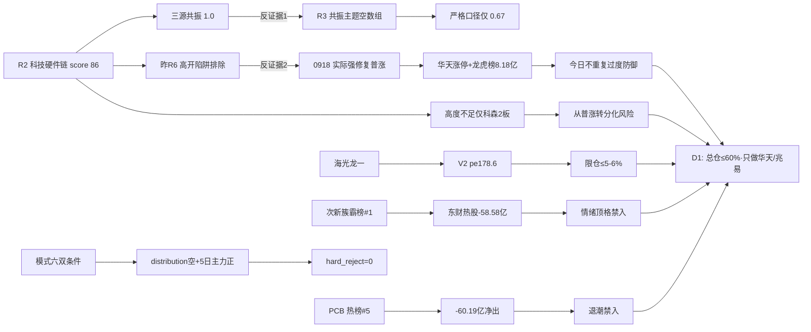

# 2026-09-21 · **反证 / Devil's Advocate**

> **数据源新鲜度**: partial
> **降级状态**: true
> **置信度**: 0.5

## 一句话结论

hard_reject 0 条：科技硬件链共振口径虚高但**不得重复昨日过度防御**，海光 V2 高估限仓，次新簇霸榜情绪顶格禁入，总仓≤60%。

## 详细分析

**反证主战场 = 科技硬件链的'共振口径'而非'方向'。** R2 给科技硬件链 86 分全池最高，cross_validation_score=1.0 是 R3 场景E L1-only 代偿口径（`resonance_top_themes` 空数组、KOL 5/5 群全灭、WeFlow 永久下线），R2 自己都注明严格口径只有 0.67。但这里有一个比口径虚高更重要的教训：**昨日 R6(0918) 判'回吐日高开陷阱·科技硬件只观察不追'，0918 实际走出强修复普涨**——涨停 78 家、半导体 ETF +4.00% 领涨、华天科技涨停封单 7.17 亿、国产芯片概念 +229.91 亿净入。若 D1 严格执行昨日 R6，等于踏空主线启动日。所以今日对科技硬件链的正确反证姿势是：承认方向（量化五源同向是事实），只降'共振虚高'为信心打折，**绝不以口径瑕疵当排除理由**。

**霸榜出货程序正义：hard_reject=0。** 硬否决双条件逐一核验：条件①`distribution_alert=[]` 空数组（注册制次新#1 是'新进第一'非连续霸榜二日，按 hotlist_rank_signal_v1 规则不触发 L4）→ 不成立；条件②4 只 eligible 龙一/龙二近 5 日主力全为正（华天 +4.9 / 兆易 +2.25 / 海光 +0.77 / 浪潮 +0.12 亿）→ 不成立。但次新簇三线新进 top20 且霸榜第一 + 东方财富热股 -58.58 亿净出 = **情绪顶格≠安全**，与 PCB（热榜#5 在榜 vs -60.19 亿净出）同属四象限'高情绪×低资金'陷阱区，全部禁入 execution_pool。

**估值×主线的火力集中在海光。** 海光（国产算力龙一·eligible）命中 V2 strong 红旗：pe_ttm 178.6、PEG≈3.6，且 R4 E001 宏观负面（美联储 10 月加息概率 56.5% + 美债破 5% + 日央行 1.25%）的 bearish_scope 明确含 AI 算力/半导体。9/22 发布会是双向兑现窗口：0921 事件前低吸可但限仓 ≤5-6%、0922 高开不追。华天/兆易/浪潮无红旗，是干净票。

**四象限负面分布**：高情绪×高资金 = 科技硬件链过热（相对·高位反复非加速）；高情绪×低资金 = PCB / 次新簇 / 粮食（情绪陷阱·禁入）；低情绪×高资金 = 北向宽基承接（背景指标·转向即普涨转分化）；低情绪×低资金 = 商业航天 / 机器人 / 光伏（事件单源·观察不抢先手）。

## 关键证据

- 证据 1: R3 `resonance_top_themes=[]`（场景E·红线4 禁止 L1_only 进共振主题），R2 科技硬件 cross_validation 1.0 为代偿口径、严格 0.67 · 来源 R3_sentiment / R2_main_sectors
- 证据 2: 0918 实际走势证伪昨日'高开陷阱'：涨停 78 家/半导体 ETF +4.00%/华天涨停封单 7.17 亿/国产芯片 +229.91 亿 · 来源 R1_style / R7_capital_flow
- 证据 3: `distribution_alert=[]` 空 + 4 只 eligible 5 日主力全正 → 模式六双条件均不成立 · 来源 hotlist_signals / R5_stock_profiles
- 证据 4: 海光 fundamental_flags[V2 strong] pe 178.6/PEG 3.6 + E001 bearish_scope 含半导体 · 来源 R5_stock_profiles / R4_news
- 证据 5: 次新簇三线新进 top20 霸榜第一 + 东方财富热股 -58.58 亿净出（情绪顶格）· 来源 R3_sentiment / R7_capital_flow
- 证据 6: E1(0918) T3 skeleton（r6_fulfillment total=0）→ 模式五无法量化兑现率，仅定性推断 · 来源 E1_data

## 反证传导图（假设 → 反证据 → 结论）

## 推理深度三问（top 反证对象）

- **大资金意图**: 0918 机构席位净买 +13.19 亿（较 0917 的 -22.3 亿大反转），方向明确指向半导体/先进封装/存储——华天龙虎榜净买 8.18 亿全市场第 1、机构专用席位净买 10.04 亿，这是配置资金在 PCB 退潮后的主动承接，不是短线脉冲。对手盘是 0918 之前 5 日资金反复（0917 单日净出 -81.91 亿）的恐慌盘。
- **为什么走强**: 位置——华天 30 日横盘箱体蓄势后 0918 首板突破（位置低、启动日）；催化——长鑫第五代量产 + 存储涨价周期（硬时间锚 + 硬业绩：佰维/普冉中报暴增）；筹码——龙虎榜多席合力（紫阳东路 +2.81 亿/湛江万豪世家 +1.79 亿/深股通/机构）。三维交叉全部正向，是少数'干净'的强逻辑。
- **逻辑够不够硬**: 华天逻辑够硬（R5 六维 alpha A·资金维度 90 分·无红旗）；科技硬件链方向够硬（五源量化同向）但**确认口径打折**（缺 KOL 文本层）；海光逻辑是事件驱动（9/22 发布会）而非资金驱动（r7_capital_match=false），证伪路径明确——发布不及预期即当日兑现。真正的软肋是高度：板块最高连板仅 2 板（科森），普涨无高标，次日承接是最大不确定性。

## 每票思维链

### 002185 华天科技（科技硬件龙一 · 唯一全维度干净票）

- **买入理由**: ①产业逻辑——长鑫第五代工艺量产 + 存储涨价周期 + PCB 退潮资金切先进封装，封测龙头是直接承接者（R4 E002 high + R7 先进封装 4/5 正加速）；②数据锚——0918 首板涨停 10:02 早封、封单 7.17 亿、龙虎榜净买 8.18 亿全市场第 1、机构席位净买 10.04 亿、主力 5 日 +4.9 亿。
- **风险点**: ①板块高度不足（最高连板 2 板），首板启动日次日接力存在'高开缩量承接'要求，若 0921 高开>3% 缩量可半路/打板、高开低走兑现不追；②E001 宏观负面（美债破 5% + 加息概率 56.5%）压制高估值成长/半导体，波动加大；③次新簇退潮若带动情绪回落，高度票承压。
- **止损条件**: 破 15.6（30 日箱体底）离场；对应 R5 支撑 15.6/16.61，止损距约 -13%（首板 18.03 → 15.6），属硬区间内。
- **可验证假设**: 0921 收盘若华天封 2 板或收涨 >5% 且板块 3 家以上涨停 → 主升中继确认；若冲高回落收 <+2% 或炸板 → 首板启动失败，转观察。

### 688041 海光信息（国产算力龙一 · V2 高估+事件驱动双刃）

- **买入理由**: ①9/22 发布会为明确时间锚（1000 系列 CPU + 机器人芯片新品类），0921 为事件前最后交易日，事件驱动型发酵；②中报预增 41.5~52.32% + 数字芯片设计行业 +75.35 亿净入。
- **风险点**: ①V2 strong 红旗（pe 178.6 / PEG 3.6）+ E001 bearish_scope 明确含 AI 算力/半导体——宏观压制高估值成长；②'买预期卖兑现'惯性：0922 高开大概率是先手兑现窗口，发布不及预期当日跌。
- **止损条件**: 破 220.77（0914 低）离场；对应 R5 支撑 220.77，止损距约 -8.5%。
- **可验证假设**: 0922 发布会后若放量收涨 → 事件超预期；若高开低走或收 <+2% → 兑现日，当日离场；0921 竞价溢价 >+3% 且海光缩量承接 → 事件前抢筹可低吸。

## 数据源审计

| 源 | 日期 | 状态 | 备注 |
|---|---|:--:|---|
| R1_style | 2026-09-21 | 🟡 | 情绪 70 · 主线扩散型 · KOL 5/5 群全灭 degraded |
| R2_main_sectors | 2026-09-21 | 🟡 | 双主线 86/77 · 共振口径 L1-only 代偿 · conf 0.48 |
| R3_sentiment | 2026-09-21 | 🟡 | 场景E · resonance_top_themes 空 · conf 0.45 |
| R4_news | 2026-09-21 | 🟡 | 8 事件 · hithink/iwencai/vibe down · llm_pure_no_verification |
| R5_stock_profiles | 2026-09-21 | 🟡 | 9 票 · fundamental_flags 透传 · chart_vision 降级 K 线替代 |
| R7_capital_flow | 2026-09-21 | 🟡 | tushare 直连 · vibe down · cap 0.5 |
| hotlist_signals | 2026-09-21 | 🟡 | 场景C T-1 基线 · distribution_alert 空 |
| E1_data(0918) | 2026-09-18 | 🔴 | T3 skeleton · 昨日兑现率不可量化 |
| 群聊(KOL) | 2026-09-21 | 🔴 | 5/5 群全灭 · 0 条 · timeout>45s |

## 不确定性 / 反证

- 模式五昨日兑现率无法量化（E1 skeleton），'昨日过度防御被证伪'的结论基于 0918 收盘数据的定性推断，存在幸存者偏差——不能证明'若严格执行 R6 一定踏空'，只能证明'方向判断错误'。
- 今日反证的自信度有限：上游六源全 degraded/partial（R2 conf 0.48 / R3 conf 0.45 / R5 conf 0.53 / R7 cap 0.5），'科技硬件方向正确'的判断本身建立在降级数据上。
- 最大的自我批判：R6 自身的历史模式是'防御偏多'（昨日高开陷阱误判、前日黄金排除正确但错过光通信），今日对科技硬件链'不重复过度防御'的立场可能矫枉过正——若 0921 实际走出高开低走，本次不排除的姿态就是错的。D1 需以早盘竞价溢价 + 炸板率为闸门自行裁决。
- 模式四（历史类比）无库降级、模式九（高位触板）4 板<8 板不触发、模式八（解套盘）涨停 78<100 不触发主规则——三个模式未覆盖今日情绪结构，次新簇假繁荣以 M8_01 soft 记录兜底。

## 与其他 R/D/E 的关系

- 依赖: R1_style · R2_main_sectors · R3_sentiment · R4_news · R5_stock_profiles · R7_capital_flow · hotlist_signals · R6(0918) · E1_data(0918)
- 被消费: D1(canghai-plan) —— hard_reject 强制剔除 / strong_suggest 须显式处理或 override / soft_suggest 记入 r6_soft_notes；E1(canghai-review) —— r6_fulfillment 追踪

## Sub-Agent 元数据

- skill: analyze_devil_advocate_v1
- artifact: data/research/20260921/R6_devil_advocate.json
- 生成耗时: ~20 秒
- model: deepseek-v4-flash-ga-260731
