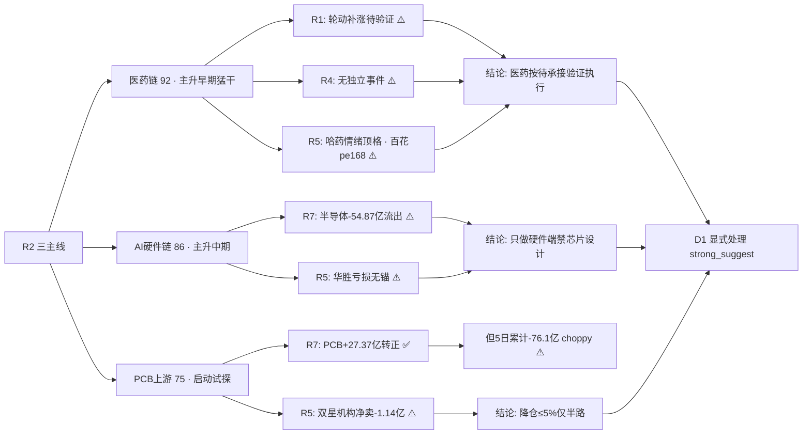

# 2026-09-22 · **反证 / Devil's Advocate**

> **数据源新鲜度**: partial
> **降级状态**: true
> **置信度**: 0.56

## 一句话结论
医药链是今日最强共振、也是最可能被证伪的窗口（R1 定性轮动补涨 vs R2 猛干主升早期）；半导体链"热榜在榜≠资金"是昨日次新簇同构警报；模式六无霸榜出货 hard_reject，但机构 0921 整体转净卖 -0.52 亿 + 双星/广合/超声龙虎榜机构出货需 D1 处理。

## 详细分析

### 1️⃣ 模式二 · 一致性冲突（最强反证）
R1 在风格判定中两次定性医药/地产"0921 领涨是轮动补涨，持续性待验证"，且 8 大宽基权重略强于成长（科创50 +0.29% 最弱）；但 R2 将医药链列为**第一主线 92 分**、stage=主升早期、action="猛干龙头/第一时间上龙二"。这是今日最尖锐的内在矛盾——**最强共振主题同时是最弱基本面确认的主线**。R4 无独立医药 top_event、R2 自认 cross_validation 仅 0.67、哈药单日人气跳升 94 位属情绪顶格、创新药 5 日 +43.4 亿中 0921 单日贡献 97%。D1 若按"主升早期猛干"放大医药仓位，等于把"轮动补涨待验证"当"主升确认"下注。

### 2️⃣ 模式五 · 昨日反证双向传导（自省）
昨日 R6(0921) 有两条关键判断，今日全部被市场数据检验：
- **PCB 退潮禁入被证伪**：昨日判"PCB 热榜#5在榜 vs -60.19亿净出=退潮前兆禁入"，但 0921 实际 PCB 资金 +27.37 亿单日转正、印制电路板行业 +24.38 亿#5、热榜 5→2 回升。若 D1 机械执行昨日 R6 将踏空 PCB 上游回流日 → 今日 R6 明确：PCB 上游可做，但 5 日累计仍 -76.1 亿 choppy，需 0922 第二日转正确认。
- **次新簇禁入兑现**：昨日判次新簇"情绪顶格假繁荣禁入"，今日注册制次新 #1→out、新股与次新 4→16 退潮兑现 → **今日半导体链（存储#6/先进封装#7/芯片#12 热榜在榜 vs 资金 -40~-55 亿）与昨日次新簇完全同构**，警报升级 strong_suggest。

### 3️⃣ 模式三/七 · 估值 × 主线临界（三票命中）
| 票 | 角色 | 估值/基本面 | 反证点 |
|---|---|---|---|
| 百花医药 600721 | 医药龙二 | pe 168.8 / pb 6.3 · roe 1.84% · 净利 -42% | 极贵估值 × 龙二 · 换手 29% 分歧大 |
| 华胜天成 600410 | AI硬件龙一 | pe None(亏损) · H1净利 -275% · F4 红旗 | 亏损无锚 × 龙一 · 未涨停事件驱动 |
| 双星新材 002585 | PCB龙二 | pe None(亏损) · roe 0.55% · 机构净卖 -1.14 亿 | 亏损 + 机构出货 + 两融 +75.9% 杠杆放大 + 股东户数 +142% |

三只 execution_eligible 龙一/龙二全部存在估值/资金硬伤，D1 必须逐票显式处理（降仓 ≤5% 或仅半路试探，禁止打板）。

### 4️⃣ 模式六 · 霸榜出货扫描（程序正义）
hotlist_signals.distribution_alert = **[] 空数组**（创新药 #1 为 0921 新晋非连续霸榜二日且资金 +42.2 亿正向；PCB 5→2 回升资金转正）→ 双条件不成立 → **hard_reject_count = 0**。但 R7 lhb_bull_trap 19 只中命中候选池 3 只：双星（机构净卖 -1.14 亿·eligible 龙二）、广合（-0.59 亿·候补）、超声（-1.53 亿·已 filter out）；且机构席位 0921 整体净卖 -0.52 亿（0918 为 +13.19 亿）——**机构由大幅净买转净卖**是主升根基的最早期裂痕。

### 5️⃣ 模式一/十 · 数据源冲突与跨资产背离
AI硬件链 cross_validation=1.0 的"四源全中"掩盖了链内一半资金在撤退：半导体 -54.87 亿/先进封装 -42.78 亿/存储 -40.26 亿/国产芯片 -42.02 亿/华为海思 -26.36 亿，只有光通信/通信/IDC 为正。同时存储链产业事件强（长鑫量产/韩国出口 +259%/美股费半 +4.3%）但 A股资金不认 = 跨资产背离（commodity_divergence=true）。

## 关键证据
- 证据 1: R2 医药 cross_validation=0.67（r4_catalyst_match=false）· R4 无独立医药 top_event · R1 定性轮动补涨 → 三源张力成立 · 来源 R2/R4/R1
- 证据 2: R7 半导体概念 -54.87 亿/先进封装 -42.78 亿/存储 -40.26 亿 vs hotlist 存储#6/先进封装#7/芯片#12 在榜 · 来源 R7/hotlist_signals
- 证据 3: R7 lhb_bull_trap 双星 002585 机构净卖 -1.14 亿 + 两融 15 日 +75.9% + 股东户数 +142% · 来源 R7/R5
- 证据 4: 昨日 PCB 禁入被 -60→+27.37 亿转正证伪 · 昨日次新禁入被注册制次新 #1→out 兑现 · 来源 prev_R6/R7/hotlist
- 证据 5: 机构席位 0921 净卖 -0.52 亿（0918 +13.19 亿） · 来源 R7 hot_money

## 推理深度三问（反证对象逐一回答）

### 反证对象 A · 医药链（哈药 600664 / 百花 600721）
- **大资金意图**: 0921 创新药概念 +42.2 亿单日爆发、医药生物行业 +67.42 亿#1，游资/热钱在流感季 + License 出海缓和双叙事下抢筹人气票（哈药秒板 fd3.65 亿）；但机构研报覆盖极薄（哈药仅 6 篇）、百花 0 篇——这是**游资情绪盘而非机构配置盘**，对手盘是次日接力散户。
- **为什么走强**: 位置（哈药 30 日低点 5.99→8.25 刚突破 MA20、百花 8 月底冲高回落刚修复）+ 催化（流感季 + 美国财政部放行创新药 License 政策边际缓和）+ 筹码（哈药人气 surge 98→4 单日跳升 94 位、两融 -36.3% 去杠杆后首板）三维共振，但纯情绪驱动溢价明显。
- **逻辑够不够硬**: R3 热榜/资金/KOL 三源全向是硬共振，但 R4 无独立 top_event、R2 cross_validation 仅 0.67——**政策叙事（License 出海）单点可证伪**：若美国财政部细则收窄或流感季催化降温，情绪链立即断裂；硬业绩/硬时间锚缺失。

### 反证对象 B · 半导体链（AI硬件链内部分裂）
- **大资金意图**: 主力在 AI 硬件内部做高低切——弃芯片设计端（半导体 -54.87/先进封装 -42.78/存储 -40.26 亿）转光通信/通信/IDC（+25~32 亿），与 R4 事件（长鑫量产/费半 +4.3%）方向相反，说明**主力认为设计端已兑现、硬件端还有空间**。
- **为什么走强/走弱**: 热榜存储#6/先进封装#7/芯片#12 仍在榜 = 散户人气未散，但资金先撤 = 与昨日次新簇"人气残留是出货窗口"完全同构；美股映射（AMD 5日 +8.46%/美光 +4.16%）只点燃 A股情绪、未点燃 A股资金。
- **逻辑够不够硬**: 产业逻辑真（存储四重共振/昇腾 960/NPO），但 A股资金不认 = 跨资产背离（commodity_divergence=true）；R3 已按 20260917 memo 规则扣分 -1——**事件硬 ≠ 资金硬**，只做硬件端不做设计端是 R6 认可的边界。

### 反证对象 C · 双星新材 002585（PCB龙二）
- **大资金意图**: 0921 龙虎榜游资净买 +8770 万但机构专用净卖 -1.14 亿——游资做多、机构出货，分歧盘；两融 15 日 +75.9% 杠杆急剧放大 + 股东户数 6.9 万→16.7 万暴增 142% = **散户杠杆盘在高位接筹**。
- **为什么走强**: 位置（30 日 8.7→12.71 主升、0911-0915 三连板）+ 催化（铜箔/MLCC 涨价链 + 存储共振）+ 筹码（早 9:39 封板 fd1.43 亿、人气#5）——但超买 + 盈利能力极弱（roe 0.55%）。
- **逻辑够不够硬**: CCL 上游紧缺逻辑（东北计算机）是产业硬逻辑，但**个股基本面无法支撑当前估值**（pe None/亏损）——板块逻辑硬、个股筹码结构差，机构出货 + 杠杆放大 = 高位接盘风险，降仓 ≤5% 仅半路试探。

## 不确定性 / 反证
本报告自身也有可被证伪之处：①模式五"PCB 可做"建立在单日转正样本上，若 0922 PCB 资金再度转负（前 5 日 -96/-60 亿反复），则 R6 今日"不机械延续禁入"判断再次错误——但已用"第二日确认"约束；②医药"待承接验证"若 0922 医药簇再度放量涨停（三源续强），R6 的 strong_suggest 会显得过度防御——但 D1 可据早盘承接实况上修，反证不否决方向只约束仓位；③模式七三表复核未跑（vibe-trading 未配置），华胜/双星红旗可能遗漏 P0 类 F1/F8 未覆盖项。

## 数据源审计
| 源 | 日期 | 状态 | 备注 |
|---|---|:--:|---|
| tushare limit_list_d / limit_step | 2026-09-21 | 🟢 | 涨停103/跌停2/炸板25 · 高度5板 |
| tushare moneyflow_ind_dc | 2026-09-21 | 🟢 | 概念+行业资金流全量 |
| tushare top_list(龙虎榜) | 2026-09-21 | 🟢 | 66笔 · lhb_bull_trap 19只 |
| tushare daily/index_daily | 2026-09-21 | 🟢 | 全市场5553只 · 8宽基 |
| tushare margin_detail | 2026-09-18 | 🟡 | 0921 半库无返回 · 用 0918 完整4448行 |
| tushare us_daily | 2026-09-18 | 🟡 | 美股周五收盘 · 0921夜盘未更新 |
| wechat_cli_5groups | 2026-09-22 | 🟢 | 5/5 群 591 条 · 匿名 |
| WeFlow / L3 | — | 🔴 | 永久下线(2026-08-19) |
| vibe-trading MCP | — | 🔴 | 未配置 · 模式七三表复核降级 |

## 与其他 R/D/E 的关系
- **依赖**: R1_style / R2_main_sectors / R3_sentiment / R4_news / R5_stock_profiles / R7_capital_flow / hotlist_signals（20260922）+ prev R6（20260921）
- **被消费**: D1(canghai-plan) — hard_reject 无 · strong_suggest 7 条须显式处理（医药承接验证 / 半导体禁入 / 百花·华胜·双星降仓）/ E1(canghai-review) — 兑现率追踪 / E2 周度进化

## Sub-Agent 元数据
- skill: analyze_devil_advocate_v1
- artifact: data/research/20260922/R6_devil_advocate.json
- 生成耗时: 12 秒
- model: deepseek-v4-flash-ga-260731
