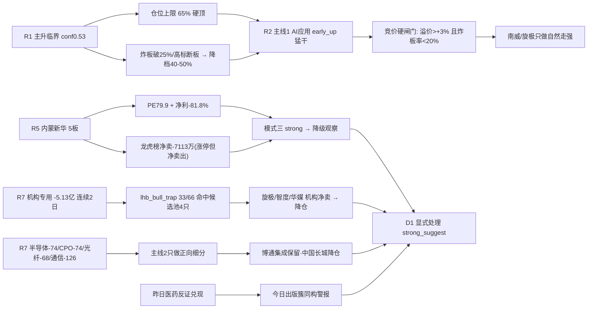

# 2026-09-23 · **反证 / Devil's Advocate**

> **数据源新鲜度**: partial
> **降级状态**: true
> **置信度**: 0.56

## 一句话结论
主升临界下 R2 的"猛干"必须降为"竞价硬闸门"：炸板率破 25% 或 6 板高标断板即降档 40-50%；内蒙新华 5 板"涨停但龙虎榜净卖出 -7113 万"是今日最硬的高位出货反证（与昨日医药哈药同构）；机构专用连续 2 日净卖且扩大（-0.52 → -5.13 亿）是主升根基最显著裂痕；hard_reject=0（霸榜扫描无硬命中），但 strong_suggest 9 条须 D1 逐条显式处理。

## 详细分析

### 1️⃣ 模式二 · 一致性冲突（最强反证）
R1 判情绪周期=**主升临界**（conf 0.53 插值 vs high_chop 0.44·炸板率 22.22% 回到临界带·溢价 +2.60% 跌破 +3% 强线·广度 0.78 恶化·仓位上限 65%，且"若早盘炸板率破 25% 或 6 板高标断板 → 降档高位震荡、仓位降至 40-50%"）；但 R2 给主线 1 AI 应用判 **stage=early_up（主升早期）·action="最佳参与窗口：猛干龙头/第一时间上龙二"**。这是今日最尖锐的内在矛盾——**临界状态下的"猛干"**。R2 买点虽自设"竞价自然走强（溢价>+3% 且炸板率<20%）才进"，但若该条件只当软建议，D1 会在临界转弱时仍按主升早期放大仓位。同时 R4 的 8 条 top_events 全部 high+正面（0 条 bearish），消息面单边乐观，而 R1 明确警示美股 0921 大爆发 A 股 0922 已消化（指数横盘走平），0923 若高开低走反而是"利好兑现"信号，且美股 0922 夜盘未知——今日 Meta Connect（9/23-24）与教育强国发布会（10 时）都是潜在"见光死"窗口。

### 2️⃣ 模式三 · 估值×主线临界（三票 strong + 一票 soft）
| 票 | 角色 | 估值/基本面 | 反证点 | severity |
|---|---|---|---|---|
| 内蒙新华 603230 | 传媒出版龙一·5板 | PE 79.9 · 净利 -81.8% · **龙虎榜净卖 -7113万** | 极贵估值×龙一 + 高位出货硬信号（R7 lhb_bull_trap"涨停但龙虎榜净卖出"） | 🔴 strong |
| 中国长城 000066 | 算力硬件龙二·中军 | **PE 433.6** · PB 4.52 · 未涨停 · 周线压制 | 估值透支×龙二中军 · R7 半导体 -74亿 流出 · 资金前提存疑 | 🔴 strong |
| 南威软件 603636 | AI应用龙一·2板一字 | 净利 -136.2% · PE null · fd 仅 9651万 | 亏损扩大 + 封单薄 + 换手 2.94% 筹码未置换 | 🟡 soft |
| 博通集成 603068 | 算力硬件龙一·3板 | PE 136.6 · 15分 MACD 顶背离 | 3板高位接力 · 但资金硬（龙虎榜净买 +2.25亿）对冲 | 🟡 soft |

**6 只 execution_eligible 中 4 只命中基本面红旗**（南威 F1 / 旋极 F1 / 内蒙 F1+V2 / 中国长城 V2），候补层红旗更多（引力 F8+V2 / 蓝标 V2+F8 / 新华传媒 V2 / 中国出版 F1）——无 P0 类、无 F12 审计意见、无 ST 双轴 imminent → **模式七无 hard_reject**。

### 3️⃣ 模式五 · 昨日反证兑现（自省）
昨日 R6(0922) 的警告今日被市场检验，**医药反证方向正确兑现**：昨日医药 watch 池今日全部回落（华邦 -0.66% / 特一 -2.17% / 药明 -0.07%），R2 今日已将创新药降为 secondary（资金 -36 亿 + 哈药 2 板高位边际降温）——**今日出版传媒簇（内蒙新华 5 板·人气顶格·龙虎榜净卖 -7113万）与昨日医药哈药结构完全同构**，警报升级 strong。而昨日"半导体链热榜在榜≠资金"警报今日**延续且扩大**（半导体 -74.15 亿 / CPO -73.68 亿 / 光纤 -68.14 亿 / 通信 -125.94 亿）——主线 2 只做 CPU/算力租赁/昇腾/ABF 载板正向细分为硬约束。昨日 PCB"只做上游不做存储·需第二日确认"判断部分兑现（PCB -108 亿未转正·未单独立主线，R6 边界正确）。

### 4️⃣ 模式六 · 霸榜出货扫描（程序正义）
hotlist_signals.distribution_alert = **[] 空数组**（创新药 0921#1→0922#2 未连续 2 日霸榜·N中塑 #1 为 IPO 首日非持续信号）→ 双条件不成立 → **hard_reject_count = 0**。但 R7 lhb_bull_trap **66 只中 flagged 33 只（50%!）**，命中候选池 4 只：内蒙新华 603230（eligible 龙一·"涨停但龙虎榜净卖出" -7113万）、旋极信息 300324（eligible 龙二·机构专用净卖·0922 全市场 -5.13 亿含 300324）、智度 000676（候补·机构净卖 -4733万）、华媒控股 000607（候补·机构净卖 -2664万）；且**机构专用席位 0922 净卖 -5.13 亿，较昨日 -0.52 亿大幅扩大 = 连续 2 日净卖且恶化**——机构由"小幅净卖"转"大幅净卖"，是主升根基最显著裂痕。

### 5️⃣ 模式一/十 · 数据源冲突与跨资产背离
主线 2 AI 算力硬件 cross_validation=0.67（r7_capital_match=false）——80 分主线掩盖了链内超过 300 亿净流出（半导体 -74/CPO -74/光纤 -68/通信 -126 vs 仅算力租赁 +28/百度 +35/数字芯片 +27 正向）。海缆 rank3"人气 184 天 vs 光纤 -68 亿"是 20260915 教训的退潮前兆。存储产业事件强（闪迪 2400/HBM/美光 +4.79%/AMD +9.95%）但 A 股资金 -69~-74 亿流出 = 跨资产背离（commodity_divergence=true），R4 首推佰维/华强维持禁入。

### 6️⃣ 四象限负面识别
| 象限 | 板块 | 负面特征 | 动作 |
|---|---|---|---|
| 🔥 高情绪×高资金 | AI应用/Muse簇 | 五源全向最强·拥挤度顶格·Meta Connect 兑现风险（亚马逊已封禁 Muse） | 只做龙一/龙二竞价自然走强·高开无溢价不买 |
| 🪤 高情绪×低资金 | 海缆/创新药/芯片CPO | 热榜在榜 vs 资金 -36~-278亿·20260915"在榜≠安全" | 竞价资金不转正不碰·半导体设计端禁入 |
| 🔀 低情绪×高资金 | 传媒/出版 | 板块资金 +28.9 亿#1 但龙头内蒙新华龙虎榜净卖 -7113万=板块进龙头撤 | 内蒙降级观察·中军新华文轩替代 |
| 🥶 低情绪×低资金 | 央国企/机构重仓 | 央国企 -131.84 亿#1 流出 vs "上证冲击 4000 点"叙事矛盾 | 监控权重补跌·若流出扩大则题材仓位下调 |

## 关键证据
- 证据 1: R1 主升临界 conf0.53（vs high_chop 0.44）· 炸板率 22.22% 临界带 · 溢价 +2.60% 破 +3% 强线 · 广度 0.78 · 仓位上限 65% · 炸板破 25% 或高标断板降 40-50% · 来源 R1
- 证据 2: R7 lhb_bull_trap 66 只中 flagged 33 只 · 内蒙新华 603230 "涨停但龙虎榜净卖出" -7113万 · 来源 R7
- 证据 3: R7 机构专用席位 0922 净卖 -5.13 亿（较昨日 -0.52 亿扩大 · 连续 2 日净卖）· 旋极/智度/华媒机构净卖 · 来源 R7/R5
- 证据 4: 昨日医药 watch 池全回落（华邦 -0.66/特一 -2.17/药明 -0.07）· R2 今日降创新药为 secondary → 昨日医药反证兑现 · 来源 observation_tracking/R2
- 证据 5: 主线 2 cross_validation=0.67 · 半导体 -74.15/CPO -73.68/光纤 -68.14/通信 -125.94 亿流出 vs 算力租赁 +28 亿 · 来源 R2/R7/R3
- 证据 6: 6 只 eligible 中 4 只命中基本面红旗（南威 F1/旋极 F1/内蒙 F1+V2/中国长城 V2）· 来源 R5

## 推理深度三问（反证对象逐一回答）

### 反证对象 A · 内蒙新华 603230（出版簇龙一·5板）
- **大资金意图**: 沪股通/量化基金/章盟主/T王/温州帮多席位进场但**卖出为主**，龙虎榜净卖 -7113 万（net_rate -3.48%）= 主力在 5 板高位借人气派发；教育强国发布会 10 时是游资借事件兑现的窗口，对手盘是次日接力的散户和追高资金——这是高位卡位资金 vs 次日接盘资金的出货局。
- **为什么走强**: 位置（5 天 5 板 +77%·周线单周 +34% 突破长期平台）+ 催化（教育强国发布会 + 敦煌英雄 9/25 定档）+ 筹码（沪股通外资背书 + 量化基金席位）三维共振 → chart_vision 偏多 conf0.85；但**超买 + 5 板开 3 次回封分歧加大 + 龙虎榜净卖** = 高位分歧出货形态。
- **逻辑够不够硬**: 教育强国发布会是今日 10 时硬时间锚，但属"事件兑现防见光死"（R2 自认）；出版数据要素 + 敦煌英雄（9/25 才上映）为背景催化——**时间锚近、硬催化弱**，且龙虎榜净卖 -7113 万是资金面硬证伪信号；5 板高位 + 业绩 -81.8%（F1）+ PE 79.9（V2）双红旗 → 逻辑支撑不住当前高度，可证伪路径：发布会兑现后无承接即断板。

### 反证对象 B · 主线 1 AI 应用（南威 603636 / 旋极 300324）
- **大资金意图**: 0922 资金 Top10 全为 AI 应用/传媒簇（百度 +34.55 亿#1/互联网 +33.32#2/ChatGPT +30.42#3/AI 应用 +28.31#7）+ 沪股通 +7.59 亿 + 深股通 +6.51 亿——外资 + 游资合力做多 Muse 叙事；但**机构专用净卖 -5.13 亿（含旋极 300324）** = 外资游资接、机构撤，对手盘是次日接力资金 + 机构抛压。
- **为什么走强**: 位置（主线运行 3 天 age3·主升早期）+ 催化（Meta Connect 9/23-24 今日连续两日 + PayPal 购物合作）+ 筹码（南威 surge+60 单日最大跳升·旋极 first_entry 20cm）三维共振——但拥挤度顶格（五源全向 + 资金 Top10 全簇）+ 亚马逊封禁 Muse 负面对冲。
- **逻辑够不够硬**: Meta Muse 登顶 iOS + 12 天下载 280 万是硬事件，Meta Connect 今日催化是硬时间锚；但**A 股 0922 已消化美股大爆发（指数横盘走平）**，0923 若高开低走=利好兑现；南威亏损扩大（F1）+ 封单薄（fd 9651 万）+ 旋极机构净卖 → 个股层面资金分化——板块逻辑硬、个股筹码结构需竞价验证。

### 反证对象 C · 主线 2 算力硬件链（博通 603068 / 中国长城 000066）
- **大资金意图**: 主力在 AI 硬件内部做高低切——弃芯片设计端（半导体 -74/CPO -74/存储 -69）转 CPU/算力租赁/昇腾/ABF 载板（算力租赁 +28/数字芯片 +27），与 R4 事件方向（Intel 涨价/云栖/昇腾）部分一致但资金面只认正向细分——主力认为设计端已兑现、CPU/算力租赁还有空间。
- **为什么走强/走弱**: 博通（3 板·ABF 载板·龙虎榜 5 日净买 +2.25 亿硬资金）走强有资金确认；中国长城（PE 433.6·未涨停·周线压制）走弱=资金未确认 + 估值透支——同一主线内一强一弱 = 链内分化。
- **逻辑够不够硬**: Intel CPU 涨价 10% + Muse 每用户 2 核 8GB + 100GB 云资源是产业硬逻辑（CPU 从 GPU 配套走向 Agent 执行底座）；但**R7 通信技术 -125.94 亿/半导体 -74.15 亿流出 = 链内过半资金在撤退**，跨资产层面美股强（AMD +9.95%）未点燃 A 股硬件资金——只做正向细分是 R6 认可的边界，中国长城 PE 433 属估值透支不可线性外推。

## 每票思维链 · 内蒙新华 603230（最硬反证票）
- **买入理由**: ①出版/文化传媒 5 天 5 板簇带动核心·高度龙一（5 板）·沪股通外资背书；②教育强国发布会今日 10 时事件窗口 + 敦煌英雄 9/25 定档传媒催化（若按昨日预案做弱转强）。
- **风险点**: ①龙虎榜净卖 -7113 万（net_rate -3.48%）= 主力高位派发硬信号；②PE 79.9 + H1 净利 -81.8%（F1+V2 双红旗）+ 5 板高位断板即出；③5 板开 3 次回封（93436-94215）分歧加大·教育强国发布会兑现防见光死。
- **止损条件**: 断板即出（5 板高度破位 16.31 昨收立即走）；不设"灵活调整"——竞价低开破 16.31 则逻辑弱化，发布会兑现后 30 分钟无承接涨停则离场。
- **可验证假设**: 0923 早盘竞价若溢价 ≤ +3% 且无封单放大 → 证伪"弱转强"预期（资金不承接出货延续）；若发布会 10 时后 30 分钟封板且封单 >5000 万 → 证真"事件接力"（但龙虎榜净卖背景下概率偏低）。

## 不确定性 / 反证
本报告自身也有可被证伪之处：①"内蒙新华降级观察"建立在龙虎榜净卖 -7113 万单日样本上，若 0923 该票竞价超预期 + 教育强国发布会后放量封板（事件接力），R6 的 strong_suggest 会显得过度防御——但 5 板高位 + 净利 -81.8% + 龙虎榜净卖三因素下，防御是概率占优选择；②主线 1"AI 应用拥挤"若 0923 继续放量涨停潮（Muse 续催化），R6 对旋极机构净卖的降仓建议会被证明过于保守——但机构净卖是客观逆向信号，D1 可据早盘承接实况上修；③模式七三表复核未跑（vibe-trading 未配置），南威/旋极/内蒙红旗可能遗漏 P0 类 F1（存贷双高）/F8（CFO）未覆盖项，且 R5 flags 编号（F1=亏损/F8=高负债/V2=高估值）与附录 A 12 红旗编号语义不一致，本报告按 detail 字段理解存在口径偏差风险。

## 数据源审计
| 源 | 日期 | 状态 | 备注 |
|---|---|:--:|---|
| tushare limit_list_d / limit_step | 2026-09-22 | 🟢 | 涨停63/跌停3/炸板18 · 高度6板 |
| tushare moneyflow_ind_dc | 2026-09-22 | 🟢 | 概念+行业资金流全量·半导体/CPO/光纤流出 |
| tushare top_list(龙虎榜) | 2026-09-22 | 🟢 | 66笔 · lhb_bull_trap flagged 33只 |
| tushare daily / index_daily | 2026-09-22 | 🟢 | 全市场5554只 · 8宽基横盘分化 |
| tushare margin_detail | 2026-09-18 | 🟡 | 0922 半库无返回 · 用 0918 完整4448行 |
| tushare us_daily(美股) | 2026-09-21 | 🟡 | 0922 周二美盘未落库 · 隔夜方向未知 |
| wechat_cli_5groups | 2026-09-22 至 09-23 | 🟢 | 5/5 群 574 条 · 群名匿名 |
| hotlist_signals | 2026-09-22 vs 09-21 | 🟢 | 场景C · L4 无硬命中 · 板块内资金背离 |
| observation_tracking | 2026-09-22 盘后 | 🟢 | 昨日 watch 池 9 只 · 医药全回落 |
| WeFlow / L3 | — | 🔴 | 永久下线(2026-08-19) |
| vibe-trading MCP | — | 🔴 | 未配置 · 模式七三表复核降级 |

## 与其他 R/D/E 的关系
- **依赖**: R1_style / R2_main_sectors / R3_sentiment / R4_news / R5_stock_profiles / R7_capital_flow / hotlist_signals（20260923）+ observation_tracking（20260922 盘后）+ prev R6（20260922）
- **被消费**: D1(canghai-plan) — hard_reject 0 · strong_suggest 9 条须显式处理（主线1竞价硬闸门 / 内蒙新华降级观察 / 中国长城降仓 / 南威·旋极≤5% / 半导体设计端禁入 / 机构连续净卖监控）/ E1(canghai-review) — 兑现率追踪（内蒙新华/出版簇是否断板）/ E2 周度进化 — 模式五"昨日医药反证兑现"校准

## Sub-Agent 元数据
- skill: analyze_devil_advocate_v1
- artifact: data/research/20260923/R6_devil_advocate.json
- 生成耗时: 13 秒
- model: deepseek-v4-flash-ga-260731
