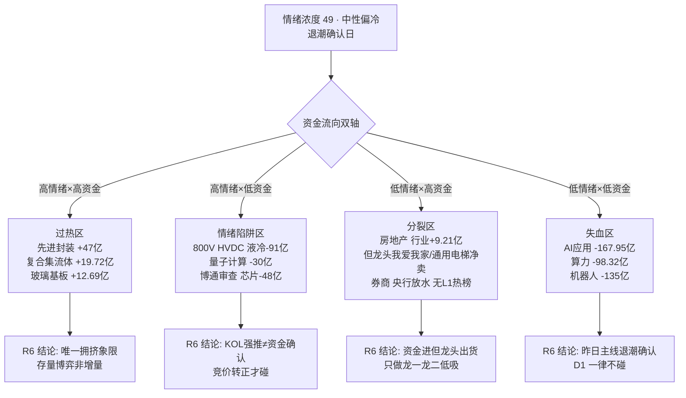

# 2026-09-24 · **反证 / Devil's Advocate**

> **数据源新鲜度**: partial
> **降级状态**: false
> **置信度**: 0.65

## 一句话结论
退潮确认日只有一条 90 分主线(材料链)≠ 可以放开做后排补涨；沃格光电是 eligible 里唯一基本面全弱票，超声电子是材料链里唯一的出货陷阱——D1 的刀要砍在这两处。

## 详细分析

**第一刀 · 段位矛盾：退潮确认日的"90 分主线"只配低吸龙一龙二。** R1 用 9 月首次"溢价转负 + 炸板率破线"双确认把情绪周期钉在高位震荡(conf0.75)：炸板率 33.77% 破 25% 线、昨日涨停溢价 -0.37% 转负、广度 0.53、跌停 13 家暴增 333%、仓位上限 0.45——这是退潮确认日，不是主升中途。R2 却在给材料链 score90 的同时标注 stage=mid_up、stage_action="可做龙头分歧低吸或后排补涨"。反证的角度：90 分只能证明资金相对最聚焦，不能证明后排有跟风赚钱效应——昨日涨停池平均 -0.37% 已经证明跟风盘不接力(纪律七)。所以"后排补涨"四个字就是 D1 最大的口子：澳弘(尾盘封板+乖离62%)、依顿(贴前高)、中一(20cm 孤军)一个都不能进执行池。

**第二刀 · 沃格光电：eligible 名单里唯一的"伪龙二"。** R5 六维画像全池最弱(C 级·69 分)：26H1 亏损扩大(np_yoy -128%)、pb 21.96 纯叙事定价(2027E PE~144)、控股股东相关方 8 月 8 日收到行政处罚告知书、股东户数 3 月→6 月 +312% 巨幅分散(全链散户化最重)、周线压力 103.7 贴身(现价 102.5)。它的唯一亮点是玻璃基板 5 日资金 cum51 亿——但"资金持续性最强"和"基本面/合规/筹码全维度最弱"并存，本身就是最强的反向信号：资金越集中、接盘越拥挤，退潮日回撤越狠。R5 明示"与 R2 execution_eligible 存在显著分歧，建议 R6 重点反证"，R6 接住：降级 watch/≤5% 试仓，除非 D1 在 override 里写清理由。

**第三刀 · 昨日警示兑现：热榜在榜≠安全，第二次被验证。** 昨日 R6 对 AI应用/算力/机器人发"热榜在榜≠资金"的 strong_suggest(AI应用#1 但资金背离)——今日 hotlist 完全兑现：AI应用 1→12、概念资金 -153 亿，算力租赁 5→15(-71 亿)，机器人新进热榜但 -135 亿。昨日主线全部退潮，R2 今天连 secondary 都没给它们留位置。这说明"热榜登顶但资金背离"在退潮环境是可靠的降档信号，今日材料链(PCB 登顶首日)必须执行同一套监控：盘中若先进封装/玻璃基板概念资金转出，立即降档。

**第四刀 · 出货陷阱藏在人气票里：超声电子。** R7 lhb_bull_trap 23/69(33%)，最扎眼的是 R3 首推的超声电子 000823：拉高净卖出 -1.31 亿、机构专用净卖 -1.42 亿、换手 37.6%——人气 surge+52 最猛、却是机构拉高派发。R2 已标"严禁纳入龙头候选"，R6 把它升级为硬约束：D1 即便竞价强也绝不纳入。另地产链我爱我家(-2643 万)、通用电梯(-1564 万)、出版替代票新华文轩(-916 万+对倒)全部涨停但龙虎榜净卖——昨日"高位+净卖=出货"模式第二次验证。

**第五刀 · 硬否决不触发，但全部 strong_suggest 都要落地。** 模式六 distribution_alert=[]（程序正义 hard_reject=0）、模式七无 P0/F12/ST imminent、模式九最高 4 板<8 板 not_applicable——今日无 hard_reject。但 5 条 strong_suggest(段位矛盾×2、沃格、超声电子、昨日兑现)全部要求 D1 显式处理：退潮日只做康强/沃格低吸、竞价承接确认优先、沃格降级、超声禁入、材料链资金背离即降档。红线 3 保护不触发(候选 5 只充足)。

## 关键证据

- 证据 1: 昨日涨停溢价 -0.37%(9月首次转负)+炸板率 33.77% 破 25% 线 = R1 退潮确认双信号 · 来源 R1_style(0923 收盘)
- 证据 2: 沃格光电 26H1 np_yoy -128%·pb 21.96·控股股东相关方行政处罚告知书(0808)·户数 +312%·R5 评分 C/69 全池最低 · 来源 R5_stock_profiles
- 证据 3: AI应用 1→12·-153 亿 / 算力租赁 5→15·-71 亿 / 机器人 -135 亿 = 昨日 R6 警示完全兑现 · 来源 R3_sentiment + R7_capital_flow
- 证据 4: 超声电子 lhb_bull_trap: 拉高净卖出 -1.31 亿·机构净卖 -1.42 亿·换手 37.6% · 来源 R7_capital_flow
- 证据 5: 机构专用席位 0923 净买 +10.28 亿(昨日警示方向证伪·结构为换仓至材料链) · 来源 R7_capital_flow
- 证据 6: E008 美股隔夜大跌(纳指 -1.14%/费半 -2.02%)与 E003 涨价利多对冲 → 高开分歧概率大 · 来源 R4_news

## 数据源审计

| 源 | 状态 | 抓取时间 | 记录数 | 备注 |
|---|---|---|---|---|
| R1_style | ✅ ok | 07:13 | - | degraded=true(美股0923夜盘缺失·新闻侧示弱) |
| R2_main_sectors | ✅ ok | 07:49 | - | 主线 1 条·score90·5 候选 |
| R3_sentiment | ✅ ok | 07:33 | - | degraded=true(场景C·T-1 baseline)·distribution_alert=[] |
| R4_news | ✅ ok | 07:18 | 8 事件 | 7 正 1 负(E008) |
| R5_stock_profiles | ✅ ok | 08:03 | 5 票 | 全维度画像·fundamental_flags 透传 |
| R7_capital_flow | ✅ ok | 07:16 | 69 龙虎榜 | lhb_bull_trap 23/69·机构净买+10.28亿 |
| prev_R6(0923) | ✅ ok | 08:33 | 17 条 | 模式五对照源 |
| vibe-trading | ⚠️ 未配置 | - | - | 模式七三表复核降级·以 R5 tushare 透传为准 |

## 四象限负面识别

## 反证清单(17 条)

| ID | 模式 | 对象 | 严重度 | 一句话结论 |
|---|---|---|---|---|
| M2_01 | 一致性 | R1 退潮确认 vs R2 90分主线"可做后排补涨" | 🔴 strong | 只做康强/沃格低吸·后排禁入 |
| M2_02 | 一致性 | E003 涨价利多 vs E008 美股大跌 | 🔴 strong | 竞价承接确认优先·高开无溢价不追 |
| M3_01 | 估值临界 | 沃格光电(eligible龙二) C/69 全池最弱 | 🔴 strong | 降级 watch/≤5%·D1 须 override |
| M5_01 | 昨日连锁 | AI应用/算力/机器人警示今日兑现 | 🔴 strong | 材料链若资金背离立即降档 |
| M6_01 | 霸榜出货 | 超声电子 拉高净卖-1.31亿 | 🔴 strong | 严禁纳入·hard_reject=0(程序正义) |
| M7_01 | 基本面红旗 | 康强V2/沃格S2+V2/中一F6 | 🔴 strong | 无P0/F12→无硬否·沃格并入M3_01 |
| M1_01 | 数据源冲突 | 材料链链内资金梯度(存储仅+14亿) | 🟡 soft | 只取资金Top3细分 |
| M1_02 | 数据源冲突 | 博通审查 L1+L2+R4 vs 芯片-48亿 | 🟡 soft | 维持 secondary·竞价转正才碰 |
| M1_03 | 数据源冲突 | 量子计算 新进热榜 vs -30亿 | 🟡 soft | 无资金无R4=情绪博弈·不参与 |
| M3_02 | 估值临界 | 康强电子 PE72.8 增收不增利 | 🟡 soft | 资金即一切·转弱即降档 |
| M3_03 | 估值临界 | 中一科技 F6一次性+20cm孤军 | 🟡 soft | 确认 filtered_out 正确 |
| M5_02 | 昨日连锁 | 出版簇消失·新华文轩 bull_trap | 🟡 soft | 涨停但净卖=出货信号·链内同等对待 |
| M5_03 | 昨日连锁 | 机构净卖警示今日证伪 | 🟡 soft | 结构为换仓至材料链·非风险解除 |
| M8_01 | 假繁荣 | 涨停51家<100·压力位密集 | 🟡 soft | 高开贴压力位无量=解套盘兑现 |
| M9_01 | 高位赌博 | 最高4板<8板 not_applicable | 🟡 soft | 无高度锚·首板只低吸不追高 |
| M10_01 | 跨资产背离 | 涨价利多 vs 美股费半-2% | 🟡 soft | 竞价确认是硬门槛 |
| M10_02 | 跨资产背离 | 存储景气 vs 资金弱+伯里空头 | 🟡 soft | 存储/硅片资金转正前不纳入 |

## 不确定性 / 反证

- **诚实标注**: 昨日 R6"机构连续 2 日净卖扩大(-0.52→-5.13 亿)"警示今日被证伪——机构专用席位 0923 净买 +10.28 亿。反证角度重新解读为"换仓"而非"回补"(机构从应用/出版切向材料链)，但方向证伪就是证伪，不能嘴硬。
- **模式七降级**: vibe-trading 未配置，附录 A 三表复核(F1/F2/F8/F11/F12)未跑，P0 类红旗可能存在遗漏——材料链高 PE 票(康强 72.8/沃格 pb21.96)的风险敞口如实标注。
- **模式四降级**: 无历史事件库，不编造历史类比。
- **存储/硅片背离**: 产业叙事(花旗美光 1300)与 A 股资金(+14 亿链内最弱)背离可能被"硅片涨价 50%"新催化证伪，D1 若竞价看到沪硅/佰维资金转正，可重估但需 override 记录。

## 与其他 R/D/E 的关系

- 依赖: R1_style / R2_main_sectors / R3_sentiment / R4_news / R5_stock_profiles / R7_capital_flow / prev_R6(0923)
- 被消费: D1(canghai-plan·hard_reject 强制·strong_suggest 须显式处理)·E1(canghai-review·次日兑现校验)·E2(周度进化·模式五命中率)

## Sub-Agent 元数据

- skill: analyze_devil_advocate_v1
- artifact: data/research/20260924/R6_devil_advocate.json
- 生成耗时: 约 12 分钟
- model: deepseek-v4-flash-ga-260731
