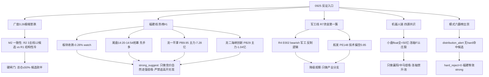

# 2026年9月25日 · **反证 / Devil's Advocate**

> **数据源新鲜度**: ok
> **降级状态**: false
> **置信度**: 0.68

## 一句话结论
广度0.26极端普跌下，R2 最强主线「福建/两岸统一」热榜#1 但板块收跌+尾盘抢筹+主力净流出，是今日最大的证伪面——hard_reject 无，但福建线/军工线必须按 strong_suggest 显式降档执行。

## 详细分析

**🧊 大盘定调：结构性热 + 全局性冷，反证必须从严。** R1 给出的画面是撕裂的：涨停52家/炸板率16.13%健康/溢价+0.55%回正/高度回升至5板——接力端在修复；但广度0.26是9月最差、4306只下跌、1030只跌超3%、8大宽基全线大跌、中位-1.3%。这意味着「涨停52家」的全部繁荣集中在极少数高标孤岛，一旦高标断板就是普跌+补跌共振。R2 却在此环境下推3条主线12只候选，还给了事件驱动day1福建线「首板试探」的窗口——这与纪律「段位决定能做什么」有强张力（M2_01）。反证的第一个任务就是把 R2 的扩张打回 R1 的克制：总仓≤50%硬上限、候选砍半、福建线只留龙一/龙二低吸。

**🇨🇳 福建线：最强人气 + 最强风险，教科书级的高开兑现剧本。** 这是今日最需要警惕的矛盾体：海峡两岸概念热榜0924新晋#1、平潭发展龙虎榜净买4.75亿全市场居首、开源西安西大街+10.27亿集中买福建——资金端无可挑剔。但反面证据同样扎眼：板块指数0924收跌-0.28%（热度>价格，R3 watch）、板块10+涨停中大部分（平潭14:23/海峡创新14:24/福建水泥14:24/厦门港务14:39/新华都14:50）是尾盘14:20-14:54集体抢筹封板=先手资金多、R4 连直接板块条目都没有（r4_catalyst_match=false）。更致命的是：龙一平潭（PB9.95/亏损-560%）和龙二海峡创新（PB29全池最高/巨亏-684%）主力5日双双净流出，估值是全池最弱一档。热榜第一 + 尾盘抢筹 + 主力净流出 = 0925 高开兑现潮的标准配方（M1_01+M3_01/02+M6_01）。

**🛰️ 军工线：资金第一簇 vs R4 bearish 的直接冲突。** R7 资金全榜第一簇（大飞机+10.47亿#1/空间站+8.14亿#3/国防军工行业+8.84亿#2）把军工抬进主线3，但 R4 E002 的 bearish_impact_sectors 白纸黑字列了「军工」（中美缓和利空反制·错题本004），R2 自己都标了「R6 需重点反证」。个股层面更难看：昆船智能（中报亏损-125%、2日+30%超买、尾盘14:02封）、航发动力（PE148、chart_vision偏空0.85全池最空、主力5日-2.04亿、0924还-3.21%破位）。资金逆势流入 + 技术破位 = 权重搭台的资金行情，不是打板主线——只做产业分支（大飞机/商业航天/中船系）低吸，军民融合/稀土反制分支严禁（M1_02）。

**🤖 机器人链：唯一真金白银，但小盘拥挤。** 这是四源共识（R2/R3/R4/R7）唯一全通过的成长主线，执行器+10.41亿#2/减速器+6.38亿#4/汽零+9.9亿#1，资金持续2天净入，无重大反证点。但反证必须指出：板块涨停票 float 全部<50亿（洛轴24.9/大业33.5/襄阳44.5/中马45.5亿）=小盘属性，高位震荡+广度0.26下波动剧烈；洛轴股份换手36.9%+温州帮/T王=庄股风险区（F11红旗）严禁升池；R3 early_or_late=middle（审厂逻辑已发酵数日非启动初期），0925板块若不扩散（涨停<4）则证伪——只做襄阳/中马低吸，严禁追洛轴20cm（M7_01）。

**⏮️ 昨日警示兑现：热榜在榜 ≠ 安全，今日福建线同形态。** 昨日 R6 对材料链「热榜在榜但资金背离」的 strong_suggest 今日完全兑现：电子-228.76亿/PCB-74.13亿/半导体-93.21亿/CPO-296亿，先进封装掉出top20、玻璃基板3→12、超声电子跌停、沃格光电掉榜。这条规则必须原样套到今天热榜新晋#1的福建线上：热榜第一 ≠ 价格确认，必须「热榜+资金+价格」三确认（板块扩散涨停≥5家+板块指数收红）才可执行（M5_01）。

**🚫 霸榜出货 hard_reject：程序正义 = 0，但等效 strong 已在场。** 模式六双条件扫描结果：distribution_alert 里哈药股份（ths#1+dc#7+跌停-9.96%）是 hard=true 但属医药链非候选主线；海峡两岸是 hard=false（watch）。execution_eligible 6只候选无一命中「hard 霸榜 alert + 近5日主力净流出」双条件 → hard_reject_count=0（红线3不适用）。但福建线平潭/海峡创新双双命中条件2（主力5日净流出），只是条件1未到 hard——这已经是等效 strong_suggest，D1 必须显式处理（M6_01）。

## 关键证据
- 证据 1: 福建板块指数0924收跌-0.28% 且热榜新晋#1 = 热度>价格 · 来源 R3 distribution_alert(watch)
- 证据 2: 福建线10+涨停大部分14:20-14:54尾盘集体抢筹封板（先手多） · 来源 R2 main_lines[0].logic
- 证据 3: 平潭发展 valuation_safety 35分 PB9.95 亏损-560% 主力5日-7.28亿 · 来源 R5 profiles
- 证据 4: 海峡创新 valuation_safety 28分全池最低 PB29 巨亏-684% 主力5日-1.04亿 · 来源 R5 profiles
- 证据 5: R4 E002 bearish_impact_sectors 明确列「军工」· 来源 R4 top_events
- 证据 6: 航发动力 chart_vision 偏空0.85全池最空 PE148 0924 -3.21%破位 · 来源 R5 profiles
- 证据 7: 电子行业-228.76亿/CPO-296亿/PCB-74.13亿 材料链退潮确认 · 来源 R7 top_outflow_sectors
- 证据 8: 哈药股份 ths热股#1+dc#7 但跌停-9.96% = hard L4 出货 · 来源 R3 distribution_alert

## 数据源审计
| 源 | 状态 | 抓取时间 | 记录数 | 备注 |
|---|---|---|---|---|
| R1_style | ✅ ok | 07:08 | - | 广度0.26·高位震荡conf0.41·仓位0.50 |
| R2_main_sectors | ✅ ok | 07:42 | - | 3主线12候选·福建88/机器人84/军工71 |
| R3_sentiment | ✅ ok | 07:31 | 253 | degraded(weflow down)·distribution_alert透传 |
| R4_news | ✅ ok | 07:17 | 8 | degraded(公众号disabled)·E002军工bearish |
| R5_stock_profiles | ✅ ok | 08:14 | 12 | chart_vision 12/12全成功·估值/筹码完整 |
| R7_capital_flow | ✅ ok | 07:11 | - | 北向+23.25亿·资金Top5·龙虎榜4.75亿 |
| hotlist_signals | ✅ ok | 07:27 | - | 场景C(T-1 baseline)·L4哈药hard |
| prev_R6 | ✅ ok | 昨日 | 17 | 模式五对照·退潮警示兑现 |

## 不确定性 / 反证
1. R3 是场景C（T-1 baseline 0924vs0923），热榜新晋「海峡两岸#1」的排序可能受 baseline 口径影响——福建线的「霸榜」成色存疑，可能被高估。
2. 平潭/海峡创新的主力5日净流出是「洗盘日大幅流出+0924游资接力」的组合，净流出口径掩盖了0924当日的游资进场（大单+9.56亿/特大单+4.88亿）——R6 建议的低吸不是全盘否定，而是只做竞价自然走强的确认买点。
3. 军工 R7 资金第一簇 vs R4 bearish 的冲突，R6 偏向 R4 的反制逻辑压制——但若 0925 中美缓和预期落地转「利好出口链」而非「利空军工」，军工产业分支可能被资金重新定价，届时需盘中重估。
4. 模式四（历史类比）无历史事件库、模式七附录A三表复核因 vibe-trading 未配置而降级（以 R5 tushare 透传为准）——P0 类红旗（F1/F2/F8/F12）可能存在遗漏，高PE题材票（平潭PB9.95/海峡创新PB29）风险敞口如实标注。

## 与其他 R/D/E 的关系
- 依赖: R1_style / R2_main_sectors / R3_sentiment / R4_news / R5_stock_profiles / R7_capital_flow / hotlist_signals / prev_R6(0924)
- 被消费: D1(canghai-plan·R6_devil_advocate.json)·E1(canghai-review·盘后复盘对照)·orchestrator(research_summary.json·hard_rejects[])

## Sub-Agent 元数据
- skill: analyze_devil_advocate_v1
- artifact: data/research/20260925/R6_devil_advocate.json
- 生成耗时: 约5分钟
- model: deepseek-v4-flash

## 反证矩阵（Mermaid）

