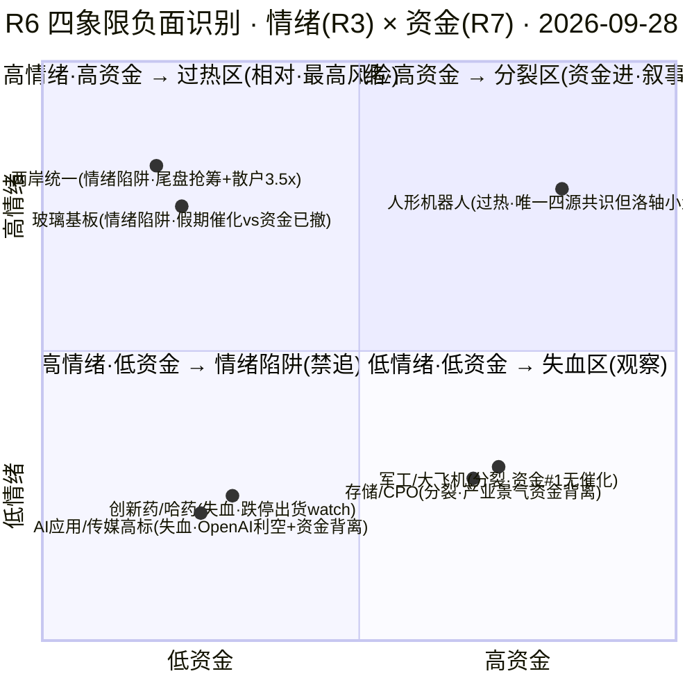

# 2026年9月28日 · **反证 / Devil's Advocate**

> **数据源新鲜度**: partial
> **降级状态**: true
> **置信度**: 0.60

## 一句话结论

18 条反证 0 hard_reject：L4 无霸榜出货，但两岸统一（score86 全市场最高）顶着"尾盘抢筹先手多 + 散户 3.5 倍涌入 + 估值全池最弱 + R4 无直接板块条目"四重雷过节后首日，平潭/海峡创新只准竞价自然走强低吸；人形机器人唯一四源共识但洛轴小盘换手极端、三花周 K 空头，全池总仓 ≤50%。

## 详细分析

**hard_reject=0 是程序正义，不是全绿。** L4_distribution_alerts 为空——0924 海峡两岸是热榜新进（非连续霸榜）、平潭发展是 rank90→1 首日暴升（非连续霸榜），模式六双条件第一条不成立，程序上没有任何 execution_eligible 票触发硬否决。但翻开 R7 的 lhb_bull_trap：全市场 72 只龙虎榜票 34 只触发诱多兑现模式（47%），福建水泥（涨停净卖出+疑似对倒·开源席位）、昆船智能（涨停净卖出+疑似对倒·中信建投）双双命中——这两只虽都被 R2 滤成候补，但"高位板在集体派发"的背景是 0928 最大的暗雷：任何盘中想升池的票，只要命中 bull_trap 就要当场否决。

**两岸统一是今天最贵的一盘棋。** R2 给它 score86 全市场最高，龙虎榜三路硬资金（平潭游资 10.27 亿+机构 6.99 亿）是真的，但四个反证点也是真的：①13 家涨停大部分 14:23-14:54 尾盘集体抢筹（平潭/海峡创新/福建水泥/厦门港务/厦工全是尾盘板）——先手资金多，节后高开就是兑现窗口；②R4 的中美八点共识是宏观事件，sectors_catalyzed 根本没有"福建/两岸"板块条目，板块催化是经 R3 间接传递的；③平潭股东户数 9.8 万→34 万，3.5 倍散户涌入，这是"解套盘+跟风盘堆积"的标准结构；④估值端平潭（PB9.95/巨亏-560%）、海峡创新（PB29.02/巨亏-684%）是全池最弱。0925 昨日 R6 已经对这个结构发过 strong_suggest（热榜#1 vs 板块收跌+主力 5 日净流出），今日 R2 原样再推——结构完全重复，且叠加了"假期利好已被 KOL 提前定价（必须涨上 4000）"和节前最后 3 个交易日。这不是否定它，是要求 D1 用竞价确认来过滤：板块扩散涨停≥5 家 + 溢价 3~5% 自然走强才碰，高开 >6% 无承接一律放弃。

**人形机器人是唯一四源共识，但个股端两条红旗。** 主线本身（R2 score83·R3 rank1 唯一 L1+L2 三源强共振·执行器 +10.41 亿#2/减速器 +6.38 亿#4/汽零 +9.9 亿#1）是 0928 最干净的方向，mainline_lifecycle 也判 mid_up（主升中期 conf0.55·一浪末/二浪初）。但龙一洛轴股份 float 只有 24.85 亿（<50 亿庄股风险区）+ 换手 36.9% 极端 + V2 次新估值透支 + F6 负债率 79.8%，昨日 R6 曾标 F11 庄股红旗维持 filtered_out，今日 R2 升为 execution_eligible——可以做，但仓位必须压到 ≤5%、只做竞价自然走强低吸、20cm 破位快切。龙二三花智控干净一些（无红旗）但周 K 空头排列、0924 只涨 0.25%、R2 记载的"H1 净利+79%"是误载（实为长电数据，R5 已修正为 -3.12%）——容量中军只能低吸，且 D1 消费时勿沿用错误表述。

**一致性张力比 0925 收敛，但没有消除。** R1 明示"高开兑现 vs 高开修复二分·高开兑现风险已被 KOL 提前定价·广度 0.26 为 9 月最差·1030 只跌超 3%"，emotion_cycle 判 high_chop（conf0.4）行动指南是"落袋为安/不搏穿越"，R2 却把 day1 新题材两岸统一列全市场最高分——R1 的防御性仓位上限 50% 与 R2 的主升进攻天然有张力。好在 R2 已经从 0925 的 3 主线 12 候选收敛到 2 主线 10 候选、只做龙一/龙二，方向是对的，剩下的是执行纪律：总仓 ≤50%、候选砍半、高标断板/天地板立即全线降档仓位至 40% 以下。

**跨资产背离三组都挂着。** 玻璃基板（R4 英伟达/台积电假期催化 vs 0924 资金 -32.39 亿+美股半导体仅温和 +0.22~0.7%）、存储/CPO（R4 格芯 SiGe 售罄/锗价新高 vs 电子 -228.76/存储 -95.43/CPO -149.92 亿流出）、油运（BDTI+100% vs A股无涨停无资金确认）——产业逻辑硬的票，A股资金都没跟上，一律"竞价资金转正才碰"，不因假期催化直接开仓。

## 重点对象思维链

### 平潭发展 000592（龙一 · execution_eligible · 最高风险对象）

- **大资金意图**: 开源西安西大街 10.27 亿 + 机构 6.99 亿 + 国新北京 5.88 亿三路硬资金买的是"两岸统一 day1 人气卡位"——14:23 尾盘封 + 封单 3.57 亿，做的是"节后首日 T+1 接力"的生意，不是基本面下注。对手盘是 9.8 万→34 万的 3.5 倍散户跟风盘。
- **为什么走强**: 位置=事件驱动 day1 首板（0923 rank90→0924 rank1·surge+89）；催化=中美八点共识（宏观事件·R4 无板块条目）+ 热榜#1#2 双新进；筹码=LHB 硬资金 + 散户拥挤——短线靠事件情绪和封单承接，不靠逻辑。
- **逻辑够不够硬**: 不够硬。估值安全分 40 全池最弱（PB9.95/巨亏-560%），F1+S3 双 strong 红旗，散户拥挤 3.5x 是临近题材兑现的标准结构。证伪路径极短：高开 >6% 无承接 = 兑现潮确认。

**买入理由**：①两岸统一唯一人气+资金双核（龙虎榜三路净买 4.75 亿居首 + 人气 surge 89 双平台）；②竞价自然走强（溢价 3~5% 且板块扩散 ≥5 家）的半路/低吸有 T+1 溢价空间。
**风险点**：①尾盘抢筹先手多，节后高开即兑现窗口；②散户 3.5 倍涌入 + 估值全池最弱，断板时无承接踩踏；③假期利好已被 KOL 提前定价（'必须涨上 4000'）。
**止损条件**：破昨收（8.78 一线）逻辑弱化即出，止损距约 -5~-7%；竞价高开 >6% 无承接不追，仓位 ≤8%。
**可验证假设**：0928 竞价溢价 ≥3% 且 10:00 前板块涨停扩散 ≥5 家 → day1 卡位延续假设成立；若高开低走破昨收或炸板率盘中破 25%，假设证伪，全天不接。

### 洛轴股份 301699（龙一 · execution_eligible · 小盘极端风险）

- **大资金意图**: 9:42 早封 + 封单 1.08 亿做的是"机器人轴承方向 20cm 弹性"——板块资金执行器 +10.41 亿#2 是真金白银，但 24.85 亿流通盘 + 36.9% 换手是游资短打结构，庄股风险区（昨日 R6 标 F11 温州帮/T王）。
- **为什么走强**: 位置=次新首板（上市 12 日）+ 20cm 弹性；催化=高盛/德银上调出货 + 特斯拉 Optimus 10 倍；筹码=换手 36.9% 极端 + 两融 +6.5%——短线资金主导，无机构托底。
- **逻辑够不够硬**: 中等。产业逻辑硬（R3 rank1 唯一三源强共振）但个股估值透支（PE48.6/PB9.4·V2+F6 红旗）+ float <50 亿，纯情绪+资金双驱动，没有基本面锚。

**买入理由**：①机器人轴承方向人气核心（dc#23·R3 首推[0]）；②9:42 早封 = 资金态度明确，板块内带动性第一。
**风险点**：①20cm 退潮环境隔日 -20% 风险；②换手 36.9% 极端 + 庄股风险区，高开兑现杀跌更快；③主线高度仅 2 板（雪龙集团），mid_up 早期若执行器资金转出立即降档。
**止损条件**：竞价高开无溢价不追；20cm 破位快切（隔日止损距 -10%~-15% 硬区间内优先竞价离场），仓位 ≤5%。
**可验证假设**：0928 执行器板块资金延续（R7 午盘增量验证）且洛轴竞价量比放大 → 20cm 卡位假设成立；若执行器资金转出或竞价低开，假设证伪，降档 watch。

### 三花智控 002050（龙二 · execution_eligible · 容量中军）

- **大资金意图**: 1331 亿流通的容量中军，做的是"执行器 Tier1 的板块 beta"而非个股 alpha——0924 只涨 0.25% 未涨停，资金在等竞价确认。
- **为什么走强**: 位置=区间震荡未突破 37.25（周K空头排列）；催化=特斯拉 Optimus 产量 10 倍（R4 E002 首推·sector_linkage 0.92）；筹码=两融 52 亿稳定，无 LHB 无大宗=容量票正常。
- **逻辑够不够硬**: 相对最硬（无红旗·PE37.4/ROE6.36 稳健），但成长性弱（净利 -3.12%，R2 误载 +79% 已修正）+ 技术周K空头——赚的是"不追高的低吸钱"。

**买入理由**：①执行器容量核心，板块续强则确定性承接；②未涨停 = 追高溢价小，低吸性价比高。
**风险点**：①周K空头 + 0924 仅 +0.25%，资金未回归执行器则逻辑失效；②无独立催化，纯板块 beta。
**止损条件**：破 36.08 昨收逻辑弱化观察，止损距约 -5%；竞价资金未转正（执行器板块+三花主力净流入）不进，仓位 ≤8%。
**可验证假设**：0928 执行器板块主力净流入延续且三花不破 36.08 → 中军承接假设成立；若板块资金转出或竞价溢价转负，假设证伪，转 watch。

## 关键证据

- 证据 1: L4_distribution_alerts=[] 空·模式六 hard_reject=0（程序正义）·但 bull_trap 34/72(47%)整体高位派发·福建水泥/昆船"涨停净卖出+疑似对倒" · 来源 R3_hotlist + R7_lhb_bull_trap
- 证据 2: 两岸统一 score86 全市场最高 vs 板块指数 -0.28%/+0.53% 微涨 vs 13 家涨停大部分尾盘 14:23-14:54 抢筹 vs R4 sectors_catalyzed 无福建板块条目 · 来源 R2 + R3 + R4
- 证据 3: 平潭股东户数 9.8万→34万（3.5倍散户涌入）+PB9.95+巨亏-560%·海峡创新 PB29.02+巨亏-684% · 来源 R5 valuation_safety
- 证据 4: 洛轴 float 24.85 亿<50 亿 caution+换手 36.9%+V2+F6·0925 R6 曾标 F11 庄股红旗维持 filtered_out·今日 R2 升为 eligible · 来源 R5 + PREV_R6
- 证据 5: 三花 R2 净利+79% 误载·R5 修正为 -3.12%·周K空头未突破 37.25 · 来源 R5 notes
- 证据 6: 昨日 R6 两岸警示（热榜#1 vs 资金/价格背离）今日结构完全重复·E1 r6_fulfillment 空无法量化兑现率 · 来源 PREV_R6 + observation_tracking
- 证据 7: R1 高开兑现风险已被 KOL 提前定价（'必须涨上4000'）·节前仅 3 个交易日·高标获利盘+224.61% · 来源 R1 risks
- 证据 8: 玻璃基板/存储/油运 三组 commodity_divergence=true·A股资金均未跟上产业催化 · 来源 R7 + R4

## 四象限负面识别

## 数据源审计

| 源 | 状态 | 抓取日期 | 记录数 | 备注 |
|---|---|---|---|---|
| R1_style | 🟡 degraded | 09-28 | — | 休市口径=0924 收盘·外部全 fresh·conf0.62 |
| R2_main_sectors | 🟢 ok | 09-28 | 2 主线 | leader_filter 已应用·conf0.63 |
| R3_sentiment | 🟡 degraded | 09-28 | 5 主题 | KOL 未点名两岸按红线不入 top5·conf0.60 |
| R4_news | 🟡 degraded | 09-28 | 8 事件 | hithink down·business_relevance=null·conf0.66 |
| R5_stock_profiles | 🟢 ok | 09-28 | 10 票 | 无 degraded·conf0.68 |
| R7_capital_flow | 🟢 ok | 09-28 | — | vibe 未配置·tushare 单源·conf0.542 |
| PREV_R6_20260925 | 🟢 ok | 09-25 | 12 条 | 昨日反证·结构重复警示 |
| E1_observation | 🟡 degraded | 09-25 | 0 | r6_fulfillment 空·兑现率无法验证 |

## 不确定性 / 反证

- 本反证最大的不确定性：**以 0924 收盘为口径**（0925-0927 中秋休市）——假期三天（中美八点共识/美股收涨/科技催化密集）的变化是 R6 无法用盘前数据覆盖的，竞价数据（P1）才是对两岸高开兑现判断的最终裁判。
- 平潭/海峡创新"主力 5 日净流出"证据来自 0925 昨日 R6 的 R5 透传，今日 R5 的 chip_structure 只有 score+summary 未透传 main_force_5d_net_wan，R6 用 LHB5（净买 4.75/2.88 亿·0924 单日）替代——**单日数据 vs 5 日趋势的口径差异**，D1 以竞价承接为准。
- 模式四（历史类比）无历史事件库、模式五（兑现率）E1 未填充，两处诚实 degraded，不编造。
- 反证自身的偏差方向：R6 倾向放大负面（两岸四重雷可能过度渲染），若 0928 竞价资金强势转正+板块扩散，两岸可能走出超预期的修复行情——所以反证的落点是"竞价确认后执行"，不是"开盘前否定"。

## 与其他 R/D/E 的关系

- 依赖: R1_style / R2_main_sectors / R3_sentiment / R4_news / R5_stock_profiles / R7_capital_flow / hotlist_signals / emotion_cycle / mainline_lifecycle / PREV_R6_20260925 / E1_observation_tracking
- 被消费: D1(canghai-plan) 主决策·hard_reject 强制剔除·strong_suggest 必须接受或 override 记录·soft_suggest 记入 r6_soft_notes

## Sub-Agent 元数据

- skill: analyze_devil_advocate_v1
- artifact: data/research/20260928/R6_devil_advocate.json
- 生成耗时: 约 12 分钟（读盘 + 10 模式扫描 + 四象限 + md 渲染）
- model: deepseek-v4-flash-ga-260731
