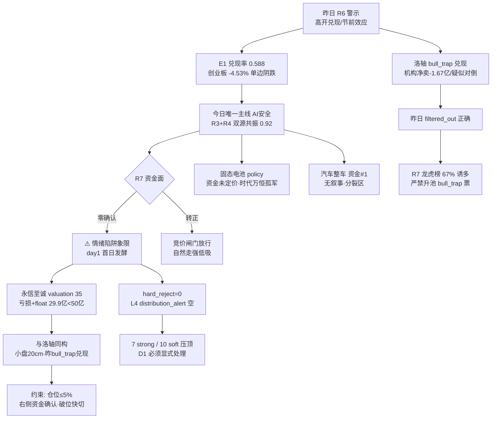

# 2026年9月29日 · **反证 / Devil's Advocate**

> **数据源新鲜度**: ok
> **降级状态**: false
> **置信度**: 0.68

## 一句话结论
退潮确认日，唯一主线 AI安全 是"双源共振、资金零确认"的 day1 题材——昨日高开兑现警示 100% 兑现，今日不赌第二遍：竞价资金不转正一律不做，永信至诚（估值全池最弱+小盘20cm）按洛轴同款约束，硬否决 0 条但 7 条 strong 压顶。

## 详细分析

**先说程序正义。** 模式六霸榜出货扫描：L4_distribution_alerts 为空——THS#1 猪肉是新进非连续霸榜，DC#1 江淮汽车是资金+涨停的正向确认而非出货。hard_reject 条件 1 不成立，今日硬否决 0 条。但这不是绿灯：R7 龙虎榜 61 家 41 家诱多（67%），洛轴股份（昨日 R6 已标庄股红旗 filtered_out）今日兑现涨停净卖-1.04 亿/机构净卖-1.67 亿/疑似对倒，昨日拒绝正确，为今日小盘 20cm 候选立下同款约束先例。

**核心张力：主线与资金的背离。** R2 唯一主线 AI安全（74 分，唯一过 70 线）拿到 R3 rank4 L1+L2 + R4 E003 全场最高 0.92 的双源共振，但 R7 资金面前 15 名里连影子都没有——网络安全板块 0928 随大盘 -2.02%，纯游资题材，r7_capital_match=false，cross_validation 只有 0.67。这不是"少一个确认"的问题：退潮环境（晋级率 13.5% / 跌停 56 反超涨停 33 / 广度 0.20 九月最差）下，day1 首日发酵的题材若竞价无资金承接，高开即兑现。R3 自己都说"所有 L1+L2 主题均首日发酵且资金未确认，按计划内试错处理"——试错仓位与主线执行仓位是两回事，D1 若按主线标准配仓即违反 emotion_cycle"不搏穿越"的硬纪律。

**昨日兑现链条是今日最强警报。** E1 复盘数据（r6_fulfillment total17/fulfilled10/partial6/rate0.588）：0928 盘前全部 10 条 strong 警示——高开兑现、节前效应、两岸 day1 风险、传媒断板、玻璃基板/存储资金背离——兑现率近 100%，创业板 -4.53% 低开单边阴跌，两岸 13 家涨停分化（厦工跌停），新华文轩断板、内蒙新华跌停，康强电子净卖 -1.16 亿。昨日"退潮期做首日题材=高开兑现"已验证，今日 AI安全是同一结构（day1、无资金、formation），不赌第二遍。

**个股层面。** 永信至诚（龙一 eligible）valuation 35 全池最弱：2025 首亏 +2026H1 亏损扩大、PS 12.18、float 29.9 亿<50 亿 caution、20cm 退潮隔日 -20% 风险——与昨日洛轴（小盘 20cm+庄股红旗→bull_trap 兑现）同构，仓位必须≤5%、只做右侧资金确认、严禁左侧抄底。三六零（龙二 eligible）pe_ttm 82 偏高、周K 空头、换手 1.42% 低迷、0928 未涨停——容量中军但技术未启动，只能低吸等资金转正。佰维存储是 12 票中唯一透传红旗（V1 周期顶低PE陷阱），存储产业催化（长鑫 349 亿）与资金流出（电子 -323.71 亿）背离，只做企稳低吸。

**四象限。** 高情绪×高资金象限今日为空（情绪 36 恐惧，没有过热主线）；高情绪×低资金=AI安全/固态电池（情绪陷阱：共振≠资金）；低情绪×高资金=汽车整车/白酒猪肉（分裂区：资金#1 但无叙事、防御无涨停潮）；低情绪×低资金=光通信算力/存储/玻璃基板（失血区：人气王出货+资金大幅流出）。

## 关键证据

- 证据 1: R7 top_inflow_sectors 前 15 无 AI安全/网络安全，r7_capital_match=false，网络安全板块 0928 -2.02% · 来源 R7_capital_flow.json
- 证据 2: E1 r6_fulfillment total17/fulfilled10/partial6/rate0.588，高开兑现警示全 fulfilled（创业板 -4.53% 低开单边阴跌）· 来源 data/reports/20260928/observation_tracking.json
- 证据 3: 洛轴 bull_trap 兑现（涨停净卖-1.04 亿/机构净卖-1.67 亿/换手 65.57%/疑似对倒），昨日 R6_M7_01 filtered_out 正确 · 来源 R7 lhb_bull_trap + PREV_R6
- 证据 4: 永信至诚 valuation_safety 35（2025 首亏+2026H1 亏损扩大·PS 12.18·float 29.9 亿<50 亿）· 来源 R5_stock_profiles.json
- 证据 5: L4_distribution_alerts=[] 空，但 R7 龙虎榜 61/41（67%）诱多 · 来源 hotlist_signals.json + R7
- 证据 6: 佰维存储 V1 周期顶低PE陷阱（pe 11.47 低+净利率 45.9% 扭亏初期历史高位）· 来源 R5 fundamental_flags

## 数据源审计

| 源 | 状态 | 抓取时间 | 记录数 | 备注 |
|---|---|---|---|---|
| R1_style | 🟢 | 07:17:54 | — | 情绪35·退潮线三条件全触发 |
| R2_main_sectors | 🟢 | 07:42:00 | — | 唯一主线AI安全74·2只eligible |
| R3_sentiment | 🟢 | 07:30:43 | — | 情绪36·resonance top5全首日 |
| R4_news | 🟢 | 07:12:00 | 8事件 | E003 AI安全0.92最高分 |
| R5_stock_profiles | 🟢 | 08:06:40 | 12票 | 永信估值35全池最弱 |
| R7_capital_flow | 🟢 | 07:17:52 | — | 龙虎榜67%诱多·洛轴bull_trap |
| hotlist_signals | 🟢 | 07:29:26 | — | L4空·watch_distribution 4只 |
| prev_R6(0928) | 🟢 | 08:25:00 | 19条 | 高开兑现警示 |
| E1_observation | 🟢 | 盘后 | 28只 | r6_fulfillment 0.588 |

## 反证证据链（mermaid）

## 不确定性 / 反证

- **本反证自身的盲点**：AI安全是"资金零确认"的反证对象，但若竞价出现超预期资金转正（板块主力净流入+永信/三六零承接），则本反证的 strong 约束可能过度保守——D1 应以 P1 竞价实际资金为最终闸门，反证只负责预设纪律而非预测走势。
- **兑现率口径**：E1 r6_fulfillment 的 fulfilled/partial 判定含主观成分，17 条中 6 条 partial 可能低估或高估实际兑现度；但核心 10 条 strong 警示兑现方向无歧义。
- **模式四/八/九降级**：历史事件库缺失（degraded）、涨停 33<100 主规则不触发（not_applicable）、最高 5 板<8 板（not_applicable）——这三类不是"没问题"，是"本轮无量化抓手"，不硬凑。
- **美股滞后 1 日**：R7 美股快照为 0925 收盘，0928 隔夜动态由 news_cls 补充（三大指数低开/中概涨/美债 10Y 5.2361% 创 2007 新高），对 0929 低开概率的评估存在 1 日滞后误差。

## 与其他 R/D/E 的关系

- 依赖: R1_style / R2_main_sectors / R3_sentiment / R4_news / R5_stock_profiles / R7_capital_flow / hotlist_signals / prev_R6(20260928) / E1_observation_tracking(20260928)
- 被消费: D1(canghai-plan) 消费 hard_rejects[] 与 counter_arguments[].severity（strong_suggest 必须显式处理或记录 d1_override）；E1(canghai-review) 盘后按 reject_id 验证兑现

## Sub-Agent 元数据

- skill: analyze_devil_advocate_v1
- artifact: data/research/20260929/R6_devil_advocate.json
- 生成耗时: 约 4 分钟
- model: deepseek-v4-flash-ga-260731
