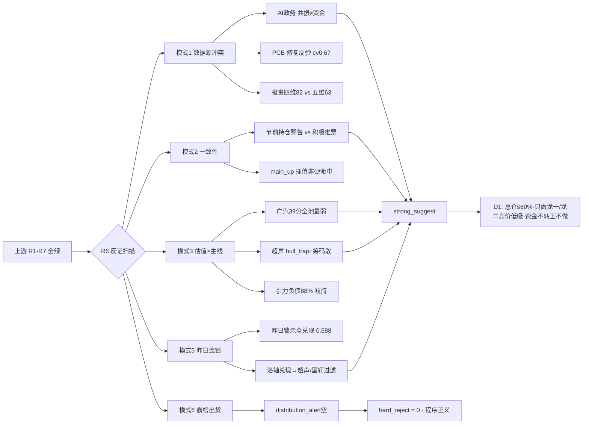

# 2026年9月30日 · **反证 / Devil's Advocate**

> **数据源新鲜度**: 🟢 ok · **降级状态**: false · **置信度**: 0.67

## 一句话结论

今日反证 hard_reject **0 条**（R3 霸榜出货 alert 为空·程序正义），但 **strong_suggest 8 条**集中在：AI政务共振≠资金、广汽基本面全池最弱、超声 bull_trap、节前最后 1 日极贪窗口——**总仓 ≤60% 硬上限·只做龙一/龙二竞价低吸·不追一字·资金不转正一律不做**。

## 详细分析

**反证全景**：六上游全绿，但全市场埋着一颗雷——**龙虎榜诱多 63/69 = 91% 为近期极值**，这是节前兑现压力最极端的一天。R2 推 3 条主线（AI应用 90 / 电池链 91 / PCB 84），6 只 execution_eligible 里却有 **4 只一字板**（新华传媒/国轩高科/广汽集团），实际可竞价参与的只有引力传媒（弱转强）、依顿电子（低吸）、超声电子（弱转强确认）。一字板越多，D1 的「可执行性」越低，越要防高开兑现。

**最强反证点——AI政务共振≠资金**：America.gov 是 09-30 凌晨发布的硬事件（特朗普+黄仁勋+五巨头签署），R3 rank3 L1+L2 + R4 E001 high 双源共振，但 R7 资金零确认（量子科技 -11.53 亿流出·网络安全中性）。这与 **昨日 AI安全完全同构**：R3+R4 双源共振、R7 零确认 → 昨日高开兑现被全兑现（r6_fulfillment 0.588，创业板 -4.53%）。「共振 ≠ 资金」是退潮修复日最容易踩的坑，竞价资金不转正一律不做。

**最弱基本面反证——广汽集团**：R2 电池链龙二（一字·整车容量），但 R5 valuation 39 分全池最低：ROE -4.34%、净利 yoy -76%、毛利率 -1.11%，三重弱红旗 + profit_warning。这是一只**纯情绪定价**的一字票，与题材（XFC 超充）严重背离——D1 只做竞价资金转正低吸，严禁追一字高开。

**筹码反证——超声电子**：PCB 龙一（人气王·surge 70→5），但 R7 lhb_bull_trap 命中（机构净卖 -2091 万·疑似对倒）+ R5 股东户数 +77.6% 筹码大幅分散 + 超跌反包属性（0928 曾 -9.4%）。12 天老线修复反弹非新高，R4 无事件催化（cv0.67）。**人气王的另一面是筹码在散**，只做竞价弱转强确认。

**情绪周期反证**：R1 情绪浓度**四维 82（极贪）vs 五维 63（贪婪）差 19>15**，触发逆向卖出窗口（参考 08-05 极贪 85.2 分→降仓先例）；emotion main_up 0.47/0.52 均**插值非硬命中**（溢价 +2.64% < +3% 阈值）。主升修复的成色要 0930 竞价验证，若高标不加速即回落高位震荡。

## 关键证据

- 证据 1: 龙虎榜诱多 63/69=91% 近期极值 · R7 lhb_bull_trap · 超声电子/国轩高科均命中
- 证据 2: AI政务 cv0.67·r7_capital_match=false·量子科技 -11.53 亿流出 · R7
- 证据 3: 广汽 valuation 39 全池最弱·净利 -76%·ROE -4.34% · R5
- 证据 4: 昨日 R6 高开兑现警示 100% 兑现·r6_fulfillment 0.588 · R6_prev
- 证据 5: 板块 5 日资金累计净流出（人工智能 -374.65 亿·PCB -342.79 亿·华为概念 -594.89 亿）·仅 0929 单日翻红 · R7

## 四象限负面识别

| 象限 | 板块 | 负面信号 |
|---|---|---|
| 🔴 高情绪×高资金 | AI应用 / 电池链 / PCB | 资金回流首日·5 日累计仍净流出·一字板无参与度·持续性未确认 |
| 🟠 高情绪×低资金 | AI政务/AI安全 | 情绪陷阱·事件首日资金未定价·与昨日 AI安全同构·共振≠资金 |
| 🟡 低情绪×高资金 | 存储 / 汽车整车 | 分裂区·产业催化 vs 修复非新高·美股半导体背离·跷跷板去向 |
| ⚫ 低情绪×低资金 | 光通信/CPO / 地产 | 失血区+出货区·人气王出货·对倒嫌疑·D1 严禁抄底 |

## 推理深度三问

- **大资金意图**：0929 全面修复日，主力选择在 AI应用/电池链/PCB 三个科技大方向内点火（强板块 17 个），本质是 0928 退潮后的超跌修复+持股过节抢筹。但机构专用席位合计净额仅 +0.98 亿，**大资金并未真金白银回归，回流的更多是游资情绪盘**——对手盘是节前兑现的获利盘。
- **为什么走强**：位置（0928 大跌后超跌反包）+ 催化（豆包上会 9/30 时间锚硬·America.gov 事件级·长鑫 108 亿）+ 筹码（涨停 57 家·晋级率 ~30% 修复）三维共振，但**筹码维度是最大软肋**——龙虎榜诱多 91% 说明涨停板上有大量诱多出货结构。
- **逻辑够不够硬**：AI应用（R3+R4+R7 三源·时间锚=今天上会）与电池链（三源·政策+资金）逻辑硬；**PCB 只有两源且无事件催化（cv0.67）**，AI政务双源但资金零确认——这两条最容易被 0930 竞价证伪，证伪路径=竞价高开无溢价/板块资金转负。

## 首推反证对象思维链（广汽集团 601238）

- **买入理由**：题材锚（广汽巨湾 XFC+固态双轮）确实硬；容量一字板若竞价打开承接可能给低吸机会；但 R5 估值 39 分全池最弱，题材定价已脱离基本面。
- **风险点**：ROE -4.34% / 净利 -76% / 毛利率 -1.1%，若题材退潮将无估值支撑；一字板打开后的抛压 = 获利盘+解套盘双杀；汽车整车是 seesaw 跷跷板另一端，板块内高低切会分流资金。
- **止损条件**：一字板打开后跌破涨停价（或竞价高开 >+3% 无承接）立即放弃；若参与低吸，破前一日涨停价 -3% 止损（对应 -5~-10% 硬区间内）。
- **可验证假设**：0930 竞价电池板块主力净流入转正且广汽承接量能放大 → 反证不成立可低吸；若竞价板块资金转负/高开低走 → 反证成立，放弃。

## 数据源审计

| 源 | 日期 | 状态 | 备注 |
|---|---|---|---|
| R1_style | 2026-09-30 | 🟢 | 主升修复·情绪70·仓位上限60% |
| R2_main_sectors | 2026-09-30 | 🟢 | 3主线·6只eligible |
| R3_sentiment | 2026-09-30 | 🟢 | 情绪75·distribution_alert空 |
| R4_news | 2026-09-30 | 🟢 | 8事件·America.gov+豆包上会 |
| R5_stock_profiles | 2026-09-30 | 🟢 | 12票画像·广汽39最弱 |
| R7_capital_flow | 2026-09-30 | 🟢 | 北向+21.29亿·诱多63/69 |
| R6_prev | 2026-09-29 | 🟢 | 昨日兑现率0.588 |
| emotion_cycle | 2026-09-30 | 🟢 | main_up 0.47插值 |

## 不确定性 / 反证

- 模式 4（历史类比）无历史库 degraded，未硬凑——昨日同样 degraded。
- 模式六 hard_reject=0 是**程序正义**（distribution_alert 为空），不等于全市场无出货风险——91% 诱多极值由 strong_suggest 承接，D1 必须显式处理超声/国轩两只 bull_trap 命中票。
- 美股隔夜数据滞后 1 日（overseas_stale=true·0928 收盘），跨市场背离判断基于 T-1 数据，若 0929 美股大幅反弹需在竞价修正。
- R5 chip_structure 未透传 main_force_5d_net_wan 字段（R5 用龙虎榜 net 近似），模式六第二条件以 R7 龙虎榜诱多 flag 代替核验。

## 与其他 R/D/E 的关系

- 依赖: R1/R2/R3/R4/R5/R7 上游 artifact + 昨日 R6 兑现数据
- 被消费: D1(canghai-plan) · E1(canghai-review) 复盘对照

## Sub-Agent 元数据

- skill: analyze_devil_advocate_v1
- artifact: data/research/20260930/R6_devil_advocate.json
- 生成耗时: ~15 分钟
- model: deepseek-v4-flash-ga-260731
