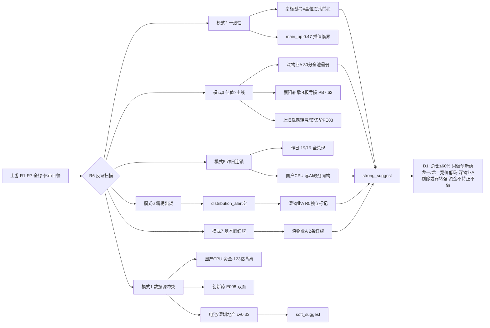

# 2026年10月1日 · **反证 / Devil's Advocate**

> **数据源新鲜度**: 🟡 partial(休市口径·A股 0930 收盘为最新) · **降级状态**: false · **置信度**: 0.67

## 一句话结论

今日反证 hard_reject **0 条**（R3 霸榜出货 alert 为空·程序正义），但 **strong_suggest 8 条**集中在：深物业A 龙虎榜诱多（R5 独立标 distribution_alert）、高标孤岛=高位震荡前兆（main_up 0.47 vs high_chop 0.40 临界）、国产CPU 与昨日 AI政务同构（KOL+事件强 vs 资金 -123 亿背离）——**节后 1008 总仓 ≤60%·只做四源确认的创新药龙一/龙二竞价低吸·资金不转正一律不做·高标断板立即降 40% 以下**。

## 详细分析

**反证全景**：六上游全绿，但 1001 是国庆休市日——本产出是「0930 节前定格 + 1008 节后展望」口径。全市场埋着三颗雷：**龙虎榜诱多 74/79 = 94% 再创极值**（较 0929 的 91% 继续抬升）、**高标孤岛+普跌分化**（广度 0.91<1·2567 涨 vs 2824 跌·科创50 -2.51%·强板块 17→6 收缩 59%）、**8 天长假外盘风险**（美债 5.62% 创 24 年新高+德国通胀 3.3%+油价 103 美元）。R2 名义推 3 主线 6 只 eligible，但其中 2 条主线（电池链/深圳地产）cv0.33 仅 R3 单源确认，深物业A 还是 R5 独立标记的 distribution_alert 对象——名义推票强度与实际资金确认度存在真实张力。

**最强反证点——深物业A（000011）**：深圳国资龙一（3板·APEC 时间锚），但 R5 valuation 30 分全池最弱：**净利 -572% 大亏 + 负债率 79.2% + ROE -2.03%**，龙虎榜连续净卖（0929 -1.03 亿 / 0930 -5595 万），R7 命中「涨停净卖出 -1.8 亿 + 机构专用净卖 -1.45 亿 + 疑似对倒」。R5 已独立把它标进 distribution_alert 与 lhb_bull_trap_flagged。虽然 R3 的 hotlist distribution_alert 为空（模式六硬否决条件①未满足·程序正义 hard_reject=0），但这是**事实上的霸榜出货结构**——D1 必须显式处理：建议剔除执行池，或只做竞价弱转强确认、高开兑现立即放弃。

**最危险的同构反证——国产CPU/昇腾**：KOL 4 群 6 人独立狂推（Muse 登顶→交货期 25-30 周→综艺股份走龙）+ R4 三 high 事件（E002 CPU 需求/E004 DeepSeek 开源昇腾/E001 PSL 六张网），但 R7 科技资金**极端背离**：半导体 -123.38 亿 / 国产芯片 -122.46 亿 / 科技 -96.23 亿 / 存储 -95.09 亿。这与**昨日 AI政务完全同构**——E1 复盘确认昨日 R6「19/19 全兑现」：双源共振但资金零确认的方向全部高开兑现（超声电子 -4.59%/依顿 -4.22%/澳弘 -10%）。「共振 ≠ 资金」在 1008 竞价是最大陷阱，资金不转正一律不做。

**情绪结构反证**：R1 名义硬命中「连板情绪型」三条件（涨停 52≥50 / 7板≥6 / 炸板率 18.75%<20%），但加注实况是「高标孤岛+普跌分化」高位震荡前兆：高标接力簇（非ST三板以上 30日 +211%）当日仅 +0.01% 高位滞涨，首板/低位转弱（打首板当日 -0.1%），emotion main_up 0.47 vs high_chop 0.40 仅差 0.07。**节后 1008 竞价是情绪周期切换点**：高标延续+涨停 50+ 可上修 70%，高标断板/炸板率破 25%/溢价转负立即降 40% 以下。

## 关键证据

- 证据 1: 深物业A 龙虎榜诱多：涨停净卖 -1.8 亿·机构净卖 -1.45 亿·疑似对倒·连续净卖 · R7 lhb_bull_trap + R5 flags=[distribution_alert, lhb_bull_trap_flagged]
- 证据 2: 龙虎榜诱多 74/79 = 94% 极值（较 0929 的 91% 再升） · R7 lhb_bull_trap
- 证据 3: 高标孤岛：广度 0.91<1·强板块 17→6·科创50 -2.51%·非ST三板以上 30日 +211% 但当日滞涨 +0.01% · R1 style_cluster
- 证据 4: 昨日 R6 19/19 全兑现（节前空仓纪律完胜）·国产CPU 与昨日 AI政务同构 · E1 observation_tracking 20260930
- 证据 5: 国产CPU 资金极端背离：半导体 -123.38 亿/国产芯片 -122.46 亿/科技 -96.23 亿 · R7
- 证据 6: 创新药 5日资金 cum -35.68 亿（0930 单日 +41.51 亿#1 但非连续趋势）·E008 美债 5.62% 对创新药 net_polarity -0.7 · R7 + R4

## 四象限负面识别

| 象限 | 板块 | 负面信号 |
|---|---|---|
| 🔴 高情绪×高资金 | 创新药/医药链 | 唯一四源确认但加速确认非首日·康希诺 PE624/30日+103% 透支·E008 美债压制·5日资金非连续 |
| 🟠 高情绪×低资金 | 深圳国资地产 / 电池链 / 国产CPU | 情绪陷阱：深物业A 诱多出货·电池资金退坡·国产CPU 与昨日 AI政务同构·共振≠资金 |
| 🟡 低情绪×高资金 | 存储/HBM | 分裂区：美光催化正面 vs A股存储 -95.09 亿流出·高位回调不跟美股存储链 |
| ⚫ 低情绪×低资金 | 半导体/科技 / 玻璃基板 | 失血区+出货区：科技 -123/-122/-96 亿·康强电子人气价格背离 -8.74%·五方光电诱多·D1 严禁抄底 |

## 推理深度三问

- **大资金意图**：0930 主力把真金白银全押在医药链（创新药 +41.51 亿#1·top11 全医药），本质是科技失血后的**防御性高低切**——资金从高位算力/半导体撤出避险，而非全面进攻。北向 +20.79 亿连续 5 日净买但 0930 边际走弱（低于 20 日均 25.56 亿），机构在节前最后一个交易日的动作是「收缩战线+锁定医药」——对手盘是 8 天长假不可控的外盘风险（美债 5.62% 创 24 年新高）。
- **为什么走强**：创新药走强 = 位置（CRO/减肥药低位细分·指数 30日 -3.24% 刚转正）+ 催化（礼来减重 23% 创纪录·E006 硬事件）+ 筹码（医药系龙虎榜霸榜）三维共振；但**筹码维度是最大软肋**——龙虎榜诱多 94% 说明涨停板上大量诱多出货结构，深物业A 就是最典型的一例（涨停净卖 -1.8 亿）。
- **逻辑够不够硬**：创新药四源确认（R3+R4+R7+R2·cv1.0）逻辑最硬，但 5 日资金 cum -35.68 亿证明它是单日爆发非连续趋势，E008 美债负面是悬顶之剑；电池链/深圳地产只有两源（cv0.33）且资金未确认，最容易被 1008 竞价证伪；国产CPU 事件+KOL 最强但资金零确认，与昨日 AI政务同构——**证伪路径 = 1008 竞价板块资金不转正/高开无溢价**。

## 首推反证对象思维链（深物业A 000011）

- **买入理由**（反证视角）: APEC 11 月时间锚确实硬（政策级中期逻辑）；3板人气龙一（热榜 12→3）若竞价弱转强存在情绪反包空间；深圳国资地产板块（我爱我家/陆家嘴/滨江）有人气扩散。
- **风险点**: 净利 -572% 大亏+负债率 79.2%，题材退潮将无估值支撑；龙虎榜连续净卖（0929 -1.03 亿/0930 -5595 万）+ 机构专用净卖 -1.45 亿 + 疑似对倒 = 高位兑现盘特征；深圳特区板块资金 -23.87 亿流出，板块资金未全面确认（cv0.33）。
- **止损条件**: 竞价高开 >+3% 无承接立即放弃；若低吸参与，破前一日涨停价 -3%（对应 -5~-10% 硬区间内）止损；节后首日若深圳特区板块资金继续流出，竞价即放弃。
- **可验证假设**: 1008 竞价深圳特区板块主力净流入转正且深物业A 承接量能放大 → 反证不成立可弱转强试错；若竞价板块资金转负/高开低走/低开无承接 → 反证成立，剔除执行池。

## 数据源审计

| 源 | 日期 | 状态 | 备注 |
|---|---|---|---|
| R1_style | 2026-10-01 | 🟢 | 连板情绪型·高标孤岛·情绪65·仓位上限60% |
| R2_main_sectors | 2026-10-01 | 🟢 | 3主线·6只eligible·电池/地产cv0.33 |
| R3_sentiment | 2026-10-01 | 🟢 | 情绪69·distribution_alert空·weflow降级 |
| R4_news | 2026-10-01 | 🟢 | 8事件·E006礼来+E008美债负面 |
| R5_stock_profiles | 2026-10-01 | 🟢 | 14票画像·深物业A 30分最弱 |
| R7_capital_flow | 2026-10-01 | 🟢 | 北向+20.79亿·诱多74/79·创新药+41.51亿 |
| R6_prev | 2026-09-30 | 🟢 | 昨日反证 19 条 |
| E1_observation_tracking | 2026-09-30 | 🟢 | R6 19/19 全兑现·超声-4.59%/澳弘-10% |
| emotion_cycle | 2026-10-01 | 🟢 | main_up 0.47 vs high_chop 0.40 临界 |

## 不确定性 / 反证

- 模式 4（历史类比）无历史库 degraded，未硬凑——连续多日 degraded。
- 模式六 hard_reject=0 是**程序正义**（R3 distribution_alert 为空数组），不等于全市场无出货风险——R5 已独立把深物业A 标进 distribution_alert（涨停净卖 -1.8 亿/机构净卖 -1.45 亿/疑似对倒），94% 诱多极值由 strong_suggest 承接，D1 必须显式处理深物业A。
- 20261001 为国庆休市日：全部 A 股判断基于 0930 收盘定格，1008 复市前有 8 天长假，任何外盘利空（美债续升/油价/地缘）都会在竞价一次性映射——本反证的所有「竞价验证」条款都指向 1008 而非今日。
- R5 chip_structure 未透传 main_force_5d_net_wan 字段（R5 用龙虎榜 net 近似），模式六第二条件以 R7 龙虎榜诱多 flag 代替核验（与昨日同口径）。
- R5 fundamental_flags 为简化编码（F1=净利下滑/转亏·F3=ROE亏损·F8=负债率高·V2=PE极高），非附录 A 严格 12 红旗，模式七以透传为准并在 patterns_status 注明。

## 与其他 R/D/E 的关系

- 依赖: R1/R2/R3/R4/R5/R7 上游 artifact + 昨日 R6(20260930) + E1 observation_tracking(20260930)
- 被消费: D1(canghai-plan) · E1(canghai-review) 复盘对照

## Sub-Agent 元数据

- skill: analyze_devil_advocate_v1
- artifact: data/research/20261001/R6_devil_advocate.json
- 生成耗时: ~15 分钟
- model: deepseek-v4-flash-ga-260731
