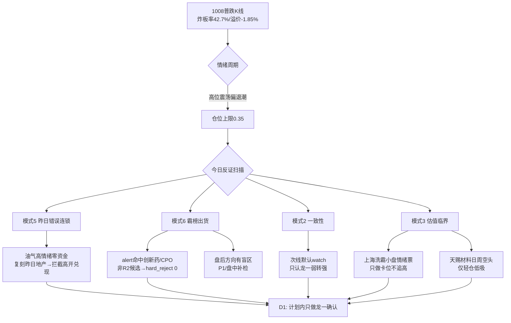

# 2026年10月9日 · 反证 / Devil's Advocate

> 数据源新鲜度: partial（降级但可判）
> 降级状态: false（六上游齐全；R3/R5 自带 degraded 标记）
> 置信度: 0.66

## 一句话结论

🚫 hard_reject 0 条（程序正义）；真正危险是"油气高情绪零资金"复刻昨日地产高开兑现，以及独主线龙一失败引发的唯一性杀跌。

## 详细分析

昨天（1008）市场用一根普跌K线给了答案：涨停43家看似不少，实则全靠新华传媒一只八板撑高度；炸板率42.7%破退潮线、昨日涨停溢价 -1.85%（打板接力隔日即亏）、3748只下跌、创业板 -3.15%、科创50 -4.82%。情绪周期=高位震荡并向主跌滑移。R1 据此把仓位上限压到 0.35。在这个段位里，R6 的任务不是找买点，而是找"看起来像机会的坑"。

第一个坑在油气次线。R4 里中东骤然升级（霍尔木兹爆炸+伊朗停装卸+三航母）与广汇能源预增167-177%构成全场最强叙事，net_weighted 1.494 排第一。但按 1008 收盘口径：R3 热榜 top5 无油气、R7 板块资金榜无油气开采（仅煤炭#9、航运#15沾边），cross_validation 只有 0.33。这与昨天地产 rank1 的结构**完全同构**——当时也是情绪+人气榜单在炒、R4无硬事件、R7资金零确认，R6 给出 strong_suggest 要求"竞价资金不转正即按高开兑现"，昨日已实盘兑现（地产/机器人/液冷今日全部退出主线）。昨天的学费不能白交：油气竞价若被先手顶满而无真实封单，拦截。

第二个坑藏在唯一进攻象限里。固态电池/新能源链是普跌日唯一逆势方向，R3 rank1 L1+L2、R7 电池+32.75亿霸榜，主线身份成立。但它是"资金独走"型主线——R4 对应催化 E006 只是 medium 单源纯情绪，无官方硬催化，运行仅第3个资金净流入日、1008 才出首板潮，尚未经过分歧检验。退潮日的高聚焦等于高拥挤：龙一弱转强成功，吃唯一性溢价；龙一低开无承接，则全场无主线，唯一性溢价瞬间反转为唯一性杀跌。故今日只认一个动作——龙一弱转强确认，不做中位补涨、不抄底科技。

第三个坑是高标的欺骗性。八板新华传媒自身被 R7 检出涨停席位净卖0.85亿、买方为自然人，最高标已在借板派发。它今天的竞价是全场总开关：核按钮则上海洗霸的二板卡位在内的所有接力买点全部撤销，仓位压到 0.20 以下。同题材小票善水科技涨停席位净卖6.07亿（严重异常口径），也说明新能源情绪方向已有资金借板兑现，板块纯度需要打折。

## 反证全景 · 决策流向

## 四象限负面识别

| 象限 | 成员 | 负面读法 | 动作 |
|---|---|---|---|
| 🔥 高情绪·高资金 | 固态电池/新能源链（score84·电池+32.75亿#1） | 唯一进攻象限，但退潮日高聚焦=高拥挤，无第二主线分散风险 | 只做龙一确认；11:35资金不延续即降仓 |
| ⚠️ 高情绪·低资金 | 油气链（R4 net1.494·资金零确认）、卫星通信（通信-99.65亿） | 高开兑现/情绪陷阱区，与昨日地产失败结构同构 | 默认watch；竞价无封单无资金转正即拦截 |
| 🧊 低情绪·高资金 | 公用事业+11.57亿、电力+10.77亿、煤炭+7.03亿 | 避险洼地，无叙事无涨停基因，无次日接力溢价 | 不开新仓；仅作避险情绪读数 |
| 🕳️ 低情绪·低资金 | 电子-233亿、半导体-159.85亿、计算机-42.33亿、传媒-20.85亿 | 恐慌抽水+海外硬件同跌，最危险左侧区 | 严禁抄底摊低；只等右侧企稳信号 |

## severity 分布（共13条）

| 等级 | 数量 | 代表条目 |
|---|---|---|
| strong_suggest | 4 | 油气高开兑现拦截（M5）、卫星事件或被淹没（M1）、退潮段位压候选面（M2）、上海洗霸只做卡位（M3） |
| soft_suggest | 9 | 天赐材料空头反弹、先导智能短多长空、传艺周线压力、龙蟠候补、模式六盲区、模式七数据空、新华传媒总开关、跨资产核对、主线消息单源 |
| hard_reject | 0 | — |

## 关键证据

- 证据1: 昨日R6_M1_01 对地产"R4叙事强+R7零确认→高开兑现"的 strong 警报今日实盘兑现（地产/机器人/液冷全部退出主线，全场-2%）· 来源 R6(20261008)+R7
- 证据2: 油气 cv=0.33：R3 top5无油气、R7 1008油气开采未进top10，尽管 R4 net_weighted 1.494 全场最高 · 来源 R2/R3/R4/R7
- 证据3: 退潮读数三连：炸板率42.7%（破40%）、涨停溢价-1.85%、3748只下跌 · 来源 R1
- 证据4: 新华传媒8板但席位净卖0.85亿、善水科技涨停席位净卖6.07亿 · 来源 R7 lhb_lure
- 证据5: R3 distribution_alert 命中创新药、CPO，均非R2候选板块 → 模式六硬否决条件不成立 · 来源 R3/R2

## 首推票思维链（先导智能 300450 · R5 alpha A-）

- 买入理由: 独主线容量中军，R7 电池/电力设备/锂电专用设备三板块共同 lead_stock，1008放量+7.58%主力方向最明确，机构调研口径直接受益——是全场唯一机构+资金双确认的计划内标的。
- 风险点: 短多长空，周K MA60≈47压制；20日前高37.77仅差0.18元，放量不过即兑现；筹码维度本轮degraded，真实承接结构未知。
- 止损条件: 破34元（日支撑/低吸窗口下沿）走；高开>5%不追。
- 可验证假设: 竞价抗住低开并放量上攻=弱转强确认，溢价来自独主线唯一性；若低开无承接，假设证伪、全场转入空仓模式。

## 数据源审计

| 源 | 状态 | 记录数 | 备注 |
|---|---|---|---|
| R1 风格 | 🟢 ok | 1 | conf 0.62，完整 |
| R2 主线 | 🟢 ok | 1主线+2次线 | conf 0.70 |
| R3 情绪 | 🟡 partial | 5主题 | WeFlow永久下线，热榜为1008收盘口径 |
| R4 消息 | 🟢 ok | 8事件 | 主线催化仅medium单源 |
| R5 画像 | 🟡 partial | 10票 | 筹码/大宗/两融/红旗全空 |
| R7 资金 | 🟢 ok | 15流入板块 | 1008收盘真实口径，xtick不可达 |
| 昨日R6 | 🟢 ok | 17条 | 模式五连锁比对依据 |

## 不确定性 / 反证（自我批判）

1. R3 热榜止于 1008 收盘，盘后全民发酵的油气与"尚水智能流通盘买断"方向存在霸榜识别盲区——hard_reject=0 是程序结论，不代表盘中无派发，P1/盘中必须补检。
2. 模式七（基本面红旗）与模式八（解套盘）因数据缺失降级，无证据不等于无风险；情绪高标仓位一律从紧。
3. 商品期货数据 skipped，油气"无跨资产背离"仅为方向核对，缺独立油价序列交叉。
4. 若竞价意外出现新主线（非新能源链）集体爆发，本报告基于"独主线"的全部前提需当场重估。

## 与其他 R/D/E 的关系

- 依赖: R1_style / R2_main_sectors / R3_sentiment / R4_news / R5_stock_profiles / R7_capital_flow / 昨日R6
- 被消费: D1 主决策（strong_suggest 须显式处理；soft 记入 r6_soft_notes；无 hard_reject 强制项）；P1 竞价承接霸榜盲区补检；E1 复盘核对反证兑现

## Sub-Agent 元数据

- skill: analyze_devil_advocate_v1
- artifact: data/research/20261009/R6_devil_advocate.json
- model: ark-code-latest
- 方法: 只读磁盘 artifact，全程无新数据拉取、无 MCP 调用
