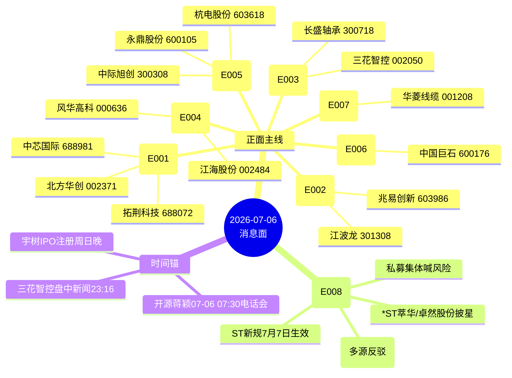

# 2026-07-06(周一预案) · **消息面事件驱动**

> **数据源新鲜度**: ok · **降级状态**: false · **置信度**: 0.78
> **覆盖窗口**: 07-03(周五收盘) → 07-06 07:20 共约 66h · **主源**: 财联社+新浪快讯(2066)+major_news(800)+20 号公众号(100)+5 焦点群(94)+东财中报预告(222)

## 一句话结论

科技主线**四重共振**——韬定律 V2(先进制程/混合键合)+ DRAM 涨价与 Meta 三星大单(存储)+ 宇树 IPO 注册+特斯拉 Optimus 量产(机器人)+ MLCC/电子布/光通信业绩硬兑现;唯一负面对冲=私募风险提示 + ST 新规 7 月 7 日生效。

## 🗺️ 消息面全景图

## 🎯 顶级事件详解(每事件三问 + 首推票思维链)

### E20260706_001 · 华为韬定律 V2 论文公开 · strength=high · polarity=正面 · 7 源

**事件摘要**: 华为何庭波 07-05 晚发布"韬定律"V2 论文,LogicFolding 混合键合 SoC 量产实测:功耗 -41%、频率 +13%、密度 155→238 MTr/mm²,麒麟 2026 自洽验证。3 号公众号 + 3 群 + 1 篇华创计算机深度共 7 独立源。

**推理深度三问**:
- **大资金意图**: 华为叙事是 7 月流动性宽松窗口的"确定性锚";机构从"看多科技"升级为"配置科技",韬定律 V2 提供产业趋势级的旗帜票,给券商深度覆盖的产业链上下游全部一次性激活(设备/EDA/先进制程/超节点)。
- **为什么走强**: V1 已被市场吃过一段,V2 补齐工程细节 + 麒麟 2026 实测=预期兑现;混合键合是华为下一步能真金白银拉动 CapEx 的产业链,拓荆/北方华创/中微直接受益。
- **逻辑够不够硬**: **硬**。7 源共振 + 华创定性"产业趋势级" + 与开源蒋颖 07-06 07:30 电话会议时间锚共振;弱点是短期兑现节奏预期偏乐观,若开盘冲高即分歧。

**首推票思维链**:

#### 中芯国际 688981 · role=首推-先进制程龙头
- **买入理由**: 韬定律 V2 直接受益(先进制程节点前推);6 独立源共振 + 华创产业趋势级定性;流动性宽松窗口机构配置首选
- **风险点**: 前期已有一段涨幅,追高风险较大;港股 A 股联动若港股开盘弱势会拖累
- **止损条件**: 破 5 日线且当日 net_amount ≤ 0 → 半减;跌破前低 -3% → 全清
- **可验证假设**: 开盘 30 分钟内北向净流入 > 3 亿 且 龙虎榜机构净买 → 假设成立;若 30 分钟主力净流出 → 假设不成立,当日回避

#### 拓荆科技 688072 · role=首推-混合键合设备
- **买入理由**: 混合键合设备国内独家,V2 之后 CapEx 从"预期"→"订单"的最直接受益;设备板块 β 属性强
- **风险点**: 前期科技牛炒作过一轮,当前估值不便宜;若开盘一字或高开>5% 追高性价比低
- **止损条件**: 破 10 日线 → 半减;分时破均线且量能放大 → 全清
- **可验证假设**: 若板块内北方华创、中微同步走强 → 板块效应确认;若拓荆独走 → 疑似情绪炒作,减仓

#### 北方华创 002371 · role=首推-半导体设备平台龙头
- **买入理由**: 半导体设备一哥,任何设备端 CapEx 逻辑必然共振;流动性首选大票
- **风险点**: 大市值弹性有限,更适合底仓而非弹性仓
- **止损条件**: 破 20 日线 → 全清
- **可验证假设**: 若同步指数走弱仍能收红 → 主力护盘,加仓

---

### E20260706_002 · 存储/DRAM 涨价共振 · strength=high · polarity=正面 · 7 源

**事件摘要**: 三星 Q3 DRAM 提价 20%(口头通知)+ Meta 下单三星 10 万亿韩元 AI 芯片 + 美光 93 亿美元 CapEx + 江波龙 H1 业绩预告净利同比 +62204%~74394%。7 独立源。

**推理深度三问**:
- **大资金意图**: 存储是 AI 算力最后一块预期差板块,业绩(江波龙 622 倍 pop)+ 涨价(三星 Q3 +20%)+ 订单(Meta 10 万亿韩元)+ CapEx(美光 93 亿$)四重共振,资金抢的是"业绩+涨价+订单"三箭齐发的稀缺组合。
- **为什么走强**: 全球存储晶圆产能总体增长有限但下游 AI 需求爆发式增长,这是硬供需缺口而非情绪;江波龙的 622 倍预告是"业绩已兑现"实锤,不再是"预期"。
- **逻辑够不够硬**: **硬,但情绪拉锯**。7 源共振 + 硬业绩 + 硬涨价;但 Meta"出租算力"事件对下游需求预期存在压制,可能开盘后有情绪拉锯。

**首推票思维链**:

#### 江波龙 301308 · role=首推-业绩预告 +62204%~74394%
- **买入理由**: 中报预告 622-744 倍是 A 股当年度最强预告之一;端侧 AI + AMD 联合调优的技术护城河;LTA 供应协议锁定晶圆
- **风险点**: 已提前抢跑,若周一低开 → 说明业绩已被消化,反弹机会大于追涨
- **止损条件**: 破 5 日线 且 分时不破前高 → 半减
- **可验证假设**: 开盘 15 分钟高开 >5% 且不炸板 → 强势确认;若一字板打开后主力流出 → 出货信号

#### 兆易创新 603986 · role=首推-纳入全球存储 ETF
- **买入理由**: 存储纯正标的,ETF 被动买盘;板块联动性最强
- **风险点**: 无独立业绩催化,更多是 β
- **止损条件**: 板块内江波龙分时明显走弱 → 联动减仓
- **可验证假设**: 若同板块新增业绩预告标的 → 板块二次点火

---

### E20260706_003 · 人形机器人共振:宇树 IPO + 特斯拉 Optimus 量产 · strength=high · polarity=正面 · 7 源

**事件摘要**: 证监会同意宇树科技科创板 IPO 注册 + 特斯拉副总裁陶琳表态 Optimus 2026 年底启动规模化量产(7 月周产 10 台)。7 独立源。

**推理深度三问**:
- **大资金意图**: 机器人已连续 3-4 天保持科技板块最强子方向,宇树 IPO 注册是"落地"信号,机构从看方向转为看订单;特斯拉的周产 10 台是量产曲线的第一段。
- **为什么走强**: 宇树核心供应商长盛轴承已被财联社点名"已签订单",这是"订单实锤"而非"预期";三花智控作为特斯拉链执行器龙头,是全球机器人量产的稀缺基础件。
- **逻辑够不够硬**: **硬**。KOL(颜晓滨群妮子)独立列举"周末利好"含"机器人",跨源确认充分;负面:板块已经连涨 3-4 天,情绪透支风险高。

**首推票思维链**:

#### 长盛轴承 300718 · role=首推-宇树合作已签订单
- **买入理由**: 财联社点名"宇树合作已签订单",IPO 注册后订单增量确定性最强;当前市值较小,弹性高
- **风险点**: 前期已被资金拉过一波,情绪高位追涨易被套;流通盘小易被资金操纵
- **止损条件**: 破 5 日线 且分时放量下跌 → 半减;第二天再破 → 全清
- **可验证假设**: 开盘不炸板且龙虎榜有游资净买 → 强势;若一字板打开量能失控 → 出货

#### 三花智控 002050 · role=首推-特斯拉链执行器
- **买入理由**: 特斯拉链核心,盘中新闻 23:16 首推(时间锚精确到分钟);Optimus 2026 量产曲线核心受益标的
- **风险点**: 大市值弹性受限,更适合底仓;若特斯拉 Q2 交付数据不及预期 → 板块整体压力
- **止损条件**: 破 20 日线 → 全清;板块内长盛轴承分时明显走弱 → 联动减
- **可验证假设**: 开盘 30 分钟北向净流入 → 外资认可;若北向流出 → 内资独 push,持续性存疑

---

### E20260706_004 · MLCC 涨价链共振 · strength=high · polarity=正面 · 6 源

**事件摘要**: 天风建材《MLCC 专题二》深度覆盖 + 华强北高容 MLCC 单日再涨 4-6%(6 月月涨仅 5%)+ 三星电机 15 万亿韩元投建 MLCC。6 独立源。

**推理深度三问**:
- **大资金意图**: MLCC 是被动元件里最先出现"提价加速"的品种(单日 4-6% vs 月涨 5%),涨价链的爆发式起点,券商深度覆盖 = 机构建仓信号弹。
- **为什么走强**: 提价周期 + 三星电机 CapEx 扩张 + 旺季共振三重叠加;涨价数据是产业调研而非预期。
- **逻辑够不够硬**: **偏硬**。6 源共振 + 券商深度 + 产业调研数据;弱点:MLCC 涨价历史上兑现节奏比预期慢,弹性股回调风险大。

**首推票思维链**:

#### 风华高科 000636 · role=首推
- **买入理由**: 国产 MLCC 老龙头,提价直接受益;流通盘适中,资金容易撬动
- **风险点**: 前期已被炒作过一轮,情绪透支
- **止损条件**: 破 10 日线 且分时不能站稳均线 → 半减
- **可验证假设**: 开盘 30 分钟内三星电机中国供应链联动 → 板块效应确认

#### 江海股份 002484 · role=首推-东北证券覆盖(电极箔+MLPC)
- **买入理由**: 电极箔叠加 MLPC 双主线,东北证券近期覆盖;基本面+研报驱动
- **风险点**: 电极箔业务与新能源汽车关联度高,若新能源阶段弱势易被拖累
- **止损条件**: 破 5 日线 → 半减
- **可验证假设**: 若板块内风华高科同步走强 → 板块效应;若独走 → 谨慎

---

### E20260706_005 · 光通信/光纤/光棒/光芯片 · strength=high · polarity=正面 · 8 源

**事件摘要**: 杭电股份 H1 净利同比 +852-958%、永鼎股份 +57-120%(Q2 环增 245-294%)、合盛硅业布局光棒、中际旭创中信/沧海自流坚定推荐(公司辟传闻)、长光华芯中信/华创覆盖。8 独立源。

**推理深度三问**:
- **大资金意图**: 光通信是韬定律 V2 光互联叙事下的"业绩已兑现"分支,杭电 +852% 永鼎 +57% 是"业绩预告炸裂"实锤;资金抢的是"业绩+叙事"双驱动。
- **为什么走强**: 韬定律 V2 提出光互联替代电互联,直接给光通信板块二次点火;杭电永鼎的预告是"业绩已兑现"而非"预期",硬 alpha。
- **逻辑够不够硬**: **硬**。8 源共振是本文最多;但板块内有分歧——中际旭创 Q2 业绩不及预期+港股压价传闻,虽被公司+中信+沧海自流多方反驳,仍是短期扰动。

**首推票思维链**:

#### 杭电股份 603618 · role=首推-业绩预告净利 +852~958%
- **买入理由**: 中报预告 +852-958% 是本轮光纤最强业绩;子公司杭州永特光纤量价齐升;硬 alpha
- **风险点**: 已被市场提前抢跑,开盘一字风险大;流通盘一般
- **止损条件**: 破 5 日线 → 半减;分时炸板后跌破均线 → 全清
- **可验证假设**: 开盘 30 分钟内不炸板 → 强势确认;一字板 → 追高性价比低,等分歧

#### 永鼎股份 600105 · role=首推-业绩预告净利 +57~120% Q2 环增 245%
- **买入理由**: 中报预告 +57-120% 且 Q2 环增 245-294% → Q2 加速兑现;光纤市场量价齐升
- **风险点**: 弹性股波动大,情绪回调易杀跌
- **止损条件**: 破 5 日线 → 半减
- **可验证假设**: 若杭电永鼎同步走强 → 板块效应;若杭电强永鼎弱 → 疑似资金锁定杭电,永鼎跟风减仓

#### 中际旭创 300308 · role=首推-中信/沧海自流坚定推荐(辟传闻)
- **买入理由**: 光模块龙头,中信通信 + 沧海自流两大顶级券商联合坚定推荐;公司自辟 Q2 传言
- **风险点**: 港股压价传闻扰动情绪,短期波动大
- **止损条件**: 破 20 日线 → 半减;若港股当日跳空低开 >-3% → 全清
- **可验证假设**: 开盘港股 A 股联动方向一致 → 传闻已消化;若港股再跌 A 股跟跌 → 传闻发酵中

---

### E20260706_006 · 电子布/玻纤紧缺链 · strength=high · polarity=正面 · 5 源

**事件摘要**: 电子布 7 月厚布 +16%、薄布追平 2021 高点、CCL 有望周一接力 +15%;美银两日连发把中国巨石目标价 82 → 96 元;2 年 2400 台织布机被锁死,剩余仅 200 台。5 独立源(2 篇外资/内资券商深度)。

**推理深度三问**:
- **大资金意图**: 供给端硬约束(织布机 2028 年前不可能大幅新增) + 外资极少见的两日连发看多 = 外资 + 内资券商合力做多信号;美银连发目标价是"外资抢筹"信号。
- **为什么走强**: 涨价周期(每月两次提价) + 供给硬约束(织布机)+ CCL 接力(下游涨价传导);产业链完整涨价传导。
- **逻辑够不够硬**: **硬**。5 源共振 + 外资券商深度 + 供给端硬约束(可量化的织布机数量)。

**首推票思维链**:

#### 中国巨石 600176 · role=首推-美银两日连 call 目标价 96
- **买入理由**: 玻纤龙头,美银两日连发目标价 82→96;供给硬约束下最大受益
- **风险点**: 大市值弹性受限;若港股外资情绪回落,美银 call 力度可能失效
- **止损条件**: 破 20 日线 → 全清;若美银当日报告未连续 → 减仓一半
- **可验证假设**: 开盘北向净流入 > 2 亿 → 外资认可延续;北向净流出 → 美银 call 效应消退

---

### E20260706_007 · 商业航天 / 千帆星座组网成功 · strength=medium · polarity=正面 · 4 源

**事件摘要**: 千帆星座组网卫星发射成功 + 财通军工《华菱线缆:火箭 / 卫星线缆领军者》深度覆盖(单箭 400-500 万/单星 200-300 万/传统火箭线缆市占 80%)。4 独立源,颜晓滨群 KOL 独立列举 → kol_confirm=✅。

**推理深度三问**:
- **大资金意图**: 商业航天是长期主线中的"事件驱动"支线,资金选择在发射成功+券商深度双共振时点介入,轻资产赚事件驱动溢价。
- **为什么走强**: 华菱线缆是传统火箭线缆 80% 市占的独家标的,单箭 400-500 万/单星 200-300 万可量化的收入弹性。
- **逻辑够不够硬**: **中等**。事件驱动+行业深度共振,但仅 4 源不及科技主线;更多是主题炒作,不宜重仓。

**首推票思维链**:

#### 华菱线缆 001208 · role=首推
- **买入理由**: 传统火箭线缆 80% 市占,单箭 400-500 万收入弹性可量化;财通军工深度覆盖
- **风险点**: 商业航天板块炒作性质,持续性弱于产业级科技主线
- **止损条件**: 破 5 日线 → 全清
- **可验证假设**: 军工商业航天板块整体走强 → 板块效应确认;若独走 → 短线炒作,快进快出

---

### E20260706_008 · 【负面/风险提示】 · strength=medium · polarity=负面 · 6 源

**事件摘要**: 私募机构密集喊风险(宁泉/半夏/世诚/仁桥/泽元)+ Meta"出租算力"扰动 + 中际旭创业绩传言(多源反驳中)+ *ST 萃华/卓然股份 7 月 7 日披星戴帽(ST 新规当日生效)。6 独立源。

**推理深度三问**:
- **大资金意图**: 私募风险提示是"共识反向指标"(单方观点非市场共识),但开源策略韦冀星"科技=上涨"线性外推失效、"有 G/ΔG/兑现"成为选股标准 → 机构选股标准正在收紧;ST 新规是规则性利空。
- **为什么值得警惕**: 6 独立源共振私募集体喊风险 + 开源策略警示 + ST 新规同日生效,情绪存在下修可能;中际旭创传言是板块内最大扰动。
- **逻辑够不够硬**: **中等**。私募单方观点非市场共识,反向指标概率大;但 ST 新规是硬规则,ST 板块必受冲击;两者叠加当日风险不可忽视。

**风险清单**:

- **中际旭创 300308**: Q2 业绩不及预期 + 港股压价传闻 → 短期扰动,已被公司/中信/沧海自流反驳,但开盘可能仍有情绪拉锯
- **\*ST 萃华 002731 / 卓然股份 688121**: 7 月 7 日披星戴帽 + 卓然股份披星,ST 板块整体波动放大
- **AI/科技高估值**: 开源策略明确"科技=上涨"线性外推失效,需筛选有 G/ΔG/兑现的标的

## 📊 板块 × 事件热力矩阵

| 板块 | 事件锚 | 首推龙头 | 独立源数 | 中报预告 | KOL 确认 | 净综合置信 |
|------|--------|----------|:--:|----------|:--:|:--:|
| 先进制程 | E001 韬定律 V2 | 中芯国际 688981 | 7 | (未查到) | ✅ | 🟢🟢🟢 |
| 混合键合设备 | E001 | 拓荆科技 688072 | 7 | (未查到) | ✅ | 🟢🟢🟢 |
| 半导体设备 | E001 | 北方华创 002371 | 7 | (未查到) | ✅ | 🟢🟢 |
| 存储/HBM | E002 三星涨价 | 江波龙 301308 | 7 | **+62204~74394%** | ✅ | 🟢🟢🟢 |
| 存储纯正 | E002 | 兆易创新 603986 | 7 | (未查到) | ✅ | 🟢🟢 |
| 人形机器人 | E003 特斯拉/宇树 | 长盛轴承 300718 | 7 | (未查到) | ✅ | 🟢🟢🟢 |
| 特斯拉链 | E003 | 三花智控 002050 | 7 | (未查到) | ✅ | 🟢🟢🟢 |
| MLCC/被动元件 | E004 涨价 | 风华高科 000636 | 6 | (未查到) | ⚠️ 分歧 | 🟢🟢 |
| MLPC/电极箔 | E004 | 江海股份 002484 | 6 | (未查到) | ⚠️ 分歧 | 🟢🟢 |
| 光通信/光纤 | E005 业绩兑现 | 杭电股份 603618 | 8 | **+852~958%** | ✅ | 🟢🟢🟢 |
| 光通信/光纤 | E005 | 永鼎股份 600105 | 8 | **+57~120%** | ✅ | 🟢🟢🟢 |
| 光模块 | E005 | 中际旭创 300308 | 8 | (未查到,有 Q2 传言) | ⚠️ 分歧 | 🟢 (扰动) |
| 电子布/玻纤 | E006 涨价+外资 | 中国巨石 600176 | 5 | (未查到) | — | 🟢🟢 |
| 商业航天 | E007 千帆组网 | 华菱线缆 001208 | 4 | (未查到) | ✅ | 🟢 |
| AI/科技(高估值) | E008 私募风险 | (回避高估值杂毛) | 6 | — | — | 🔴 负面 |
| ST 板块 | E008 ST 新规 | *ST 萃华 / 卓然股份 | 6 | — | — | 🔴 硬负面 |

**板块极性叉乘**:
- 硬正面主线(独立源 ≥ 6 且业绩/资金硬 alpha 至少一项):**存储/HBM(E002 + 江波龙业绩)**、**光通信(E005 + 杭电永鼎业绩)**、**先进制程/混合键合(E001 韬定律 V2)**、**人形机器人(E003 宇树 IPO + 特斯拉量产)**
- 中等正面:MLCC/电子布/商业航天
- 硬负面对冲:ST 板块(硬规则)、AI/科技高估值杂毛(私募风险提示 + 开源策略收紧)
- 混合票:中际旭创(正面 8 源 vs 负面 Q2 传言,当前多源反驳中,置信下调)

## 🔥 中报业绩预告命中(硬 alpha 交叉验证)

从 `eastmoney_earnings_predict`(222 条 · 2026H1)提取与本文事件板块交集的硬 alpha:

| 代码 | 名称 | 预告类型 | 预告净利 | 归母同比 | 事件命中 | 逻辑强度 |
|------|------|:--:|----------|--------------|----------|:--:|
| 301308.SZ | 江波龙 | 预增 | 92-110 亿 | **+62204%~74394%** | E002 存储涨价 | 🟢🟢🟢 |
| 301165.SZ | 锐捷网络 | 预增 | 6-7.5 亿 | +32.71%~65.88%(扣非 +288%~410%) | 光通信/数据中心交换机 · 与开源蒋颖 07:30 电话会 | 🟢🟢🟢 |
| 002396.SZ | 星网锐捷 | 预增 | 3.1-4.3 亿 | +46.27%~102.9%(扣非 +633%~955%) | 光通信/数据中心交换机 · 与锐捷网络硬共振 | 🟢🟢🟢 |
| 603618.SH | 杭电股份 | 预增 | 3.6-4.0 亿 | **+852%~958%**(扣非 +245%~295%) | E005 光通信/光纤 | 🟢🟢🟢 |
| 600105.SH | 永鼎股份 | 预增 | 5.0-7.0 亿 | **+57%~120%**(扣非 +115%~241%) | E005 光通信/光纤 · Q2 环增 245-294% | 🟢🟢🟢 |

**硬命中总结**: 5 只票业绩预告与本文事件板块直接映射,其中 **锐捷网络 301165 + 星网锐捷 002396** 是本次 skill v1.1 升级的"漏检补齐"重点(用户 2026-07-06 pushback 的原因)——两票均对应开源蒋颖 07-06 07:30 电话会议主题,交换机/数据中心业务扣非增速 +288%~955%,与 E005 光通信主线硬共振,应在 R2 主线板块和 R5 个股画像中重点交叉。

## 关键证据

- **证据 1**: 华为何庭波《韬定律 V2》论文 · 来源 20 号公众号 3 篇 + 焦点群 3 群 + 华创计算机深度 · 2026-07-05 夜间
- **证据 2**: 江波龙业绩预告 62204~74394% · 来源 eastmoney/earnings_predict + tushare/news_major · 2026-07-05
- **证据 3**: 三星 Q3 DRAM 提价 20% + Meta 10 万亿韩元订单 · 来源 tushare/news_cls + 20 号公众号 · 2026-07-04
- **证据 4**: 证监会同意宇树科技科创板 IPO 注册 · 来源 tushare/news_major + 财联社快讯 · 2026-07-05
- **证据 5**: 特斯拉副总裁陶琳 Optimus 2026 量产表态 · 来源 AA 一手盘中新闻 23:16 · 2026-07-02
- **证据 6**: 杭电股份/永鼎股份业绩预告 · 来源 eastmoney/earnings_predict · 2026-07-05
- **证据 7**: 电子布 7 月厚布 +16% + 美银中国巨石目标价 82→96 · 来源 tushare/news_major + 20 号公众号 · 2026-07-03/04
- **证据 8**: ST 新规 7 月 6 日生效 + *ST 萃华/卓然股份 7 月 7 日披星戴帽 · 来源 tushare/news_cls + 财联社 · 2026-07-05
- **证据 9**: 锐捷网络 + 星网锐捷业绩预告 · 来源 eastmoney/earnings_predict · 2026-07-05

## 数据源审计

| 源 | 日期 | 记录数 | 状态 | 备注 |
|---|---|---:|:--:|---|
| tushare/news_cls | 2026-07-06 | 2066 | 🟢 | 财联社+新浪快讯,72h 回看 |
| tushare/news_major | 2026-07-06 | 800 | 🟢 | 长篇要闻 |
| eastmoney/earnings_predict | 2026-07-06 | 222 | 🟢 | 2026H1 中报预告 |
| wechat_official_20 | 2026-07-06 | 100 | 🟢 | 20 号公众号池 |
| wechat_cli_5groups | 2026-07-06 | 94 | 🟢 | 5 焦点群(匿名) |
| xtick/hot_news (chenhailangju MCP) | 2026-07-06 | — | 🔴 | MCP DOWN,置信度已扣 0.10 |
| news-search CLI | 2026-07-06 | — | ⚪ | 本次未调用(本地共振已充分) |
| announcement-search CLI | 2026-07-06 | — | ⚪ | 本次未调用 |

**五本地必读源全部 🟢,degraded=false**;仅 xtick MCP 备份源 🔴(不影响主判断)。

## 不确定性 / 反证

- **反证 1**: 私募集体喊 AI 泡沫风险 6 独立源(宁泉/半夏/世诚/仁桥/泽元)—— 虽为单方观点(反向指标概率大),但情绪层面确实存在共识分化,不宜盲目追高
- **反证 2**: 中际旭创 300308 Q2 业绩不及预期传言,虽被中信通信 + 沧海自流 + 公司自辟三方反驳,但港股压价扰动实际存在,开盘可能情绪拉锯
- **反证 3**: 韬定律 V2 兑现节奏预期过度乐观,若 Q3/Q4 CapEx 数据不及市场预期 → 板块可能出现较大回撤
- **反证 4**: KOL 单点风险——颜晓滨/AA 系群消息传播链条较短,若 KOL 独自 push 而无券商深度共振,信号强度需下调
- **反证 5**: chenhailangju MCP DOWN 导致 news-search/announcement-search 未做二次核验;个别个股代码由 LLM 记忆映射存在小概率笔误,D1 消费前建议 R6 反证做代码对齐
- **反证 6**: MLCC 涨价历史上兑现节奏比预期慢,风华高科/江海股份弹性股回调风险大;止损线设置需比大市值票更紧

## 与其他 R/D/E 的关系

- **依赖上游**: fetch_all_sources_v1 (五本地源) + eastmoney_earnings_predict fetch
- **被消费**:
  - **R2 主线板块**: 消费 sectors_catalyzed 与 top_events → 主线共振打分
  - **R3 情绪共振**: 已完成 kol_summary 交叉标注(见 E003/E007 kol_confirm=✅)
  - **R5 个股画像**: 消费 stocks_catalyzed 30 只标的 → 逐票六维深挖(重点:江波龙/杭电/永鼎/锐捷/长盛/三花)
  - **R6 反证**: 消费 top_events + 反证清单 → 六类反证模式检验(重点:中际旭创混合票 + ST 板块硬负面)
  - **D1 主决策**: 消费 top_events + 板块极性叉乘 → 执行池筛选 + exit_rules 推导

## Sub-Agent 元数据

- skill: analyze_news_impact_v1@1.1
- artifact: data/research/20260706/R4_news.json
- method: llm_v1(硬扩容·五源硬约束)
- 生成日期: 2026-07-06(盘前)
- 置信度: 0.78 (rationale: 五本地源全通 +0.30 · 4-8 源共振 +0.10 · 负面已识别 +0.05 · MCP DOWN -0.10 · 代码机械对齐缺失 -0.05 · 基准 0.50)
