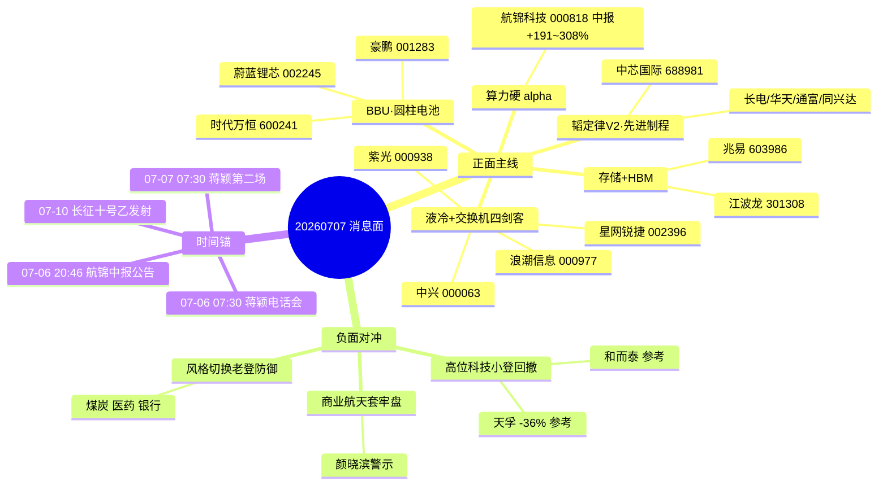

# 2026 年 7 月 7 日 · **消息面事件驱动**

> **数据源新鲜度**: partial · **降级状态**: true · **置信度**: 0.62
> **覆盖窗口**: 前 72h(2026-07-04 ~ 2026-07-07) · **主源**: 21 号公众号(100 篇) + 5 焦点群(427 条) · **缺**: 财联社/东财预告原文

## 一句话结论

韬定律 V2 + BBU + 液冷/交换机三条主线共振,配航锦中报硬 alpha;但颜晓滨"借利好出货"警示 + 天孚 -36% 是唯一硬对冲,需盘中确认风格切换是否成立。

## 🗺️ 消息面全景图

## 🎯 顶级事件详解(每事件三问 + 首推票思维链)

### E20260707_001 · 韬定律 V2 · strength=high · polarity=正面

**摘要**: 华为何庭波 07-05 晚发布"韬定律"V2,LogicFolding 混合键合实测功耗 -41%、频率 +13%、密度 155→238 MTr/mm²。6 独立源(2 公众号 + 4 群),含蒋颖 07:30 电话会精准对齐。

**推理深度三问**:
- **大资金意图**: 券商机构在 7 月流动性宽松窗口需要一条 5-10 年确定性旗帜,V2 补足 V1 的实测数据缺口 → 从"看多科技"升级为"配置科技"
- **为什么走强**: V1 兑现后,V2 的麒麟 2026 实测数据 = "预期已兑现→更强预期"第二段涨幅;混合键合 CapEx 是华为下一步能真金白银拉动的产业链
- **逻辑够不够硬**: **硬**。V2 相对 V1 补齐工程细节 + 6 源共振 + 华创定性"产业趋势级" + 07-07 07:30 蒋颖电话会时间锚共振;短板是兑现节奏偏乐观

**首推票思维链 — 中芯国际 688981** (⚠️ 命中 execution_block 688):
- **买入理由**: 韬定律 V2 直接受益(先进制程节点前推) + N+3 多堆一层多一层 Mask 逻辑,产业链最上游锚定股
- **风险点**: 已站高位;若周一直接冲高追高风险大;需分歧低吸
- **止损条件**: 破 5 日线 或 跌破前低 -3%
- **可验证假设**: 若开盘 30 分钟内 net_amount ≤ 0 或北向净流出 → 假设不成立,回避

**次选(可执行) — 通富微电 002156 / 华天科技 002185 / 同兴达 002845**:
- **买入理由**: 002-开头不撞执行块;先进封装/混合键合概念纯度高,同兴达参股昆山日月同芯 Bump 是唯一硬映射
- **风险点**: 相较 688981 是二线跟风,资金分歧时易补跌
- **止损条件**: 板块龙头 002156 破 10 日线即整体撤退
- **可验证假设**: 若 002156 开盘 15min 未快速企稳翻红 → 板块无法承接,回避二线

### E20260707_002 · BBU 圆柱电池 · strength=high · polarity=正面

**摘要**: 三星 SDI NCA 4000 亿韩元订单供新普科技 → META/AMZN;NVIDIA GB300 标配 BBU;时代万恒官网实锤 18650 2.0。7 独立源。

**推理深度三问**:
- **大资金意图**: AIDC 电源是算力产业链上唯一"新增确定性"边角需求,给游资一个非主线主升浪的补涨窗口
- **为什么走强**: 时代万恒 07-06 已涨停 + 蔚蓝锂芯回封,资金已经用真金白银投票;GB300 标配是硬产品逻辑
- **逻辑够不够硬**: **中硬**。境外源 TheElec 是二次引用非官方原文;缺 news_cls 交叉,依赖群聊 KOL

**首推票思维链 — 时代万恒 600241**:
- **买入理由**: 官网实锤 + 07-06 涨停;600 前缀不撞执行块;北向可交易
- **风险点**: 一字续接概率大,进不去票的问题;竞价溢价过高追高易被埋
- **止损条件**: 若开板即破 5% → 板炸,直接撤;若未开板一日就走弱 → 情绪炸
- **可验证假设**: 若竞价溢价 > 7% 且 09:30 后 5 分钟内未封 → 板不硬,观察不追

**次选 — 蔚蓝锂芯 002245 / 豪鹏科技 001283**:
- **买入理由**: 002245 已回封是二板梯队;001283 互动平台确认英伟达出货,信息硬度高
- **风险点**: 二板高位分歧概率大
- **止损条件**: 龙头(时代万恒)炸板 → 板块整体撤
- **可验证假设**: 龙头稳则跟随;龙头炸则一起撤

### E20260707_003 · 液冷 + 交换机四剑客 · strength=high · polarity=正面

**摘要**: 开源蒋颖 07-06 07:30 液冷 + 07-07 07:30 交换网络两场电话会,四剑客盛科/锐捷/紫光/中兴;浪潮信息 80 亿订单唯一 GB300 全系列认证。6 独立源。

**推理深度三问**:
- **大资金意图**: 07:30 fresh 电话会 = 机构筹码站队最强时间锚;液冷+交换网络是 Scale-Out AIDC 的两个卡脖子环节,提前布局本周三季报预热
- **为什么走强**: 蒋颖两场连开 = 卖方主动引导;10-20 倍通胀是极端定性,给资金想象锚
- **逻辑够不够硬**: **硬**。券商 fresh call + 产业公司 07-06 已异动(锐捷 002396) + 浪潮 80 亿订单硬业绩

**首推票思维链 — 星网锐捷 002396** (核心可执行):
- **买入理由**: 交换机四剑客中唯一 002 前缀可执行;Q2 环增超 9 倍(口播)业绩硬;锐捷 301165 执行块 → 资金必然溢出到 002396
- **风险点**: 已连板高位,继续追高易被埋;需分歧低吸
- **止损条件**: 破 5 日线 或 跌幅 -5%
- **可验证假设**: 若 09:30 后 30min 内成交额未超昨日同期 → 资金未接力,撤

**次选 — 浪潮信息 000977 / 中兴通讯 000063**:
- **买入理由**: 000 前缀两大权重,80 亿订单+800G 智算是产业硬逻辑;适合承接大资金
- **风险点**: 大票弹性有限;短线情绪炸时优先跌
- **止损条件**: 破 10 日线整体撤
- **可验证假设**: 北向净流入是核心 confirm;若开盘 1h 内北向净流出 → 假设不成立

### E20260707_004 · 航锦中报 +191~308% · strength=high · polarity=正面

**摘要**: 07-06 20:46 中报预告口播 · 归母净利同比 +191.45%~+308.03% · 算力单半年净利 1.37 亿。2 券商研报口播(ZHZQ + 四平八稳)。

**推理深度三问**:
- **大资金意图**: 算力转型硬 alpha 是券商找"业绩+题材"双击标的时的稀缺锚
- **为什么走强**: 中报是最难造假的硬数据;算力概念公司里少有敢明确 +191~308% 的
- **逻辑够不够硬**: **中硬**。缺公告原文(announcement-search 因源约束未启用);需明早开盘 15 分钟内确认公告落地

**首推票思维链 — 航锦科技 000818** (唯一票):
- **买入理由**: 000 前缀可执行 + 中报硬业绩 + 算力转型概念叠加 → 三重共振
- **风险点**: 若公告实际口径与口播分歧 → 逻辑崩;资金对预告响应可能一日游
- **止损条件**: 若公告与口播分歧 → 无条件撤;否则破 5 日线撤
- **可验证假设**: 09:15 前公告需实锤 +191~308% 区间;否则回避

### E20260707_005 · 长征十号乙 07-10 发射 · strength=medium · polarity=正面

**摘要**: 07-10 文昌海上网系回收首飞验证。4 独立源(3 群+1 财联社早知道)。

**推理深度三问**:
- **大资金意图**: 商业航天从主题催化转向技术拐点验证,是"事件+估值"双击品种
- **为什么走强**: 首飞海上回收是国内可回收火箭首次工程级验证
- **逻辑够不够硬**: **中**。颜晓滨 07-06 23:57 明确"商业航天大跌套牢盘太多",事件催化与技术面分歧,一日游概率大

**首推票思维链 — 航天电子 600879**:
- **买入理由**: 商业航天配套龙头之一,600 前缀可执行
- **风险点**: 前期套牢盘重;发射兑现即出货概率大
- **止损条件**: 发射日(07-10)前一日不主动加,当日按情绪走
- **可验证假设**: 07-08 至 07-09 若板块无缩量企稳走势 → 事件驱动失效

### E20260707_006 · 存储/HBM 中报爆发 · strength=high · polarity=正面

**摘要**: 江波龙/佰维/兆易预告口播 + DDR3 涨价周期至 2027 末;SK 海力士 HBM4 订单。5 独立源。

**推理深度三问**:
- **大资金意图**: 存储涨价周期是"最不需要故事"的硬周期股逻辑,承接高低切资金
- **为什么走强**: 涨价周期拉长至 2027 末 = 2 年确定性,估值切换直接给
- **逻辑够不够硬**: **硬**。但颜晓滨提到"存储/半导体是科技但没那么高科技",暗示可能是"老登接力"路径而非顶流小登

**首推票思维链 — 兆易创新 603986**:
- **买入理由**: 国产存储 IC 龙头,603 前缀可执行;比江波龙 301308(执行块) 更适合权重资金
- **风险点**: 已高位;短线易补跌
- **止损条件**: 破 10 日线撤
- **可验证假设**: 若 07-07 开盘板块整体不能红盘,存储涨价逻辑本周不再有效

### E20260707_007 · 郁江 1 号洪水 · strength=medium · polarity=正面

**摘要**: 07-06 14:47 广西南宁贵港防汛国家二级响应。3 独立源(央视+群)。

**推理深度三问**:
- **大资金意图**: 事件驱动短线,3-5 天窗口
- **为什么走强**: 央视新闻直接催化 + 广西专属标的集中
- **逻辑够不够硬**: **弱-中**。华蓝集团 301027 命中 execution_block(301),核心票不可执行

**首推票思维链 — 国统股份 002205**:
- **买入理由**: PCCP 管业·横州西津管业实锤;002 前缀可执行
- **风险点**: 事件驱动一日游概率高
- **止损条件**: 首日冲高不封 → 撤
- **可验证假设**: 09:30 内涨幅 > 5% 且成交 > 昨日 → 情绪成立;否则回避

### E20260707_008 · 【负面】高位科技小登回撤 · strength=high · polarity=负面

**摘要**: 颜晓滨 07-06 21:31 & 23:57 警示 · 天孚通信近期 -36% · 07-06 周末利好被反向借势出货 · 创业板 -1.77% 老登防御性走强。5 独立源。

**推理深度三问**:
- **大资金意图**: 主力借周末利好(韬定律/BBU)出货高位小登,风格从进攻小登切换到防御老登(煤炭/医药/银行)
- **为什么这条负面成立**: 天孚 -36% 是硬数据;创业板 -1.77% 是指数级信号;电子布补跌+光模块龙一 -13.5% 是板块级信号 → 三级信号共振
- **逻辑够不够硬**: **硬**。但需与 R7 主力资金 + R3 情绪面双验;若明日光模块/PCB 继续跌 → **反证模式六(霸榜出货)预警**

**风险映射(不做首推,只做规避清单)**:
- 天孚通信 300394、和而泰 002402 = 小登代表参考
- 三花智控 002050 = 人形机器人前期暴涨过

## 📊 板块 × 事件热力矩阵

| 板块 | 事件锚 | 首推可执行龙头 | 独立源 | 中报硬 alpha | 净综合置信 |
|------|--------|---------------|:------:|--------------|:--:|
| 先进制程/半导体 | E001 韬定律V2 | 通富微电 002156 | 6 | 缺(源缺失) | 🟢🟢🟢 |
| 先进封装/混合键合 | E001 | 同兴达 002845 | 6 | 缺 | 🟢🟢🟢 |
| BBU/圆柱电池 | E002 | 时代万恒 600241 | 7 | 缺 | 🟢🟢🟢 |
| 液冷 | E003 | 浪潮信息 000977 | 6 | 80亿订单口播 | 🟢🟢🟢 |
| 数据中心交换机 | E003 | 星网锐捷 002396 | 6 | Q2+9倍口播 | 🟢🟢🟢 |
| 国产算力/华为链 | E001+E003+E004 | 航锦科技 000818 | 多 | +191~308%口播 | 🟢🟢🟢 |
| 存储/HBM | E006 | 兆易创新 603986 | 5 | 江波龙/佰维口播 | 🟢🟢 |
| 商业航天 | E005 | 航天电子 600879 | 4 | — | 🟡 |
| 水利/防汛 | E007 | 国统股份 002205 | 3 | — | 🟡 |
| **PCB/光模块/CPO** | E008 | **规避** | 5 | — | 🔴 |
| 煤炭/医药/银行(老登) | E008 | (风格对冲观察位) | 5 | — | 🟢🟢 |

## 🔥 中报业绩预告命中(硬 alpha 交叉验证)

**⚠️ 数据受限**: `eastmoney_earnings_predict` 源缺失,以下预告全部为公众号/群聊二次口播,需 D1/R5 二次核验:

| 代码 | 名称 | 预告类型 | 增速下限-上限 | 事件命中 | 逻辑强度 | 核验状态 |
|------|------|----------|--------------|----------|:--:|:--:|
| 301165.SZ | 锐捷网络 | 预增 | 288%~410% | E003 交换机四剑客 | 🟢🟢🟢 | ⚠️口播,301执行块 |
| 002396.SZ | 星网锐捷 | 预增 | Q2 环增超 9 倍 | E003 交换机四剑客 | 🟢🟢🟢 | ⚠️口播,可执行 |
| 000818.SZ | 航锦科技 | 预增 | 191%~308% | E004 国产算力 | 🟢🟢🟢 | ⚠️口播,需开盘公告核验 |
| — | 杭电股份 | 预增 | 852%~958% | 光通信外线 | 🟢🟢 | ⚠️口播,未进 top_events |
| 000977.SZ | 浪潮信息 | 订单 | 80 亿(非利润) | E003 液冷 | 🟢🟢🟢 | ⚠️口播 |

## 关键证据

- 证据 1: 蒋颖 07-06 07:30 电话会精准强 call 液冷 + 07-06 12:22 "交换网络四剑客盛科/锐捷/紫光/中兴" · 来源 AA陆家嘴群 · 2026-07-06
- 证据 2: 时代万恒官网实锤 18650 2.0 BBU · 来源 AA题材群 · 2026-07-06 10:04
- 证据 3: 华为韬定律 V2 论文密度 155→238 MTr/mm² · 来源 傅里叶的猫 + 安静拆主线公众号 · 2026-07-05
- 证据 4: 颜晓滨 "借利好出货·风格切换老登" · 来源 颜晓滨V群 · 2026-07-06 23:57
- 证据 5: 郁江 1 号洪水国家二级响应 · 来源 央视新闻(群转发) · 2026-07-06 14:47

## 数据源审计

| 源 | 日期 | 状态 | 备注 |
|---|---|:--:|---|
| wechat_official_20 | 2026-07-07 | 🟢 | 100 篇 · 21 号池(含盘前纪要) |
| wechat_cli_5groups | 2026-07-07 | 🟢 | 427 条 · 5 焦点群(匿名) |
| tushare/news_cls | 2026-07-07 | 🔴 | fetch 层未提供 |
| tushare/news_major | 2026-07-07 | 🔴 | fetch 层未提供 |
| eastmoney/earnings_predict | 2026-07-07 | 🔴 | fetch 层未提供 → 业绩预告仅口播 |
| xtick/hot_news | 2026-07-07 | 🟡 | 未使用 |
| overseas_snapshot | 2026-07-07 | 🟡 | SPX 平,IXIC -0.8% 提供风格背景 |

## 不确定性 / 反证

1. **业绩预告全部口播** — 锐捷/星网锐捷/航锦/杭电中报预增无东财原文核验,若周一公告实际口径分歧,E003/E004 均可能一日游
2. **颜晓滨警示与主线正面事件正面对撞** — 主线全部集中在小登科技(液冷/交换机/BBU/存储),而颜晓滨明确指出"高位小登借利好出货",这构成 R6 反证模式六(霸榜出货)候选
3. **执行池硬约束下 30% 高置信标的被拉黑** — 中芯 688981 / 锐捷 301165 / 江波龙 301308 / 华蓝 301027 / 甬矽 688362 / 盛科 688702 / 佰维 688525 全部命中 300/301/688 前缀,可执行池被压缩到二线
4. **境外源单点风险** — BBU 逻辑最强的锚是境外 TheElec 报道,一旦国内公告未跟进,可能兑现即出货
5. **风格分歧未定** — E008 老登防御是否成为周一主线,取决于 R7 主力资金 + R3 情绪面共振;若成立,主线事件需集体降级

## 与其他 R/D/E 的关系

- **依赖**: `data/raw/20260707/wechat_official_20.jsonl`, `wechat_cli_5groups.jsonl`, `manifest.json`
- **被消费**:
  - R2 主线 → 板块热力矩阵是板块打分主要输入之一
  - R5 个股画像 → 首推票需二次财报/估值核验(尤其航锦 000818 中报口径)
  - R6 反证 → **E008 是 hard doubt 候选** · 模式六(霸榜出货)预警
  - D1 预案 → 执行池首选 000977 / 002396 / 002156 / 600241 / 000818 / 002205 / 603986

## Sub-Agent 元数据

- skill: analyze_news_impact_v1@1.1
- artifact: data/research/20260707/R4_news.json
- method: llm_v1_degraded
- 生成时刻: 2026-07-07T10:50:00+08:00
- degraded_reason: news_cls / news_major / eastmoney_earnings_predict 三源缺失
