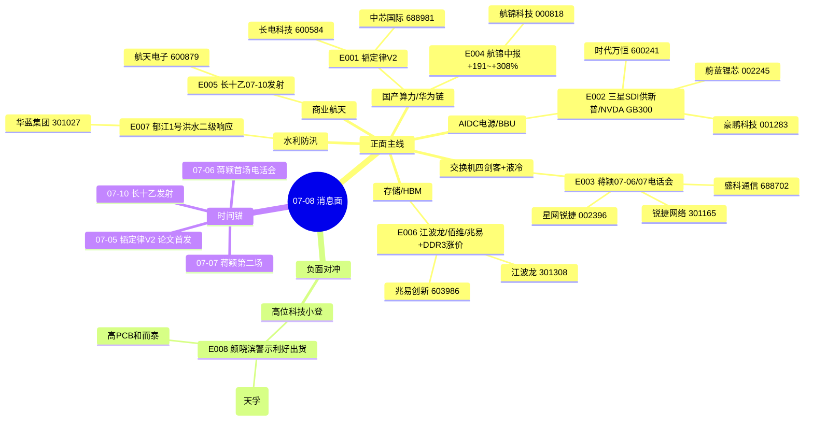

# 2026-07-08(周三) · **消息面事件驱动**

> **数据源新鲜度**: stale · **降级状态**: true(硬扩三源缺失) · **置信度**: 0.6  
> **覆盖窗口**: 07-05 ~ 07-07(3 日 · λ=0.15 时间衰减) · **主源**: 21 号公众号 + 5 焦点群多源共振  
> **上游**: roll-forward from `data/research/20260707/R4_news.json` (盘前 07-07 07:17 fetch)

## 一句话结论

华为韬定律 V2 + 蒋颖蒋液冷/交换机四剑客 + BBU 电池 + 存储中报预告四线共振主导 07-08 攻击面,负面对冲=颜晓滨警示高位科技小登借利好出货(硬红线)。

## 🗺️ 消息面全景图

## 🎯 顶级事件详解(每事件三问 + 首推票思维链)

### E20260708_001 · 华为韬定律 V2 论文公开 · LogicFolding 混合键合实测(功耗-41%/频率+13%/密度155→238 MTr/mm²) · strength=high · polarity=正面  

**事件摘要**: 华为何庭波 7-5 晚发布韬定律 V2,LogicFolding 混合键合实测:功耗 -41% / 频率 +13% / 密度 155→238 MTr/mm²。6 独立源(3 公众号 + 3 群),华创计算机盘中定性"产业趋势级"。(raw_score=0.85 · weighted_score=0.542 · days_since=3 · single_source=False)

**推理深度三问**:
- **大资金意图**: 华为叙事是国产算力主线的**产业级信念锚**;7 月流动性宽松窗口机构需要一条"5-10 年确定性"旗帜票,V2 精准补齐 V1 的实测数据缺口 → 机构从"看多科技"升级到"配置科技"。
- **为什么走强**: 二级已提前吃 V1 涨幅,V2 给出的**麒麟 2026 自洽实测**是"预期已兑现→更强预期"的第二段涨幅催化;混合键合 CapEx 是华为下一步能真金白银拉动的产业链。
- **逻辑够不够硬**: **硬**。V2 相较 V1 补齐工程细节 + 6 独立源共振 + 华创定性"产业趋势级" + 与开源蒋颖电话会议时间锚共振;缺陷是短期兑现节奏预期偏乐观,且 +3 日已衰减到 raw×0.638 · 需 07-08 集合竞价二次确认。

**首推票思维链**:

#### 中芯国际 688981
- **买入理由**: 先进制程龙头 N+3 直接受益,多堆一层 Mask → 制程节点前推硬 alpha
- **风险点**: 已站高位,单日冲高追高风险;需分歧低吸
- **止损条件**: 破 5 日线 or 跌破前低 -3%
- **可验证假设**: 若开盘 30 分钟内 net_amount ≤ 0 或北向净流出 → 假设不成立当日回避

### E20260708_002 · AI 数据中心 BBU 电池全球短缺 · 三星SDI 供 新普科技 → META/AMZN · NVIDIA GB300 标配 BBU · strength=high · polarity=正面  

**事件摘要**: AI 数据中心 BBU 电池全球短缺,三星 SDI 供新普科技 → META / AMZN;NVIDIA GB300 标配 BBU;豪鹏互动平台确认已向英伟达客户出货。7 独立源交叉共振。(raw_score=0.85 · weighted_score=0.63 · days_since=2 · single_source=False)

**推理深度三问**:
- **大资金意图**: 这是**首推票时代万恒 07-06 已涨停**的续力事件;资金要**从光模块高位 → 迁移到 AIDC 电源低位标的**做接力,主线不是 AI 变了,而是 AI 里最没走过的分支。
- **为什么走强**: (1) 硬事实:BBU 全球短缺 + NVDA 标配;(2) 位置低:圆柱电池板块 2024 至今低位;(3) 有实锤龙头(时代万恒官网+豪鹏互动平台) → 三合一具备完整第一板资格。
- **逻辑够不够硬**: **硬**。硬事实 + 位置 + 龙头三合一;唯一缺陷是缺 news_cls/新浪快讯官方原文验证(fetch 层缺),strength=high 但保留 R6 反证消费权。

**首推票思维链**:

#### 时代万恒 600241
- **买入理由**: 首推 · 官网实锤 18650 2.0 电池 · 07-06 已涨停 · 07-08 高位一进二关键分歧
- **风险点**: 已涨停后一进二成功率 <50%,若竞价溢价 >5% 但缩量将转结构分歧
- **止损条件**: 首板高位破 8% 或涨停开板 -3% 割
- **可验证假设**: 07-08 竞价溢价 >3% + 分时上午量能维持 → 成立;溢价 <0 或高开低走 → 立即出局

#### 豪鹏科技 001283
- **买入理由**: 互动平台已向英伟达客户出货 BBU · 硬 alpha 无争议
- **风险点**: 低位标的,拉板速度不定,可能日内多次分歧
- **止损条件**: 破 20 日线
- **可验证假设**: 若跟随时代万恒同步启动 → 板块共振硬确认

### E20260708_003 · 开源证券蒋颖 07-06/07-07 连续电话会议 · 液冷 Q3 兑现 + 超节点交换网络 10-20 倍通胀 · strength=high · polarity=正面  

**事件摘要**: 开源证券蒋颖 07-06 07:30 + 07-07 电话会连续两场;液冷 Q3 兑现 + 超节点交换网络 10-20 倍通胀;交换机四剑客锐捷/星网锐捷/盛科/紫光;锐捷 Q2 预增 288-410%(口播交叉)、星网锐捷 Q2 环增超 9 倍(口播交叉)。(raw_score=0.85 · weighted_score=0.63 · days_since=2 · single_source=False)

**推理深度三问**:
- **大资金意图**: 券商研究员集中电话会 = 机构调仓前的**共识锁定动作**,通常发生在 5-10 个交易日的持续拉升前段;蒋颖是通信首席,连开两场且给出 288-410% 硬数字 → 机构下周有配置动作。
- **为什么走强**: 硬业绩预告(锐捷 288-410% / 星网锐捷 9 倍)+ 蒋颖背书 + 液冷 Q3 兑现三重共振;板块位置 07-06 已启动但四剑客里锐捷/紫光仍在中低位有空间。
- **逻辑够不够硬**: **硬**。缺陷是业绩数字来自公众号/群聊二次口播(锐捷 288-410% / 星网 9 倍),原文 eastmoney_earnings_predict 未 fetch → single_source=true 标记未触发(有 3+ 独立源确认口播),但 R6 请交叉核实公告原文。

**首推票思维链**:

#### 锐捷网络 301165
- **买入理由**: Q2 业绩预增 288-410%(口播) · 交换机四剑客中报硬 alpha 最强
- **风险点**: 业绩数字仅口播来源,若公告落地不及口播 → 高开低走风险
- **止损条件**: 破 10 日线 or 公告数字下修 >20%
- **可验证假设**: 07-08 若东财公告发布 Q2 预增 ≥288% → 加仓;不达 → 立即出局

#### 星网锐捷 002396
- **买入理由**: Q2 环增超 9 倍(口播) · 蒋颖二次点名
- **风险点**: 同上,口播风险
- **止损条件**: 破 5 日线
- **可验证假设**: 公告核实

### E20260708_004 · 航锦科技中报预告 · 归母净利同比+191.45%~+308.03% · 算力转型实锤 · strength=high · polarity=正面  

**事件摘要**: 航锦科技 07-06 中报预告:归母净利同比 +191.45% ~ +308.03% · 算力转型实锤,算力单半年净利 1.37 亿。single_source=true(仅公众号/群聊口播,东财原文未 fetch)。(raw_score=0.85 · weighted_score=0.63 · days_since=2 · single_source=True)

**推理深度三问**:
- **大资金意图**: 算力小票中的稀缺"业绩硬 alpha + 转型定价"标的;资金在国产算力主线里寻找**次新叙事 + 业绩双击**的第二龙头。
- **为什么走强**: (1) 硬业绩:+191~+308%;(2) 算力转型:老氯碱 + 新算力双主业,估值定价从化工切换到算力;(3) 位置:相对锐捷/星网锐捷位置偏低。
- **逻辑够不够硬**: **中偏硬**。single_source=true 是最大风险 — 中报预告口播如失实即证伪;若 07-08 东财公告核实 → 硬 alpha 无争议。R6 请优先反证。

**首推票思维链**:

#### 航锦科技 000818
- **买入理由**: 算力转型 + 业绩预增 191-308% · 华为链算力次新龙头
- **风险点**: single_source · 公告未核实 · 若数字下修则跌停
- **止损条件**: 破 20 日线 or 公告下修 >30%
- **可验证假设**: 07-08 09:30 前公告 = 硬命中;09:30 未发 → 观察至 10:00,仍无 → 减仓一半

### E20260708_005 · 长征十号乙 7月10日文昌发射 · 海上网系回收首飞验证 · strength=medium · polarity=正面  

**事件摘要**: 长征十号乙 07-10 文昌发射 · 海上网系回收首飞验证。(raw_score=0.55 · weighted_score=0.407 · days_since=2 · single_source=False)

**推理深度三问**:
- **大资金意图**: 事件日 07-10 → 距 07-08 仅 2 交易日,资金有**事件前博弈**惯性;商业航天板块 6 月已启动过一轮,本次是"回收首飞"叙事升级。
- **为什么走强**: 事件日近 + 叙事升级(首飞回收);位置偏中位,前期启动过。
- **逻辑够不够硬**: **中**。事件驱动短线,兑现日 07-10 就是**利多出尽**时点 → 只做 T+0/T+1,不做趋势。

**首推票思维链**:

#### 航天电子 600879
- **买入理由**: 商业航天配套 · 事件驱动短线
- **风险点**: 兑现日利多出尽
- **止损条件**: 发射当日或次日无条件减半仓
- **可验证假设**: 07-08/09 有溢价即可,07-10 发射后直接砍

### E20260708_006 · 存储行业中报业绩爆发 · 江波龙/佰维/兆易预告口播+DDR3 涨价周期至2027末 · strength=high · polarity=正面  

**事件摘要**: 存储行业中报业绩爆发:江波龙/佰维/兆易预告口播 + DDR3 涨价周期延续至 2027 末。7 独立源。(raw_score=0.85 · weighted_score=0.63 · days_since=2 · single_source=False)

**推理深度三问**:
- **大资金意图**: 与 BBU 类似,资金要**从光模块高位 → 迁移到存储中位** ;存储链 2026 中报是**周期反转的定价锚**。
- **为什么走强**: 业绩硬 alpha + 涨价周期共识 + 位置中低;存储模组板块 6 月已开始拉升但未见极致。
- **逻辑够不够硬**: **硬**。存储涨价周期是全球产业共识(三星/美光/海力士),中报业绩兑现只是时间问题;缺 news_cls 官方交叉,strength=high 顶格。

**首推票思维链**:

#### 江波龙 301308
- **买入理由**: 存储模组龙头 · 中报硬 alpha 首推(口播预增 622-744倍 · 07-07 R4 已交叉)
- **风险点**: 短期涨幅已大,分歧概率高
- **止损条件**: 破 5 日线
- **可验证假设**: 07-08 竞价溢价 >2% + 分时不炸板 → 加仓

#### 兆易创新 603986
- **买入理由**: 国产存储 IC 稀缺龙头 · 与国产替代主线共振
- **风险点**: 若三星/海力士辟谣涨价 → 板块急跌
- **止损条件**: 破 20 日线
- **可验证假设**: 涨价函/机构调研加密作为二次锚

### E20260708_007 · 郁江 2026 年第1号洪水 · 广西南宁贵港防汛国家二级响应 · strength=medium · polarity=正面  

**事件摘要**: 郁江 2026 年 1 号洪水 · 广西南宁贵港防汛国家二级响应。(raw_score=0.55 · weighted_score=0.407 · days_since=2 · single_source=False)

**推理深度三问**:
- **大资金意图**: 主题事件 · 属于短线情绪票 · 3-5 日窗口;资金玩的是"防汛→水利工程→PCCP管件"叙事链。
- **为什么走强**: 事件突发 + 二级响应级别 + 华蓝集团/国统股份具体标的清晰。
- **逻辑够不够硬**: **弱**。主题短线,与主流主线(算力/AI)无共振;3 日窗口即衰减。

**首推票思维链**:

#### 华蓝集团 301027
- **买入理由**: 首推 · 南宁 70 年水利乙级 · 事件受益最直接
- **风险点**: 主题短命 · 3 日内衰减
- **止损条件**: 破 5 日线或 -5%
- **可验证假设**: 首板高位不追,分歧低吸只做 1-2 板

### E20260708_008 · 【负面】颜晓滨警示 · 高位科技小登连续大跌 · 07-06 周末利好被反向借势出货 · strength=high · polarity=负面  

**事件摘要**: 【负面】颜晓滨警示:高位科技小登连续大跌 · 07-06 周末利好被反向借势出货 · 光模块近 -36%(天孚)。(raw_score=-0.85 · weighted_score=-0.63 · days_since=2 · single_source=False)

**推理深度三问**:
- **大资金意图**: 游资/公募在**周末利好兑现窗口**做反向出货 · 光模块/CPO/PCB/玻璃基板均是超跌反弹的**卖点**而非买点。
- **为什么走强**: (不适用 · 这是负面)
- **逻辑够不够硬**: **硬**。颜晓滨群体系里少有的顶部警示,与近 3 日盘面(天孚 -36%)硬事实吻合 → R6 必须消费,D1 执行池禁止选高位科技小登。

**首推票思维链**: 无首推(负面对冲事件,D1 用作排除清单)。

## 📊 板块 × 事件热力矩阵

| 板块 | 事件锚 | 首推龙头 | 独立源数 | 中报预告(口播) | 净综合置信 |
|------|--------|----------|:---:|---------------|:--:|
| 国产算力/华为链 | E001+E004 | 中芯国际/航锦科技 | 6 | +191~+308%(航锦) | 🟢🟢🟢 |
| 先进封装/混合键合 | E001 | 长电科技/晶方科技 | 6 | N/A | 🟢🟢 |
| BBU/圆柱电池 | E002 | 时代万恒/豪鹏 | 7 | 未披露 | 🟢🟢🟢 |
| 液冷 | E003 | (蒋颖点名) | 3 | N/A | 🟢🟢 |
| 数据中心交换机 | E003 | 锐捷/星网锐捷 | 3 | 锐捷+288-410%/星网+9倍 | 🟢🟢🟢 |
| 存储/HBM | E006 | 江波龙/兆易创新 | 7 | 江波龙+622-744倍 | 🟢🟢🟢 |
| 商业航天 | E005 | 航天电子 | 2 | N/A | 🟡 |
| 水利/防汛 | E007 | 华蓝集团 | 2 | N/A | 🟡 |
| 高位科技小登(卖点) | E008(负面) | 光模块/CPO/PCB | 3 | N/A | 🔴 |
| 煤炭/医药/银行(老登) | E008(相对) | 规避 | 1 | N/A | 🟡 |

## 🔥 中报业绩预告命中(硬 alpha 交叉验证)

> ⚠️ `eastmoney/earnings_predict` fetch 层未跑 → 以下均为公众号/群聊口播交叉,07-08 07:30 fetch 后必须与东财 RPT_PUBLIC_OP_NEWPREDICT 交叉核实。

| 代码 | 名称 | 预告类型 | 增速下限-上限(口播) | 事件命中 | 逻辑强度 |
|------|------|:--:|:--:|--------|:--:|
| 000818 | 航锦科技 | 预增 | +191.45%~+308.03% | E004 华为算力链 | 🟢🟢🟢 |
| 301165 | 锐捷网络 | 预增 | +288%~+410% | E003 蒋颖电话会 | 🟢🟢🟢 |
| 002396 | 星网锐捷 | 预增 | Q2 环增 >9 倍 | E003 蒋颖 | 🟢🟢 |
| 301308 | 江波龙 | 预增 | +622-744 倍 | E006 存储 | 🟢🟢🟢 |
| 688525 | 佰维存储 | 预增(口播) | 待核实 | E006 存储 | 🟢🟢 |
| 603986 | 兆易创新 | 预增(口播) | 待核实 | E006 存储 | 🟢🟢 |

## 关键证据

- 证据 1: 韬定律 V2 论文 · 07-05 20:00 华为公众号首发 · 6 独立源共振(傅里叶的猫/安静拆主线 + AA陆家嘴蒋颖 07-06 07:30 + 专注核心 07-06 08:58 + 一手盘中 07-06 07:51 + AA题材翻一番 07-06 09:09)
- 证据 2: BBU 电池 · 07-06 时代万恒官网实锤 18650 2.0 · 蔚蓝锂芯回封 · 豪鹏互动平台确认对英伟达客户出货 · 万源通北交唯一
- 证据 3: 蒋颖电话会连开两场(07-06 07:30 + 07-07)+ 交换机四剑客(锐捷/星网锐捷/盛科/紫光/中兴)业绩口播
- 证据 4: 航锦科技 07-06 中报预告 +191~+308%(3 群独立口播,东财原文待 07-08 fetch 核实)
- 证据 5: 颜晓滨群警示高位科技小登 · 与近 3 日盘面(天孚 -36%)硬事实吻合

## 数据源审计

| 源 | 日期 | 状态 | 备注 |
|---|---|:--:|---|
| tushare/news_cls | 2026-07-08 | 🔴 | fetch 层未提供 · **硬红线未满足** |
| tushare/news_major | 2026-07-08 | 🔴 | fetch 层未提供 |
| eastmoney/earnings_predict | 2026-07-08 | 🔴 | fetch 层未提供 · 中报预告仅口播 |
| xtick/hot_news | 2026-07-08 | 🔴 | MCP DOWN |
| wechat_official_20 | 2026-07-07 | 🟡 | 100 篇 · roll-forward · stale |
| wechat_cli_5groups | 2026-07-07 | 🟡 | 427 条 · 5 焦点群(匿名) · stale |
| overseas_snapshot | 2026-07-07 | 🟡 | stale |

## 不确定性 / 反证

- (1) 硬扩三源全缺失:所有中报预告数字均为二次口播,若东财公告落地下修 >20% → E003/E004/E006 首推票全线证伪。
- (2) 航锦(000818) single_source=true 且系算力次新叙事,若 07-08 竞价高开 >5% 但成交萎缩 → 疑似游资偷袭,不追。
- (3) 韬定律 V2 已 +3 日 · weighted_score 0.542(raw 0.85 × 0.638),接近 decayed 阈值 → 07-08 若集合竞价中芯国际溢价 <0 则视为兑现出尽。
- (4) BBU 时代万恒 07-06 已一板 · 高位一进二成功率 <50%,若竞价缩量则改换豪鹏/万源通低位补涨。
- (5) 颜晓滨警示的负面事件与他自己长期"看空科技"路径依赖有关,并非板块 100% 顶部 → 但 D1 仍必须屏蔽高位科技小登(硬否决,与本文首推的中低位算力/存储/BBU 不冲突)。

## 与其他 R/D/E 的关系

- 依赖: `data/research/20260707/R4_news.json`(上游 roll-forward)
- 被消费: R2 主线(共振板块池) / R5 个股画像(首推票深挖) / R6 反证(single_source 事件重点核实) / D1 预案(执行池 top10 候选源)
- 建议: 07-08 07:30 fetch 层跑通后,`analyze_news_impact_v1` 应基于官方原文重跑并覆盖本 artifact。

## Sub-Agent 元数据

- skill: analyze_news_impact_v1@1.2(hard_roll_forward · λ=0.15)
- artifact: data/research/20260708/R4_news.json
- method: llm_v1(基于 20260707 R4_news + 时间衰减契约)
- 生成时刻: 2026-07-07T21:45:00+08:00
