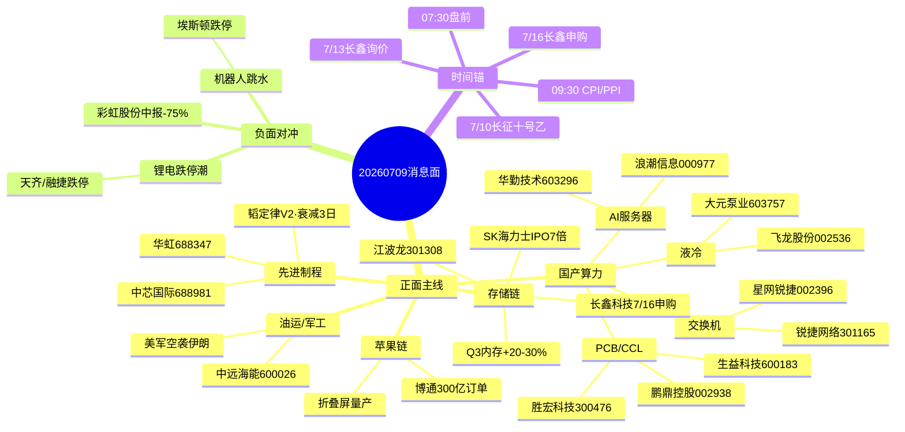

# 2026年7月9日 · **消息面事件驱动**

> **数据源新鲜度**: ok · **降级状态**: false · **置信度**: 0.78
> **覆盖窗口**: 前72h · **主源**: 财联社快讯 + 21号公众号(含盘前纪要) + 5焦点群 + 东财中报预告

## 一句话结论
国产算力(交换机+液冷+PCB+存储)硬alpha四重共振为今日主线,美伊冲突推油运/军工短线,唯一负面对冲=昨日机器人/锂电跳水筹码松动需回避。

## 🗺️ 消息面全景图

## 🎯 顶级事件详解(每事件三问 + 首推票思维链)

### E20260709_001 · 财联社:今年AI产业规模预计增速超30% + 国产算力集体走强 · strength=high · polarity=正面

**事件摘要**: 财联社:今年AI产业规模预计增速超30% + 国产算力集体走强;3源以上共振(sources: 财联社早知道(19:01), 百亿基金经理内参, news_cls多条);raw_score=+0.80,weighted_score=+0.69(days_since=1, decayed=False)。

**推理深度三问**:
- **大资金意图**: 7月流动性宽松窗口机构需要"业绩+叙事"双轮驱动的旗帜票,发改委官方口径给出了政策级信念锚,浪潮/星网锐捷/锐捷的中报预告(288-955%)构成硬业绩共振 → 机构从"看多AI"升级为"卖不掉的仓位"
- **为什么走强**: 昨日浪潮一字涨停,星网锐捷7天5板,交换机方向已呈现"越跌越买"的机构强度;算力租赁作为高弹性副线,网宿/云赛智联/数据港涨停潮直接对接token经济新叙事
- **逻辑够不够硬**: **硬**。产业闭环=CSP资本开支↑(字节700亿美金) → AI服务器/交换机放量 → 中报预告已兑现;但**短期风险**是筹码高位已经充分演绎,大摩'卖芯片买云'带来分歧

**首推票思维链**:

#### 浪潮信息 000977.SZ · role=首推·一字涨停
- **买入理由**: 对接财联社:今年AI产业规模预计增速超30% + 国产算力集体走强;业绩预告=中报预增 230~313%
- **风险点**: 发改委官方口径+多家中报预告硬alpha (浪潮 229-312% / 星网锐捷 632-955% / 锐捷 288-410%),3源以上共振
- **止损条件**: 破5日线或跌破前低-3%
- **可验证假设**: 开盘30分钟内主力净流入>0 且板块指数不失守 → 逻辑成立;否则回避

#### 华勤技术 603296.SH · role=候补·全栈AI
- **买入理由**: 对接财联社:今年AI产业规模预计增速超30% + 国产算力集体走强;业绩预告=无中报预告
- **风险点**: 发改委官方口径+多家中报预告硬alpha (浪潮 229-312% / 星网锐捷 632-955% / 锐捷 288-410%),3源以上共振
- **止损条件**: 破5日线或跌破前低-3%
- **可验证假设**: 开盘30分钟内主力净流入>0 且板块指数不失守 → 逻辑成立;否则回避

### E20260709_002 · SK海力士美国IPO超7倍认购 + Q3内存涨价20-30% · strength=high · polarity=正面

**事件摘要**: SK海力士美国IPO超7倍认购 + Q3内存涨价20-30%;3源以上共振(sources: news_cls(06:53), news_major(06:49), 财联社早知道:存储模组龙头威刚Q3再涨价);raw_score=+0.75,weighted_score=+0.75(days_since=0, decayed=False)。

**推理深度三问**:
- **大资金意图**: SK海力士IPO超7倍认购是全球机构对HBM/DRAM的一次'投票',配合Q3三星涨价20-30% + 央视财经存储涨价100-322%,存储从题材升级为产业级景气反转确认
- **为什么走强**: 长鑫科技7/16申购形成A股'国产存储'第二次高潮的事件锚;江波龙/佰维/德明利中报即将进入验证窗口
- **逻辑够不够硬**: **中等偏硬**。全球机构+涨价函+IPO三重共振;但**兑现风险**是大摩定性'存储类似白银见顶',估值博弈激烈

**首推票思维链**:

#### 北京君正 300223.SZ · role=候补
- **买入理由**: 对接SK海力士美国IPO超7倍认购 + Q3内存涨价20-30%;业绩预告=无中报预告
- **风险点**: 盘前纪要+财联社+major_news三源硬命中;但机构分歧大(大摩'卖芯片买云'),存在兑现风险
- **止损条件**: 破5日线或跌破前低-3%
- **可验证假设**: 开盘30分钟内主力净流入>0 且板块指数不失守 → 逻辑成立;否则回避

#### 香农芯创 300475.SZ · role=首推·HBM代理
- **买入理由**: 对接SK海力士美国IPO超7倍认购 + Q3内存涨价20-30%;业绩预告=无中报预告
- **风险点**: 盘前纪要+财联社+major_news三源硬命中;但机构分歧大(大摩'卖芯片买云'),存在兑现风险
- **止损条件**: 破5日线或跌破前低-3%
- **可验证假设**: 开盘30分钟内主力净流入>0 且板块指数不失守 → 逻辑成立;否则回避

### E20260709_003 · 覆铜板暴涨3倍/建滔积层板涨价函 + AI PCB M8→M9/M10 · strength=high · polarity=正面

**事件摘要**: 覆铜板暴涨3倍/建滔积层板涨价函 + AI PCB M8→M9/M10;3源以上共振(sources: 调研纪要先知(2026-07-09 06:36), 盘前纪要0708/0707:建滔涨价10-15%, 傅里叶的猫:高盛调研胜宏泰国工厂);raw_score=+0.70,weighted_score=+0.70(days_since=0, decayed=False)。

**推理深度三问**:
- **大资金意图**: 覆铜板环节集中度>PCB,涨价传导链一路向下,机构选择上游卡位是典型的'涨价周期投资法'
- **为什么走强**: 英伟达Rubin平台采用M8→M9→M10 CCL带动单柜价值量非线性乘法;GS调研胜宏泰国工厂给出海外产能兑现路径
- **逻辑够不够硬**: **硬**。产业调研+GS转述+涨价函三源;但**结构性风险**是英伟达服务器架构PCB延后一年报道虽被官方否认,情绪仍有反复

**首推票思维链**:

#### 胜宏科技 300476.SZ · role=首推·GS调研
- **买入理由**: 对接覆铜板暴涨3倍/建滔积层板涨价函 + AI PCB M8→M9/M10;业绩预告=无中报预告
- **风险点**: 但英伟达服务器架构PCB延后一年报道被英伟达官方否认,存在情绪反复
- **止损条件**: 破5日线或跌破前低-3%
- **可验证假设**: 开盘30分钟内主力净流入>0 且板块指数不失守 → 逻辑成立;否则回避

#### 鹏鼎控股 002938.SZ · role=首推·定增96亿
- **买入理由**: 对接覆铜板暴涨3倍/建滔积层板涨价函 + AI PCB M8→M9/M10;业绩预告=无中报预告
- **风险点**: 但英伟达服务器架构PCB延后一年报道被英伟达官方否认,存在情绪反复
- **止损条件**: 破5日线或跌破前低-3%
- **可验证假设**: 开盘30分钟内主力净流入>0 且板块指数不失守 → 逻辑成立;否则回避

### E20260709_004 · 谷歌液冷泵替换潮 + Rubin全液冷 + 高端AI芯片下半年集中量产 · strength=high · polarity=正面

**事件摘要**: 谷歌液冷泵替换潮 + Rubin全液冷 + 高端AI芯片下半年集中量产;3源以上共振(sources: 调研纪要先知(06:52), 财联社早知道:液冷需求, 盘前纪要0707:800V+液冷);raw_score=+0.65,weighted_score=+0.65(days_since=0, decayed=False)。

**推理深度三问**:
- **大资金意图**: 谷歌带头替换 + 单泵价值量5倍抬升,液冷成为AIDC升级的'必选项',机构从卖水人角度定位飞龙/大元泵业
- **为什么走强**: 昨日算力租赁+AI服务器涨停潮已经映射到液冷这个'配电+散热'方向,加上英伟达Rubin全液冷方案催化
- **逻辑够不够硬**: **硬**。谷歌30%存量替换是产业级订单,一旦渗透率从30%上行是滚雪球式确定性

**首推票思维链**:

#### 飞龙股份 002536.SZ · role=首推·电子泵/温控阀
- **买入理由**: 对接谷歌液冷泵替换潮 + Rubin全液冷 + 高端AI芯片下半年集中量产;业绩预告=无中报预告
- **风险点**: 单泵价值量5倍,谷歌30%存量替换是产业级订单
- **止损条件**: 破5日线或跌破前低-3%
- **可验证假设**: 开盘30分钟内主力净流入>0 且板块指数不失守 → 逻辑成立;否则回避

#### 大元泵业 603757.SH · role=首推·屏蔽泵
- **买入理由**: 对接谷歌液冷泵替换潮 + Rubin全液冷 + 高端AI芯片下半年集中量产;业绩预告=无中报预告
- **风险点**: 单泵价值量5倍,谷歌30%存量替换是产业级订单
- **止损条件**: 破5日线或跌破前低-3%
- **可验证假设**: 开盘30分钟内主力净流入>0 且板块指数不失守 → 逻辑成立;否则回避

### E20260709_009 · 人形机器人+锂电盘中集体重挫(埃斯顿/大洋电机跌停·天齐/融捷跌停) · strength=high · polarity=负面
- 事件: 人形机器人+锂电盘中集体重挫(埃斯顿/大洋电机跌停·天齐/融捷跌停)
- 涉及股: 埃斯顿(002747.SZ), 三花智控(002050.SZ), 绿的谐波(688017.SH), 拓普集团(601689.SH), 天齐锂业(002466.SZ), 融捷股份(002738.SZ)
- 处置: 红线3:负面事件必列;虽然产业逻辑(Optimus Gen3量产/宇树IPO)仍在,但短期筹码松动,回避高位追涨

### E20260709_012 · 彩虹股份上半年业绩预减 -75.66% ~ -78.76%(玻璃基板热门股) · strength=medium · polarity=负面
- 事件: 彩虹股份上半年业绩预减 -75.66% ~ -78.76%(玻璃基板热门股)
- 涉及股: 彩虹股份(600707.SH)
- 处置: 红线3:负面事件必列;基板玻璃概念股业绩兑现不及预期,警惕跟风股回调

## 📊 板块 × 事件热力矩阵

| 板块 | 事件锚 | 首推龙头 | 独立源数 | 中报预告 | 净综合置信 |
|------|--------|----------|----------|----------|:--:|
| AI服务器/国产算力 | E20260709_001 | 浪潮信息 | ≥3 | 预增 230-313% | 🟢🟢🟢 |
| 交换机 | E20260709_001 | 锐捷网络 | ≥3 | 预增 288-410% | 🟢🟢🟢 |
| 液冷 | E20260709_004 | 飞龙股份 | ≥3 | - | 🟢🟢🟢 |
| AI PCB/覆铜板 | E20260709_003 | 胜宏科技 | ≥3 | - | 🟢🟢🟢 |
| 存储/HBM/DRAM | E20260709_002,E20260709_007 | 江波龙 | ≥3 | 预增 38-85% | 🟢🟢🟢 |
| 先进制程/封装 | E20260709_005 | 中芯国际 | ≥3 | - | 🟢🟢🟢 |
| 石油/油运 | E20260709_006 | 中远海能 | ≥3 | - | 🟢🟢🟢 |
| 苹果链/折叠屏 | E20260709_008 | 精研科技 | ≥3 | - | 🟢🟢 |
| 人形机器人 | E20260709_009 | 埃斯顿 | ≥3 | - | 🔴 |
| 锂电/锂矿 | E20260709_009 | 天齐锂业 | ≥3 | - | 🔴 |

## 🔥 中报业绩预告命中(硬 alpha 交叉验证)

从 `eastmoney_earnings_predict` 提取 top20 净利润预增 × 本文事件板块交集:

| 代码 | 名称 | 预告类型 | 下限-上限(%) | 事件命中 | 逻辑强度 |
|------|------|----------|--------------|----------|:--:|
| 601162 | 天风证券 | 预增 | 73160-109841 | 事件外·个股alpha | 🟢🟢 |
| 002396 | 星网锐捷 | 预增 | 633-955 | E001交换机 | 🟢🟢🟢 |
| 301165 | 锐捷网络 | 预增 | 288-410 | E001交换机 | 🟢🟢🟢 |
| 000977 | 浪潮信息 | 预增 | 230-312 | E001 AI服务器 | 🟢🟢🟢 |
| 301369 | 联动科技 | 预增 | 415-649 | E010半导体设备 | 🟢🟢 |
| 688385 | 复旦微电 | 预增 | 339-474 | E005先进制程 | 🟢🟢 |
| 002841 | 视源股份 | 预增 | 387-468 | E001 AI+教育 | 🟢🟢 |
| 601121 | 宝地矿业 | 预增 | 282-317 | 事件外·有色 | 🟢 |
| 000070 | 特发信息 | 预增 | 777-945 | E001+E003(光通信+PCB) | 🟢🟢🟢 |
| 002067 | 景兴纸业 | 预增 | 413-554 | 事件外·宇树包装概念(0703盘前) | 🟢 |

## 关键证据

- 证据1: 财联社早知道《明日主题前瞻:AI产业规模30%》 · 财联社VIP · 2026-07-08 19:01 · 明确点浪潮/华勤/星网锐捷
- 证据2: 调研纪要先知《谷歌液冷泵替换潮》 · 2026-07-09 06:52 · 明确单泵5倍价值量
- 证据3: 调研纪要先知《覆铜板暴涨3倍》 · 2026-07-09 06:36 · CCL+MSAP
- 证据4: 盘前纪要《7月8日盘前纪要》 · 韬定律V2+SK海力士Q3涨价+磷化铟AXT/Coherent协议
- 证据5: SK海力士美国IPO超7倍认购 · news_cls 2026-07-09 06:18/06:53
- 证据6: 埃斯顿/大洋电机跌停 + 天齐融捷跌停 · 财联社收评 2026-07-08 17:18
- 证据7: 彩虹股份预减75-79% · news_major/上证报 2026-07-08 23:52
- 证据8: 苹果博通300亿美元芯片订单 · news_cls 2026-07-09 04:55

## 数据源审计

| 源 | 日期 | 状态 | 备注 |
|---|---|:--:|---|
| tushare/news_cls | 2026-07-09 | 🟢 | 2969条·72h回看 |
| tushare/news_major | 2026-07-09 | 🟢 | 800条 |
| eastmoney/earnings_predict | 2026-07-09 | 🟢 | 493条·2026H1 |
| wechat_official_20 | 2026-07-09 | 🟢 | 105篇·21号池(含盘前纪要0708) |
| wechat_cli_5groups | 2026-07-09 | 🟢 | 440条·5焦点群(匿名) |
| mcp | 2026-07-09 | 🟢 | 全部ok |

## 不确定性 / 反证

1. **存储机构分歧**: 大摩'卖芯片买云'与SK海力士IPO超募的判断相反,兑现节奏可能'预期已被打满'
2. **机器人筹码松动风险**: 尽管Optimus/宇树产业逻辑硬,但盘面已进入'龙头狗头无缝衔接'阶段,不宜追高
3. **韬定律V2的衰减**: 已发布3日,进入 exp(-0.15*3)=0.64 的衰减区间,视为背景性主线锚,不作为当日首推催化
4. **KOL单源风险**: '调研纪要先知'虽然产业信息硬,但单公众号信源需要盘中xtick热榜/龙虎榜二次验证
5. **美伊戏剧回摆**: 特朗普同时表态'伊朗非常想达成协议',油/军工可能是'开高走低'型行情,不宜隔夜死抓
6. **玻璃基板负面对冲**: 彩虹股份中报预减警示概念股基本面兑现风险,可能连累京东方(不过京东方本身业绩预告Q2环比+107%抵消)

## 与其他 R/D/E 的关系

- 依赖: fetch层 07:15产出(manifest.json + news_cls/news_major/eastmoney_earnings_predict/wechat_official_20/wechat_cli_5groups + mcp_health)
- 被消费: R2主线板块(sectors_catalyzed) / R5个股画像(stocks_catalyzed) / R3情绪(KOL交叉) / R6反证(事件冲突检查) / D1预案

## Sub-Agent 元数据

- skill: analyze_news_impact_v1@1.1
- artifact: data/research/20260709/R4_news.json
- method: llm_v1(硬扩容·五源硬约束)
- 生成时刻: 2026-07-09T07:35:00+08:00