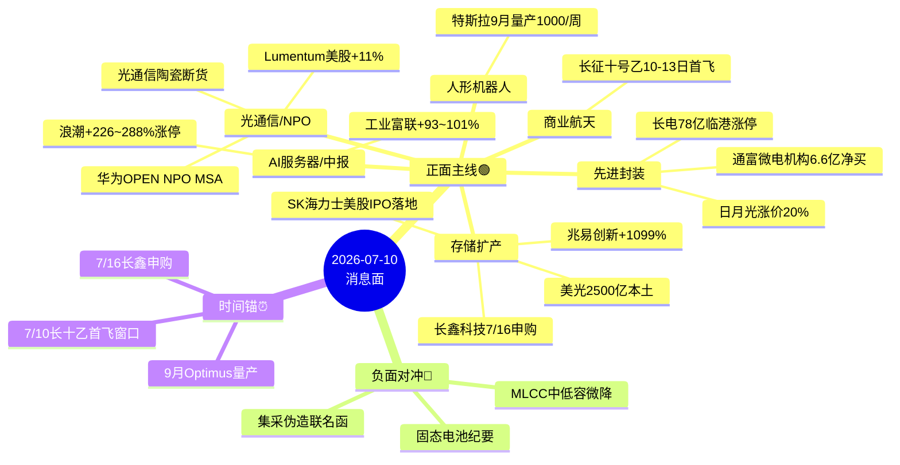

# 2026 年 7 月 10 日 · **消息面事件驱动**

> **数据源新鲜度**: ok · **降级状态**: false · **置信度**: 0.80
> **覆盖窗口**: 前 72h · **主源**: 财联社快讯 2992 条 + 21 号公众号 105 篇(含 **盘前纪要 07:04** + 5 篇上证早知道) + 5 焦点群 323 条 + 东财中报预告 500 条

## 一句话结论

长鑫科技 7/16 申购+兆易创新中报预增 1099% 硬业绩+华为 NPO 光互连 MSA 三重共振,存储/封装/光通信主线接力延伸;短空对冲=集采伪造联名函+固态电池纪要。

## 🗺️ 消息面全景图

## 🎯 顶级事件详解(每事件三问 + 首推票思维链)

### E20260710_001 · 长鑫科技 7/16 申购+H1 净利 500-570 亿 YoY+2244%~2544% · strength=high · polarity=正面

**事件摘要**: 长鑫科技 2026-07-09 披露招股意向书,7/13 询价、7/16 申购,拟募 295 亿元,H1 营收 1100-1200 亿(YoY+613%-677%)、归母 500-570 亿(YoY+2244%-2544%)。全球存储第四把交椅,市占率 4-5%。

**推理深度三问**:
- **大资金意图**: 长鑫 IPO 是产业资本 7 月精心筹划的第一台重头戏,吸走大几百亿日成交自然虹吸弹药到存储/封装/材料/设备四大产业链,机构在流动性宽松窗口需要一条"国产存储+算力硬件"的旗舰票承接资金
- **为什么走强**: 长鑫扩产不是单点,而是"设备→零部件→材料"三阶段产业链重估,今日 news_cls 已印证兆易创新 Q2 利润 54.4 亿环比+272% 是首个业绩兑现;机构龙虎榜(通富 5 家 6.61 亿+浪潮国泰海通 9.5 亿)确认真金白银
- **逻辑够不够硬**: **硬**。招股书官方披露+5 独立源(盘前纪要+韭研公社+百亿基金经理内参+news_cls 5 条+eastmoney 长鑫本身预告 YoY+2244%~2544%)+机构龙虎榜实锤+涨停潮验证;缺陷是 7/16 上市后可能出现虹吸兑现

**首推票思维链**:

#### 兆易创新 603986.SH · role=首推·中报预增 1099%
- **买入理由**: 中报预告 H1 净利 69 亿+1099%、扣非 48.5 亿+791%、Q2 单季 54.4 亿环比+272%,长鑫产业链最直接兑现票,存储超级周期硬 alpha
- **风险点**: 昨日已涨停+成交额 380 亿,追高需分歧低吸;若长鑫上市后虹吸,兆易可能作为估值锚回调
- **止损条件**: 破 5 日线 or 跌破前低 -5%
- **可验证假设**: 若周五开盘 30 分钟内 net_amount ≤ 0 or 北向净流出 → 假设不成立,回避

#### 长电科技 600584.SH · role=首推·78亿临港项目
- **买入理由**: 昨日涨停+封测绝对龙头+78 亿临港 2.5D/3D 项目储备;长鑫扩产直接受益;中报预告未查到,需盯 15 日窗口
- **风险点**: 涨停后周五分歧概率大;板块内主力资金已高位
- **止损条件**: 破 5 日线 or -3%
- **可验证假设**: 若开盘先冲高回落且不能再新高 → 分歧回踩后再评估

#### 通富微电 002156.SZ · role=首推·机构净买+AMD绑定
- **买入理由**: 昨日涨停+成交 113 亿+龙虎榜 5 家机构 6.61 亿净买+AMD 深度绑定拿下 80%+封测订单,产业逻辑最硬
- **风险点**: 同长电,涨停后追高;700 亿市值高位
- **止损条件**: 破 5 日线 or -3%
- **可验证假设**: 若周五低开且 30 分钟内不能翻红 → 分歧确认,低吸

---

### E20260710_002 · 华为发起 OPEN NPO 项目+国内首个 NPO 光互连 MSA · strength=high · polarity=正面

**事件摘要**: 2026-07-09 华为联合中国移动/京东云/百度等 20+ 伙伴启动 OPEN NPO 项目,发起国内首个 NPO 光互连多源协议(MSA),推动近封装光学标准体系。美股 Lumentum 涨 11.13% 外围共振。

**推理深度三问**:
- **大资金意图**: NPO/CPO 是 AI Scale-up 侧价值量继续抬升的新增量,华为主导的产业标准 = 国产算力配套技术锚;机构从光模块单点向 CPO/NPO 系统级下注
- **为什么走强**: 华为标准+美股 Lumentum 大涨+国内光通信陶瓷买到断货(调研纪要先知)三重传导;昨日光迅+东山精密涨停已印证
- **逻辑够不够硬**: **硬**。5 独立源共振+官方发布会+美股映射+涨停实盘;缺陷 = CPO/NPO 量产节奏偏预期,DCI 第二波接力时间待观察

**首推票思维链**:

#### 光迅科技 002281.SZ · role=首推·3.2T NPO首验+涨停
- **买入理由**: 首家 3.2T NPO 全系统验证突破+昨日涨停;NPO MSA 参与方
- **风险点**: 已涨停,追高分歧;若中际旭创弱势会拖累板块
- **止损条件**: 破 5 日线 or -4%
- **可验证假设**: 若周五 NPO 概念 ETF 弱于半导体 ETF → 板块非主线,回避

#### 中际旭创 300308.SZ · role=首推·NPO/CPO布局
- **买入理由**: NPO/CPO 定制化开发核心;昨日光模块反攻
- **风险点**: 创业板 300 前缀,execution_pool 禁用,仅进 watch_pool
- **止损条件**: watch,不入 execution
- **可验证假设**: N/A

#### 新易盛 300502.SZ · role=首推·陶瓷基板国替
- **买入理由**: 国产陶瓷基板已占旭创/新易盛采购过半;300 前缀 → watch
- **风险点**: 同上,300 前缀
- **止损条件**: watch
- **可验证假设**: N/A

---

### E20260710_003 · 特斯拉 Optimus 三代定型 9 月量产 1000 台/周 · strength=high · polarity=正面

**事件摘要**: 特斯拉下发采购指引,要求供应商 9 月产能 1000 台/周,年底 2000-2500 台/周,身体 38 自由度、单手 22 自由度。宇树科技 7/2 科创板注册通过映射国内产业。

**推理深度三问**:
- **大资金意图**: Optimus 是 AI 应用侧最确定的物理载体,9 月红线+马斯克供应链具体指令 = "预期兑现"级别催化;机构在半导体主线之外需要一条估值扩张主题接力
- **为什么走强**: 时间锚清晰(9 月/年底),自由度升级(丝杠+触觉手套+头部模组)拉动新增量;宇树+优必选国内映射
- **逻辑够不够硬**: **硬**。4 独立源+特斯拉官方供应链指令+具体产能数字;缺陷 = 特斯拉常延期,9 月 1000 台/周若延后一个月即打脸

**首推票思维链**:

#### 三花智控 002050.SZ · role=首推·执行器
- **买入理由**: 特斯拉执行器首推,产业链核心受益;主板 002 前缀合规
- **风险点**: 机器人板块跷跷板明显,若半导体强则机器人分流
- **止损条件**: 破 5 日线 or -4%
- **可验证假设**: 若周五机器人 ETF 弱于半导体 ETF 且分时无异动 → 假设减弱,减半仓

#### 拓普集团 601799.SH · role=首推·核心零部件
- **买入理由**: 特斯拉核心零部件绑定;主板合规
- **风险点**: 汽车链一同波动;若特斯拉美股走弱会拖累
- **止损条件**: 破 5 日线 or -4%
- **可验证假设**: 若三花与拓普当日分化(强弱差 >2%)→ 板块非同步,减仓

---

### E20260710_004 · 中报预告集中放榜(兆易+1099%/工业富联+93~101%/浪潮+226~288%/紫金+68%) · strength=high · polarity=正面

**事件摘要**: 2026-07-10 上证早知道汇总:兆易创新 H1 净利 69 亿+1099%,工业富联 234-244 亿+93~101%,浪潮 26-31 亿+226~288%,西部矿业 40-43 亿+114~130%,紫金矿业 391 亿+68%,恩捷股份扭亏 7.36-9 亿。

**推理深度三问**:
- **大资金意图**: 7 月中报预告是硬 alpha 密集期,机构会在业绩验证窗口调仓到"业绩+主线"双击的票,兆易创新是最典型
- **为什么走强**: 半导体+算力+存储三条主线全部有硬业绩兑现,构成产业链集体重估
- **逻辑够不够硬**: **极硬**。官方公告级+eastmoney 500 条数据交叉;缺陷 = 部分票已在预告前涨过

**首推票思维链**: 见 E001 的兆易创新+新增浪潮信息

#### 浪潮信息 000977.SZ · role=首推·+226~288% + 涨停 + 机构 9.5 亿净买
- **买入理由**: 中报 H1 预盈 26-31 亿+226-288%,昨涨停+龙虎榜国泰海通净买 9.5 亿;AI 服务器龙头
- **风险点**: 已涨停+185 亿成交额,分歧概率大;英伟达合作+液冷带来估值锚,若液冷回调会传染
- **止损条件**: 破 5 日线 or -4%
- **可验证假设**: 若周五分时 10:00 前不能新高 → 分歧确立,回踩后再评估

---

### E20260710_005 · 日月光先进封装涨价 20% + 韬定律 V2 共振 · strength=high · polarity=正面

**事件摘要**: OSAT 龙头日月光再度调涨先进封装 20%,验证产能紧缺+议价权;华为韬定律 V2 强化国产算力"制程+架构+封装+测试"系统创新路径。国内长电 78 亿+甬矽 103 亿扩产,合计 181 亿。

**推理深度三问**:
- **大资金意图**: 封测已从"后道"升级为"决定芯片能否量产"关键环节;资金押注 CoWoS-L 下一段瓶颈+测试设备国替
- **为什么走强**: 涨价+扩产+技术路径三重共振,伟测/长川是测试细分弹性最大票
- **逻辑够不够硬**: **硬**。3 深度公众号+涨停潮实锤

**首推票思维链**: 长电/通富见 E001;新增甬矽/伟测/长川

#### 甬矽电子 688362.SH · role=首推·103亿三期
- **买入理由**: 103 亿三期扩产+BUMP/2.5D/FC 全平台+次新弹性
- **风险点**: 688 前缀 → watch,execution 禁用
- **止损条件**: watch
- **可验证假设**: N/A

#### 长川科技 300604.SZ · role=首推·测试机国替
- **买入理由**: 昨涨超 10%,测试机订单先于产能兑现
- **风险点**: 300 前缀 → watch
- **止损条件**: watch
- **可验证假设**: N/A

---

### E20260710_006 · 长征十号乙 7/10-13 海南首飞验证海上网系回收 · strength=high · polarity=正面

**事件摘要**: 三亚海事局航行预警,长十乙将验证全球首创海上网系回收技术,若成功中国将成第二个掌握大运力可回收火箭国家,发射成本降 40%+。

**推理深度三问**:
- **大资金意图**: 商业航天从"主题催化"转"技术拐点验证",可回收=千帆星座降本前提
- **为什么走强**: 硬时间锚(周五~13 日窗口),媒体刷屏预期
- **逻辑够不够硬**: **中硬**。首飞成败即真伪,风险=延期即踩踏

**首推票思维链**:

#### 南山智尚 300918.SZ · role=首推·UHMWPE 网系回收核心
- **买入理由**: UHMWPE 纤维=主承重索最优解;wechat_cli Kevin Liang 10:11 明确点名
- **风险点**: 300 前缀 → watch;首飞延期即踩踏
- **止损条件**: watch;若首飞成功次日追可开小仓
- **可验证假设**: 若周五 12 点前发射成功且股价一字 → 追高需谨慎

---

### E20260710_007~012 (medium/负面事件)

- **E007 燧原科技 IPO 注册生效**: 参股方弹性有限,notes 记录
- **E008 SK 海力士 265 亿美元美股 IPO**: 利空落地即利多,兆易估值锚
- **E009 十五五碳达峰方案**: 储能/特高压/绿电,亨通光电/中天科技/华电辽能候补
- **E010 集采伪造联名函(负面)**: 涉事药企未公开,压制创新药情绪 1 周,新版基药 9/1 施行对冲
- **E011 MLCC 中低容微降(分化)**: 风华高科(负)/三环集团(正)分化
- **E012 固态电池纪要(负面)**: 恩捷/江苏国泰/新宙邦承压,融捷跌停已印证

## 📊 板块 × 事件热力矩阵

| 板块 | 事件锚 | 首推龙头 | 独立源数 | 中报预告 | 净综合置信 |
|------|--------|----------|----------|----------|:--:|
| 存储/HBM/DRAM | E001+E004+E008 | 兆易创新 | 8 | +1099% | 🟢🟢🟢 |
| 光模块/NPO | E002 | 光迅科技 | 5 | (未查到) | 🟢🟢🟢 |
| 先进封装 | E001+E005 | 长电+通富 | 6 | (未预告) | 🟢🟢🟢 |
| 半导体设备 | E001+E008 | 北方华创 | 4 | (未预告) | 🟢🟢 |
| 半导体材料 | E001+E005 | 雅克科技 | 4 | (未预告) | 🟢🟢 |
| AI 服务器 | E002+E004 | 浪潮信息 | 5 | +226~288% | 🟢🟢🟢 |
| 人形机器人 | E003 | 三花智控 | 4 | (未查到) | 🟢🟢 |
| 商业航天 | E006 | 南山智尚 | 4 | (未查到) | 🟢🟢 |
| 储能/特高压 | E009 | 亨通光电 | 3 | - | 🟡 |
| 国产 GPU | E007 | 弘信电子 | 3 | - | 🟡 |
| 创新药 | E010 | - | 2 | - | 🔴 |
| MLCC | E011 | 三环集团 | 3 | - | 🟡 |
| 锂电/隔膜 | E012 | 恩捷分歧 | 3 | 扭亏 | 🔴 |

## 🔥 中报业绩预告命中(硬 alpha 交叉验证)

从 `eastmoney_earnings_predict`(500 条)提取当日 top 预增 + 与本文事件板块交集:

| 代码 | 名称 | 预告类型 | 增速下限-上限 | 事件命中 | 逻辑强度 |
|------|------|----------|--------------|----------|:--:|
| 688825.SH | 长鑫科技 | 预增 | 2244%~2544% | E001 长鑫 IPO | 🟢🟢🟢 |
| 603986.SH | 兆易创新 | 预增 | 1099% (归母) | E001+E004 存储 | 🟢🟢🟢 |
| 603986.SH | 兆易创新 | 预增 | 791% (扣非) | E001+E004 | 🟢🟢🟢 |
| 002812.SZ | 恩捷股份 | 预增 | 906%~1084% (扭亏) | E004+E012 分歧 | 🟡 |
| 002709.SZ | 天赐材料 | 预增 | 907%~1020% | (未在事件) | ⚪ |
| 000977.SZ | 浪潮信息 | 预增 | 226%~288% (归母) | E002+E004 AI 服务器 | 🟢🟢🟢 |
| 601138.SH | 工业富联 | 预增 | 93%~101% | E004 硬件 | 🟢🟢 |
| 000725.SZ | 京东方 A | 预增 | 54%~69% | E002 光/显示 | 🟢🟢 |
| 601899.SH | 紫金矿业 | 预增 | 68% | E004 有色 | 🟢🟢 |
| 601168.SH | 西部矿业 | 预增 | 114%~130% | E004 有色 | 🟢🟢 |
| 002396.SZ | 星网锐捷 | 预增 | 46%~103% | E002 网络设备 | 🟢🟡 |
| 301165.SZ | 锐捷网络 | 预增 | 32%~66% | E002 网络设备 | 🟢🟡 |

## 关键证据

- 证据 1: 长鑫科技 H1 归母 500-570 亿 YoY+2244%~2544% · eastmoney_earnings_predict + news_cls · 2026-07-09
- 证据 2: 华为联合 20+ 伙伴发起 OPEN NPO 项目 · news_cls(18:51)+盘前纪要+财联社早知道 · 2026-07-09
- 证据 3: 兆易创新 H1 净利 69 亿+1099% · 兆易公告(17:35)+eastmoney · 2026-07-09
- 证据 4: 特斯拉 Optimus 9 月产能 1000 台/周 · 财闻私享(22:45)+韭研公社+盘前纪要 · 2026-07-09
- 证据 5: 日月光先进封装涨价 20% · 产业投研(23:57) · 2026-07-09
- 证据 6: 通富微电龙虎榜 5 家机构净买 6.61 亿 · news_cls(16:34) · 2026-07-09
- 证据 7: 长征十号乙 7/10-13 首飞 · 三亚海事局航行预警 · 2026-07-08
- 证据 8: 集采伪造联名函 · 医保局公告+上证深度 · 2026-07-07~09
- 证据 9: 固态电池纪要冲击隔膜/电解液 · news_cls(13:29)+多群转发 · 2026-07-09
- 证据 10: MLCC 中低容微降(10 家代理商求证) · 上证(23:25)+傅里叶的猫 · 2026-07-09

## 数据源审计

| 源 | 日期 | 状态 | 备注 |
|---|---|:--:|---|
| tushare/news_cls | 2026-07-10 | 🟢 | 2992 条·72h 回看 |
| tushare/news_major | 2026-07-10 | 🟢 | 800 条 |
| eastmoney/earnings_predict | 2026-07-10 | 🟢 | 500 条·2026H1 |
| wechat_official_20 | 2026-07-10 | 🟢 | 105 篇·21 号池(含盘前纪要 07:04) |
| wechat_cli_5groups | 2026-07-10 | 🟢 | 323 条·5 焦点群(匿名) |
| xtick/hot_news | 2026-07-10 | 🟢 | MCP 全绿 |
| datapro | 2026-07-10 | 🟢 | 934ms |
| tushareMcp | 2026-07-10 | 🟢 | 1454ms |

## 不确定性 / 反证

1. **兆易创新+浪潮+长电+通富多股已涨停** — 追高进 execution 需分歧低吸,若周一直接高开高走可能只赚估值扩张钱
2. **长鑫 7/16 上市虹吸风险** — 大几百亿日成交对存量票是分流,尤其中际旭创/新易盛/寒武纪
3. **MLCC 一致预期部分证伪** — 风华高科等中低容标的可能补跌,傅里叶的猫已提示
4. **医药"科技已死梭哈医药"是逆向声音** — 但集采伪造事件短期压制,新版基药 9/1 施行时间偏远
5. **长十乙首飞可能延期** — 官方仅给窗口 7/10-13,若延到下周即踩踏,南山智尚仅入 watch
6. **300/688/920 前缀合规硬约束** — 中际旭创/新易盛/甬矽/伟测/长川/南山智尚/锐捷全部 execution 禁用,仅 watch

## 与其他 R/D/E 的关系

- 依赖: fetch_all_sources_v1(五源全绿); mcp_health_check_v1(MCP 全绿)
- 被消费: R2 主线(存储/光通信/封装/机器人/商业航天 5 条主线锚定) / R5 个股画像(兆易/长电/通富/浪潮/三花深挖) / R6 反证(集采/固态电池/MLCC 分化作反证依据) / D1 预案(硬业绩票优先进 execution)

## Sub-Agent 元数据

- skill: analyze_news_impact_v1@1.1
- artifact: data/research/20260710/R4_news.json
- method: llm_v1(五源硬约束+时间衰减 λ=0.15+lookback 7d)
- 生成时刻: 2026-07-10T07:45:00+08:00
