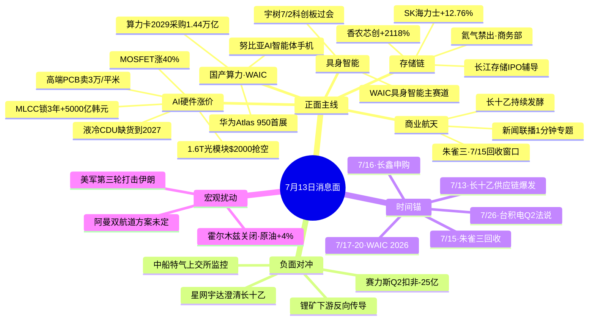

# 7月13日(周一) · **消息面事件驱动**

> **数据源新鲜度**: partial(盘前纪要周末缺席,其余五源全绿) · **降级状态**: false · **置信度**: 0.78
> **覆盖窗口**: 前 72h(周五盘后~周日晚) · **主源**: 财联社快讯 2911 条 + 21 号公众号(周末专场,调研纪要先知×5 篇周日晨发) + 5 焦点群 + 东财中报预告 500 条 + 东财周末专场 yjyg

## 一句话结论
本周首日消息面 = 存储主线三重共振(氦气禁出+海力士上市+香农芯创+2118%)+ WAIC 7/17 华为 Atlas 950 硬时间锚,负面对冲为赛力斯 Q2 扣非亏 22-25 亿明星股暴雷。

## 🗺️ 消息面全景图

## 🎯 顶级事件详解(每事件三问 + 首推票思维链)

### E20260713_001 · 商务部+海关总署氦气临时禁止出口 · strength=high · polarity=正面

**事件摘要**: 2026-07-12 商务部+海关总署联合公告,对氦气实施临时禁止出口管理。氦气是晶圆/存储/激光/低温制冷关键气体,国内自给率不足 5%,主要依赖俄罗斯(出口管制中)+卡塔尔(霍尔木兹被锁)进口。5 独立源共振。

**推理深度三问**:
- **大资金意图**: 这是"反制日韩+保国内存储扩产"的双重供给端硬信号,与长鑫 7/16 申购、长江存储 IPO 辅导第一期披露形成产业政策闭环。资金意图 = 借"卡脖子反制"叙事一次性抬升国产电子特气板块的估值锚。
- **为什么走强**: 氦气叙事与主线(存储扩产)完全同频,同时又是"低位品种"(此前无爆发),满足了"主线扩散+补涨主龙头"的双重条件;上周有研硅涨停+进入上交所监控名单,说明资金已提前埋伏部分品种。
- **逻辑够不够硬**: **硬**。政策级信号(部委级公告)+ 供给端硬缺口 + 存储主线共振 + 涉事标的稀缺(华特气体/中船特气/凯美特气就是核心几只);缺陷是中船特气已在上交所监控名单,追涨可能被点名。

**首推票思维链**:

#### 华特气体 688268 · role=电子特气龙头
- **买入理由**: 氦气自主可控唯一涵盖分离+提纯全链条的稀缺标的;电子特气龙头正股;不在上交所监控名单
- **风险点**: 若周一直接一字/涨停开盘,溢价已被抢完;须看竞价情绪
- **止损条件**: 破 5 日线 -3% 或竞价溢价 >7% 但半日不能封板则减仓
- **可验证假设**: 开盘 30 分钟内主力净流入 ≥ 3000 万 + 板块内 ≥5 只跟涨,假设成立

#### 中船特气 688669 · role=电子特气(带监控标签)
- **买入理由**: 特气纯品种;氦气纯化能力最强
- **风险点**: 已被上交所监控异常波动,追涨风险显著上升
- **止损条件**: 若开盘冲高即卖或不参与首日,等分歧再入
- **可验证假设**: 若不被点名披露 → 二次给入场机会

### E20260713_002 · 美军对伊朗一周内第三轮打击+霍尔木兹关闭 · strength=high · polarity=正面(对油气/油运/军工)

**事件摘要**: 2026-07-12 05:00-08:00,美军中央司令部对伊朗南部布什尔、贾斯克港等多地发动本周第三轮打击;伊朗革命卫队宣布关闭霍尔木兹海峡直至美停止干涉;原油暗盘涨 4% 逼近 $80。阿曼提议"双航道"方案未最终敲定。

**推理深度三问**:
- **大资金意图**: A 股主流资金**仍在科技主线**,此事件不会改变主叙事,但会给油运+军工+黄金短期避险资金分流;这是"背景变量",不是"主叙事"。
- **为什么走强**: 油运是弹性最高细分,VLCC 运价对海峡通行敏感;军工是"复仇预期"催化;黄金是滞胀预期。
- **逻辑够不够硬**: **中等偏软**。海峡关闭是伊朗多次演绎的老剧本(去年已发生 3 次),市场脱敏度高;若无 21+ 硬升级(如以色列入场/沙特介入)不足以持续。周一开盘可能高开低走。

**首推票思维链**:

#### 中远海能 600026 · role=VLCC 油运弹性最高
- **买入理由**: VLCC 运价对霍尔木兹敏感度最高;A 股油运纯度最高
- **风险点**: 若周一美伊突然缓和(阿曼双航道敲定),则一字回落
- **止损条件**: 破 5 日线 或 布伦特跌回 $75 以下
- **可验证假设**: 若布伦特周一维持 $78+ 且盘中海峡未重开,持仓

### E20260713_003 · SK 海力士 ADR +12.76%+存储短缺延续至下一个十年 · strength=high · polarity=正面

**事件摘要**: 2026-07-11 SK 海力士美股 ADR 首日大涨 12.76%(总市值 1.25 万亿美元);SK 海力士 CEO 郭鲁正预告 2027 存储短缺创史上最严峻+延续至下一个十年;长江存储 IPO 辅导第一期披露(中信+中信建投 31 人)。

**推理深度三问**:
- **大资金意图**: 全球存储产业估值锚被 SK 上市重新锚定;A 股存储 = 全球最大扩产窗口+估值最便宜洼地,机构无法不加仓
- **为什么走强**: 香农芯创 H1+2118-2434% 是硬业绩兑现;长江存储 IPO 辅导对应下半年新一轮 IPO 窗口;兆易创新继续吃扩产红利
- **逻辑够不够硬**: **硬**。上市公告(官方)+ CEO 采访(官方)+ 中报预告(官方)+ 长江存储辅导报告(证监会官方)四重官方源

**首推票思维链**:

#### 香农芯创 300475 · role=存储代理龙头+业绩最猛
- **买入理由**: H1 归母净利 +2118-2434%(21.73-26.73 亿);存储代理业务直接受益 SK 海力士上市定价上修;7/13 消息面共振
- **风险点**: 上周五已有较大涨幅,若开盘一字则错过;股价已在高位区
- **止损条件**: 破 5 日线 或 单日回撤 >8%
- **可验证假设**: 开盘 30 分钟机构净买 >1 亿 → 假设成立

#### 兆易创新 603986 · role=存储主线最正股
- **买入理由**: H1+1099%(硬业绩) + 氦气受益 + 长鑫产业链 + SK 锚 三重共振
- **风险点**: 前期涨幅已大,分歧时可能杀波段
- **止损条件**: 破 10 日线
- **可验证假设**: 若板块内其余存储股(北方华创/长电/通富)同步走强 = 主线延续

### E20260713_004 · WAIC 2026(7/17-20)华为 Atlas 950 首展 · strength=high · polarity=正面

**事件摘要**: 上海证券报报道 2026-WAIC 于 7/17-20 在上海举办,300+ 产品全球首发,华为 Atlas 950 SuperPoD(1024 卡)真机首展,近存计算 3D 芯片新品发布,努比亚全球首款 AI 智能体手机首秀。9 位图灵/诺贝尔奖得主参会,姚期智任 WAIC Academic 大会主席。

**推理深度三问**:
- **大资金意图**: 机构在 7 月流动性宽松窗口需要 1 条"5-10 年确定性"的国产算力旗帜叙事,WAIC 是本月最大的产业级催化,资金意图 = "预期发酵+落地共振"两段行情
- **为什么走强**: 华为 Atlas 950 是国产算力 DS 时刻候选;近存计算 3D 芯片指向先进封装+混合键合;努比亚 AI 智能体手机是端侧 AI 全球首款
- **逻辑够不够硬**: **硬**。硬时间锚 7/17 + 上海证券报深度报道 + 6 独立源 + 国泰海通策略定性;缺陷是 WAIC 前预期发酵充分,若产品未超预期存在"卖预期"风险

**首推票思维链**:

#### 中兴通讯 000063 · role=努比亚 AI 智能体手机首秀主体
- **买入理由**: 努比亚 = 中兴子品牌,全球首款 AI 智能体手机 7/17 首秀,是 WAIC 端侧 AI 唯一"产品级硬催化"标的
- **风险点**: 若首秀产品未超预期(重蹈魅族/华为等前车),事件驱动逻辑破坏
- **止损条件**: 7/17 首秀后 -5% 无量反抽即出
- **可验证假设**: 若倪飞在 WAIC 前(7/13-7/16)有微博/公告放大信息量 → 假设增强

#### 科大讯飞 002230 · role=大模型全栈+全国产算力
- **买入理由**: 星火大模型基于国产算力,WAIC 主秀之一;主线内正股
- **风险点**: 大模型开源竞争激烈,单纯预期不足以支持独立行情
- **止损条件**: 破 20 日线
- **可验证假设**: 若周内讯飞公告新一代大模型 → 强化

### E20260713_005 · 长十乙首飞持续发酵+朱雀三 7/15 回收窗口 · strength=high · polarity=正面

**事件摘要**: 长征十号乙 7/10 首飞海上网系回收成功,新闻联播罕见 1 分钟专题+央视财经+外媒热议;中国成为唯二回收成功国家;朱雀三 7/15 第二次回收验证;星网宇达周日晚公告澄清"未参与长十乙"(异动股)。

**推理深度三问**:
- **大资金意图**: 商业航天从"概念"进入"产业化里程碑",资金已在周五爆发+周末发酵二次共振;这是"半年一遇"的宏伟叙事
- **为什么走强**: 新闻联播 1 分钟报道 = 官方定调+高规格背书;朱雀三 7/15 硬时间锚;星网宇达澄清恰恰筛选出真受益标的
- **逻辑够不够硬**: **硬**。官方定调 + 外媒确认 + 硬时间锚 + KOL 集体共振;缺陷是航天板块普涨后,后续需要"个股筛选"环节

**首推票思维链**:

#### 南山智尚 300918 · role=UHMWPE 网系回收核心供应商
- **买入理由**: 首飞回收网系材料唯一确定性供应商;技术护城河高;已在盘前纪要+韭研公社点名
- **风险点**: 前期已启动,追高溢价高;若朱雀三 7/15 延期风险则杀
- **止损条件**: 破 5 日线 -5% 或 竞价溢价 >8%
- **可验证假设**: 竞价溢价 3-6% + 主力净流入 >2000 万

#### 航天电子 600879 · role=商业航天正股
- **买入理由**: 首推商业航天龙头
- **风险点**: 涨幅已大,机构定价可能已充分
- **止损条件**: 破 5 日线
- **可验证假设**: 若朱雀三 7/15 前有更多产业消息渗透

### E20260713_006 · 调研纪要先知 5 篇周日晨报共振·AI 硬件涨价全链条 · strength=high · polarity=正面

**事件摘要**: 调研纪要先知 2026-07-12 06:35~07:53 连发 5 篇: MLCC(英伟达 5000 亿韩元锁 3 年,涨 12-30%)/高端 PCB(3 万/平米,是传统 3 倍)/1.6T 光模块($2000 抢空,订单排 2027)/液冷 CDU(缺货到 2027,单机 $15 万)/低压 MOSFET(涨 30-40%)。傅里叶的猫黄仁勋大摩会议纪要+沧海自流"1.6T 落定 2.4T 排期"共振。

**推理深度三问**:
- **大资金意图**: 从"炒涨价"到"炒扩产"的过渡叙事,调研纪要先知连发 5 篇是"KOL 集中打包出货"信号,但底层产业逻辑仍然扎实
- **为什么走强**: 5 环节涨价共振 = AI 硬件全链条兑现;风华高科 Q2+104-138% 是 MLCC 硬业绩兑现;英伟达锁 3 年是终极产业信仰
- **逻辑够不够硬**: **硬**。5 篇产业访谈+英伟达非融资路演纪要;缺陷是福总"涨价开始反噬"警告已发出,韩国截留产业链现金流的模式不可持续

**首推票思维链**:

#### 沪电股份 002463 · role=AI PCB 高端龙头(3 万/平米)
- **买入理由**: 高端 MSAP 工艺唯一大规模量产的 A 股龙头;单价 3 倍于传统;良率打通有先发优势
- **风险点**: 新增产能 2027Q1 才逐步释放,短期已在预期中
- **止损条件**: 破 10 日线
- **可验证假设**: 若周内有大单公告 → 强化

#### 风华高科 000636 · role=MLCC + Q2 硬业绩
- **买入理由**: Q2 单季环比 +104-138%,MLCC 英伟达锁 3 年+主线共振
- **风险点**: 中低容 MLCC 一致预期已部分证伪
- **止损条件**: 破 5 日线
- **可验证假设**: 若板块内三环集团/顺络电子跟涨

### E20260713_007 · 周末中报预告集群硬 alpha · strength=high · polarity=正面

**事件摘要**: 爱在冰川同学周日 22:26 汇总,叠加东财 earnings_predict 500 条+周末专场:香农芯创 +2118-2434%/翔鹭钨业 +2348-3436%/中矿资源 +1078-1302%/融捷股份 +957-1192%/风华高科 Q2 环比 +104-138%/紫光股份 +84-123%/信德新材 +562-664%/方正科技 +196-265%。

**推理深度三问**:
- **大资金意图**: 硬 alpha 密度极高是本周最强的"业绩兑现型"催化,机构会集中买入超预期+主线相关的品种,弃锂择电
- **为什么走强**: 存储/MLCC/钨/ICT/PCB 五条主线均有硬业绩,与前面 6 个事件形成"业绩+主线"叉乘
- **逻辑够不够硬**: **硬**。业绩预告是官方公告级,是"事实"而非"预期";但需注意融捷股份 7/10 已二连跌停,不代表下游锂电继续跟涨

**首推票思维链**:

#### 翔鹭钨业 002785 · role=钨价 +2348-3436%
- **买入理由**: 钨作为小金属景气+关联半导体切削和军工;业绩最猛之一
- **风险点**: 前期已启动,追高风险;小市值波动大
- **止损条件**: 破 5 日线 -5%
- **可验证假设**: 钨精矿现货价维持 30 万+/吨

#### 紫光股份 000938 · role=ICT 算力
- **买入理由**: H1+84-123%,人工智能算力需求爆发驱动 ICT
- **风险点**: 权重股弹性有限
- **止损条件**: 破 20 日线
- **可验证假设**: 若 WAIC 期间华为超节点催化 ICT 主线

### E20260713_008 · 赛力斯 Q2 扣非亏损 22-25 亿明星股暴雷 · strength=high · polarity=负面 · **唯一硬负面事件**

**事件摘要**: 赛力斯 Q2 扣非归母亏 22-25 亿,H1 由盈转亏(Q1 盈利 7 亿+);问界 Q2 亏近 20 亿(销量 +5.6% 但成本上涨+价格战+计提减值);从最高点回撤 65% 变为过气老登。

**推理深度三问**:
- **大资金意图**: 明星股杀业绩会形成"业绩爆雷 → 情绪面下行"的连锁反应,新能源车板块估值锚被下移
- **为什么走弱**: 上游锂矿+存储涨价传导至整车 → 价格战下无法转嫁 → 越卖越亏;这是"上游涨价的反噬第一枪"
- **逻辑够不够硬**: **硬**。业绩预告是官方公告;但需注意这是个股问题(问界)还是行业问题,建议只对赛力斯本股负面,对比亚迪等其他新能源车中性

**首推票思维链**(负面对冲):

#### 赛力斯 601127 · role=直接负面
- **风险点**: Q2 扣非 -22 到 -25 亿超预期负面;可能连续跌停
- **观察假设**: 若周一开盘 -7% 至 -10% 且无护盘 → 未来 3 日或继续下探

#### 中矿资源/融捷股份等锂盐股
- **观察假设**: 上游锂矿短期业绩兑现,但下游车企亏损会向上传导;需盯梢锂盐股是否借业绩利好高开低走

## 📊 板块 × 事件热力矩阵

| 板块 | 事件锚 | 首推龙头 | 独立源数 | 中报预告 | 净综合置信 |
|------|--------|----------|----------|----------|:--:|
| 存储/HBM/DRAM | E001+E003+E007 | 兆易创新/香农芯创 | 12+ | 兆易+1099%/香农+2118% | 🟢🟢🟢 |
| 半导体材料/特气 | E001 | 华特气体/中船特气 | 5 | — | 🟢🟢🟢 |
| 国产算力/华为链 | E004 | 中兴通讯/科大讯飞 | 6 | 紫光股份+84-123% | 🟢🟢🟢 |
| AI 硬件涨价链(MLCC/PCB/光模块/液冷/功率) | E006+E007 | 沪电/风华高科/中际旭创 | 8 | 风华 Q2+104-138% | 🟢🟢🟢 |
| 商业航天 | E005 | 南山智尚/航天电子 | 7 | 中国卫星扭亏 | 🟢🟢 |
| 具身智能/人形机器人 | E004 | 三花智控/双环传动 | 6 | — | 🟢🟢 |
| 石油/油运/军工/黄金 | E002 | 中远海能/招商轮船 | 6 | 紫金+68% | 🟢🟡 |
| 创新药/中医药 | E007 | (待 R2 筛选) | 3 | — | 🟢🟡 |
| 整车/新势力/锂电 | E008 | — | 4 | 赛力斯 Q2 巨亏 | 🔴 |

## 🔥 中报业绩预告命中(硬 alpha 交叉验证)

从 eastmoney_earnings_predict + 周末专场提取当日 top 预增,与本文事件板块交集:

| 代码 | 名称 | 预告类型 | 增速下限-上限 | 事件命中 | 逻辑强度 |
|------|------|----------|--------------|----------|:--:|
| 300475.SZ | 香农芯创 | 预增 | 2118-2434% | E003 存储+E007 硬 alpha | 🟢🟢🟢 |
| 002785.SZ | 翔鹭钨业 | 预增 | 2348-3436% | E007 钨小金属 | 🟢🟢🟢 |
| 002738.SZ | 中矿资源 | 预增 | 1078-1302% | E007 锂盐 + E008 反向传导 | 🟢🟡 |
| 002647.SZ | 融捷股份 | 预增 | 957-1192% | E007+7/10 已二连跌停 | 🟡 |
| 000636.SZ | 风华高科 | 预增 Q2 | Q2 环比+104-138% | E006 MLCC + E007 硬 alpha | 🟢🟢🟢 |
| 000938.SZ | 紫光股份 | 预增 | 84-123% | E004 国产算力 + E007 | 🟢🟢🟢 |
| 301199.SZ | 信德新材 | 预增 | 562-664% | E007(负极包覆) | 🟢🟢 |
| 600601.SH | 方正科技 | 预增 | 196-265% | E006 PCB + E007 | 🟢🟢 |
| 600118.SH | 中国卫星 | 扭亏 | H1 3050-3650 万 | E005 商业航天 | 🟢🟢 |
| 601127.SH | 赛力斯 | 预亏 | Q2 扣非 -22 到 -25 亿 | E008 唯一负面 | 🔴 |

## 关键证据

- 证据 1: 商务部+海关总署联合公告"对氦气实施临时禁止出口管理" · 2026-07-12 盘面说/寻找低估/财闻私享/news_cls 多条
- 证据 2: SK 海力士 ADR 首日 +12.76% + CEO 郭鲁正采访"存储短缺延续至下一个十年" · 2026-07-11~2026-07-12 财联社+新华社+news_cls
- 证据 3: 长江存储 IPO 辅导第一期披露(中信+中信建投 31 人组辅导团队) · 2026-07-10 证监会官网/news_cls(2026-07-11 22:29)
- 证据 4: 上海证券报 WAIC 2026 深度报道"华为 Atlas 950 真机首展+全球首款 AI 智能体手机" · 2026-07-12 20:27
- 证据 5: 调研纪要先知 5 篇产业访谈晨报(MLCC/PCB/光模块/液冷/MOSFET 全链条涨价) · 2026-07-12 06:35~07:53
- 证据 6: 美军中央司令部本周第三轮打击伊朗声明+伊朗革命卫队关闭霍尔木兹海峡 · 2026-07-12 06-08 时区 news_cls 十余条
- 证据 7: 爱在冰川同学 2026-07-12 个股公告大全 + 东财 yjyg 周末专场 · 硬业绩兑现集群
- 证据 8: 猫笔刀《明星股暴雷了》+ 贩财局《赛力斯太太太惨了》 · 2026-07-12 晚
- 证据 9: 韭研公社《产业化进程加快》商业航天+半导体+AI 硬件多主线明日看好 · 2026-07-12 16:48
- 证据 10: 新闻联播罕见 1 分钟专题+央视财经"火箭回收背后的两本账" · 2026-07-11 官方定调

## 数据源审计

| 源 | 日期 | 状态 | 备注 |
|---|---|:--:|---|
| tushare/news_cls | 2026-07-12 | 🟢 | 2911 条·72h 回看 |
| tushare/news_major | 2026-07-12 | 🟢 | 800 条 |
| eastmoney/earnings_predict | 2026-07-12 | 🟢 | 500 条 · 2026H1 |
| eastmoney/yjyg_weekend | 2026-07-12 | 🟢 | 周末专场 1 汇总 |
| wechat_official_20 | 2026-07-12 | 🟢 | 115 篇 · 23 号池(周末专场,盘前纪要缺席) |
| wechat_cli_5groups | 2026-07-12 | 🟢 | 98 条 · 5 焦点群(匿名) |
| mcp_health | 2026-07-12 | 🟢 | 7 MCP 全 ok |
| overseas_snapshot | 2026-07-12 | 🟡 | commodities 分类 skipped(非 R4 主源) |
| weflow_snapshot | 2026-07-12 | 🟡 | timeout 45s(非 R4 主源) |
| 盘前纪要(周末) | — | 🟡 | 21 号池·周末休,预计 07-14 补上 |

## 不确定性 / 反证

1. **福总"涨价开始反噬"警告**(2026-07-11 17:57 独立反证): 短板环节涨价吞噬下游云厂商采购预算 + 加剧全球通胀 + 美元加息预期,韩国截留产业链现金流的模式不可持续;需盯梢周内是否有科技板块系统性调整
2. **中船特气+有研硅+恒尚节能被上交所监控异常波动**: 直接影响 E001 氦气链首推标的追涨节奏;若被点名披露,短期负面
3. **星网宇达周日晚澄清"未参与长十乙"**: E005 商业航天中的证伪信号,可能引发赛道分歧+对齐真伪供应商筛选
4. **KOL 单点风险**: 调研纪要先知 5 篇同日集中发,存在"打包出货"嫌疑;需交叉产业实据(如实际订单/公告)
5. **锂矿业绩兑现 vs 下游赛力斯暴雷**: 中矿/融捷/信德等锂盐短期业绩利好,但下游整车亏损向上传导可能在 1-2 周内启动;不确定业绩利好能否延续
6. **美伊事件脱敏度**: A 股主流资金已多次演绎中东叙事,油运/军工可能高开低走;若阿曼双航道协议敲定,则一字回落
7. **WAIC 预期发酵充分**: 7/17-20 是硬时间锚,但预期已被机构充分定价;若首秀产品未超预期存在"卖预期"风险

## 与其他 R/D/E 的关系

- 依赖: 上游 fetch(data/raw/20260712) · @news-search · @announcement-search
- 被消费: R2 主线板块判断(存储/国产算力/AI 硬件/商业航天) · R5 个股画像(兆易/香农/中兴/南山智尚/沪电/华特气体) · R6 反证(福总"涨价反噬"+ 调研纪要先知 5 篇集中打包出货 + 星网宇达澄清 + 赛力斯暴雷) · D1 预案(存储+国产算力+AI 硬件+商业航天=4 条主线,弃锂+避新势力)

## Sub-Agent 元数据

- skill: analyze_news_impact_v1@1.1(硬扩容五源+时间衰减 λ=0.15)
- artifact: data/research/20260713/R4_news.json
- method: llm_v1
- 生成时刻: 2026-07-13T07:35:00+08:00
- top_events 数: 8(硬事件)
- 板块极性叉乘: 9 个板块 × 8 事件矩阵
- 中报预告命中: 10 只硬 alpha
- 唯一硬负面事件: E008 赛力斯 Q2 暴雷
