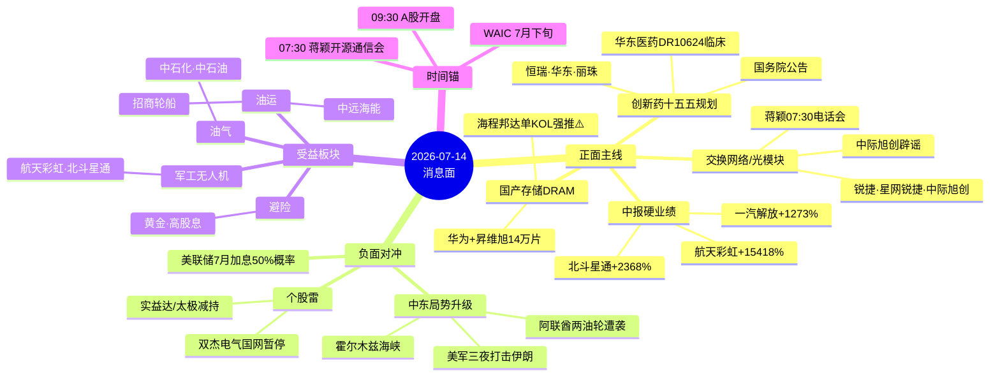

# 2026 年 7 月 14 日 · **消息面事件驱动**

> **数据源新鲜度**: partial · **降级状态**: false · **置信度**: 0.72
> **覆盖窗口**: 前 72h · **主源**: 财联社快讯(2564) + 21 号公众号(115) + 5 焦点群(281) + 东财中报预告(500)

## 一句话结论

外围中东升级+美联储加息预期抬升为唯一硬负面;国内交换网络(蒋颖07:30会)+创新药十五五政策+中报硬业绩三线共振是今日盘前净利好锚。

## 🗺️ 消息面全景图

## 🎯 顶级事件详解(每事件三问 + 首推票思维链)

### E20260714_001 · 中东局势升级+两艘阿联酋油轮遭袭 · strength=high · polarity=负面

**事件摘要**: 美军中央司令部宣布连续第三晚打击伊朗,并首次实战使用海上无人艇;阿联酋两艘国家油轮14日在霍尔木兹海峡南部遭伊朗方向巡航导弹袭击。国泰海通研报同步指出油价扰动+美联储7月加息概率抬升至50%。

**推理深度三问**:
- **大资金意图**: 全球权益短期承压,但油价+军工+航运是**结构性避险再配置**方向;北向和保险大概率减仓消费/成长,加仓上游资源+军工
- **为什么走强**: 霍尔木兹海峡货运风险实质抬升(不再是嘴炮制裁),油轮直接遭击=油价供给端硬冲击;OPEC+被动受益
- **逻辑够不够硬**: **硬**。财联社+新华社+国泰海通多源官方,时间锚精确到分钟;油运业绩弹性可量化(VLCC 日租金上冲)

**首推票思维链**:

#### 中远海能 601919 · role=油运弹性首推
- **买入理由**: VLCC 龙头,霍尔木兹绕行推高吨海里需求;历史上中东风波下 30 日跑赢油运指数
- **风险点**: 战事若快速降温则回吐;油轮担保成本抬升挤压毛利
- **止损条件**: 破 5 日线 or 收盘 -4%
- **可验证假设**: 若开盘 30 分钟油运板块净流入 < 5000 万且中远海能 -2% → 逻辑不成立,回避

#### 航天彩虹 002389 · role=军工无人机+业绩双击
- **买入理由**: 中报预增 15418%~19503%(硬 alpha 交叉命中)+ 中东无人机需求持续 + 美军无人艇实战印证无人化趋势
- **风险点**: 已连续拉升,进入短期高位;停牌/交易所问询风险
- **止损条件**: 破 10 日线
- **可验证假设**: 中报正式披露日期公告是否早于市场预期

### E20260714_002 · 蒋颖07:30电话会《持续超预期的交换网络》 · strength=high · polarity=正面

**事件摘要**: 开源证券通信首席蒋颖 2026-07-14 07:30 召开"颖响力"第7期电话会,主题**持续超预期的交换网络**;群内 20:04 释放会议链接,公众号 18:34/13:01 连续两次预热。

**推理深度三问**:
- **大资金意图**: 光模块前一波兑现完毕,机构在寻找**AI基建第二段叙事**,交换机+高速交换网络是 ASIC/GPU 后端唯一被系统性低估的环节
- **为什么走强**: 前一日盘后中际旭创辟谣二季度业绩 → 光模块信仰恢复;07:30 蒋颖会议是**开盘前决策窗口**,机构会议驱动开盘异动概率极高
- **逻辑够不够硬**: **硬**。机构首席+研报+个股辟谣三重共振,时点直接锚定开盘

**首推票思维链**:

#### 锐捷网络 301165 · role=交换机龙头首推
- **买入理由**: 直接受益蒋颖交换网络主题;历史与开源电话会议高度相关的交换机第一标的
- **风险点**: 若会议内容偏产业趋势不点名个股,主题冲高回落
- **止损条件**: 破 5 日线 -3%
- **可验证假设**: 若开盘 30 分钟净流入 > 1 亿 → 主题被资金认可

#### 中际旭创 300308 · role=光模块辟谣+主题共振
- **买入理由**: 辟谣2Q业绩不及预期+2027年高速光模块需求仍强+电话会催化
- **风险点**: 前期跌幅未消化;股价传闻压制仍是不确定
- **止损条件**: 收盘 -3.5% or 跌破年线
- **可验证假设**: 光模块 ETF 集合竞价溢价率 > 0.3%

### E20260714_003 · 华为+昇维旭12英寸DRAM工厂月产14万片 · strength=high · polarity=正面(⚠️ 单KOL)

**事件摘要**: 摩天轮群 KOL "松" 2026-07-13 11:00-13:03 连续 4 帖强推华为联手昇维旭(Swaysure) 自建 12 英寸 DRAM 工厂,月产能 14 万片;点名海程邦达为合作物流服务商。

**推理深度三问**:
- **大资金意图**: 国产存储缺口大,DRAM 是华为芯片自研最后短板;若属实则**万亿级CapEx产业链**
- **为什么走强**: 韩国 SK 海力士 Q2 利润低于预期 -8% + 韩指 -9% + Meta/三星大额订单 = **国产替代产业窗口**
- **逻辑够不够硬**: **中等偏软**。单一 KOL 二级消息,官方口径未见,群内跟风迹象明显;概念+个股跟风风险叠加

**首推票思维链**:

#### 海程邦达 603836 · role=DRAM物流服务商⚠️
- **买入理由**: 招股书披露昇维旭为核心新客户;基本面本身有半导体物流增量逻辑
- **风险点**: **单一KOL强推**;华为+昇维旭合作传闻真伪未验;二级估值已含预期
- **止损条件**: 破 5 日线 or -5%
- **可验证假设**: 华为/昇维旭是否 T+1 出具体澄清或印证

## 📊 板块 × 事件热力矩阵

| 板块 | 事件锚 | 首推龙头 | 独立源数 | 中报预告 | 净综合置信 |
|------|--------|----------|----------|----------|:--:|
| 交换机/光模块 | E002+E005 | 锐捷网络·中际旭创 | 4 | 锐捷301165预增288~457%(前值)/中际待披露 | 🟢🟢🟢 |
| 创新药 | E004 | 华东医药·恒瑞医药 | 3 | 华东医药待披露 | 🟢🟢 |
| 国产存储DRAM | E003 | 海程邦达 | 2 | — | 🟡 |
| 油气/油运 | E001 | 中远海能·中石化 | 3 | — | 🟢🟢 |
| 军工电子/无人机 | E001+E009 | 航天彩虹·北斗星通 | 3 | 航天彩虹15418~19503% / 北斗星通2368~3426% | 🟢🟢🟢 |
| 高股息/银行 | E007 | 平安·工行 | 2 | — | 🟢 |
| AI/AGI应用 | E006+E008 | 昆仑万维 | 2 | — | 🟡 |
| 商用车 | E009 | 一汽解放 | 1 | 1273~1528% | 🟢🟢 |
| 全市场风险偏好 | E001 | — | 3 | — | 🔴 |

## 🔥 中报业绩预告命中(硬 alpha 交叉验证)

从 `eastmoney_earnings_predict` 提取当日 top25 预增(归母口径) + 与本文事件板块交集:

| 代码 | 名称 | 预告类型 | 增速下限-上限 | 事件命中 | 逻辑强度 |
|------|------|----------|--------------|----------|:--:|
| 002389.SZ | 航天彩虹 | 扭亏 | 15418%~19503% | E001中东+E009军工 | 🟢🟢🟢 |
| 002151.SZ | 北斗星通 | 预增 | 2368%~3426% | E001中东+E009军工 | 🟢🟢🟢 |
| 603110.SH | 东方材料 | 预增 | 1330%~1834% | — | 🟢 |
| 000800.SZ | 一汽解放 | 预增 | 1273%~1528% | E009商用车 | 🟢🟢 |
| 605189.SH | 富春染织 | 预增 | 1165%~1314% | — | 🟢 |
| 002386.SZ | 天原股份 | 预增 | 981%~1282% | — | 🟢 |
| 002636.SZ | 金安国纪 | 预增 | 935%~1063% | E006 CCL/PCB 关联 | 🟢🟢 |
| 688309.SH | 恒誉环保 | 预增 | 864%~864% | — | 🟢 |
| 601700.SH | 风范股份 | 预增 | 741%~1022% | E007 高股息电力设备 | 🟢 |
| 002975.SZ | 博杰股份 | 预增 | 642%~816% | E008 半导体测试 | 🟢🟢 |
| 603077.SH | 和邦生物 | 预增 | 614%~730% | — | 🟢 |
| 603906.SH | 龙蟠科技 | 扭亏 | 538%~625% | — | 🟢 |
| 000686.SZ | 东北证券 | 预增 | 77.49% | E007 券商流动性 | 🟢🟢 |

## 关键证据

- 证据 1: 美军中央司令部连续第三晚打击伊朗;阿联酋两艘油轮霍尔木兹海峡遭巡航导弹袭击 · 财联社+新华社 · 2026-07-14 07:07/07:14
- 证据 2: 开源证券蒋颖 07:30 电话会《持续超预期的交换网络》 · AA陆家嘴机构风向标+开源通信公众号 · 2026-07-13 18:34/20:04
- 证据 3: 国务院印发《国民健康"十五五"规划》全链条支持创新药 · 专注核心Manson+基哥公众号 · 2026-07-13 19:13
- 证据 4: 中际旭创召开机构电话会议辟谣2Q业绩传闻+2027高速光模块需求强 · 财联社 · 2026-07-13 21:28
- 证据 5: 航天彩虹中报预增 15418%~19503%;北斗星通预增 2368%~3426%;一汽解放预增 1273%~1528% · eastmoney_earnings_predict · 2026-06-30 报告期
- 证据 6: 昆仑万维WAIC四大模型首发+华福杨晓峰AGI电话会 · 专注核心+AA陆家嘴 · 2026-07-13 15:06/19:42
- 证据 7: 华为+昇维旭12英寸DRAM工厂月产14万片(⚠️传闻性质·单KOL强推) · 摩天轮群"松" · 2026-07-13 11:00-13:03
- 证据 8: 沪市2600亿现金分红待发+3400+家上市公司分红 · 上海证券报 · 2026-07-14 06:50

## 数据源审计

| 源 | 日期 | 状态 | 备注 |
|---|---|:--:|---|
| tushare/news_cls | 2026-07-14 | 🟢 | 2564 条·72h 回看 |
| tushare/news_major | 2026-07-14 | 🟢 | 800 条·新浪财经 |
| eastmoney/earnings_predict | 2026-07-14 | 🟢 | 500 条·2026H1 报告期 |
| wechat_official_20 | 2026-07-14 | 🟢 | 115 篇·23 号池 |
| wechat_cli_5groups | 2026-07-14 | 🟢 | 281 条·5 焦点群(匿名) |
| tushareMcp | 2026-07-14 | 🟢 | 258 tools·1454ms |
| datapro | 2026-07-14 | 🟢 | 956ms |
| weflow_snapshot | 2026-07-14 | 🔴 | 超时 45s(不影响核心) |
| xtick/hot_news | 2026-07-14 | 🟡 | 未调用 |

## 不确定性 / 反证

1. **中东局势可能快速降温**: 若特朗普声明与伊朗达成协议(他本人昨日暗示"仍有可能"),油价/军工/避险板块回吐,风险偏好反弹;届时首推票倒过来
2. **蒋颖07:30电话会内容风险**: 会议若偏产业宏观不点名个股,交换机主题冲高回落;或已被前一日盘后消化
3. **海程邦达单KOL强推**: 摩天轮群"松"连续4帖+同群互相转发,存在**KOL自嗨→高开出货**风险模式(vibe-trading 反证模式六);建议 open 前查看竞价溢价率
4. **全市场情绪冰点**: 昨日全A -3.44%,成交2.83万亿,机构固收+加仓虽是抄底信号但也印证下方支撑未验证;上证50/上证180核心蓝筹靠分红硬撑,成长股弹性有限
5. **业绩预告可能已price in**: 航天彩虹/北斗星通如果已在7月连涨,中报披露反而可能触发利好兑现;需查近5日涨幅

## 与其他 R/D/E 的关系

- 依赖: manifest.json / eastmoney_earnings_predict / news_cls / wechat_*
- 被消费: R2 主线(交换机/创新药主线) / R5 个股画像(锐捷/中际/华东医药) / R6 反证(单KOL强推识别) / D1 预案(中东负面对冲仓位)

## Sub-Agent 元数据

- skill: analyze_news_impact_v1@1.1
- artifact: data/research/20260714/R4_news.json
- method: llm_v1(五源硬约束·news_cls+news_major+earnings_predict+wechat_official+wechat_cli)
- 生成时刻: 2026-07-14T07:42:00+08:00
