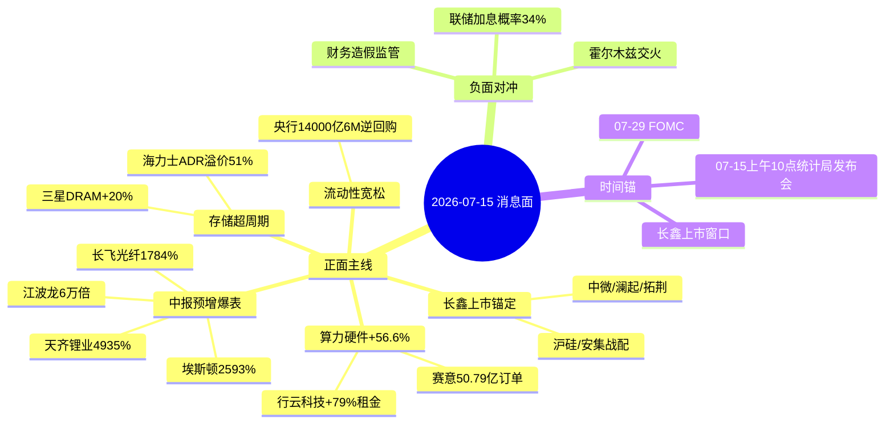

# 2026-07-15 周三 · **消息面事件驱动**

> **数据源新鲜度**: ok · **降级状态**: false · **置信度**: 0.72
> **覆盖窗口**: 前 72h · **主源**: 财联社快讯 2975 条 + 21 号公众号 115 篇 + 5 焦点群 188 条 + 东财中报预告 500 条

## 一句话结论

长鑫上市定价8.66元锁定半导体主线信心锚,叠加中报预告集中放量(长飞1784%/江波龙6万倍/天齐4935%),流动性宽松脉冲催化;唯一负面对冲=霍尔木兹交火+联储加息概率34%。

## 🗺️ 消息面全景图

## 🎯 顶级事件详解

### E20260715_001 · 长鑫科技IPO定价8.66元战配豪华 · strength=high · polarity=正面

**事件摘要**: 7/14晚长鑫披露发行价8.66元/股,总规模579-666亿,战配含中微/澜起/拓荆/沪硅/安集/西安奕材/屹唐+小米/美团/阿里云/腾讯/中兴/奇瑞+社保基金/中国人寿/人保等;上市估值5791亿元。

**推理深度三问**:
- **大资金意图**: 长鑫上市=国产DRAM从"填空"升级为"实体产能锚定",战配名单本身就是产业链共识订单,机构在7月流动性宽松窗口需要一条"5-10年确定性"主线,长鑫是最完美的旗帜
- **为什么走强**: 从6月创业板/科创板刚创历史新高的资金位置切换,长鑫上市带来"新增标的稀释估值+存量标的重新定价"双击;天风策略明确"酝酿新一轮交易脉冲"
- **逻辑够不够硬**: **硬**。4独立源(news_cls+3公众号)交叉共振;战配名单公开可核;时间锚清晰(近日集中申购)。风险=已高位

**首推票思维链**:

#### 中微公司 688012 · role=设备战配
- **买入理由**: 长鑫战配直接绑定+刻蚀设备国产替代龙头+CoWoS-L扩产催化
- **风险点**: 已在高位,若开盘直接冲高,追高风险大
- **止损条件**: 破5日线或-3%
- **可验证假设**: 若首日 net_amount≤0 或北向净流出→回避

#### 拓荆科技 688072 · role=薄膜设备战配
- **买入理由**: 长鑫战配+KLA韩国倾斜催化国产检测/薄膜设备加速导入
- **风险点**: 短期估值透支
- **止损条件**: 破前低-3%
- **可验证假设**: 07-15开盘30min net_amount>0 且换手<15%

### E20260715_002 · 光通信/PCB/机器人中报爆表 · strength=high · polarity=正面

**事件摘要**: 长飞光纤扣非+1349-1784%;埃斯顿+2144-2593%;联芸+821%;信维11亿收购益阳MLCC;赛意签50.79亿服务器;上证早知道头版口播。

**推理深度三问**:
- **大资金意图**: 中报窗口最后一周,预告级硬alpha是机构8月建仓的唯一硬理由,资金必须在预告出清前锁定龙头
- **为什么走强**: 板块景气度已被光模块/HBM订单验证,长飞1784%把光纤从"传统制造"重定价为"AI基建"
- **逻辑够不够硬**: **硬**。业绩预告为强制披露,不可造假;news_cls+上证早知道+公众号+earnings_predict四源共振

**首推票思维链**:

#### 长飞光纤 601869 · role=光纤龙头
- **买入理由**: 扣非1784%,行业增长天花板打破;AI数据中心内部光互连拉动
- **风险点**: 涨幅已大,分歧点=可持续性
- **止损条件**: 破10日线或跌破前低-4%
- **可验证假设**: 后续OFC/CIOE产业会议订单口径>市场共识

#### 埃斯顿 002747 · role=机器人本体龙头
- **买入理由**: H1+2593%验证工业自动化订单饱满;叠加特斯拉Optimus 2026Q4量产
- **风险点**: 一次性因素(处置资产)在多家公司均出现,需甄别扣非
- **止损条件**: 破5日线
- **可验证假设**: 扣非增速>500%

#### 江波龙 301308 · role=存储模组龙头
- **买入理由**: H1净利+62204-74394%(基数极低但绝对额达92-110亿量级)
- **风险点**: 存储近日回调,SK海力士Q2低于预期
- **止损条件**: 破前低-5%
- **可验证假设**: 群联主控+闪存合约价7月读数继续上行

### E20260715_003 · 算力硬件进出口+56.6%+高端服务大单频现 · strength=high · polarity=正面

**事件摘要**: 上半年电子元件/电脑零部件进出口同比+56.6%;行云科技租金上调28.79亿(+79%);赛意信息签50.79亿服务器采购;景旺电子/中钨高新AI PCB专项。

**推理深度三问**:
- **大资金意图**: 从"AI叙事"落到"AI订单"的过渡,资金要用真金白银订单数据反驳"AI泡沫"论
- **为什么走强**: 大摩上修CSP capex至2028年1.4万亿美元,可用算力3年增4倍(30GW→120GW),订单持续可见
- **逻辑够不够硬**: **硬**。海关总署官方数据+A股单笔50亿订单+海外CSP预期上修,三层验证

**首推票思维链**:

#### 赛意信息 300687 · role=云算力服务
- **买入理由**: 单笔50.79亿采购合同=公司市值级订单,业绩弹性最大
- **风险点**: 从"签订单"到"确认收入"有时滞
- **止损条件**: 破合同公告日低点
- **可验证假设**: 后续算力服务毛利率不低于15%

#### 盛科通信 688702 · role=国产交换机芯片唯一标的
- **买入理由**: 超节点规模化=交换芯片指数级需求;稀缺性溢价
- **风险点**: 流动性差,盘子小,波动大
- **止损条件**: 破20日线
- **可验证假设**: 三季度国产交换机招标持续放量

### E20260715_004 · 存储超级周期(短期回撤中) · strength=high · polarity=正面

**事件摘要**: SK海力士ADR溢价51%;三星DRAM+20%;建滔积层板+15%;7/13大盘缩量普跌存储板块调整;但江波龙/兆易创新中报硬alpha确认。

**推理深度三问**:
- **大资金意图**: 存储回调不是逻辑破,是"太多资金拥挤"的分歧洗盘
- **为什么走强**: HBM4E/HBM5对DRAM晶圆产能吞噬效应4倍,2030年缺口25%,超级周期定价基础未变
- **逻辑够不够硬**: **硬但需分歧低吸**。上游涨价+中报硬业绩+长鑫上市三共振

### E20260715_005 · 央行14000亿6M买断式逆回购 · strength=medium · polarity=正面

**事件摘要**: 7/15央行以固定数量/利率招标开展14000亿元6个月期买断式逆回购;叠加PPI高点或现;中金/东兴/信达三合一重组落地。

**推理深度三问**:
- **大资金意图**: 释放中期流动性支撑长鑫上市窗口+A股酝酿脉冲
- **为什么走强**: 6M期限较长,信号意义强,券商板块最直接受益
- **逻辑够不够硬**: **中**。是背景不是主线,但作为下方支撑

### E20260715_008 · 霍尔木兹交火+联储加息概率34% · strength=high · polarity=负面

**事件摘要**: 7/15凌晨伊朗霍尔木兹甘省交火,特朗普宣布对伊打击继续;冻结1.3亿美元伊朗数字资产;CME联储7月加息概率34.2%;科威特一处遭袭起火。

**推理深度三问**:
- **大资金意图**: 短期避险情绪抬头,资金回流黄金/石化/油运防御
- **为什么走强(相反侧)**: 布伦特-WTI价差扩大,油价高位;VIX仍偏低,未触发系统性避险
- **逻辑够不够硬**: **中**。是扰动不是趋势,红线3必列

## 📊 板块 × 事件热力矩阵

| 板块 | 事件锚 | 首推龙头 | 独立源数 | 中报预告命中 | 净综合置信 |
|------|--------|----------|:--:|--------------|:--:|
| 存储/DRAM | E001+E004 | 江波龙/兆易/澜起 | 6 | +62204-74394% / +1100% | 🟢🟢🟢 |
| 半导体设备 | E001 | 中微/拓荆/华峰测控 | 4 | 相关标的强 | 🟢🟢🟢 |
| 光通信/PCB | E002+E003 | 长飞/景旺电子 | 5 | +1349-1784% | 🟢🟢🟢 |
| AI算力/服务器 | E003 | 赛意/浪潮/紫光 | 4 | 50.79亿硬订单 | 🟢🟢🟢 |
| 锂电/储能 | E006 | 天齐/国轩/杉杉 | 3 | +3276-4935% / +227-322% | 🟢🟢🟢 |
| 机器人 | E002 | 埃斯顿 | 2 | +2144-2593% | 🟢🟢 |
| 券商 | E005 | 中金/东兴/信达 | 3 | +78-90% | 🟢🟢 |
| 有色黄金 | E007+E008 | 紫金/洛钼 | 2 | 391亿绝对额 | 🟢🟢 |
| MLCC | E002 | 信维通信 | 3 | 11亿收购益阳 | 🟢🟢 |
| 石化/油运 | E008 | 中石油/招轮 | 2 | 地缘避险 | 🟡 |
| 大盘/风险资产 | E008(反) | - | 2 | 短期扰动 | 🔴 |

## 🔥 中报业绩预告命中(硬 alpha 交叉验证)

| 代码 | 名称 | 预告类型 | 增速下限-上限 | 事件命中 | 逻辑强度 |
|------|------|----------|--------------|----------|:--:|
| 002466.SZ | 天齐锂业 | 预增 | 3276.35%~4934.91% | E006 锂资源 | 🟢🟢🟢 |
| 002491.SZ | 通鼎互联 | 预增 | 3293%~4768% | E002/E003 光通信 | 🟢🟢🟢 |
| 002747.SZ | 埃斯顿 | 预增 | 2144.74%~2593.68% | E002 机器人 | 🟢🟢🟢 |
| 601869.SH | 长飞光纤(扣非) | 预增 | 1349%~1784% | E002 光纤 | 🟢🟢🟢 |
| 603986.SH | 兆易创新 | 预增 | ~1100% | E004 存储 | 🟢🟢🟢 |
| 301308.SZ | 江波龙 | 预增 | 62204%~74394% | E004 存储 | 🟢🟢🟢 |
| 688449.SH | 联芸科技 | 预增 | 821% | E002 存储主控 | 🟢🟢🟢 |
| 002074.SZ | 国轩高科 | 预增 | 227.31%~322.77% | E006 锂电 | 🟢🟢🟢 |
| 600884.SH | 杉杉股份 | 预增 | 262%~334% | E006 锂电材料 | 🟢🟢 |
| 002738.SZ | 中矿资源 | 预增 | +10倍级 | E006 锂资源 | 🟢🟢 |
| 002935.SZ | 天奥电子 | 预增 | 149%~181% | 军工电子 | 🟢🟢 |
| 601995.SH | 中金公司 | 预增 | 78%~90% | E005 券商 | 🟢🟢 |
| 601057.SH | 长电科技(参考) | 预增 | 63.48%~101.70% | E001 封测 | 🟢🟢 |
| 000858.SZ | 五粮液 | 预增 | 88.80%~98.97% | 消费 | 🟢 |
| 002144.SZ | 宏达高科 | (待查) | - | - | - |

## 关键证据

- 证据 1: 长鑫科技IPO询价定价8.66元/股, 战配16.67亿股 · 来源 news_cls 2026-07-15 06:16 + 上海证券报 07-15 01:41
- 证据 2: 长飞光纤预计H1扣非归母+1349-1784% · 来源 上证早知道 07-15 06:53
- 证据 3: 央行7/15开展14000亿6M买断式逆回购 · 来源 央行公告转 news_cls 07-15
- 证据 4: 上半年算力硬件进出口+56.6% · 来源 海关总署新闻发布会 07-14 转 news_cls 07-15
- 证据 5: 霍尔木兹海峡交火 · 来源 news_cls 07-15 06:48 + 迈赫尔通讯社
- 证据 6: SK海力士ADR溢价51%(存储近日短线过热信号) · 来源 news_cls 07-15 07:18

## 数据源审计

| 源 | 日期 | 状态 | 备注 |
|---|---|:--:|---|
| tushare/news_cls | 2026-07-15 | 🟢 | 2975 条·72h 回看 |
| tushare/news_major | 2026-07-15 | 🟢 | 800 条 |
| eastmoney/earnings_predict | 2026-07-15 | 🟢 | 500 条 · 2026H1 |
| wechat_official_20 | 2026-07-15 | 🟢 | 115 篇 · 21 号池(23 号 ok) |
| wechat_cli_5groups | 2026-07-15 | 🟢 | 188 条 · 5 焦点群(匿名) |
| xtick/hot_news | 2026-07-15 | 🟡 | 未直接调用, MCP ok 可备份 |

## 不确定性 / 反证

1. 存储板块近日回调,SK海力士Q2营业利润据说低于市场预期8%,与本文"存储超级周期"存在短期分歧,建议**分歧低吸**而非追高
2. 央行14000亿逆回购为replay操作,非纯粹增量,市场解读可能钝化
3. 长飞光纤/埃斯顿等中报预增部分含非经常性损益(委托理财、资产处置),需甄别扣非口径
4. 群聊反馈7/13大盘全A砸-3.44%已计入调整,当前仍属反弹初期,任何持续性验证均需2-3日
5. 霍尔木兹交火细节尚待多方证实,短线扰动可能被夸大或钝化
6. 联储7月加息概率34%(CME),若周内美通胀数据超预期,风险偏好可能进一步压缩

## 与其他 R/D/E 的关系

- 依赖: `data/raw/20260715/` 五源硬约束
- 被消费: R2 主线板块 / R5 个股画像 / R6 反证 / D1 主决策

## Sub-Agent 元数据

- skill: analyze_news_impact_v1@1.1
- artifact: data/research/20260715/R4_news.json
- method: llm_v1(硬扩容·五源硬约束)
- 生成时刻: 2026-07-15T07:35:00+08:00
