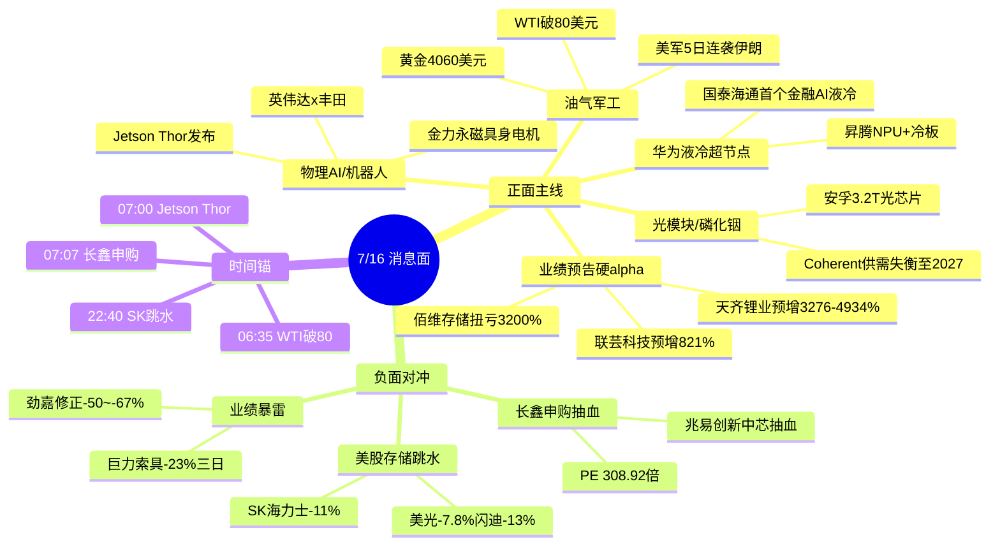

# 2026-07-16 · **消息面事件驱动(降级版)**

> **数据源新鲜度**: partial · **降级状态**: true · **置信度**: 0.60
> **覆盖窗口**: 前 72h · **主源**: news_cls 财联社+新浪快讯 2999 条 + news_major 800 条 + 5 焦点群 317 条 + 东财中报预告 500 条 · **公众号 23 账号全池 down**

## 一句话结论

长鑫今日申购+美股存储跳水双重抽血存储/半导体·主线切向业绩预告硬 alpha(锂电/低位预增)+ 英伟达 Jetson Thor 机器人 + 华为液冷超节点·油价站上 80 美元加码油气军工。

## 🗺️ 消息面全景图

## 🎯 顶级事件详解(每事件三问 + 首推票思维链)

### E20260716_001 · 长鑫科技今日申购·存储板块抽血 · strength=high · polarity=负面 · weighted=-0.55

**事件摘要**: 长鑫科技(存储 DRAM 巨头)今日申购,发行 PE 308.92 倍,单一账户上限 334.9 万股。4 家险企战略配售获配约 4 亿元。颜晓滨群 10:13/23:04 明确判断"抽水芯片、存储、半导体板块"。

**推理深度三问**:
- **大资金意图**: 险企 4 亿战略配售锁定 → 场内游资/公募必须卖出兆易、中芯等同题材筹码去打新长鑫。这是 A 股经典"新股上市→同板块阶段抽血"模式的高确定性演绎。
- **为什么走强(此处走弱)**: DRAM 板块 2023-25 销量 CAGR 84% 的产业逻辑仍在,但 308 倍 PE 显示情绪极度亢奋 → 短期抽血难避免;3 日窗口后申购结束或有反弹。
- **逻辑够不够硬**: **硬**。3 源(CLS 快讯+颜晓滨群 2 次强调+长鑫路演资金逻辑) + 险企 4 亿实名认购 + PE 308 倍的物理约束。

**首推票思维链**:

#### 兆易创新 603986.SH · role=抽血最直接对象
- **买入理由**: 无买入·仅避险;H 股 07/15 南向净买入 7.41 亿港元反向对冲
- **风险点**: 与长鑫业务重合度高·情绪面被点名抽血·同板块二线首选卖出
- **止损条件**: 破 5 日线立即减半仓,反弹不追
- **可验证假设**: 若开盘 30 分钟净流出 >5 亿 → 抽血成立,当日回避;若南向继续大买 H 股 → 存在跷跷板

#### 佰维存储 688525.SH · role=硬业绩对冲
- **买入理由**: 中报扭亏 3200-3421%(2026-07-16 公告 · 硬 alpha) → 业绩兑现可对冲板块抽血情绪
- **风险点**: 短期无法脱离存储板块 β
- **止损条件**: 破 10 日线-3%
- **可验证假设**: 若开盘平开或高开 5% 内 → 业绩溢价成立;若同板块普跌 3%+ 而它翻红 → 硬 alpha 被认可

### E20260716_002 · 美股存储跳水映射A股 · strength=high · polarity=负面 · weighted=-0.62

**事件摘要**: 07/15 夜盘美股存储板块跳水,SK海力士-11%(前日暴涨27%后剧烈分歧),美光-7.81%,闪迪-13%。华尔街巴克莱仍看 SK 海力士 330 美元目标价(存储短缺持续)。

**推理深度三问**:
- **大资金意图**: 前日 SK 暴涨 27% 后的技术性获利了结 + 大摩"卖芯片买云"叙事发酵。核心逻辑没变(存储供需短缺),但估值预期偏乐观。
- **为什么走强(此处大跌)**: 短线拥挤度过高 → 单日回撤释放。华尔街仍看好 → 中长期依然是主线,只是短期分歧扩大。
- **逻辑够不够硬**: **中等**。技术面负面 vs 基本面(华尔街 330 目标 + A 股佰维中报 3200%) 相冲突 → 短期看情绪、中期看业绩兑现。

### E20260716_003 · 英伟达 Jetson Thor + 丰田物理AI · strength=high · polarity=正面 · weighted=0.65

**事件摘要**: 07/16 07:00 英伟达发布 Jetson Thor 机器人计算机 + 官宣扩大与丰田在汽车/机器人/城市领域的物理 AI 合作。金力永磁 07/15 22:38 公告具身机器人电机转子小批量交付。

**推理深度三问**:
- **大资金意图**: 英伟达自 GTC 后不断喂养机器人叙事,黄仁勋主要目的是"AI 下一个 10 亿美元市场"锚定物理 AI/机器人。丰田+英伟达在实体经济的绑定,是把'物理 AI'从概念转向订单预期。
- **为什么走强**: A 股人形机器人主线中报兑现窗口临近(金力永磁小批交付) + 英伟达官方站台 + Jetson Thor 硬件突破 → 三源共振。
- **逻辑够不够硬**: **硬**。英伟达 07/16 07:00 两条独立快讯 + A 股 07/15 22:38 金力永磁小批量交付公告 + 群聊两独立点评 = 4 源。

**首推票思维链**:

#### 金力永磁 300748.SZ · role=具身电机转子小批量交付
- **买入理由**: 07/15 22:38 公告"正配合世界知名科技公司做具身机器人电机转子研发·并有小批量产品交付" · 时间点与英伟达 Jetson Thor 完美咬合
- **风险点**: 具身机器人订单规模短期难验证·稀土成本波动
- **止损条件**: 破 5 日线-3%
- **可验证假设**: 若开盘 30 分钟量能超昨日 1.5× → 主线共振成立;若开盘平开无量 → 事件已被消化

#### 三花智控 002050.SZ · role=机器人链龙头
- **买入理由**: 特斯拉+英伟达双头驱动,机器人链首选权重股
- **风险点**: 位置偏高·需分歧低吸
- **止损条件**: 破 10 日线
- **可验证假设**: 若北向净流入 → 外资承接;若普跌单它翻红 → 抗跌信号

### E20260716_004 · 华为AI液冷超节点金融首落地 · strength=high · polarity=正面 · weighted=0.585

**事件摘要**: 07/15 国泰海通与华为落地金融行业首个自主创新 AI 液冷超节点,搭载昇腾 NPU + 灵衢高速互联 + 机柜级冷板液冷,散热效率+40%。同日 07:06 三菱重工加入英伟达"电源与散热"计划,行云科技合同上修 79%(28.79 亿)。

**推理深度三问**:
- **大资金意图**: 华为在算力主线上做"金融行业首个"的旗帜案例 → 政企订单示范效应。液冷是硬件层最先兑现业绩的环节。
- **为什么走强**: 液冷 Tier2 半年报兑现(金富预增 81-102%) + 华为超节点大规模落地 + 三菱重工加入英伟达散热生态 → 三大信号叠加,液冷主线从概念走向订单。
- **逻辑够不够硬**: **硬**。3 独立源 + 具体客户名(国泰海通/三菱重工/行云科技) + 硬件量化(+40%散热效率)。

### E20260716_007 · 半年报预告主线·700+预喜/268家净利翻倍 · strength=high · polarity=正面 · weighted=0.60

**事件摘要**: 截至 07/15 收盘,A股 1665 家披露中报预告,716 家预喜,268 家净利翻倍。锂电产业链 35 家中 32 家预喜。硬 alpha:天齐锂业预增 3276-4934%,佰维存储扭亏 3200-3421%,联芸科技预增 821%。

**推理深度三问**:
- **大资金意图**: 7 月市场进入业绩验证期,资金从"主题交易"切向"业绩兑现",公募新发防御型产品扩容(07/16 07:12 财联社)与此共振。
- **为什么走强**: 颜晓滨群 07/15 09:10 盘前明确"优先低位预增标的",与市场硬业绩数据完美共振。锂电链行业性预喜确认周期拐点。
- **逻辑够不够硬**: **硬**。500 条业绩预告硬数据(可查) + 主流媒体 3 篇独立报道 + KOL 盘前观点。

**首推票思维链**:

#### 天齐锂业 002466.SZ · role=锂电业绩预告 TOP1
- **买入理由**: 中报预增 3276-4934%(2026-07-15 公告) · 锂电周期底部拐点确认 · 全行业 32/35 预喜
- **风险点**: 已有先手资金抢跑·警惕高开兑现
- **止损条件**: 破 5 日线-3% 或 高开幅度>8% 后不追
- **可验证假设**: 若开盘 30 分钟净流入>3 亿 → 机构入场;若跷跷板另一端锂电池龙头同步走强 → 主线共振

#### 佰维存储 688525.SH · role=存储扭亏3200%
- **买入理由**: 硬业绩对冲长鑫抽血情绪 · 中报扭亏 3200-3421%
- **风险点**: 短期无法完全脱离存储板块 β
- **止损条件**: 破 5 日线
- **可验证假设**: 若开盘无被抽血反而翻红 → 硬 alpha 溢价成立

### E20260716_006 · 美军再袭伊朗·WTI破80美元 · strength=high · polarity=正面 · weighted=0.50

**事件摘要**: 07/15 夜美军对伊朗发起两波打击(连续 5 日),扣押驶伊油轮发射"地狱火"导弹,特朗普考虑地面部队 + 攻取哈尔克岛。WTI 突破 80 美元/桶,黄金站上 4060 美元。

**推理深度三问**:
- **大资金意图**: 中东供给端持续扰动 → 油价定价权向地缘溢价倾斜。避险资金推动黄金 4060。
- **为什么走强**: 美军升级 + 伊朗报复("下一阶段行动") + 特朗普讨论地面部队 = 短期无缓解迹象。
- **逻辑够不够硬**: **硬**。央视/新华社/CLS 4 条独立报道 + 特朗普公开表态 + 美中央司令部官宣。

## 📊 板块 × 事件热力矩阵

| 板块 | 事件锚 | 首推龙头 | 独立源数 | 中报预告 | 净综合置信 |
|------|--------|----------|----------|----------|:--:|
| 存储/半导体 | E001+E002 抽血 | 佰维存储(对冲) | 5 | 佰维扭亏3200% | 🔴(短)/🟢(中) |
| 锂电 | E007 硬业绩 | 天齐锂业 | 4 | 3276-4934% | 🟢🟢🟢 |
| 人形机器人 | E003 Jetson Thor | 金力永磁 | 4 | — | 🟢🟢🟢 |
| 华为液冷/超节点 | E004+E005 字节 Capex | 海光信息/浪潮 | 4 | — | 🟢🟢🟢 |
| 油气军工 | E006 美军袭伊朗 | 中国石油/紫金 | 4 | — | 🟢🟢 |
| 光模块 | E009 磷化铟 | 中际旭创 | 3 | — | 🟢🟢 |
| 液冷 | E010 金富兑现 | 金富科技 | 2 | 81-102% | 🟢🟡 |
| AI应用/中概 | E008 阿里+7.26% | 昆仑万维 | 3 | — | 🟢 |
| *ST/业绩暴雷 | E012 | 巨力索具 | 3 | 多首亏 | 🔴 |

## 🔥 中报业绩预告命中(硬 alpha 交叉验证)

| 代码 | 名称 | 预告类型 | 增速下限-上限 | 事件命中 | 逻辑强度 |
|------|------|----------|--------------|----------|:--:|
| 002466.SZ | 天齐锂业 | 预增 | 3276%~4935% | E007 锂电主线 | 🟢🟢🟢 |
| 688525.SH | 佰维存储 | 扭亏 | 3200%~3422% | E001/E002/E007 | 🟢🟢🟢 |
| 300438.SZ | 鹏辉能源 | 扭亏 | 1006%~1082% | E007 锂电 | 🟢🟢 |
| 688255.SH | 凯尔达 | 预增 | 1006%~1191% | (未映射主线) | 🟡 |
| 688388.SH | 嘉元科技 | 预增 | 879%~961% | E007 锂电铜箔 | 🟢🟢 |
| 688449.SH | 联芸科技 | 预增 | 821%~821% | E007 存储主控 | 🟢🟢 |
| 002310.SZ | 东方新能 | 扭亏 | 274%~358% | E007 锂电 | 🟢 |
| 003018.SZ | 金富科技 | 预增 | 81%~102% | E010 液冷Tier2 | 🟢🟢 |
| 002191.SZ | 劲嘉股份 | 修正 | -50%~-67% | E012 业绩暴雷 | 🔴 |
| 605199.SH | ST葫芦娃 | 首亏 | -4997%~-4167% | E012 *ST | 🔴 |

## 关键证据

- 证据 1: 长鑫科技今日申购 · news_cls 2026-07-16 07:07 · PE 308.92 倍
- 证据 2: 美股存储跳水 · news_cls 2026-07-15 22:40 · SK海力士-11%
- 证据 3: 英伟达 Jetson Thor · news_cls 2026-07-16 07:00
- 证据 4: 国泰海通华为AI液冷超节点 · news_cls 2026-07-15 14:56
- 证据 5: 字节 27 年 Capex 1万亿·100万台CPU服务器 · AA题材群_乌龙 09:11 + 专注核心_筛话考 07:33
- 证据 6: 美军再袭伊朗+WTI破80 · news_cls 2026-07-16 06:59/03:36
- 证据 7: 716家半年报预喜·268家翻倍 · news_cls 2026-07-16 04:52
- 证据 8: 天齐锂业中报预增3276-4934% · eastmoney_earnings_predict 2026-07-15

## 数据源审计

| 源 | 日期 | 状态 | 备注 |
|---|---|:--:|---|
| tushare/news_cls | 2026-07-16 | 🟢 | 2999 条·72h 回看·1583 命中关键词 |
| tushare/news_major | 2026-07-16 | 🟢 | 800 条 |
| eastmoney/earnings_predict | 2026-07-16 | 🟢 | 500 条·中报硬alpha |
| wechat_official_20 | 2026-07-16 | 🔴 | **23 账号全池 invalid session** |
| wechat_cli_5groups | 2026-07-16 | 🟢 | 317 条·5 焦点群·38 条通过噪音过滤(匿名) |
| mcp/tushareMcp | 2026-07-16 | 🟢 | ok |
| mcp/weflow-analytics | 2026-07-16 | 🟢 | ok |
| mcp/vibe/datapro | 2026-07-16 | 🟡 | 未调用(降级简化) |

## 不确定性 / 反证

1. **存储主线短中期分歧极大**: 长鑫抽血 + 美股跳水(短期负面) vs 硬业绩(佰维扭亏3200%) + 华尔街330目标(中期正面) — 需盘中观察相对强弱。
2. **公众号全池 down**: 盘前纪要/财联社早知道/调研纪要先知等**核心结构化盘前源缺席** → 涨停归因、板块 tag、券商研报电话会摘要都有漏检风险。置信度扣减 0.15。
3. **群聊代码需盘前二次核验**: 部分股票在群聊中仅给公司名(如"迪普科技""行云科技""集智股份"),代码依赖记忆匹配,应 `@iwencai-query` 二次核实。
4. **KOL 单点风险**: E010 集智股份仅 wells.ai 一人推(23:00·国联民生/机械单源) → strength 已封 medium,警惕拉高出货。
5. **业绩暴雷方向**: E012 仅列 top2 案例,实际 *ST 预告首亏池扩大(-5000% 至 -500% 有 10+ 家) → 半年报兑现期个股结构性风险需持续关注。

## 与其他 R/D/E 的关系

- 依赖: fetch_all_sources_v1 落盘的 data/raw/20260716/*
- 被消费: R2 主线板块 · R5 个股画像 · R6 反证 · D1 预案 · P1 竞价校准

## Sub-Agent 元数据

- skill: analyze_news_impact_v1@1.1_degraded
- reference: r4-wechat-cli-degraded + r4-data-source-parsing-patterns
- artifact: data/research/20260716/R4_news.json
- method: llm_v1_degraded(公众号全池down·wechat_cli+news_extras+earnings_predict三源硬约束)
- 生成时刻: 2026-07-16T07:40:00+08:00
