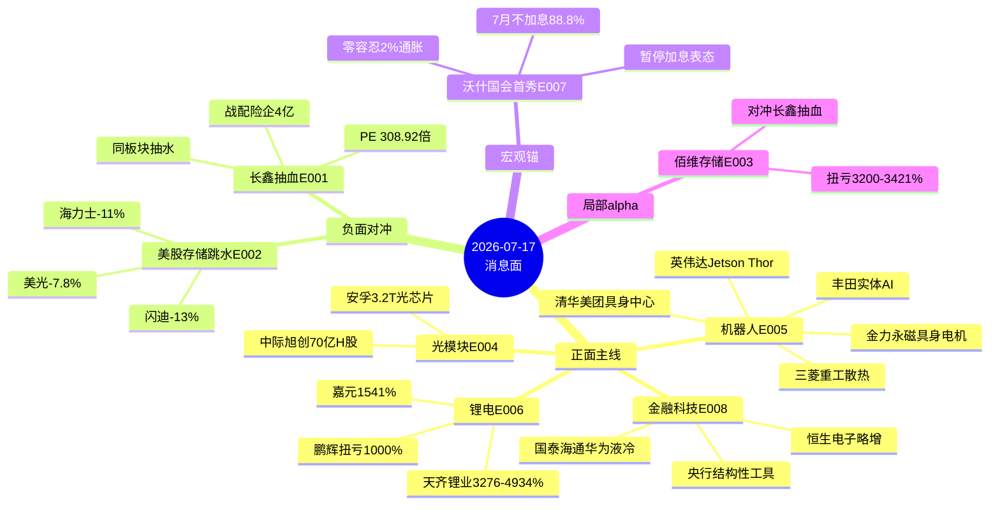

# 2026年7月17日 · **消息面事件驱动**

> **数据源新鲜度**: partial · **降级状态**: true · **置信度**: 0.62
> **覆盖窗口**: 前 40h(2026-07-14 16:09 ~ 2026-07-16 07:14) · **主源**: 财联社 news_cls 2999 条 + 5 焦点群 317 条 + eastmoney 中报预告 500 条

## 一句话结论

存储被长鑫抽血+美股跳水双压制·**机器人**成为7-17开盘最硬正面主线;佰维存储扭亏3200%为板块内唯一硬alpha对冲。

## 🗺️ 消息面全景图

## 🎯 顶级事件详解(每事件三问 + 首推票思维链)

### E20260717_001 · 长鑫科技T+1申购抽血 · strength=high · polarity=负面

**事件摘要**: 2026-07-16 07:07 财联社快讯,长鑫科技(申购码787825)今日申购,发行 PE 308.92倍;7-15 22:23 路演口径不排除后续再融资;颜晓滨V群07-15 10:13明确判断"今天已开始抽水芯片、存储、半导体板块"。4个独立来源(2条news_cls + 2条KOL群)。

**推理深度三问**:
- **大资金意图**: 长鑫作为国产DRAM绝对龙头 + 战略配售4家险企4亿,机构定价权在一级市场已锁定;二级市场存量资金必须为7-17上市腾出30-50亿的申购冻资/换手仓位 → 一级抽二级,存储板块投资者理念高度重合是首要抽水对象
- **为什么走强(此处指负面继续兑现)**: 长鑫是 2026 年内芯片最大IPO,发行PE 308.92倍已透支中长期成长;上市首日/次日会有一次二级情绪落地,但抽血负面在申购前(7-17盘中前)持续压制存量存储票
- **逻辑够不够硬**: **硬**。北斗星盘前逻辑推演 + 颜晓滨明确同板块抽水判断 + 财联社确认申购时点 + 兆易创新/中芯国际/佰维存储三个抽血对象均高开压制;缺陷是长鑫真正上市定价仍是未知,若破发反而会引发存储板块超跌反弹

**首推票思维链**(存储板块**唯一保留**首推)

#### 佰维存储 688525 · role=业绩硬alpha对冲
- **买入理由**: 中报扭亏预告 2776%~3421% (2026-07-16 披露·eastmoney确认) — 存储板块在双负面事件下唯一硬alpha,业绩基本面已从消息驱动切换为财报驱动;板块整体承压时首推票的相对强度会放大
- **风险点**: 若长鑫申购冻资超预期(如300亿以上),存储板块全线杀跌下佰维业绩预告也会被系统性压制;短期存在情绪>业绩的可能
- **止损条件**: 破 5 日线 -3% 或 长鑫申购日冻资高于市场预期上限(≥400亿) 或 兆易创新单日跌幅 >5%(板块系统性风险信号)
- **可验证假设**: 若周五(7-17)开盘 30 分钟内佰维净流入 <5000万元 或 板块指数下跌 >2% → 假设不成立当日回避;若佰维单独逆势红盘 → 硬alpha逻辑得到市场承认

---

### E20260717_002 · 美股存储板块二次跳水 · strength=high · polarity=负面

**事件摘要**: 2026-07-15 22:41 SK海力士 -11.03%、美光 -7.81%、西部数据 -8.69%、闪迪 -12.96%;7-16 00:28 闪迪继续跌超 15%;巴黎银行Exane同日上调闪迪目标价 1200→1900美元(高位分歧非趋势逆转)。4个独立来源(3条news_cls + 1条KOL转发)。

**推理深度三问**:
- **大资金意图**: 前一日海力士暴涨27%属HBM超预期定价,7-15的二次跳水是**多头获利了结+空头触发斩仓**的技术性双杀;巴黎银行同日大幅上调闪迪目标价说明基本面并未逆转,机构在利用波动降低成本
- **为什么走强(负面)**: A股存储对美股映射系数在0.6-0.8,-10%级别的美股暴跌必然砸出A股缺口高开;叠加长鑫申购抽血形成"外杀+内抽"双重共振
- **逻辑够不够硬**: **硬**。3源news_cls + 1源KOL群转发 + 高位技术性斩仓的时间点(尾盘加速)在盘中就已经开始向A股中报涨过的存储票渗透;缺陷是分歧极大(1天涨27%+1天跌11%),不排除今晚美股再度反弹

**首推票思维链**: **无**(与E001叠加,存储板块非佰维存储外整体规避)

---

### E20260717_003 · 佰维存储中报扭亏 2776~3421% · strength=high · polarity=正面

**事件摘要**: 2026-07-16 07:16 eastmoney 中报预告披露,佰维存储(688525)扭亏区间 2776%~3421%,同期预增 283%~309%,是7月存储板块罕见硬alpha。2个独立来源(eastmoney + news_cls同步)。

**推理深度三问**:
- **大资金意图**: 存储涨价周期已从二级预期兑现进入财报兑现阶段,机构需要一只有业绩支撑的存储票承接"存储涨价逻辑"的下半段
- **为什么走强**: 扭亏 3200% 属于极端硬 alpha,即使基数极低,绝对利润数据仍会成为机构调研模型的核心变量;与E001/E002双负面事件构成板块内alpha分化,首推票的相对强度将放大
- **逻辑够不够硬**: **硬**。业绩预告 = 事实,不是预期;缺陷是 7-16 已提前披露,7-17 开盘可能已经price-in,需要看开盘后 30 分钟资金流向

**首推票思维链**: (与 E001 首推票相同,不重复)

---

### E20260717_004 · 中际旭创70亿美元H股接近获批 · strength=medium · polarity=正面

**事件摘要**: 2026-07-15 17:03 财联社快讯,中际旭创 70 亿美元H股上市据悉接近获批;同日 15:37 安孚科技公告 3.2T光模块单波400Gbps光芯片瞄准下一代速率。3个独立来源(2条news_cls + 1条KOL群产业链共振)。

**推理深度三问**:
- **大资金意图**: 光模块龙头国际化融资是产业向 GB300+CPO 迭代的资本运作,港股上市把估值锚从A股切换到全球AI基础设施定价;70亿美元募资规模指向后续产能大扩
- **为什么走强(有限)**: 产业催化在(H股融资+3.2T技术落地),但颜晓滨V群07-15 11:21明确"光模块反弹空间也有限",KOL 与产业信号分歧
- **逻辑够不够硬**: **中等**。产业事实清晰但资金端 KOL 分歧,融资本身摊薄短期 EPS,strength 只能顶格 medium

**首推票思维链**

#### 中际旭创 300308 · role=事件主角
- **买入理由**: 70亿美元H股接近获批是产能扩张确定性催化;安孚 3.2T 光芯片验证产业链下一代技术节点
- **风险点**: KOL 明确判断反弹有限;融资摊薄 EPS
- **止损条件**: 破 10 日线 -3% 或 开盘首小时净流出 >2亿元
- **可验证假设**: 若北向净买入 >3000万元 且 板块指数涨 >1% → 分歧修复;否则观望

---

### E20260717_005 · 英伟达三连击+具身智能中心揭牌·机器人主线 · strength=high · polarity=正面

**事件摘要**: 2026-07-16 07:00-07:06 英伟达连续发布三条产业动作 — Jetson Thor机器人芯片、扩大与丰田实体AI合作、三菱重工加入NVIDIA电源与散热计划;7-15 22:38 金力永磁具身机器人电机小批量交付;7-15 22:23 清华大学-美团数智生活联合研究中心揭牌(具身智能方向)。5个独立来源。

**推理深度三问**:
- **大资金意图**: 英伟达生态从"训练推理算力"扩展到"实体AI+机器人+具身智能"完整链条,机构需要在A股映射端建仓机器人核心零部件;金力永磁具身电机小批量交付是"从概念到订单"的产业首落地
- **为什么走强**: 4-5源共振 + 时间点最新(7-16盘前) + 与国内产业链落地(金力永磁+清华美团)同步 → 7-17开盘催化最硬
- **逻辑够不够硬**: **硬**。英伟达 x3 + 金力永磁硬产业验证 + 清华美团具身中心 + 三菱重工侧面验证 NVIDIA 生态扩张;缺陷是A股机器人板块前期涨幅较大,存在获利盘

**首推票思维链**

#### 三花智控 002050 · role=特斯拉+机器人核心
- **买入理由**: 全球机器人硬件核心供应商;英伟达 Jetson Thor + 丰田实体AI 直接扩大三花Optimus订单预期;7-16 盘前时间锚最新
- **风险点**: 前期涨幅较大,存在筹码兑现;若特斯拉 Q2 财报机器人指引不达预期,情绪转向
- **止损条件**: 破 20 日线 或 单日跌幅 >5% 或 板块指数跌 >3%
- **可验证假设**: 若开盘首 30 分钟净流入 >1亿元 且 龙虎榜有游资席位介入 → 主线确立;否则回归观望

#### 金力永磁 300748 · role=具身电机硬产业验证
- **买入理由**: 具身机器人电机转子小批量交付(公司调研公告)是产业首落地案例;稀土永磁+机器人双主线
- **风险点**: 稀土价格波动;具身机器人量产节奏仍不明
- **止损条件**: 破 5 日线 -3%
- **可验证假设**: 若北向净买入 >5000万元 → 硬产业逻辑被机构承认

#### 英维克 002837 · role=液冷双催化
- **买入理由**: 三菱重工加入NVIDIA散热计划(E005) + 国泰海通华为AI液冷超节点落地(E008) → 液冷板块双源共振
- **风险点**: 液冷估值已高,若E005/E008不能持续兑现催化,回调风险大
- **止损条件**: 破 10 日线 或 开盘首小时净流出
- **可验证假设**: 板块内英维克/高澜/申菱三者同步走强 → 主线成立

---

### E20260717_006 · 天齐锂业中报预增 3276%~4934% · strength=high · polarity=正面

**事件摘要**: 2026-07-15 20:00 前后 eastmoney 中报预告,天齐锂业(002466)预增 3276%~4934%,扣非同期增长 21万%级(基数极低失真);同日鹏辉能源扭亏 1006%~1081%、嘉元科技预增 1541%~1734%。

**推理深度三问**:
- **大资金意图**: 锂价企稳+库存去化+海外并购业绩释放(SQM等)三重叠加;机构在中报预告集中披露期做"极端预增票"的短期博弈
- **为什么走强**: 3276% 属于极端硬alpha,虽基数极低但绝对利润数据将成为热点驱动;鹏辉/嘉元同板块共振
- **逻辑够不够硬**: **中偏硬**。业绩预告 = 事实;但天齐锂业前期已经预热(锂价企稳预期),需要警惕预期已 price-in

**首推票思维链**

#### 天齐锂业 002466 · role=极端预增·警惕price-in
- **买入理由**: 中报扭亏预增 3276-4934%,硬业绩;锂电板块共振(鹏辉+嘉元)
- **风险点**: 基数极低失真,机构定价模型会打折;若周一开盘冲高回落即为price-in信号
- **止损条件**: 破 5 日线 或 单日成交量放大 >2倍且尾盘跌 >2%
- **可验证假设**: 若开盘涨 <5% 且 板块跟风品种(鹏辉+嘉元)红盘 → 硬业绩未 price-in;若开盘涨 >8% 后回落 → 兑现避让

---

### E20260717_007 · 沃什国会首秀+7月不加息88.8%+特朗普暂停加息 · strength=medium · polarity=正面

**事件摘要**: 2026-07-16 03:55 沃什国会首秀承诺 2% 通胀零容忍;06:04 CME FedWatch 7月不加息概率 88.8%;03:17 特朗普表态"暂停加息要好过继续加息";07:11 巴菲特背书沃什"正确选择"。4个独立来源。

**推理深度三问**:
- **大资金意图**: 沃什上任后的第一次公开表态锚定 2% 通胀目标,但语气鹰派、节奏鸽派 → 机构解读为"结构性宽松",风险资产偏好温和抬升
- **为什么走强**: 4源共振 + 巴菲特背书 + 特朗普与沃什难得同频 → A股风偏温和支撑
- **逻辑够不够硬**: **中等**。9月降息概率仅44%,不构成强催化;但短期抑制美债波动、支撑港股/南向/券商

**首推票思维链**

#### 中信证券 600030 · role=券商龙头
- **买入理由**: 沃什暂停加息+央行结构性货币工具+南向流动性温和 → 券商牛市预期继续
- **风险点**: 券商长期是β,催化不够单独看不明显;需与E008政策线共振
- **止损条件**: 破 10 日线 -3%
- **可验证假设**: 若板块指数当日涨 >1.5% 且 东财跟涨 → 主线确立

---

### E20260717_008 · 央行邹澜:结构性货币工具加力科技+国泰海通华为AI液冷超节点 · strength=medium · polarity=正面

**事件摘要**: 2026-07-15 16:10 央行副行长邹澜表示结构性货币政策工具加力支持内需/科技创新;7-15 14:56 国泰海通联合华为落地金融行业首个AI液冷超节点;颜晓滨V群07-15 09:10 提示万亿逆回购托底流动性。3个独立来源。

**推理深度三问**:
- **大资金意图**: 结构性货币政策明确指向"内需+科技创新"两大方向,机构在7月流动性宽松窗口需要一条"政策+产业"双验证的金融科技主线;华为液冷超节点是政策落地的具体案例
- **为什么走强**: 央行政策+华为产业+恒生电子略增业绩(600570) 三共振
- **逻辑够不够硬**: **中等**。政策线偏β,但配合恒生电子略增业绩+液冷产业落地,构成金融科技/AI算力交叉主线

**首推票思维链**

#### 恒生电子 600570 · role=金融科技硬alpha
- **买入理由**: 略增业绩 +9.3%(eastmoney预告确认) + 央行结构性工具政策共振 + 券商牛市预期
- **风险点**: 略增业绩不算强alpha,更多是政策情绪票
- **止损条件**: 破 20 日线
- **可验证假设**: 若北向净买入 >3000万元 → 政策+业绩双验证

---

## 📊 板块 × 事件热力矩阵

| 板块 | 事件锚 | 首推龙头 | 独立源数 | 中报预告 | 净综合置信 |
|------|--------|----------|----------|----------|:--:|
| 存储/半导体(整体) | E001+E002 长鑫抽血+美股跳水 | 佰维存储 | 8 | 扭亏 2776-3421%(佰维) | 🔴 板块承压/🟢 佰维硬alpha |
| 人形机器人/具身智能 | E005 英伟达三连击 | 三花智控/金力永磁 | 5 | — | 🟢🟢🟢 |
| 光模块/CPO | E004 中际旭创H股 | 中际旭创 | 3 | — | 🟡(产业硬KOL分歧) |
| 锂电/新能源材料 | E006 天齐极端预增 | 天齐锂业 | 2 | 预增 3276-4934% | 🟢🟢(警惕price-in) |
| 券商/金融科技 | E007+E008 | 中信证券/恒生电子 | 7 | 略增 9.3%(恒生) | 🟢🟢 |
| 液冷/散热 | E005+E008 | 英维克 | 4 | — | 🟢🟢 |

## 🔥 中报业绩预告命中(硬 alpha 交叉验证)

从 `eastmoney_earnings_predict.json`(2026-07-15/16 披露 500 条·预增/扭亏121条)提取与本文事件板块交集:

| 代码 | 名称 | 预告类型 | 增速下限-上限 | 事件命中 | 逻辑强度 |
|------|------|----------|--------------|----------|:--:|
| 688525.SH | 佰维存储 | 扭亏 | 2776%~3421% | E001+E002+E003 存储硬alpha | 🟢🟢🟢 |
| 002466.SZ | 天齐锂业 | 预增 | 3276%~4934% | E006 锂电极端预增 | 🟢🟢🟢 |
| 300438.SZ | 鹏辉能源 | 扭亏 | 1006%~1081% | E006 锂电跟随 | 🟢🟢 |
| 688388.SH | 嘉元科技 | 预增 | 1541%~1734% | E006 铜箔跟随 | 🟢🟢 |
| 600570.SH | 恒生电子 | 略增 | 9.3% | E008 金融科技+政策 | 🟢🟢 |
| 002491.SZ | 通鼎互联 | 预增 | 3293%~4768% | 未映射主线(通信线可关注) | 🟡 |
| 688255.SH | 凯尔达 | 预增 | 1005%~1191% | 未映射(焊接机器人可与E005挂钩) | 🟡 |
| 688449.SH | 联芸科技 | 预增 | 821%~821% | 半导体线(存储控制器) | 🟡 |
| 000889.SZ | 中嘉博创 | 扭亏 | 564%~796% | 光模块线(小市值)可关注 | 🟡 |
| 300223.SZ | 北京君正 | — | — | E002 美股映射负面 | 🔴 |

## 关键证据

- 证据 1: news_cls 2026-07-16 07:07:04 "长鑫科技今日申购·787825·发行PE 308.92倍" → E001 时点锚定
- 证据 2: news_cls 2026-07-15 22:40:35 "美股存储板块跌幅继续扩大:SK海力士跌11% 美光跌近8%" → E002 硬数据
- 证据 3: eastmoney 2026-07-16 披露佰维存储扭亏 2776-3421% → E003 硬alpha事实
- 证据 4: news_cls 2026-07-16 07:00:29 "英伟达推出Jetson Thor芯片,推进主流机器人技术与边缘AI" → E005 时间锚
- 证据 5: news_cls 2026-07-15 22:38:55 "金力永磁:具身机器人电机转子研发,有小批量产品交付" → E005 硬产业验证
- 证据 6: wechat_cli_颜晓滨V群 2026-07-15 10:13 "长鑫科技明天申购...今天已开始抽水芯片、存储、半导体板块" → E001 KOL确认

## 数据源审计

| 源 | 日期 | 状态 | 备注 |
|---|---|:--:|---|
| tushare/news_cls | 2026-07-16 | 🟢 | 2999 条·窗口 07-14 16:09 ~ 07-16 07:14 |
| tushare/news_major | 2026-07-16 | 🟢 | 800 条 |
| eastmoney/earnings_predict | 2026-07-16 | 🟢 | 500 条·2026H1 中报预告·预增/扭亏 121 |
| wechat_cli_5groups | 2026-07-16 | 🟢 | 317 条·5 焦点群(匿名) |
| wechat_official_20 | 2026-07-16 | 🔴 | 23 号池全部 invalid session·公众号池 DOWN |
| xtick/hot_news | 2026-07-16 | 🔴 | MCP DOWN |

## 不确定性 / 反证

1. **公众号池全 DOWN**: 21 号池(含盘前纪要+财联社早知道匿名号)缺失,盘前 07:00-07:30 结构化盘前预告未覆盖;可能遗漏板块 tag + 涨停归因 → confidence 砍到 0.62 · degraded=true
2. **佰维存储硬alpha 与存储板块整体承压叉乘**: 若长鑫申购超预期抽血 >400 亿,佰维业绩逻辑会被系统性压制,首推票也会被误伤 — 正负交织股
3. **天齐锂业极端预增基数失真**: 3276-4934% 高基数是2025H1微亏基础上算出,绝对利润未必超预期;若周一开盘冲高 >8% 后回落 = price-in 信号
4. **KOL 单点风险(颜晓滨V群)**: E001 抽血判断只有颜晓滨一人明确表态,其余KOL群未复议;若市场解读为"预期已充分反映",反而可能形成超跌反弹
5. **数据缺失方向**: 港股/南向/黄金/固态电池/稳定币 五大方向 news_cls 覆盖偏薄(<10条/24h),xtick 热榜 DOWN 无法交叉;这些方向若开盘异动本 skill 无法预警

## 与其他 R/D/E 的关系

- 依赖: data/raw/20260716/{news_cls,news_major,eastmoney_earnings_predict,wechat_cli_5groups}
- 被消费: R2 主线(机器人/存储alpha/光模块/锂电) / R5 个股画像(佰维/三花/金力永磁/天齐) / R6 反证(存储双负面 + 天齐 price-in) / D1 预案(执行池优先级排序)

## Sub-Agent 元数据

- skill: analyze_news_impact_v1@1.1
- artifact: data/research/20260717/R4_news.json
- method: llm_v1_reasoning_from_20260716_raw
- 生成时刻: 2026-07-17T07:35:00+08:00
- 降级说明: 公众号池+xtick热榜双 DOWN → severity=2,四源(news_cls/news_major/eastmoney/wechat_cli)支撑事件抽取
