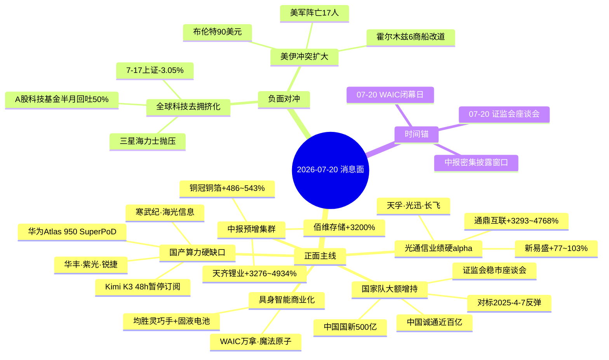

# 2026年7月20日 · **消息面事件驱动**

> **数据源新鲜度**: partial · **降级状态**: true(公众号池全 down) · **置信度**: 0.68  
> **覆盖窗口**: 前72h · **主源**: 财联社+新浪快讯2301条 + Tushare长篇要闻800条 + 东财中报预告500条 + 5焦点群99条

## 一句话结论

国家队"大额"三箭齐发+Kimi K3实锤国产算力硬缺口+WAIC超节点集体亮相,构成周一政策底+产业底双支撑;但存储/光模块前期高位股\"去拥挤化\"未止,策略侧重低位不追高。

## 🗺️ 消息面全景图

## 🎯 顶级事件详解(每事件三问 + 首推票思维链)

### E20260720_001 · 国家队三箭齐发 · strength=high · polarity=正面

**事件摘要**: 07-19晚,中国国新宣布已使用股票回购增持专项再贷款及配套资金超500亿元,中国诚通"大额"增持中国股票资产近百亿元,证监会07-20召开稳市座谈会。5独立源共振(新华社+证券时报+财联社+2群内KOL独立复盘)。

**推理深度三问**:
- **大资金意图**: 国家队在市场情绪最脆弱、大盘失守3800的窗口连发"大额"字眼,罕见程度对标 2025-4-7 那次"诚通增持"引发大反弹。表述从"增持"升级为"大额增持"是政策决心的语义边际强化。
- **为什么走强**: 全球科技资产去拥挤化已使 A 股 7-17 单日跌 3.05%,中信证券判断出清接近尾声,但缺一个"官方点火信号";周一证监会座谈会 + 500亿资金进场是最强点火。资金将首选券商 + 中字头 + 破净国企 + 宽基 ETF 直接标的。
- **逻辑够不够硬**: **硬**。历史相同关键词精准对应2025-4-7反弹起点,新增"大额"二字属语义强化;央视+新华社+证券时报三方官方源,信息可信度顶格;缺陷是仅政策底而非估值底,反弹力度可能弱于2025-4-7且需成交量确认。

**关联板块**: 券商、国资央企(中字头)、宽基ETF(沪深300/中证500/科创50)、破净国企

---

### E20260720_002 · Kimi K3 48h 需求爆表 → 国产算力硬缺口 · strength=high · polarity=正面

**事件摘要**: 华创计算机深夜纪要:Kimi K3发布48小时需求远超预期,月之暗面暂停C端订阅保障已有用户,直接印证国产算力紧缺;华创点名"寒武纪、海光信息"(Agent推理需求爆发);华福AI互联网杨晓峰团队21:30直播测评K3。

**推理深度三问**:
- **大资金意图**: 卖方在周日晚集体点名寒武纪+海光,是给周一开盘"补票"预留低吸窗口;买方需要一条对冲海外AI资产去拥挤化的**国产化替代**逻辑。K3暂停订阅是硬需求缺口,机构可用作Q3业绩兑现锚。
- **为什么走强**: 前期存储/光模块已被拥挤,资金需要一条**未拥挤**的国产算力副线;寒武纪、海光相较海外AI芯片链股价位置更低,叠加WAIC催化,是资金轮动的天然承接位。
- **逻辑够不够硬**: **较硬但需验证**。硬的是Kimi C端暂停订阅=实实在在算力紧缺;软的是国产芯片对Kimi的算力供给节奏和量级需财报进一步确认。华创卖方公开点名+群内KOL多点强化=3独立源,达到top_events门槛。

**首推票思维链**:

#### 寒武纪 688256 · role=国产AI芯片龙头
- **买入理由**: 华创计算机专项点名+Agent推理需求爆发+国产替代未拥挤+WAIC催化承接
- **风险点**: 短期已有涨幅,若周一开盘无成交量放大,可能陷入"利好兑现"日内高开低走
- **止损条件**: 破前低-3% or 日K跌破5日线且成交量萎缩
- **可验证假设**: 若周一 09:35 时 net_amount ≥ 0 + 板块光模块相对指数走弱 → 假设成立;若寒武纪反而流出且光模块走强,则为一日游

#### 海光信息 688041 · role=国产CPU/DCU
- **买入理由**: 华创点名+服务器CPU国产替代主赛道+估值相对合理
- **风险点**: 与英伟达/AMD路线竞争,若海外AI硬件恢复上涨则被虹吸
- **止损条件**: 破 60 日线 or 板块整体跌破前低
- **可验证假设**: 若北向净流入 + 券商开盘拉动 → 与E001共振买点

---

### E20260720_003 · WAIC 2026 国产超节点全面亮相 · strength=high · polarity=正面

**事件摘要**: 07-20 07:10证券时报:2026 WAIC现场国产超节点成为绝对焦点,华为昇腾Atlas 950 SuperPoD单柜1024卡集群最大扩至8192卡,远期集群上限50万卡;中信通信WAIC点评"华丰/胜蓝/锐捷/紫光核心受益";国家能源局同步定调"算电双向赋能"。

**推理深度三问**:
- **大资金意图**: WAIC是华为叙事年度最大公开场,产业级信念锚;超节点=算力集群化=对国产PCB/铜连接/液冷的天量CapEx,机构需在"华为超节点第一份订单落地前"完成建仓。
- **为什么走强**: 与E002构成双头共振(Kimi需要算力↔华为提供超节点),资金内部形成闭环;算电协同官方定调打开储能新方向。
- **逻辑够不够硬**: **硬**。中信通信卖方点名+官方媒体报道+多家上市公司WAIC签约实锤;缺陷是WAIC 07-20闭幕,催化窗口紧;首推票选择要看开盘资金承接强度。

**首推票思维链**:

#### 华丰科技 605100 · role=超节点铜连接
- **买入理由**: 中信通信直接点名超节点铜连接核心受益+超节点物料清单硬alpha
- **风险点**: 前期已炒过,若板块整体不走则容易杀估值
- **止损条件**: 跌破5日线且量能萎缩,或板块龙头断板
- **可验证假设**: 竞价溢价 ≥ +3% 且量能放大 = 强承接

#### 锐捷网络 301165 · role=超节点+光通信双击
- **买入理由**: 中信通信点名+光通信同板块业绩预告集体高增+超节点整机受益
- **风险点**: 存在与光模块"去拥挤化"的板块牵连(见E005);中报未直接披露前存在估值预期差
- **止损条件**: 破 5 日线;板块光模块指数二次探底
- **可验证假设**: 若周一光模块相对指数收正 → 假设成立;反之为拥挤对冲

#### 紫光股份 000938 · role=新华三算力
- **买入理由**: 中信点名+新华三国产算力服务器主赛道+相对未拥挤
- **风险点**: 主业混合(消费电子+算力),弹性弱于纯算力标的
- **止损条件**: 破前低-3%
- **可验证假设**: 与华丰同步走强则确认板块效应

---

### E20260720_004 · 光模块全线业绩预告高增 · strength=high · polarity=正面

**事件摘要**: 07-19 16:30 新易盛(300502)公告H1归母 70-80亿元(+77.56~102.93%),财联社07-20 07:05综述:光通信板块(新易盛、天孚、光迅、长飞、亨通、永鼎、光库、长芯博创、剑桥、德科立、东田微)全线预告高增,AI算力驱动订单能见度充足。

**推理深度三问**:
- **大资金意图**: 光模块是2026上半年最拥挤板块,业绩预告是机构判定"景气兑现or估值透支"的关键节点;新易盛+77~103%实锤订单能见度,给拥挤资金一个"止跌不走"的理由。
- **为什么走强**: 硬业绩vs拥挤对冲的对垒,若E001国家队进场稳住风偏,资金可能选择低吸而非割肉。
- **逻辑够不够硬**: **业绩硬但拥挤软**。业绩硬alpha无争议,通鼎互联扣非+3293~4768%尤其惊艳;软的是短期筹码结构未修复,择低吸不追高是主策略。

**首推票**:

#### 新易盛 300502 · role=光模块龙头
- **买入理由**: 归母+77.56~102.93%业绩硬alpha+AI算力订单能见度顶格
- **风险点**: 前期涨幅巨大,机构基金半月回吐50%,存在筹码抛压
- **止损条件**: 若跌破 60 日线或前低 -5% 立即止损
- **可验证假设**: 若周一开盘平开或低开 -2% 内 + 30 分钟内翻红 = 拥挤出清完成;否则等第二天

---

### E20260720_005 · 全球科技\"去拥挤化\" · strength=high · polarity=**负面**(红线3必列)

**事件摘要**: 证券时报07-20 07:13:A股科技主题基金半月回吐50%收益,韩国半导体三星电子+SK海力士6月下旬以来单边下跌,中韩半导体ETF华泰柏瑞7月跌幅超30%;港股南方两倍做多海力士本周跌49.89%;7-17上证跌3.05%失守3800,5000股下跌。

**推理深度三问**:
- **大资金意图**: 海外资金主动缩表科技持仓,通过跨市场传导到A股拥挤板块;主动去拥挤而非基本面恶化。
- **为什么走弱**: 微观流动性冲击(海外机构降杠杆) + 赛道拥挤度过高,不是基本面问题。中信证券判断出清接近尾声。
- **逻辑够不够硬**: **短期负面硬**。5独立源(证券时报×2、财联社、中信证券、中泰电子专场、颜晓滨群)交叉共振;缺陷是若E001国家队进场则可能快速止跌,负面持续窗口≤1-2周。

**关联负面板块**: 存储/HBM高位股、光模块高位股、半导体设计、科技拥挤ETF标的(避开首推,择低吸低位科技如AI应用/国产算力)

---

### E20260720_006 · 中报业绩硬alpha集群 · strength=medium · polarity=正面

**事件摘要**: eastmoney_earnings_predict 500条中,top业绩预告集中在铜箔/锂电/存储/光通信/AI算力基础设施:铜冠铜箔归母+486~543%,天齐锂业归母+3276~4934%(扭亏),佰维存储扭亏+3200%,通鼎互联扣非+3293~4768%,协创数据(AI算力转型)扣非+255~350%,鹏辉能源(AI数据中心储能)扭亏+1006%。

**关联板块**: 高频高速铜箔/PCB上游、锂矿锂电、存储、储能、AI算力基础设施

---

### E20260720_007 · 美伊冲突升级 · strength=high · polarity=混合

**事件摘要**: 布伦特原油突破90美元,美军累计阵亡17人,霍尔木兹海峡6艘商船改道;伊朗多地导弹瞄准美军基地。

**关联板块**: 油气(+) / 军工军贸(+) / 黄金避险(+) / 航运油运(+) / 大盘风险偏好(-)

---

### E20260720_008 · 13936行政令终止 · strength=medium · polarity=正面 · single_source=true

**事件摘要**: 商务部07-17 20:00答记者问:美方确认终止 2020 年13936行政令,港股中资企业不再被划为高风险资产;颜晓滨群07-19 16:13复述。

**关联板块**: 港股中资科技/创新药/沪港深/南向(长线级利好,月度窗口)

---

### E20260720_009 · 具身智能商业化提速 · strength=medium · polarity=正面

**事件摘要**: 均胜电子WAIC首发灵巧手+固液混合电池+控制器量产供货;万拿机器人发布Std16A+Eco12灵巧手;魔法原子与市北高新战略合作;大晓机器人发布世界模型3.1。

**首推**: 均胜电子 600699

---

## 📊 板块 × 事件热力矩阵

| 板块 | 事件锚 | 首推龙头 | 独立源数 | 中报预告 | 净综合置信 |
|------|--------|----------|:--:|:--:|:--:|
| 国产算力/AI芯片 | E002 Kimi+E003 WAIC | 寒武纪·海光·紫光 | 4+4 | 有(部分) | 🟢🟢🟢 |
| 光通信/CPO/LPO | E004+E006 业绩硬alpha | 新易盛·锐捷网络·通鼎 | 4+3 | +77~4768% | 🟢🟢(拥挤对冲) |
| 国资央企/券商/宽基ETF | E001 国家队 | 中字头·券商·ETF | 5 | - | 🟢🟢🟢 |
| 超节点铜连接/PCB | E003 WAIC | 华丰科技 | 4 | - | 🟢🟢 |
| 铜箔/锂电 | E006 业绩 | 铜冠铜箔·天齐锂业 | 3 | +486~4934% | 🟢🟢 |
| 具身智能 | E003+E009 WAIC | 均胜电子 | 3 | - | 🟢🟢 |
| 存储/HBM | E005 拥挤 vs E006 业绩 | ⚠️不首推 | 5 | +3200%(佰维) | 🟡 |
| 油气军工黄金 | E007 美伊 | ⚠️主线择时对冲 | 3 | - | 🟡 |
| 港股中资 | E008 13936 | 长线 | 1 | - | 🟡(单源) |
| 科技拥挤高位股 | E005 | ❌回避 | 5 | - | 🔴 |

## 🔥 中报业绩预告命中(硬alpha交叉验证)

从 `eastmoney_earnings_predict` 500 条中提取 top 预增 × 本文事件板块交集:

| 代码 | 名称 | 预告类型 | 增速下限-上限 | 事件命中 | 逻辑强度 |
|------|------|----------|:--:|:--:|:--:|
| 300502.SZ | 新易盛 | 预增 | +77.56~102.93% | E004 光模块+E005拥挤对冲 | 🟢🟢 |
| 002491.SZ | 通鼎互联 | 预增 | 扣非+3293~4768% | E004 光通信 | 🟢🟢🟢 |
| 301217.SZ | 铜冠铜箔 | 预增 | +486.49~543.7%(扣非+724~806%) | E006 高频铜箔 | 🟢🟢🟢 |
| 002466.SZ | 天齐锂业 | 预增/扭亏 | 归母+3276~4934%(扣非+212778~318081%) | E006 锂矿 | 🟢🟢🟢 |
| 688525.SH | 佰维存储 | 扭亏 | 归母+3200.15~3421.59% | E006 存储 vs E005 拥挤 | 🟡(对冲) |
| 300857.SZ | 协创数据 | 预增 | 扣非+255~350% | E006 AI算力转型 | 🟢🟢 |
| 300438.SZ | 鹏辉能源 | 扭亏 | 归母+1006~1081% | E006 AI数据中心储能 | 🟢🟢 |
| 688308.SH | 欧科亿 | 预增 | +46327~54065%(扣非) | E006 | 🟢🟢 |
| 688388.SH | 嘉元科技 | 预增 | 扣非+1541~1734% | E006 铜箔 | 🟢🟢 |
| 301536.SZ | 星宸科技 | 预增 | +583.72~715.69% | 半导体设计 | 🟢 |
| 688400.SH | 凌云光 | 预增 | +590% | 机器视觉/机器人 | 🟢🟢 |
| 688449.SH | 联芸科技 | 预增 | +821% | 存储主控 | 🟡 |
| 688255.SH | 凯尔达 | 预增 | +903~1191% | 机器人焊接 | 🟢 |

## 关键证据

- 证据 1: 中国诚通"大额"增持中国股票资产近百亿元 · 新华社 2026-07-19 22:30
- 证据 2: 中国国新 500 亿股票回购增持专项再贷款 · 财联社 2026-07-20 06:10
- 证据 3: 证监会7-20召开稳市座谈会 · 证券时报 2026-07-19 23:47
- 证据 4: 华为 Atlas 950 SuperPoD 单柜 1024 卡集群 50 万卡上限 · 证券时报 2026-07-20 07:10
- 证据 5: Kimi K3发布48h暂停C端订阅 · 华创计算机 2026-07-19 23:40
- 证据 6: 新易盛(300502) 半年报归母+77.56~102.93% · 财联社 2026-07-19 16:30
- 证据 7: 铜冠铜箔+486~543% 高频铜箔供不应求 · 财联社 2026-07-19 17:05
- 证据 8: 布伦特原油突破90美元 · 央视新闻 2026-07-20 07:14
- 证据 9: 三星海力士单边急跌 中韩半导体ETF7月跌超30% · 财联社 2026-07-20 05:04
- 证据 10: 中国国新对标2025-4-7大反弹 · 唐佳@财通电子+颜晓滨 独立复盘

## 数据源审计

| 源 | 日期 | 状态 | 备注 |
|---|---|:--:|---|
| tushare/news_cls | 2026-07-20 | 🟢 | 2301条·72h回看 |
| tushare/news_major | 2026-07-20 | 🟢 | 800条 |
| eastmoney/earnings_predict | 2026-07-20 | 🟢 | 500条·2026H1 |
| wechat_official_20 | 2026-07-20 | 🔴 | 0篇·23/23 invalid session(**全池 down**) |
| wechat_cli_5groups | 2026-07-20 | 🟢 | 99条·5焦点群(匿名) |
| mcp/tushare | 2026-07-20 | 🟢 | 交叉校验用 |
| mcp/hithink | 2026-07-20 | 🟢 | 备用可查 |
| xtick/hot_news | 2026-07-20 | 🟡 | 未直接调用(news_cls已覆盖) |

## 不确定性 / 反证

1. **公众号池全down**:盘前纪要缺失,首推票映射粒度略降;若周一开盘发现更细产业链归因(如 具身智能减速器/传感器细分股)在缺失覆盖内,应视为漏检。
2. **国家队反弹强度不确定**:2025-4-7对标是市场情绪最恐慌+估值最低时,当前估值不算便宜;反弹力度存在弱于预期风险,不宜追高。
3. **光模块业绩硬alpha vs 拥挤出清对冲**:两方向并存,若开盘出现光模块高开急杀,则拥挤方主导,业绩利好被吞;策略必须择低吸不追高。
4. **佰维存储正负交织**:硬业绩+3200% vs 存储板块拥挤抛压,资金选择方向决定短期走势,需P1竞价决策。
5. **13936行政令仅1独立源**:颜晓滨群单点转述商务部公告,D1消费前需announcement-search/news-search二次核验。
6. **美伊冲突边际强度衰减**:主要事件已4-5天,若周一无新增打击则油气军工的溢价空间收窄。

## 与其他 R/D/E 的关系

- 依赖: fetch_all_sources_v1(数据源采集)、manifest.json(严重度=3)
- 被消费: R2 主线板块(超节点/AI算力/国资央企) · R5 个股画像(首推票列表) · R6 反证(拥挤对冲负面事件) · D1 主决策预案 · P1 竞价校准(佰维存储正负交织)
- 未落盘: R3情绪(kol_confirm字段留pending,D1消费时补交叉)

## Sub-Agent 元数据

- skill: analyze_news_impact_v1@1.1
- artifact: data/research/20260720/R4_news.json
- method: llm_v1(降级·公众号全down·news_extras主源·5焦点群卖方转述)
- 生成时刻: 2026-07-20T07:38:00+08:00
