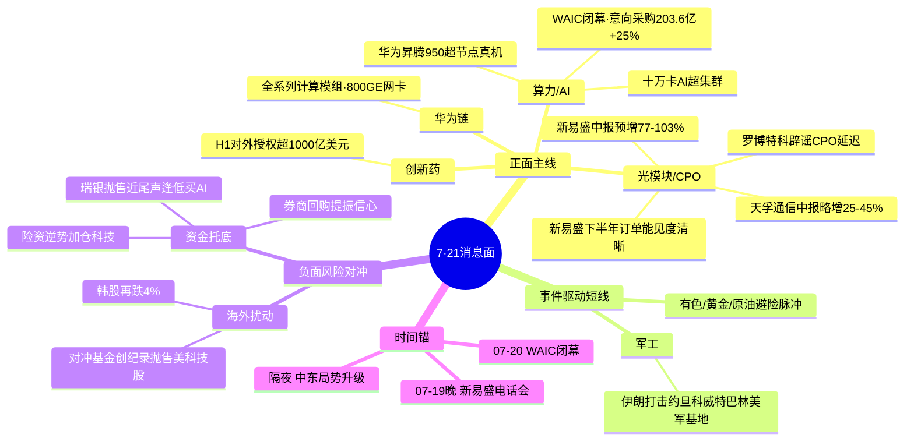

# 2026年7月21日(周二) · **消息面事件驱动**

> **数据源新鲜度**: partial · **降级状态**: true(公众号+群聊双源DOWN) · **置信度**: 0.68
> **覆盖窗口**: 前 72h(07-18 09:00 → 07-21 09:00) · **主源**: 财联社/新浪快讯 2366 条 + major_news 800 条 + 东财中报预告 500 条

## 一句话结论
WAIC2026闭幕点燃国产算力总攻主线(华为昇腾950真机+新易盛硬业绩双击),唯一负面是海外对冲基金创纪录抛售科技股的输入性扰动,但险资逆势加仓+券商回购已托底。

## 🗺️ 消息面全景图

## 🎯 顶级事件详解(每事件三问 + 首推票思维链)

### E20260721_001 · WAIC2026闭幕 · strength=high · polarity=正面

**事件摘要**: 2026世界人工智能大会7月20日在上海闭幕,现场观众超40万人次,组织全球177个采购团组,意向采购金额约203.6亿元同比+25%(新华社00:25)。人民日报头版+新闻联播同步综述,官方三源共振。

**推理深度三问**:
- **大资金意图**: WAIC是整周A股算力叙事的**国家级信念锚**。习近平出席开幕式+意向采购创新高,给机构提供了"AI是国策级确定性"的配置理由,资金借闭幕当口把预期从"看多"升级为"必配"。
- **为什么走强**: 会期内昇腾真机、十万卡集群、AI银行卡等落地成果密集,把抽象叙事转成可验证的产业进度;闭幕不是利好出尽,而是把分散在四天的催化聚合成一个交易日的情绪高点。
- **逻辑够不够硬**: **硬**。新华社+人民日报+新闻联播三官方源共振,采购金额有数据支撑;缺陷是"意向采购"非落地订单,情绪属性强于业绩属性。

### E20260721_002 · 华为WAIC全系列计算模组+昇腾950超节点真机 · strength=high · polarity=正面

**事件摘要**: 7月20日WAIC上华为首次完整展示全系列计算模组(网卡/SSD/DPU/RAID卡),国内首发800GE AI网卡支持10万级节点组网;昇腾950超节点真机首次公开亮相+全国产十万卡AI超集群(财联社15:42+国产算力分论坛18:22)。

**推理深度三问**:
- **大资金意图**: 华为=国产算力自主可控的**产业级旗帜**。在海外对冲基金抛售英伟达链的背景下,资金需要一条"不受美制裁影响"的内循环主线,昇腾真机精准补足了国产算力的落地证据。
- **为什么走强**: 昇腾950真机"首次公开"是从PPT到实物的关键跃迁;800GE网卡对标英伟达网络方案,直接映射国产光模块/PCB/服务器链CapEx。
- **逻辑够不够硬**: **硬**。财联社+官方分论坛+新闻联播多源,产品实物可验证;缺陷是华为链兑现节奏依赖昇腾出货,短期偏主题。

### E20260721_003 · 新易盛电话会+中报预增77-103% · strength=high · polarity=正面

**事件摘要**: 7月19日晚新易盛电话会:成都/泰国产能持续扩充,预计下半年订单交付快速增长,Q3/Q4及明年订单能见度清晰,NPO业务预计2027H2起量(财联社21:03/21:14/21:16)。中报预告扣非净利698-798亿元,同比+77.46%~102.88%(东财earnings_predict,notice 07-20)。

**推理深度三问**:
- **大资金意图**: 光模块是WAIC算力主线里**唯一有硬业绩兑现**的环节,机构在情绪主题里找业绩锚定,新易盛"叙事+业绩"双击成为首选配置。
- **为什么走强**: 电话会给出的"下半年订单能见度清晰"直接消除市场对光模块Q2见顶的担忧;77-103%的中报增速把估值切换逻辑坐实。
- **逻辑够不够硬**: **硬**。电话会纪要+中报预告+投资者关系记录表三源共振,业绩数据精确到分钟;缺陷是股价已在高位,需防利好兑现回调。

**首推票思维链**:

#### 新易盛 300502.SZ · role=光模块业绩龙头
- **买入理由**: 中报扣非净利同比+77.46%~102.88%(698-798亿)硬业绩 + 下半年订单能见度清晰 + 1.6T/NPO前瞻布局,是WAIC算力主线里业绩最硬的核心票。
- **风险点**: 股价处高位,若周一直接高开冲高追高风险大;受E005海外科技股抛售情绪短期扰动。
- **止损条件**: 破5日线 or 跌破前低 -3%;若开盘30分钟主力净流出则不追。
- **可验证假设**: 若周一开盘30分钟内 net_amount ≤ 0 或光模块板块指数走弱 → 高位兑现假设成立,当日回避不追高。

### E20260721_004 · 罗博特科辟谣CPO延迟 · strength=medium · polarity=正面

**事件摘要**: 罗博特科7月20日投资者关系活动记录表:关注到市场关于CPO延迟的传言,但作为设备端未从任何客户处获得CPO延迟消息,核心客户需求预测明确、高速增长(财联社00:26)。

**推理深度三问**:
- **大资金意图**: 直接对冲市场关于"CPO延迟利空光模块"的担忧,给算力主线扫清一个悬顶利空。
- **为什么走强**: 设备端一手信息比二级传言权威;叠加天孚通信中报略增25-45%,CPO/光模块景气得到交叉印证。
- **逻辑够不够硬**: **中**。单一公司口径,属澄清型而非增量催化,故strength封顶medium。

### E20260721_005 · 海外对冲基金创纪录抛售科技股(唯一负面) · strength=high · polarity=负面

**事件摘要**: 高盛主经纪商指出过去两个月对冲基金撤出美科技股速度创纪录,八周内六周净卖出,累计减持约10%(01:47);韩股综合指数再跌逾4%,A股短期受输入性情绪传导(财联社06:28+中证报券商研判)。

**推理深度三问**:
- **大资金意图**: 海外资金去杠杆/获利了结,与A股基本面无关,属外部输入性冲击。
- **为什么走强**(此处为反向·为什么是风险): 韩股大跌+美科技股抛售会通过情绪和北向资金传导到A股科技赛道,短期压制算力主线开盘情绪。
- **逻辑够不够硬**: **硬(作为风险)**。高盛数据+韩股实盘+多券商研判共振;但多方定性为"技术性回调非基本面逆转",E006形成对冲。

### E20260721_006 · 瑞银称抛售近尾声+险资加仓+券商回购 · strength=medium · polarity=正面

**事件摘要**: 瑞银交易部称动量股急剧抛售可能即将结束,建议逢低重建AI+半导体仓位(05:46);四大险企发声看好,部分险资逆势加仓科技股(06:32);华安/国联民生/红塔/中泰等券商密集回购(06:22);摩根大通称芯片回调是下一轮上涨蓄力。

**推理深度三问**:
- **大资金意图**: 机构+险资+券商三方托底信号,意在稳定市场预期,给E005的负面情绪封底。
- **为什么走强**: 险资"逆势加仓科技"是真金白银的多头信号,与瑞银/摩根大通判断形成"外资看多+内资加仓"共振。
- **逻辑够不够硬**: **中**。属研判+意愿性表态,加仓规模未量化,故medium。

### E20260721_007 · 中东局势升级(伊朗打击美军基地) · strength=medium · polarity=正面

**事件摘要**: 伊朗革命卫队7月20日对约旦/科威特/巴林美军基地实施打击,发射弹道导弹+无人机;约旦拦截3枚导弹;胡塞反舰导弹待命(财联社02:54/03:22/05:25)。

**推理深度三问**:
- **大资金意图**: 地缘冲突升级催化军工+避险资产(黄金/原油)的短线脉冲,资金做事件驱动博弈。
- **为什么走强**: A股军工板块近72h新闻热度139条(仅次于算力),情绪基础充足;地缘事件是典型的短线情绪催化。
- **逻辑够不够硬**: **中**。地缘事件持续性和传导幅度不确定,属短线脉冲而非趋势主线,故medium。

### E20260721_008 · H1创新药对外授权超1000亿美元创新高 · strength=medium · polarity=正面

**事件摘要**: 工信部国新办发布会:H1我国38款创新药获批(31款国产),对外技术授权交易总额超1000亿美元创新高(12:24);海正药业股东大会通过引进艾缇亚化药1类创新药独家授权合作(21:38)。

**推理深度三问**:
- **大资金意图**: 创新药出海BD是独立于算力的第二条产业趋势线,给资金提供主线之外的分散配置。
- **为什么走强**: 授权总额创新高是产业级数据,验证国产创新药全球竞争力提升。
- **逻辑够不够硬**: **中**。产业趋势硬但非当日算力主线,属背景性利好,故medium。

## 📊 板块 × 事件热力矩阵

| 板块 | 事件锚 | 首推龙头 | 独立源数 | 中报预告 | 净综合置信 |
|------|--------|----------|:--:|----------|:--:|
| 算力/AI | E001 WAIC闭幕 + E002 华为 | (板块级) | 3 | — | 🟢🟢🟢 |
| 光模块/CPO | E003 新易盛 + E004 罗博特科 | 新易盛 | 3 | +77~103% | 🟢🟢🟢 |
| 华为链/国产算力 | E002 昇腾950真机 | (板块级) | 3 | — | 🟢🟢🟢 |
| 军工 | E007 中东局势 | (事件驱动) | 3 | — | 🟡 |
| 创新药 | E008 授权创新高 | 海正药业(关联) | 2 | — | 🟡 |
| 券商 | E006 回购+研判 | (板块级) | 3 | — | 🟡 |
| 半导体/制程 | E005 负面 / E002 正面 | — | 3 | — | 🟡(正负交织) |

## 🔥 中报业绩预告命中(硬 alpha 交叉验证)

从 `eastmoney_earnings_predict`(2026-06-30 报告期,500 条)提取与本文事件板块交集:

| 代码 | 名称 | 预告类型 | 增速下限-上限 | 事件命中 | 逻辑强度 |
|------|------|----------|--------------|----------|:--:|
| 300502.SZ | 新易盛 | 预增 | +77.46%~102.88%(扣非698-798亿) | E003 光模块电话会 | 🟢🟢🟢 |
| 300394.SZ | 天孚通信 | 略增 | +25%~45%(净利112-130亿) | E004 CPO景气 | 🟢🟢 |
| 688041.SH | 海光信息 | 预增 | +41.5%~52.32%(净利170-183亿) | E002 国产算力 | 🟢🟢 |

## 关键证据

- 证据 1: WAIC意向采购金额约203.6亿元同比+25%,现场观众超40万人次 · 新华社 · 2026-07-20
- 证据 2: 华为昇腾950超节点真机首次公开+全国产十万卡AI超集群 · 财联社+国产算力分论坛 · 2026-07-20
- 证据 3: 新易盛中报扣非净利698-798亿元同比+77.46%~102.88% · 东财earnings_predict · notice 2026-07-20
- 证据 4: 对冲基金八周内六周净卖出美科技股,累计减持约10% · 高盛主经纪商 · 2026-07-21
- 证据 5: 险资逆势加仓科技股+四家券商密集回购 · 财联社/中证报 · 2026-07-21

## 数据源审计

| 源 | 日期 | 状态 | 备注 |
|---|---|:--:|---|
| tushare/news_cls | 2026-07-21 | 🟢 | 2366 条 · 72h 回看(07-18→07-21) |
| tushare/news_major | 2026-07-21 | 🟢 | 800 条长篇要闻 |
| eastmoney/earnings_predict | 2026-07-21 | 🟢 | 500 条 · 2026H1(06-30) |
| wechat_official_20 | 2026-07-21 | 🔴 | 23账号全 invalid session · 0 篇 |
| wechat_cli_5groups | 2026-07-21 | 🔴 | 未落盘 · 焦点群缺席 |
| xtick/hot_news | 2026-07-21 | ⚪ | 未调用 · news_cls 已覆盖 |

## 不确定性 / 反证

1. **公众号+群聊双源DOWN**: 21号公众号池(含"盘前纪要")23账号全invalid session,5焦点群未落盘,KOL口播维度完全缺失,无法做R3情绪交叉验证 → degraded=true,置信度封顶0.68。
2. **正负交织(半导体/算力)**: E002华为链正面 vs E005海外抛售负面同时作用于科技赛道,开盘方向取决于北向资金和情绪谁占上风,存在高开低走风险。
3. **WAIC属"利好兑现"临界**: 闭幕日情绪高点,存在"利好出尽"回调可能,203.6亿是意向非落地订单。
4. **新易盛高位追高风险**: 硬业绩已被市场部分预期,股价高位,需防利好兑现型回调。
5. **军工/中东事件持续性存疑**: 地缘脉冲难以量化传导幅度,属短线情绪非趋势。

## 与其他 R/D/E 的关系

- 依赖: data/raw/20260721/{news_cls, news_major, eastmoney_earnings_predict, mcp_health}
- 被消费: R2 主线(算力/光模块) · R5 个股画像(新易盛/海光/天孚) · R6 反证(E005负面对冲) · D1 预案

## Sub-Agent 元数据

- skill: analyze_news_impact_v1@1.1
- artifact: data/research/20260721/R4_news.json
- method: llm_v1(五源硬约束·公众号/群聊降级)
- 生成时刻: 2026-07-21T07:40:00+08:00
