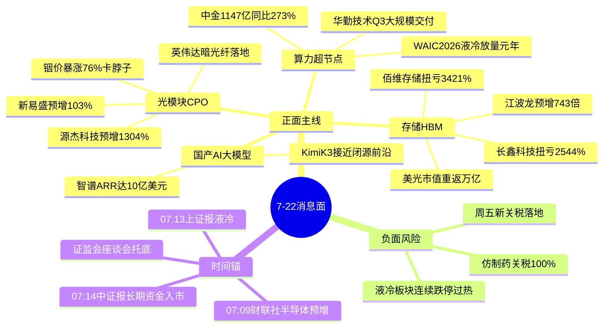

# 2026年7月22日 · **消息面事件驱动**

> **数据源新鲜度**: partial · **降级状态**: true(公众号全灭) · **置信度**: 0.68
> **覆盖窗口**: 前 72h · **主源**: 财联社快讯(2918条) + Tushare major_news(800条) + 5 焦点群(578条) + 东财中报预告(500条)

## 一句话结论

半导体产业链中报大面积预增点燃存储/光模块/超节点三主线共振；唯一负面对冲为美国仿制药关税与周五新关税落地的风险偏好压制。

## 🗺️ 消息面全景图

## 🎯 顶级事件详解(每事件三问 + 首推票思维链)

### E20260722_001 · 半导体产业链中报大面积预增 · strength=high · polarity=正面

**事件摘要**: 财联社 07:09 快讯"最高预增743倍，半年度利润高达110亿元，以存储模组龙头江波龙为代表，A股半导体公司上半年业绩大面积预喜"。news_major 06:43 长篇《AI算力需求驱动+产品涨价 半导体产业链上半年业绩大面积预增》呼应。外部锚:美股明星存储股集体飙涨两位数、美光市值重返万亿(06:05)。三源共振 + 中报预告硬 alpha 交叉命中。

**推理深度三问**:
- **大资金意图**: 存储是本轮 AI 算力叙事里唯一"量价齐升 + 财报可验证"的环节，机构在业绩空窗期需要拿"确定性兑现"的票做进攻仓位，中报预增是把"预期"变成"事实"的关键催化 → 从看多升级为配置。
- **为什么走强**: AI 算力需求爆发 + DRAM/HBM 涨价双击，业绩是滞后确认的第二段行情；美光财报电话会全产业链需求指引 + 市值重返万亿提供外部映射，A 股存储链顺势补涨。
- **逻辑够不够硬**: **硬**。财联社快讯 + major 长篇 + 美股映射三源 + 佰维/长鑫中报预告实打实扭亏 3000%+，是"新闻叙事 + 财报数据"双重锚定。缺陷:HBM4 良率攻坚、通用 DRAM 涨价放缓提示涨价节奏边际走弱。

**首推票思维链**:

#### 佰维存储 688525 · role=存储模组龙头
- **买入理由**: 中报预告扭亏 2776%~3421%(交叉查 eastmoney_earnings_predict 命中)，处于半导体业绩预增主线核心；AI 算力 + 涨价双击。
- **风险点**: 科创板高波动，若存储涨价放缓预期发酵易高位杀跌；已有一波涨幅追高风险。
- **止损条件**: 破 5 日线 or 跌破前低 -3%。
- **可验证假设**: 若周一开盘 30 分钟内主力净额 ≤ 0 或存储板块不能领涨 → 假设不成立，当日回避。

#### 长鑫科技 688825 · role=国产存储候选
- **买入理由**: 中报扭亏 1714%~2544%，华西计算机首推"中国存·存世界"(陆家嘴群 07-21 08:57);国产替代 + 业绩双逻辑。
- **风险点**: 次新/科创板估值高，情绪退潮首当其冲。
- **止损条件**: 破 5 日线或单日放量滞涨 -4%。
- **可验证假设**: 若北向对半导体不净流入 + 板块量能萎缩 → 逻辑走弱。

### E20260722_004 · AI光模块缺口70%+铟价暴涨76% · strength=high · polarity=正面

**事件摘要**: 专注核心群 07-21 确认"英伟达自研长距暗光纤网络项目确已落地"(产业链人脉核实);财联社链接"缺口70%、铟价暴涨76%！AI狂奔背后谁卡住光模块命门";源杰科技中报预增最高 1304%。三源共振。

**推理深度三问**:
- **大资金意图**: 光模块是 AI 算力"卖铲子"里弹性最大、业绩最先兑现的环节，英伟达暗光纤落地把叙事从"GPU"外延到"光互联"，机构借新催化拔估值。
- **为什么走强**: 800G/1.6T + CPO 放量 + 上游铟/磷化铟卡脖子涨价，供需双紧;开源蒋颖(通信首席)全天力挺"全球 AI 算力全产业链"强化情绪。
- **逻辑够不够硬**: **硬**。英伟达暗光纤(产业链核实)+ 光模块缺口(财联社)+ 源杰中报硬业绩三源共振;缺陷是铟价、暗光纤更多利好上游/远期，短期需龙头承接。

**首推票思维链**:

#### 源杰科技 688498 · role=光芯片龙头
- **买入理由**: 中报预增 1196%~1304%(eastmoney 命中，三条预告全指向高增)，光芯片直接受益 800G/1.6T + CPO 放量。
- **风险点**: 科创板小市值高波动，光模块板块整体已高位。
- **止损条件**: 破 5 日线 or 跌破前低 -3%。
- **可验证假设**: 若周一光模块指数不能红盘 + 个股不放量 → 短期逻辑未被市场认可，回避。

### E20260722_002 · 算力超节点带火液冷 · strength=high · polarity=正面(交织)

**事件摘要**: 上证报 07:13/财联社 03:22《算力超节点带火液冷 浸没式液冷崭露头角》，WAIC 2026 华为/中兴/新华三/浪潮超节点热管理全线向液冷升级;中金预测 2026 液冷放量元年市场 1147 亿同比 +273%。华勤技术公告超节点 Q3 大规模交付全年破 100 亿。

**推理深度三问**:
- **大资金意图**: 超节点是数据中心趋势型产品，华勤"最早卡位 + Q3 大规模交付"给了业绩兑现路径，资金找算力硬件里"新叙事 + 有订单"的方向。
- **为什么走强**: WAIC 催化 + 中金 273% 增速定调 + 液冷从冷板向浸没式升级打开空间。
- **逻辑够不够硬**: **中等偏硬但有杂音**。题材硬(WAIC+中金+华勤订单)，但液冷服务器板块已连续 3-4 日跌停(金富科技 4 连跌停)，属过热杀跌后的题材回摆，需低吸不追高。

**首推票思维链**:

#### 华勤技术 603296 · role=超节点先发龙头
- **买入理由**: 超节点 Q3 起大规模交付、全年收入预计破 100 亿(投资者关系公告)，是超节点里少数有明确订单指引的标的。
- **风险点**: 无中报预告(未在 eastmoney 500 条内)，业绩确定性弱于存储链;液冷板块过热杀跌情绪传导。
- **止损条件**: 破 5 日线 or 板块二次跌停潮 -4%。
- **可验证假设**: 若超节点/液冷方向周一继续跌停扩散 → 情绪未修复，回避等右侧。

## 📊 板块 × 事件热力矩阵

| 板块 | 事件锚 | 首推龙头 | 独立源数 | 中报预告 | 净综合置信 |
|------|--------|----------|----------|----------|:--:|
| 存储/HBM | E001 半导体预增 | 佰维存储 | 4 | 扭亏 2776~3421% | 🟢🟢🟢 |
| 光模块/CPO | E004 光模块缺口 | 源杰科技 | 3 | 预增 1196~1304% | 🟢🟢🟢 |
| 算力超节点 | E002 液冷+超节点 | 华勤技术 | 3 | 无 | 🟢🟢🟡 |
| 液冷/温控 | E002 液冷元年 | (回避追高) | 3 | 金富科技预增81~125% | 🟡 |
| 国产AI大模型 | E005 Kimi K3 | (KOL映射不出首推) | 3 | 无 | 🟡 |
| 券商/大金融 | E003 长期资金入市 | (beta无首推) | 3 | — | 🟢🟡 |
| 仿制药/出口链 | E006 关税 | — | 2 | — | 🔴 |

## 🔥 中报业绩预告命中(硬 alpha 交叉验证)

从 `eastmoney_earnings_predict`(500 条·2026H1) 提取 top 预增 + 与本文事件板块交集:

| 代码 | 名称 | 预告类型 | 增速下限-上限 | 事件命中 | 逻辑强度 |
|------|------|----------|--------------|----------|:--:|
| 688525.SH | 佰维存储 | 扭亏 | 2776%~3421% | E001 半导体预增 | 🟢🟢🟢 |
| 688825.SH | 长鑫科技 | 扭亏 | 1714%~2544% | E001 存储/国产替代 | 🟢🟢🟢 |
| 688498.SH | 源杰科技 | 预增 | 1196%~1304% | E004 光模块缺口 | 🟢🟢🟢 |
| 300502.SZ | 新易盛 | 预增 | 77%~103% | E004 光模块 | 🟢🟢 |
| 003018.SZ | 金富科技 | 预增 | 103%~125% | E002 液冷(⚠️连续跌停) | 🟡 |
| 300394.SZ | 天孚通信 | 略增 | 25%~48% | E004 光模块 | 🟢 |
| 002466.SZ | 天齐锂业 | 预增 | 3276%~4934% | 未命中本文事件(锂电独立) | 🟡 |

> 全市场 top 预增(天齐锂业/欧科亿/嘉元科技等)多在锂电/材料链，与本文 AI 算力主线无交集，未纳入首推。

## 关键证据

- 证据 1: "最高预增743倍…存储模组龙头江波龙为代表A股半导体公司上半年业绩大面积预喜" · 财联社 · 2026-07-22 07:09
- 证据 2: "英伟达自研长距暗光纤网络项目确已落地(产业链人脉核实)" · 专注核心群 · 2026-07-21 09:12
- 证据 3: "中金预测2026液冷放量元年 市场达1147亿同比+273%" · 上海证券报 · 2026-07-22 07:13
- 证据 4: "华勤技术超节点Q3起大规模交付 全年收入预计破100亿" · 投资者关系公告 · 2026-07-21 15:37
- 证据 5(负面): "特朗普计划2028年8月起对仿制药征收100%关税；美国最快周五对数十经济体加征新关税" · 财联社 · 2026-07-22 07:05

## 数据源审计

| 源 | 日期 | 状态 | 备注 |
|---|---|:--:|---|
| tushare/news_cls | 2026-07-22 | 🟢 | 2918 条·72h 回看 |
| tushare/news_major | 2026-07-22 | 🟢 | 800 条 |
| eastmoney/earnings_predict | 2026-07-22 | 🟢 | 500 条·2026H1 |
| wechat_official_20 | 2026-07-22 | 🔴 | 23/23 invalid session·公众号全灭 |
| wechat_cli_5groups | 2026-07-22 | 🟢 | 578 条·5 焦点群(匿名) |
| xtick/hot_news | 2026-07-22 | 🟡 | 未直采·news_cls 已覆盖财联社 |

## 不确定性 / 反证

1. **公众号全灭(23/23)** — 缺失"财联社早知道""盘前纪要""安静拆主线"等结构化盘前，主线判断更依赖 news_cls 快讯与群聊二次口播，可能漏掉公众号独家的涨停归因。
2. **液冷正负交织** — E002 题材硬但板块连续 3-4 日跌停(金富科技 4 连跌停)，若归为"利好出尽后杀跌"，则超节点/液冷首推华勤存在情绪拖累风险，标为 🟡 不追高。
3. **国产 AI 大模型个股 single_source** — 浙数文化/首都在线/九安医疗均来自群聊 KOL 二次口播(松/AA 盘中群)，无公告/研报原文，顶格 medium 未入首推，避免踩 KOL 单点风险。
4. **存储涨价边际走弱** — HBM4 良率攻坚 + 通用 DRAM 涨价放缓，存储链业绩虽兑现但涨价预期可能已在高位，追高需谨慎。
5. **关税负面被低估风险** — 周五新关税落地时点临近，若涉及科技/半导体则可能压制本文全部正面主线的风险偏好。

## 与其他 R/D/E 的关系

- 依赖: data/raw/20260722/(news_cls / news_major / eastmoney_earnings_predict / wechat_cli_5groups / manifest)
- 被消费: R2 主线板块 / R5 个股画像 / R6 反证 / D1 预案

## Sub-Agent 元数据

- skill: analyze_news_impact_v1@1.1
- artifact: data/research/20260722/R4_news.json
- method: llm_v1(硬扩容·五源硬约束·公众号降级)
- 生成时刻: 2026-07-22T07:42:00+08:00
