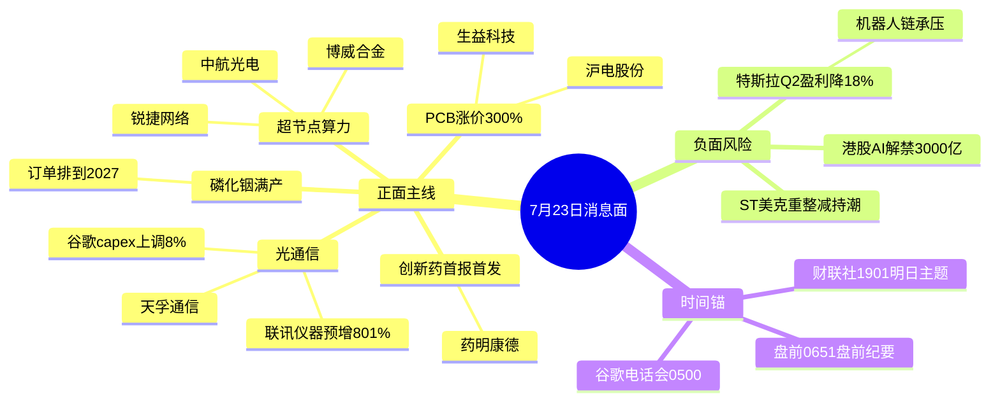

# 2026年7月23日 · **消息面事件驱动**

> **数据源新鲜度**: partial · **降级状态**: false · **置信度**: 0.74
> **覆盖窗口**: 前72h · **主源**: 财联社快讯2987条 + 21号公众号115篇(含**盘前纪要**7点结构化) + 5焦点群480条 + 东财中报预告500条

## 一句话结论

超节点算力主线四源硬共振为今日绝对核心 谷歌capex上调8%接力光通信 唯一负面对冲特斯拉Q2盈利降18%机器人链回避追高。

## 🗺️ 消息面全景图

## 🎯 顶级事件详解(每事件三问 + 首推票思维链)

### E20260723_001 · 超节点成大模型推理主流形态 · strength=high · polarity=正面

**事件摘要**: 财联社《明日主题前瞻》(7-22 19:01)+盘前纪要WAIC 2026+开源蒋颖锐捷深度+news_major"超节点建设周期开启"四源硬共振。华为昇腾950超节点WAIC真机首秀 1024卡集群 1EFLOPS FP8。华泰/华鑫/华创券商定性产业趋势级 液冷/正交背板/高压直流供电(800VHVDC)配套价值量显著提升。

**推理深度三问**:
- **大资金意图**: 6月底以来AI硬件深度回撤(创业板昨跌超3%)后 机构需要一条"系统级商业化"新叙事重新聚拢筹码;超节点从"单卡竞争"升级为"整机柜方案" 把光互连/液冷/连接器全链拉成价值量确定性 = 机构从"看多算力"升级为"配置算力配套"。
- **为什么走强**: WAIC真机首秀把预期兑现为实物 华为昇腾950+浪潮元脑SD200+紫光UniPoD密集发布 2026被称"国产超节点放量元年";北京Token工厂政策(下半年新增5万P)提供财政级承接。
- **逻辑够不够硬**: **硬**。四独立源共振(财联社明日主题权重同官方+盘前纪要+开源券商深度+产业WAIC)+三家券商定性趋势级+与E006国产算力政策时间锚共振;缺陷是配套环节个股映射需R5核验成分归属。

**首推票思维链**:

#### 中航光电 002179 · role=超节点配套全矩阵龙头
- **买入理由**: 已形成电源类+光传输器件+高速连接器(112G及以上)+液冷散热完整矩阵 华泰点名;主板可execution
- **风险点**: 大盘蓝筹弹性偏弱 若主线切向弹性小票易跑输
- **止损条件**: 破5日线 or 板块炸板情绪退潮 -3%
- **可验证假设**: 若周一开盘30分钟内主力净额≤0 → 主线未被资金选中 当日回避

#### 锐捷网络 301165 · role=高端交换机/硅光/液冷(创业板watch)
- **买入理由**: 阿里腾讯字节数据中心交换机核心供应商 华鑫点名;蒋颖6月底部全市场唯一深度独家标的 双源共振
- **风险点**: 创业板不进execution_pool(仅watch);已有前期涨幅 追高风险
- **止损条件**: 破前低-3% or 交换机分支退潮
- **可验证假设**: 若北向+主力同步净流出 → 逻辑不成立 观察不追

### E20260723_002 · Alphabet资本开支上调8% 云积压订单5140亿 · strength=high · polarity=正面

**事件摘要**: 谷歌Q2电话会(news_cls 05:00逐条)全年capex从1800-1900亿上调至1950-2050亿美元(+8%) 云业务飙升82% 待交付订单激增至5140亿。盘前纪要转"Alphabet资本支出翻倍449亿"。

**推理深度三问**:
- **大资金意图**: 海外AI capex持续超预期是国内光通信/算力硬件最硬的基本面锚 机构借海外巨头指引确认国内光模块订单能见度;capex上修=下游需求可持续 资金敢于在回撤后重新加仓光互连。
- **为什么走强**: capex上调直接对应光互连/PCB订单;联讯仪器中报归母预增801-925%、天孚25-45%业绩已兑现 "预期→兑现"第二段催化。
- **逻辑够不够硬**: **硬**。海外capex(news_cls分钟级)+国内业绩预告双源;缺陷是谷歌盘后大跌(烧钱担忧)构成情绪面对冲 短期或高开低走。

**首推票思维链**:

#### 联讯仪器 688808 · role=光模块(科创板watch)
- **买入理由**: 中报归母净利预增801-925%(eastmoney_earnings_predict硬命中) 受益AI算力+数据中心光模块需求高速增长;谷歌capex上修直接映射
- **风险点**: 科创板不进execution(仅watch);业绩已公告 或利好兑现回落
- **止损条件**: 破5日线 or 高开幅度>7%不追
- **可验证假设**: 若开盘竞价高开超8%且分时走弱 → 利好出尽 回避

### E20260723_004 · 央视财经高端PCB涨超300%订单到2027 · strength=high · polarity=正面

**事件摘要**: 盘前纪要转央视财经 高速PCB涨价超3-4倍 AI服务器2026出货破200万台+55% 拉动高端PCB需求增超110% 头部订单锁到2027;news_major MLCC/PCB产业链景气。

**推理深度三问**:
- **大资金意图**: 央视官方背书使PCB从题材升级为"央视认证景气" 机构可名正言顺配置;涨价+订单双确定性提供安全垫。
- **为什么走强**: 覆铜板供不应求推升PCB成本进而提价 量价齐升;与超节点主线同属AI硬件价值链 联动效应。
- **逻辑够不够硬**: **硬**。央视官方源+产业新闻;铜冠铜箔中报预增486-543%硬alpha交叉命中。

**首推票思维链**:

#### 生益科技 600183 · role=覆铜板龙头
- **买入理由**: 高端覆铜板供不应求 PCB核心基材涨价直接受益;主板可execution
- **风险点**: 前期已有涨幅 板块高位
- **止损条件**: 破5日线-3%
- **可验证假设**: 若PCB分支周一无涨停家数扩散 → 主线不在此 观望

## 📊 板块 × 事件热力矩阵

| 板块 | 事件锚 | 首推龙头 | 独立源数 | 中报预告 | 净综合置信 |
|------|--------|----------|----------|----------|:--:|
| 超节点 | E001 WAIC真机 | 中航光电 | 4 | — | 🟢🟢🟢 |
| 光通信 | E002 谷歌capex | 联讯仪器 | 4 | +801~925% | 🟢🟢🟢 |
| 磷化铟 | E003 满产到2027 | (待R5核成分) | 4 | — | 🟢🟢 |
| PCB | E004 央视涨300% | 生益科技 | 3 | 铜冠铜箔+486% | 🟢🟢🟢 |
| 创新药 | E005 首报首发 | 药明康德 | 4 | — | 🟢🟢 |
| 国产算力 | E006 北京Token工厂 | 锐捷网络 | 3 | — | 🟢🟢🟢 |
| MLCC/存储 | E007 三星涨价 | 风华高科 | 3 | 佰维+3200% | 🟢🟢 |
| 黄金有色 | E008 金铜油共振 | 山金国际 | 3 | — | 🟢🟡 |
| 特斯拉链 | E009 Q2盈利降18% | (回避) | 3 | — | 🔴 |
| ST/减持 | E010 美克重整 | (回避) | 4 | — | 🔴 |

## 🔥 中报业绩预告命中(硬 alpha 交叉验证)

从 `eastmoney_earnings_predict`(500条) 提取与本文事件板块交集:

| 代码 | 名称 | 预告类型 | 增速下限-上限 | 事件命中 | 逻辑强度 |
|------|------|----------|--------------|----------|:--:|
| 688808 | 联讯仪器 | 归母预增 | 801.96%~925.75% | E002 光通信+谷歌capex | 🟢🟢🟢 |
| 688525 | 佰维存储 | 归母预增 | 3200%~3421% | E007 存储涨价 | 🟢🟢🟢 |
| 301217 | 铜冠铜箔 | 归母预增 | 486.49%~543.7% | E004 PCB/铜箔 | 🟢🟢🟢 |
| 688205 | 德科立 | 归母预增 | 216.8%~277.31% | E002 光模块 | 🟢🟢 |
| 300394 | 天孚通信 | 归母预增 | 25%~45% | E002 光器件 | 🟢🟢 |
| 688825 | 长鑫科技 | 归母预增 | 2244%~2544% | 存储/半导体(未入top) | 🟢🟢 |

## 关键证据

- 证据1: 财联社《明日主题前瞻》超节点配套环节价值量提升 · 财联社早知道 · 2026-07-22
- 证据2: 谷歌全年capex上调至1950-2050亿美元(+8%) 云积压订单5140亿 · tushare/news_cls · 2026-07-23
- 证据3: 央视财经高端PCB涨超300%订单到2027 · 盘前纪要转央视 · 2026-07-23
- 证据4: 联讯仪器中报归母预增801-925% · eastmoney/earnings_predict · 2026-07-23
- 证据5: 特斯拉Q2营收+26%但盈利-18%远逊预期 · tushare/news_major · 2026-07-23

## 数据源审计

| 源 | 日期 | 状态 | 备注 |
|---|---|:--:|---|
| tushare/news_cls | 2026-07-23 | 🟢 | 2987条·72h回看 |
| tushare/news_major | 2026-07-23 | 🟢 | 800条 |
| eastmoney/earnings_predict | 2026-07-23 | 🟢 | 500条·2026H1 |
| wechat_official_20 | 2026-07-23 | 🟢 | 115篇·23号池(含盘前纪要) |
| wechat_cli_5groups | 2026-07-23 | 🟢 | 480条·5焦点群(匿名) |
| R3_sentiment | — | 🔴 | 未落盘 KOL交叉降级 |
| mcp/agentqmt_qmt | 2026-07-23 | 🔴 | DOWN(不影响R4) |

## 不确定性 / 反证

1. **超节点配套个股映射置信度**: 中航光电/博威合金/恒为科技为券商研报点名 但具体订单弹性归属需R5画像核验 存在"蹭概念"杂毛风险。
2. **谷歌capex正负交织**: capex上调利好国内光通信 但谷歌盘后大跌(烧钱担忧+负现金流警报)可能拖累情绪 光模块或高开低走。
3. **KOL单点风险**: R3情绪artifact未落盘 KOL交叉验证以wechat_cli高频词(算力64/超节点14)代偿 非语义级独立验证 存在群消息回声室风险。
4. **业绩预告利好兑现风险**: 联讯仪器/佰维等已公告业绩 属"利好落地" 需防高开出货。
5. **有色情绪高位**: 黄金有色昨日已2板(长裕/盛达) 金铜油共振为隔夜宏观驱动 追高需防退潮。

## 与其他 R/D/E 的关系

- 依赖: 无上游artifact(R4与R1/R3/R7并行 07:30跑动)
- 被消费: R2主线(sectors_catalyzed→主线叙事) / R5画像(stocks_catalyzed→催化) / R6反证(事件夸大检查) / D1预案

## Sub-Agent 元数据

- skill: analyze_news_impact_v1@1.1
- artifact: data/research/20260723/R4_news.json
- method: llm_v1(硬扩容·五源硬约束·λ=0.15时间衰减)
- 生成时刻: 2026-07-23T07:45:00+08:00
