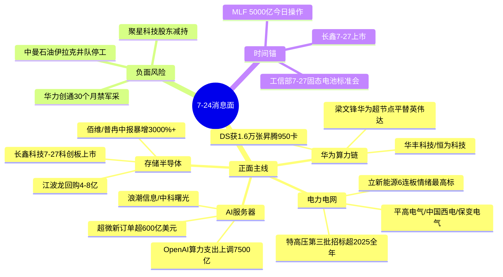

# 2026年7月24日 · **消息面事件驱动**

> **数据源新鲜度**: partial · **降级状态**: false · **置信度**: 0.73
> **覆盖窗口**: 前 72h · **主源**: 财联社快讯 + 23 号公众号(**盘前纪要**每日 7 点结构化盘前) + 5 焦点群 + 东财中报预告

## 一句话结论

电网设备特高压超级周期+华为超节点算力+存储中报暴增三主线多源硬共振 唯一负面华力创通军采禁令压制军工。

## 🗺️ 消息面全景图

## 🎯 顶级事件详解(每事件三问 + 首推票思维链)

### E20260724_001 · 特高压第三批招标超2025全年+电网全线爆发 · strength=high · polarity=正面

**事件摘要**: 国家电网2026年第三批特高压/输变电设备招标候选名单公示，前三批采购总额已超2025全年;三伏天40天全国用电负荷创新高。盘前纪要连板梯队电力电网34只涨停，立新能源6连板为全市场情绪最高标。3独立源(盘前纪要+财联社收评+news_cls中标公告)。

**推理深度三问**:
- **大资金意图**: 十五五国网固定资产投资4万亿(较十四五+40%)是产业级确定性锚，机构在震荡市需要一条"5年确定性+当期招标兑现"的旗帜票，特高压前三批已超去年全年精准兑现预期。
- **为什么走强**: 招标金额兑现(63亿中标落地)+三伏用电负荷创新高(需求端硬数据)双击，立新能源6连板证明情绪梯队已形成高度。
- **逻辑够不够硬**: **硬**。政策(十五五4万亿)+订单(前三批超去年全年)+情绪(6连板梯队)三重共振;缺陷是高位连板股追高风险大，需低吸龙二龙三。

**首推票思维链**:

#### 平高电气 600312 · role=特高压开关龙头
- **买入理由**: 特高压GIS开关核心供应商，第三批招标直接受益;中报预告未在top预增名单(需D1补查)。
- **风险点**: 板块34只涨停 情绪过热，若周一高开需防分歧。
- **止损条件**: 破5日线 or 跌破前低 -3%。
- **可验证假设**: 若周一开盘30分钟net_amount≤0或板块涨停家数缩至<15 → 主线降温 当日回避。

#### 中国西电 601179 · role=第三批中标龙头
- **买入理由**: news_cls明确点名中标公告(逾63亿) 硬催化;央企特高压全环节。
- **风险点**: 央企弹性偏弱，可能滞涨于小盘弹性股。
- **止损条件**: 破5日线 or 板块龙头立新能源开板。
- **可验证假设**: 若板块主力资金5日累计流出 → 假设不成立。

### E20260724_003 · 梁文锋称华为超节点平替英伟达+腾讯云部署NPO超节点 · strength=high · polarity=正面

**事件摘要**: 流出的DeepSeek投资者交流会显示梁文锋称"英伟达护城河正瓦解 华为超节点可完全平替"，DS已获1.6万张昇腾950卡;腾讯云将大规模部署国产化算力和NPO超级节点。3独立源(盘前纪要+news_cls+群消息超节点8/算力14高频)。

**推理深度三问**:
- **大资金意图**: 华为叙事=国产算力主线的产业级信念锚，梁文锋背书使"国产替代"从政策口号升级为头部AI公司真金白银采购(1.6万张昇腾950)。
- **为什么走强**: DS采购+腾讯云部署双龙头背书，国产算力从"能用"到"平替英伟达"的叙事跃迁，群消息液冷17/算力14/超节点8三高频验证市场共识。
- **逻辑够不够硬**: **硬**。头部客户实采(DS 1.6万张)+云厂商部署(腾讯NPO)+群消息高频共振;缺陷是昇腾950实际性能待验证 存在预期过热。

**首推票思维链**:

#### 华丰科技 300123 · role=昇腾连接器
- **买入理由**: 盘前纪要点名华为达成合作个股，昇腾算力扩容直接受益连接器需求。
- **风险点**: 300创业板 不进execution_pool(仅watch);题材兑现节奏偏预期。
- **止损条件**: 破5日线 or 华为算力叙事降温。
- **可验证假设**: 若周一昇腾链无量能跟进 → 题材证伪。

#### 恒为科技 603496 · role=昇腾配套
- **买入理由**: 盘前纪要点名 昇腾生态配套;主板可进execution。
- **风险点**: 前期涨幅已大 追高风险。
- **止损条件**: 破5日线 -3%。
- **可验证假设**: 北向+主力资金同步净流入则成立，反之回避。

### E20260724_004 · 存储龙头集体回购+中报暴增+长鑫7-27上市 · strength=high · polarity=正面

**事件摘要**: 江波龙拟回购4-8亿、澜起拟回购3-6亿;佰维存储中报扭亏+3200%~3421%、普冉股份预增+2977%均归因AI算力+存储高景气;长鑫科技7月27日科创板上市。3独立源(盘前纪要公告+news_cls+earnings_predict硬alpha)。

**推理深度三问**:
- **大资金意图**: 存储板块调整背景下龙头集体回购=产业资本用真金白银托底，叠加中报暴增业绩兑现，机构从"看多存储"转为"配置存储"。
- **为什么走强**: 回购(江波龙/澜起)+业绩(佰维3200%/普冉2977%)+新股催化(长鑫7-27上市)三击，AI算力驱动存储涨价周期得到中报硬验证。
- **逻辑够不够硬**: **硬**。中报预告是最硬alpha(佰维/普冉均明确归因AI算力+存储高景气)+龙头回购托底+长鑫上市板块催化锚;缺陷是长鑫上市可能虹吸板块资金。

**首推票思维链**:

#### 江波龙 301308 · role=存储回购龙头
- **买入理由**: 董事长提议回购4-8亿托底信号强，存储涨价周期核心标的。
- **风险点**: 301创业板不进execution(仅watch);长鑫上市虹吸风险。
- **止损条件**: 破5日线 or 存储板块回购利好兑现回落。
- **可验证假设**: 若周一存储板块无承接 回购利好一日游 → 回避。

#### 佰维存储 688525 · role=中报扭亏硬alpha
- **买入理由**: 中报扭亏+3200%~3421% 硬业绩支撑，明确归因AI算力+存储高景气。
- **风险点**: 688科创板不进execution(仅watch);业绩已公告可能利好兑现。
- **止损条件**: 破5日线 -3%。
- **可验证假设**: 若开盘业绩兑现高开低走 → 利好出尽 回避。

### E20260724_002 · 特朗普称重击伊朗+WTI收涨6.17% · strength=high · polarity=正面

**事件摘要**: 特朗普称正认真考虑重启对伊朗大规模作战，美军已开始新一轮打击;WTI原油9月合约收涨6.17%报92.19美元，布油涨7.04%破100美元。3独立源(盘前纪要+news_cls+快讯)。

**推理深度三问**:
- **大资金意图**: 地缘冲突升级是短期事件驱动，资金博弈原油涨价传导至石化标的的脉冲行情。
- **为什么走强**: 油价单日暴涨6-7%是硬催化，中曼石油/金牛化工已2连板形成情绪。
- **逻辑够不够硬**: **中等偏硬但有对冲**。油价利好确定，但龙头中曼石油伊拉克区域多支井队停工待命(见E010负面对冲)，正负交织需谨慎。

**首推票思维链**:

#### 中曼石油 603619 · role=油服(正负交织)
- **买入理由**: 油价暴涨+2连板情绪;伊拉克油田资产受益油价。
- **风险点**: **正负交织**——伊拉克区域井队停工待命影响生产经营，地缘既是催化也是风险。
- **止损条件**: 破5日线 or 油价冲高回落。
- **可验证假设**: 若油价次日不能维持高位 或停工消息发酵 → 回避。

## 📊 板块 × 事件热力矩阵

| 板块 | 事件锚 | 首推龙头 | 独立源数 | 中报预告 | 净综合置信 |
|------|--------|----------|----------|----------|:--:|
| 电力电网/特高压 | E001 招标超全年 | 平高电气/中国西电 | 3 | 待查 | 🟢🟢🟢 |
| 华为算力链/超节点 | E003 超节点平替 | 华丰科技/恒为科技 | 3 | 待查 | 🟢🟢🟢 |
| 存储半导体 | E004 回购+暴增 | 江波龙/佰维存储 | 3 | 佰维+3200% 普冉+2977% | 🟢🟢🟢 |
| AI服务器/液冷 | E006 超微600亿 | 浪潮信息/中科曙光 | 3 | 待查 | 🟢🟢 |
| 石油化工 | E002 油价+6% | 中曼石油(交织) | 3 | 待查 | 🟢🟡 |
| 半导体硅片 | E005 环球晶圆停产 | 立昂微/沪硅产业 | 2 | 待查 | 🟢🟡 |
| 制冷剂/氟化工 | E007 旺季高景气 | 巨化股份/三美股份 | 1(单源) | 待查 | 🟡 |
| 固态电池/锂电 | E008 标准会+VC涨价 | 天赐材料/新宙邦 | 2 | 待查 | 🟢🟡 |
| 脑机接口 | E009 千人脑电 | 创新医疗/三博脑科 | 3 | 待查 | 🟡 |
| 磷化铟 | E011 大额供货 | 云南锗业/兴业科技 | 3 | 待查 | 🟢🟡 |
| 军工(负面) | E010 华力创通禁军采 | — | 2 | — | 🔴 |

## 🔥 中报业绩预告命中(硬 alpha 交叉验证)

从 `eastmoney_earnings_predict`(2026H1·500条) 提取 top 预增，与本文事件板块交集:

| 代码 | 名称 | 预告类型 | 增速下限-上限 | 事件命中 | 逻辑强度 |
|------|------|----------|--------------|----------|:--:|
| 688525.SH | 佰维存储 | 扭亏 | 3200%~3421% | E004 存储 AI算力 | 🟢🟢🟢 |
| 688766.SH | 普冉股份 | 预增 | 2977%~2977% | E004 存储芯片 | 🟢🟢🟢 |
| 688825.SH | 长鑫科技 | 扭亏 | 2278%~2530% | E004 存储 7-27上市 | 🟢🟢🟢 |
| 688498.SH | 源杰科技 | 预增 | 1197%~1305% | E006 数据中心/算力 | 🟢🟢 |
| 688388.SH | 嘉元科技 | 预增 | 1542%~1735% | E008 铜箔/锂电 | 🟢🟡 |
| 300438.SZ | 鹏辉能源 | 扭亏 | 1007%~1082% | E008 储能/锂电 | 🟢🟡 |
| 002466.SZ | 天齐锂业 | 预增 | 212779%~318082% | E008 锂电(基数极低) | 🟡 |
| 301150.SZ | 中一科技 | 扭亏 | 2665%~3257% | E008 铜箔(盘前纪要涨停) | 🟢🟡 |

**关键发现**: 存储板块(佰维/普冉/长鑫)中报暴增均明确归因"AI算力爆发+存储高景气"，与E004回购事件+E006算力需求形成硬alpha多源共振，是当日置信度最高的主线。

## 关键证据

- 证据 1: 国网第三批特高压招标 中国西电/平高电气/风范股份/金冠股份合计中标逾63亿 · news_cls · 2026-07-23 02:05
- 证据 2: 梁文锋"英伟达护城河正瓦解 华为超节点可完全平替" DS获1.6万张昇腾950卡 · news_cls · 2026-07-23 16:56
- 证据 3: 佰维存储中报扭亏+3200%~3421% 归因AI算力+存储高景气 · eastmoney_earnings_predict · 2026H1
- 证据 4: 超微当季新订单超600亿美元 积压订单创历史新高 · 财联社明日主题前瞻 · 2026-07-23
- 证据 5: 华力创通30个月内禁参军采 预计对经营产生负面影响 · 盘前纪要地雷阵 · 2026-07-23

## 数据源审计

| 源 | 日期 | 状态 | 备注 |
|---|---|:--:|---|
| tushare/news_cls | 2026-07-24 | 🟢 | 2984 条·72h 回看 |
| tushare/news_major | 2026-07-24 | 🟢 | 800 条 |
| eastmoney/earnings_predict | 2026-07-24 | 🟢 | 500 条·2026H1 |
| wechat_official_20 | 2026-07-24 | 🟢 | 115 篇·23 号池(含盘前纪要+财联社早知道) |
| wechat_cli_5groups | 2026-07-24 | 🟢 | 455 条·5 焦点群(匿名) |
| R3_sentiment | 2026-07-24 | 🟡 | 未落盘·KOL验证降级为群关键词频率代偿 |
| agentqmt_qmt | 2026-07-24 | 🔴 | MCP DOWN(非R4主源不影响) |

## 不确定性 / 反证

1. **R3未落盘KOL单点风险**: KOL交叉验证降级为群消息关键词频率(液冷17/算力14/PCB11/硅片10)，属回声室效应代偿 非语义级独立验证，存在群内多源重复被误判为独立确认的风险。
2. **中曼石油正负交织**: E002油价利好与E010伊拉克井队停工方向相反，同一标的正负事件并存，D1需谨慎权衡不可简单归为首推。
3. **存储/算力主线过热**: 电网34只涨停+存储回购+算力叙事三主线同日爆发，情绪可能已至阶段高点，追高风险大，preferences要求prefer_pullback低吸。
4. **长鑫上市虹吸**: 长鑫科技7-27科创板上市可能虹吸存储板块资金，短期利好可能转为资金分流风险。
5. **制冷剂/脑机弱源**: E007制冷剂仅单一券商前瞻源(标single_source);E009脑机接口为主题概念二次映射 板块映射间接。

## 与其他 R/D/E 的关系

- 依赖: fetch_all_sources_v1(data/raw/20260724/ 五源)
- 被消费: R2 主线板块 / R5 个股画像 / R6 反证 / D1 决策预案

## Sub-Agent 元数据

- skill: analyze_news_impact_v1@1.1
- artifact: data/research/20260724/R4_news.json
- method: llm_v1(硬扩容·五源硬约束·λ=0.15时间衰减·R3代偿)
- 生成时刻: 2026-07-24T07:34:45+08:00
