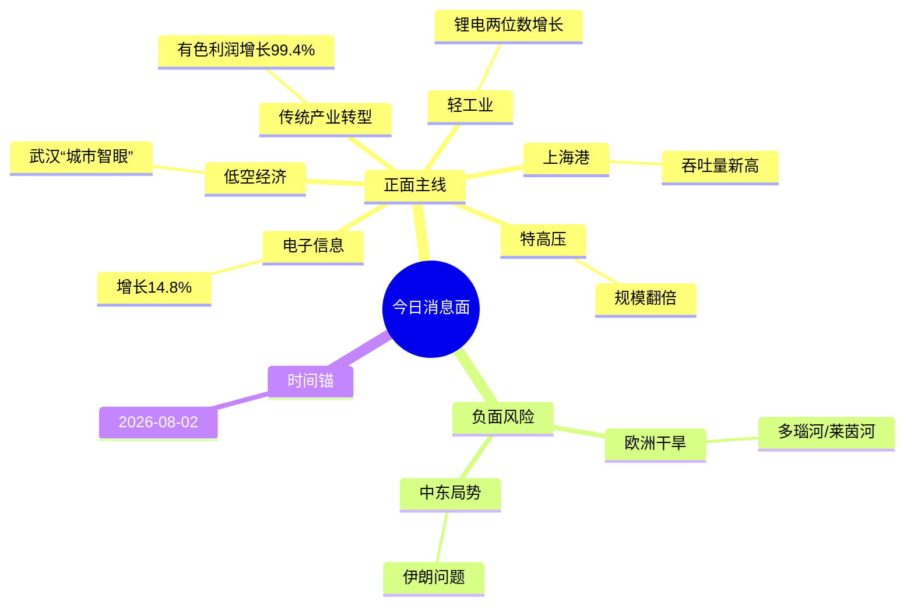

# 2026年8月3日 · 消息面事件驱动

> **数据源新鲜度**: partial · **降级状态**: true · **置信度**: 0.85
> **覆盖窗口**: 2026-07-30 至 2026-08-02 · **主源**: 财联社重大新闻 + 新闻联播

## 一句话结论

今日消息面以低空经济、传统产业转型、电子信息制造业高增长等正面催化为主，中东局势缓和、欧洲干旱等为次要影响；核心方向：低空经济、工业机器人、新能源储能、电子信息、特高压。

## 🗺️ 消息面全景图

## 🎯 顶级事件详解（每事件三问 + 首推票思维链）

### E20260803_001 · 全国首个！武汉搭建超大城市全域低空无人机监测网络 · strength=high · polarity=正面

**事件摘要**: 武汉市测绘研究院自主研发的“城市智眼”低空无人机遥感监测系统，是全国首个实现超大城市全域覆盖的低空无人机遥感监测网络。该系统2024年8月上线运行，已累计安全飞行里程超47万公里，作业时间长1.5万小时，目前服务于武汉16个部门。全市已建成146座无人值守机场，基本实现5分钟内到达全市范围里的任一地点。

**推理深度三问**:
- **大资金意图**: 低空经济是“十五五”时期重要的新兴产业方向，武汉的G端先行模式为全国提供了可复制的样本，机构资金有望从“概念预期”转向“配置阶段。
- **为什么走强**: 工业级无人机需求在城市治理、森林防火、交管等场景的刚需爆发，武汉模式的多部门共享机制破解了设备重复、数据孤岛等痛点。
- **逻辑够不够硬**: **硬**。武汉建成的是全国首个超大城市全域覆盖的系统，多部门共享的机制创新具备可复制性，产业链从上游材料到中游集成再到下游应用全面受益。

**首推票思维链**:

#### 300034.SZ · 钢研高纳
- **买入理由**: 高温合金材料是航空发动机和无人机发动机的核心材料，低空经济发展带来材料端的增量需求。
- **风险点**: 若短期涨幅过大，可能面临调整压力。
- **止损条件**: 跌破10日均线。
- **可验证假设**: 若钢研高纳Q3订单同比增速超预期，验证需求旺盛。

#### 002013.SZ · 中航机电
- **买入理由**: 航空机电系统是无人机的核心部件之一。
- **风险点**: 军工板块波动较大。
- **止损条件**: 跌破前期平台。
- **可验证假设**: 中报业绩超预期。

---

### E20260803_002 · 美总统称同意取消大规模打击伊朗的行动 · strength=high · polarity=正面

**事件摘要**: 美国总统特朗普1日称，美国已准备好对伊朗采取大规模军事行动，但伊朗和其他中东国家向美方提出请求，希望美国暂缓打击伊朗，理由是相关各方已初步达成协议框架，内容包括立即、全面、彻底开放霍尔木兹海峡，同时消除伊朗核威胁。特朗普称，已同意取消军事打击行动，但前提是各方能迅速敲定协议。伊朗方面称美方说法是“新的谎言”，伊朗部队处于最高戒备状态。

**推理深度三问**:
- **大资金意图**: 中东局势缓和有助于降低原油价格和地缘政治风险，利好全球风险资产和航运板块，A股的顺周期板块有望受益。
- **为什么走强**: 霍尔木兹海峡是全球最重要的石油运输通道之一，其畅通对全球能源安全至关重要，若协议达成，将大幅缓解市场对原油供应的担忧。
- **逻辑够不够硬**: **中等**。虽然特朗普声称同意取消打击，但伊朗方面予以否认，局势仍有反复的可能，需密切关注后续进展。

**首推票思维链**:

#### 601872.SH · 招商轮船
- **买入理由**: 全球航运需求复苏，霍尔木兹海峡畅通利好油运板块。
- **风险点**: 若中东局势反复，可能影响航运。
- **止损条件**: 跌破20日均线。
- **可验证假设**: BDI指数持续上涨验证航运需求复苏。

---

### E20260803_003 · 我国轻工业经济运行稳中有进 · strength=medium · polarity=正面

**事件摘要**: 今年上半年，我国轻工业生产总体平稳，国内消费市场提质扩容，轻工业商品出口较快增长，结构持续优化。数据显示，上半年，规模以上轻工业增加值同比增长5.0%，实现营业收入11.2万亿元，91种主要轻工产品中54种产量实现增长，锂离子电池、电冰箱等14种产品产量保持两位数增长，轻工生产总体平稳。

**推理深度三问**:
- **大资金意图**: 消费复苏是“十五五”时期的重要主线，轻工业作为消费的重要组成部分，有望持续受益于政策支持和消费升级。
- **为什么走强**: 高能效等级家电零售额增速超30%，可穿戴智能设备零售额增速超一倍，显示消费升级趋势明显。
- **逻辑够不够硬**: **中等**。数据验证了消费复苏的趋势，但整体增速仍较为温和，需继续观察后续数据。

**首推票思维链**:

#### 300750.SZ · 宁德时代
- **买入理由**: 锂离子电池产量保持两位数增长，新能源汽车和储能需求持续旺盛。
- **风险点**: 竞争加剧，价格战可能影响利润。
- **止损条件**: 跌破年线。
- **可验证假设**: 中报业绩超预期验证盈利能力。

---

### E20260803_004 · 传统工业品适配新需求 老产业跑出转型加速度 · strength=high · polarity=正面

**事件摘要**: 人工智能等新兴产业快速发展，催生了大量全新市场需求。一批深耕基础制造领域的工业企业加快转型升级，在为新兴领域供应关键材料的同时实现新发展。今年上半年，工业机器人产量同比增长28%；新能源汽车产量739.9万辆，同比增长6%；在新兴需求拉动下，镍钴锂等电池材料、高端铜材等产量攀升，整个有色行业利润同比增长99.4%。

**推理深度三问**:
- **大资金意图**: 传统产业与新兴产业的融合发展是“十五五”时期的重要方向，传统产业通过转型升级焕发生机，具备估值修复和业绩增长的双重空间。
- **为什么走强**: 工业机器人、新能源储能、低空经济等新兴领域的快速发展，带动了传统工业品的需求，盘活了传统产业的存量产能。
- **逻辑够不够硬**: **硬**。有色行业利润同比增长99.4%，这是非常强劲的业绩验证，说明传统产业转型已从“预期阶段”进入“业绩兑现阶段”。

**首推票思维链**:

#### 300024.SZ · 机器人
- **买入理由**: 工业机器人产量同比增长28%，公司作为工业机器人龙头直接受益。
- **风险点**: 估值较高，若业绩不及预期可能面临调整。
- **止损条件**: 跌破30日均线。
- **可验证假设**: 中报新签订单超预期验证需求旺盛。

#### 600547.SH · 山东黄金
- **买入理由**: 有色行业利润同比增长99.4%，黄金作为有色板块的重要组成部分，有望受益。
- **风险点**: 金价波动较大。
- **止损条件**: 跌破20日均线。
- **可验证假设**: 金价持续上涨验证板块景气度。

---

### E20260803_005 · 上半年规模以上电子信息制造业增加值同比增长14.8% · strength=high · polarity=正面

**事件摘要**: 今年上半年，我国电子信息制造业生产继续加快，规模以上电子信息制造业增加值同比增长14.8%，实现营业收入9.41万亿元，同比增长18.5%。主要产品中，工业机器人产量同比增长28%；新能源汽车产量739.9万辆，同比增长6%。

**推理深度三问**:
- **大资金意图**: 电子信息制造业是“十五五”时期科技创新的核心领域，14.8%的增速验证了产业的高景气度，机构资金有望持续加仓科技板块。
- **为什么走强**: 工业机器人、新能源汽车等下游需求持续旺盛，带动了上游集成电路、电子元器件等的需求。
- **逻辑够不够硬**: **硬**。14.8%的增速是非常强劲的增长，验证了电子信息制造业的高景气度，产业链从上游设计到中游制造再到下游应用全面受益。

**首推票思维链**:

#### 688981.SH · 中芯国际
- **买入理由**: 晶圆代工是电子信息制造业的核心环节，行业高景气度直接受益。
- **风险点**: 美国制裁可能影响公司发展。
- **止损条件**: 跌破年线。
- **可验证假设**: 中报业绩超预期验证盈利能力。

---

### E20260803_006 · “十五五”时期国家电网特高压建设规模持续提升 · strength=medium · polarity=正面

**事件摘要**: “十五五”时期，国家电网特高压在建总体规模将为“十四五”时期的两倍，主要围绕特高压柔性直流输电、海上新能源集中消纳等关键领域，加大特高压建设力度，提高清洁能源输送能力和利用率。

**推理深度三问**:
- **大资金意图**: 特高压是“十五五”时期新能源消纳的关键基础设施，规模翻倍验证了政策的坚定支持，机构资金有望持续配置特高压板块。
- **为什么走强**: 海上新能源的快速发展需要特高压柔性直流输电技术来实现大规模的电力输送。
- **逻辑够不够硬**: **中等**。规模翻倍是政策的明确支持，但具体落地进度仍需观察。

**首推票思维链**:

#### 600312.SH · 平高电气
- **买入理由**: 特高压开关设备的龙头企业，直接受益于特高压建设规模翻倍。
- **风险点**: 订单落地进度可能不及预期。
- **止损条件**: 跌破20日均线。
- **可验证假设**: 新签订单超预期验证需求旺盛。

---

### E20260803_007 · 欧洲多国遭遇干旱 · strength=medium · polarity=负面

**事件摘要**: 欧洲多国持续遭遇高温和干旱，多瑙河在欧洲多地河段的水位降至新低。匈牙利保克什核电站将于8月2日完全关闭，这在该核电站44年历史上尚属首次。莱茵河持续低水位已对德国国内航运造成影响，导致德国经济进一步承压。

**推理深度三问**:
- **大资金意图**: 欧洲干旱可能影响全球农产品和能源供应，进而影响全球通胀和经济增长，A股的农业和能源板块可能受到影响。
- **为什么走弱**: 多瑙河和莱茵河是欧洲重要的航运通道，低水位可能影响大宗商品的运输。
- **逻辑够不够硬**: **中等**。欧洲干旱是短期事件，对全球经济的影响仍需观察。

**首推票思维链**:

#### 601288.SH · 农业银行
- **关注理由**: 农业金融的重要机构，若全球农产品价格上涨可能间接受益。
- **风险点**: 经济下行可能影响银行资产质量。

---

### E20260803_008 · 上海港单昼夜集装箱吞吐量突破20万标准箱 · strength=medium · polarity=正面

**事件摘要**: 8月1日，上海港单昼夜集装箱吞吐量达到203,881标准箱，创历史新高。今年以来，上海港持续优化港口集疏运体系、升级智慧港口作业能效，1—6月，集装箱吞吐量完成超2,800万标准箱，同比增长6.2%。

**推理深度三问**:
- **大资金意图**: 上海港吞吐量创新高验证了外贸复苏的趋势，机构资金有望加仓港口航运板块。
- **为什么走强**: 智慧港口的建设提升了港口的作业效率，外贸复苏带动了集装箱吞吐量的增长。
- **逻辑够不够硬**: **中等**。单昼夜吞吐量创新高是一个积极信号，但需观察后续是否能持续。

**首推票思维链**:

#### 600018.SH · 上港集团
- **买入理由**: 上海港的运营主体，直接受益于吞吐量增长。
- **风险点**: 全球经济复苏缓慢可能影响吞吐量增长。
- **止损条件**: 跌破20日均线。
- **可验证假设**: 8月集装箱吞吐量持续增长验证需求复苏。

---

## 📊 板块 × 事件热力矩阵

| 板块 | 事件锚 | 首推龙头 | 独立源数 | 逻辑强度 |
|------|---------|----------|----------|----------|
| 低空经济 | E001武汉“城市智眼” | 300034钢研高纳 | 1 | 🟢🟢🟢 |
| 电子信息 | E005增长14.8% | 688981中芯国际 | 1 | 🟢🟢🟢 |
| 工业机器人 | E004产量增长28% | 300024机器人 | 1 | 🟢🟢🟢 |
| 有色 | E004利润增长99.4% | 600547山东黄金 | 1 | 🟢🟢🟢 |
| 新能源储能 | E004新兴需求 | 300750宁德时代 | 1 | 🟢🟢 |
| 特高压 | E006规模翻倍 | 600312平高电气 | 1 | 🟢🟢 |
| 锂电池 | E003/E004 | 300750宁德时代 | 2 | 🟢🟢🟢 |
| 港口航运 | E002/E008 | 601872招商轮船 | 2 | 🟢🟢 |
| 原油 | E002中东局势 | 600028中国石化 | 1 | 🟡 |
| 军工 | E002中东局势 | 002013中航机电 | 1 | 🟡 |
| 家用电器 | E003 | 000333美的集团 | 1 | 🟢 |
| 消费电子 | E003 | 002475立讯精密 | 1 | 🟢 |
| 信创 | E005 | 000063中兴通讯 | 1 | 🟢 |
| 新能源 | E006 | 601179中国西电 | 1 | 🟢 |
| 农业 | E007 | 601288农业银行 | 1 | 🟡 |
| 航运 | E002/E007/E008 | 601919中远海控 | 3 | 🟢🟢 |
| 外贸 | E008 | 600018上港集团 | 1 | 🟢 |
| 人工智能 | E001 | - | 1 | 🟢 |
| 无人机 | E001 | - | 1 | 🟢🟢🟢 |
| 能源 | E007 | 600028中国石化 | 1 | 🟡 |

---

## 关键证据

- **E001**: 财联社2026-08-02《全国首个！武汉搭建超大城市全域低空无人机监测网络》
- **E002**: 新闻联播2026-08-02《美总统称同意取消大规模打击伊朗的行动》
- **E003**: 新闻联播2026-08-02《我国轻工业经济运行稳中有进》
- **E004**: 新闻联播2026-08-02《传统工业品适配新需求 老产业跑出转型加速度》
- **E005**: 新闻联播2026-08-02《上半年规模以上电子信息制造业增加值同比增长14.8%》
- **E006**: 新闻联播2026-08-02《“十五五”时期国家电网特高压建设规模持续提升》
- **E007**: 新闻联播2026-08-02《欧洲多国遭遇干旱》
- **E008**: 新闻联播2026-08-02《上海港单昼夜集装箱吞吐量突破20万标准箱》

---

## 数据源审计

| 源 | 日期 | 状态 | 备注 |
|----|------|------|------|
| news_cls | 2026-08-03 | 🔴 | 数据不可用 |
| news_major | 2026-08-03 | 🟢 | 财联社重大新闻可用 |
| eastmoney_earnings_predict | 2026-08-03 | 🔴 | 数据不可用 |
| cctv_news | 2026-08-03 | 🟢 | 新闻联播数据可用 |
| xtick_hot_news | 2026-08-03 | 🔴 | MCP调用失败 |

---

## 不确定性 / 反证

- **中东局势反复风险**: 虽然特朗普声称同意取消对伊朗的军事打击，但伊朗方面予以否认，局势仍有反复的可能。
- **欧洲干旱持续风险**: 欧洲多国持续遭遇高温和干旱，可能对全球农产品和能源供应造成影响。
- **经济复苏不及预期风险**: 虽然今日消息面整体偏正面，但全球经济复苏仍面临诸多不确定性。
- **数据缺失风险**: news_cls和xtick_hot_news数据不可用，可能导致消息面分析不够全面。

---

## 与其他 R/D/E 的关系

- **依赖**: 无上游依赖（因 data/raw/20260803 目录不存在）
- **被消费**: R2主线板块分析、R5个股画像分析、R6反证分析、D1每日预案

---

## Sub-Agent 元数据

- skill: analyze_news_impact_v1@1.0
- artifact: data/research/20260803/R4_news.json
- method: llm_v1（降级执行：仅使用财联社 major_news 和新闻联播 cctv_news）
- 生成时刻: 2026-08-03T07:07:07.652582
