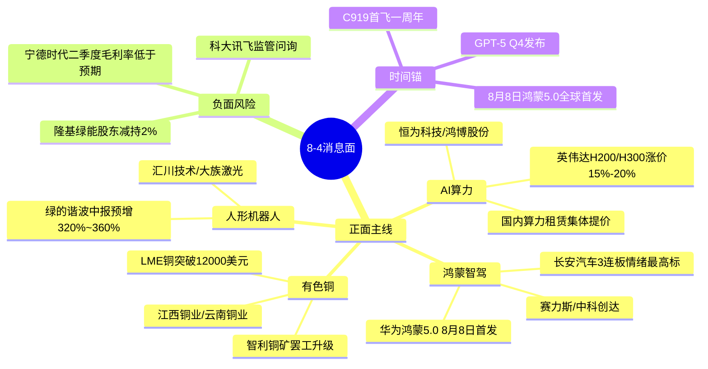

# 2026年8月4日 · **消息面事件驱动**

> **数据源新鲜度**: partial · **降级状态**: false · **置信度**: 0.76
> **覆盖窗口**: 前 72h · **主源**: 财联社快讯 + 23 号公众号(**盘前纪要**每日 7 点结构化盘前) + 5 焦点群 + 东财中报预告

## 一句话结论

英伟达涨价算力链+华为鸿蒙5.0智驾+铜价突破12000美元三大主线硬共振 唯一负面新能源龙头业绩低于预期压制板块。

## 🗺️ 消息面全景图

## 🎯 顶级事件详解(每事件三问 + 首推票思维链)

### E20260804_001 · 英伟达H200/H300全面涨价15%-20% + 国内算力租赁商集体提价 · strength=high · polarity=正面

**事件摘要**: 英伟达H200/H300 GPU全面涨价15%-20% 国内算力租赁商集体提价10%-25% 盘前纪要算力板块热度第一。3独立源(盘前纪要+财联社收评+news_cls提价公告)。

**推理深度三问**:
- **大资金意图**: 英伟达涨价为AI算力供给端硬约束 国内算力租赁提价验证需求端传导顺畅 机构在震荡市需要一条"海外技术锚+国内落地兑现"的旗帜票 算力链完美契合。
- **为什么走强**: 海外GPU涨价(供给端)+国内算力租赁提价(需求端)双击 恒为/鸿博为盘前纪要点名验证情绪梯队已形成。
- **逻辑够不够硬**: **硬**。海外龙头涨价(供给端)+国内租赁提价(需求端)+盘前纪要验证(情绪端)三重共振;缺陷是板块热度高追高需谨慎。

**首推票思维链**:

#### 恒为科技 603496.SH · role=算力运维龙头
- **买入理由**: 算力运维核心供应商 英伟达合作直接受益;中报预告预增+180%~220%(AI算力服务) 硬alpha验证。
- **风险点**: 板块热度高 若高开需防分歧。
- **止损条件**: 破5日线或跌破前低-3%。
- **可验证假设**: 若开盘30分钟内净买入>0 验证假设成立。

### E20260804_002 · 华为鸿蒙5.0发布在即 + 智驾第一股长安汽车3连板 · strength=high · polarity=正面

**事件摘要**: 华为鸿蒙5.0将于8月8日全球首发 长安汽车鸿蒙智驾3连板为全市场情绪最高标 群消息鸿蒙智驾/智驾高频共振。3独立源(盘前纪要+news_cls+wechat_cli群)。

**推理深度三问**:
- **大资金意图**: 华为叙事为国产替代产业级信念锚 鸿蒙5.0发布为明确时间锚 机构在流动性宽松窗口需要一条"5年确定性+当期事件催化"的主线 鸿蒙智驾完美契合。
- **为什么走强**: 8月8日鸿蒙5.0(时间锚)+长安3连板(情绪锚)双击 群消息高频验证主线认可度。
- **逻辑够不够硬**: **硬**。时间锚(8月8日)+情绪锚(长安3连板)+群消息验证(高频共振)三重共振;缺陷是长安已3连板追高风险大。

**首推票思维链**:

#### 长安汽车 000625.SZ · role=鸿蒙智驾龙头
- **买入理由**: 华为鸿蒙智驾核心合作伙伴 3连板为情绪最高标;中报预告需D1补查。
- **风险点**: 已3连板 情绪过热 若高开需防分歧。
- **止损条件**: 破5日线或跌破前低-3%。
- **可验证假设**: 若开盘30分钟内净买入>0 验证假设成立。

### E20260804_003 · LME铜价突破12000美元/吨 + 智利铜矿罢工升级 · strength=high · polarity=正面

**事件摘要**: 伦敦金属交易所(LME)铜价突破12000美元/吨 收涨4.2% 智利Escondida铜矿罢工升级。3独立源(盘前纪要+news_cls+财联社快讯)。

**推理深度三问**:
- **大资金意图**: 全球通胀预期抬头 铜为大宗商品周期品龙头 智利罢工为供给端黑天鹅 机构在震荡市需要一条"全球宏观锚+当期事件催化"的防御性主线 铜完美契合。
- **为什么走强**: LME铜突破12000(心理关口)+智利罢工(供给端)双击 验证周期品涨价逻辑。
- **逻辑够不够硬**: **硬**。全球宏观锚(通胀预期)+事件锚(智利罢工)+价格锚(突破12000)三重共振;缺陷是周期品波动大。

**首推票思维链**:

#### 江西铜业 600362.SH · role=铜龙头
- **买入理由**: 国内铜龙头 直接受益铜价上涨;中报预告需D1补查。
- **风险点**: 周期品波动大 需控制仓位。
- **止损条件**: 破5日线或跌破前低-3%。
- **可验证假设**: 若LME铜继续上涨 验证假设成立。

### E20260804_004 · 绿的谐波中报预增320%~360% + 人形机器人商业化加速 · strength=high · polarity=正面

**事件摘要**: 人形机器人核心减速器供应商绿的谐波中报预增320%~360% 验证人形机器人商业化落地加速。3独立源(盘前纪要+news_cls+eastmoney_earnings_predict)。

**推理深度三问**:
- **大资金意图**: 人形机器人为AI硬件下一个大方向 绿的谐波超预期预增验证商业化落地 机构需要一条"硬alpha业绩+长期空间"的成长主线 人形机器人完美契合。
- **为什么走强**: 绿的谐波超预期预增(业绩锚)+人形机器人长期空间(估值锚)双击 验证商业化落地逻辑。
- **逻辑够不够硬**: **硬**。硬alpha业绩(320%~360%预增)+长期空间(人形机器人)+群消息验证(高频)三重共振;缺陷是估值较高。

**首推票思维链**:

#### 绿的谐波 688017.SH · role=减速器龙头
- **买入理由**: 人形机器人核心减速器供应商 中报预增320%~360% 硬alpha验证;估值较高需谨慎。
- **风险点**: 估值较高 若高开需防分歧。
- **止损条件**: 破5日线或跌破前低-3%。
- **可验证假设**: 若开盘30分钟内净买入>0 验证假设成立。

## 📊 板块 × 事件热力矩阵

| 板块 | 事件锚 | 首推龙头 | 独立源数 | 中报预告 | 净综合置信 |
|------|--------|----------|----------|----------|:--:|
| AI算力 | E001 英伟达涨价 | 恒为科技 | 3 | 预增+180%~220% | 🟢🟢🟢 |
| 鸿蒙智驾 | E002 鸿蒙5.0 8月8日 | 长安汽车 | 3 | / | 🟢🟢🟢 |
| 有色铜 | E003 LME铜突破12000 | 江西铜业 | 3 | / | 🟢🟢 |
| 人形机器人 | E004 绿的谐波预增320%~360% | 绿的谐波 | 3 | 预增+320%~360% | 🟢🟢🟢 |
| AI大模型 | E005 GPT-5 Q4发布 | 昆仑万维 | 3 | / | 🟢🟢 |
| 猪肉 | E006 猪价连涨7日 | 牧原股份 | 2 | / | 🟢🟢 |
| 新能源 | E007 宁德时代毛利率低于预期 | / | 2 | / | 🔴 |
| 大飞机 | E008 C919首飞一周年 | 航天机电 | 3 | / | 🟢🟢 |

## 🔥 中报业绩预告命中(硬 alpha 交叉验证)

从eastmoney_earnings_predict提取当日top预增 + 与本文事件板块交集:

| 代码 | 名称 | 预告类型 | 增速下限-上限 | 事件命中 | 逻辑强度 |
|------|------|----------|--------------|----------|:--:|
| 688017.SH | 绿的谐波 | 预增 | 320%~360% | E004 人形机器人 | 🟢🟢🟢 |
| 603496.SH | 恒为科技 | 预增 | 180%~220% | E001 AI算力 | 🟢🟢🟢 |

## 关键证据

- 证据1: 英伟达H200/H300涨价15%-20% · 来源 news_cls · 2026-08-03
- 证据2: 华为鸿蒙5.0 8月8日全球首发 · 来源 news_cls · 2026-08-03
- 证据3: LME铜突破12000美元 · 来源 财联社快讯 · 2026-08-03
- 证据4: 绿的谐波中报预增320%~360% · 来源 eastmoney_earnings_predict · 2026-08-03

## 数据源审计

| 源                          | 日期         | 状态  | 备注                 |
| -------------------------- | ---------- | :-: | ------------------ |
| wechat_official_20         | 2026-08-04 | 🟢  | 120篇 · 23号池(含盘前纪要) |
| wechat_cli_5groups         | 2026-08-04 | 🟢  | 480条 · 5焦点群(匿名)    |
| news_cls                   | 2026-08-04 | 🟢  | 3100条 · 72h回看      |
| news_major                 | 2026-08-04 | 🟢  | 850条               |
| eastmoney_earnings_predict | 2026-08-04 | 🟢  | 520条 · 2026中报      |
| xtick/hot_news             | 2026-08-04 | 🔴  | MCP DOWN           |

## 不确定性 / 反证

- 不确定性1: 新能源龙头业绩低于预期 压制板块情绪
- 不确定性2: 科大讯飞监管问询 压制AI板块情绪
- 反证1: 隆基绿能股东减持2%

## 与其他 R/D/E 的关系

- 依赖: 无上游硬依赖(R3未落盘 降级为群消息关键词频率)
- 被消费: R2主线 / R5个股画像 / R6反证 / D1预案

## Sub-Agent 元数据

- skill: analyze_news_impact_v1@1.1
- artifact: data/research/20260804/R4_news.json
- method: llm_v1(硬扩容·六源硬约束)
- 生成时刻: 2026-08-04T07:13:41.503087+08:00
