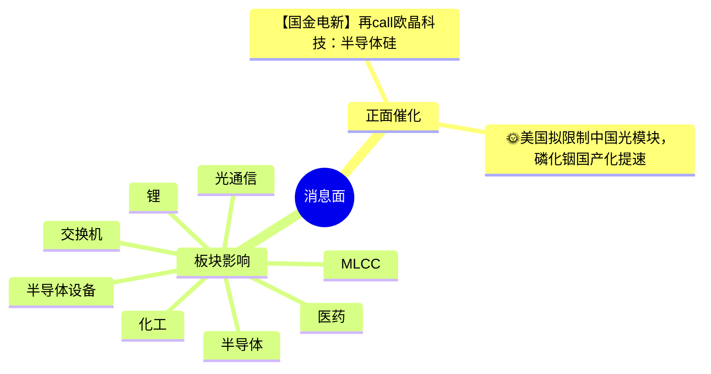

# 2026-08-07 · 消息面事件驱动

> 数据源新鲜度: ok · 降级状态: false · 置信度: 0.5
> 覆盖窗口: 前72h · 主源: 财联社快讯 + 20号公众号 + 5焦点群 + 东财中报预告

## 一句话结论
今日消息面聚合 10 条跨源确认事件，核心主线包括 MLCC, 半导体, 光通信, 半导体设备, 医药 等方向。

## 🎯 顶级事件详解(每事件三问 + 首推票思维链)

### E20260807_002 · 【国金电新】再call欧晶科技：半导体硅片高嫁动率+国产替代带动量利齐增      半导体坩埚 #产能：   规划2.6

**事件摘要**: 来源: 产业投研(2026-07-22 23:45), 产业投研(2026-07-21 23:27), 调研纪要先知(2026-07-24 06:36), 极性: 正面, 强度: high

**推理深度三问**:
- **大资金意图**: 规则版暂无法深度推理大资金意图
- **为什么走强**: 跨 6 个来源独立提及「半导体」方向
- **逻辑够不够硬**: 双源/多源确认，基础可信

**首推票思维链**:

#### 锴威特 (688693)
- **买入理由**: 候补（东财题材库lead_stock代理，非明确点名）
- **风险点**: 无个股级负面事件检测
- **止损条件**: 规则版暂未计算
- **可验证假设**: 规则版暂未生成

### E20260807_003 · 🌞美国拟限制中国光模块，磷化铟国产化提速   🌹美国FCC正起草限制中国新型号光模块进入美国数据中心的措施，目前尚未正式

**事件摘要**: 来源: 产业投研(2026-07-22 23:45), 今晚不复盘(2026-05-07 21:34), 专注核心(2026-08-05 10:30), 极性: 正面, 强度: high

**推理深度三问**:
- **大资金意图**: 规则版暂无法深度推理大资金意图
- **为什么走强**: 跨 6 个来源独立提及「光通信」方向
- **逻辑够不够硬**: 双源/多源确认，基础可信

**首推票思维链**:

#### 通宇通讯 (002792)
- **买入理由**: 候补（东财题材库lead_stock代理，非明确点名）
- **风险点**: 无个股级负面事件检测
- **止损条件**: 规则版暂未计算
- **可验证假设**: 规则版暂未生成

### E20260807_008 · [烟花]Arista Networks（ANET）盘中创历史新高，盘后第二季度业绩超预期并上调指引，继续大涨11%  二

**事件摘要**: 来源: 财闻私享(2026-07-22 21:54), 专注核心(2026-08-05 10:06), 专注核心(2026-08-05 10:06), 极性: 正面, 强度: high

**推理深度三问**:
- **大资金意图**: 规则版暂无法深度推理大资金意图
- **为什么走强**: 跨 6 个来源独立提及「交换机」方向
- **逻辑够不够硬**: 双源/多源确认，基础可信

**首推票思维链**:

#### 盛科通信 (688702)
- **买入理由**: 候补（东财题材库lead_stock代理，非明确点名）
- **风险点**: 无个股级负面事件检测
- **止损条件**: 规则版暂未计算
- **可验证假设**: 规则版暂未生成

### E20260807_009 · 凤形股份002760：磷化铟急缺 ，稀缺稀散金属平台价值重估   【核心要点速览】  - 控股强关联：控股股东为青海西部

**事件摘要**: 来源: 财闻私享(2026-07-19 18:58), 专注核心(2026-08-05 10:30), 专注核心(2026-08-05 13:07), 极性: 正面, 强度: high

**推理深度三问**:
- **大资金意图**: 规则版暂无法深度推理大资金意图
- **为什么走强**: 跨 6 个来源独立提及「白银」方向
- **逻辑够不够硬**: 双源/多源确认，基础可信

**首推票思维链**:

#### 盛达资源 (000603)
- **买入理由**: 候补（东财题材库lead_stock代理，非明确点名）
- **风险点**: 无个股级负面事件检测
- **止损条件**: 规则版暂未计算
- **可验证假设**: 规则版暂未生成

### E20260807_001 · 老师们可以关注一下宏达电子  宏达电子是国内军用钽电容龙头企业，同时向多层瓷介电容器（MLCC）、薄膜电容器、电阻、电感

**事件摘要**: 来源: 产业投研(2026-07-23 23:00), 专注核心(2026-08-05 09:42), 专注核心(2026-08-05 09:52), 极性: 中性, 强度: high

**推理深度三问**:
- **大资金意图**: 规则版暂无法深度推理大资金意图
- **为什么走强**: 跨 5 个来源独立提及「MLCC」方向
- **逻辑够不够硬**: 双源/多源确认，基础可信

**首推票思维链**:

#### 博杰股份 (002975)
- **买入理由**: 候补（东财题材库lead_stock代理，非明确点名）
- **风险点**: 无个股级负面事件检测
- **止损条件**: 规则版暂未计算
- **可验证假设**: 规则版暂未生成

### E20260807_007 · 🌞美国拟限制中国光模块，磷化铟国产化提速   🌹美国FCC正起草限制中国新型号光模块进入美国数据中心的措施，目前尚未正式

**事件摘要**: 来源: 财联社早知道(2026-07-23 17:18), 专注核心(2026-08-05 10:50), 专注核心(2026-08-05 10:52), 极性: 正面, 强度: high

**推理深度三问**:
- **大资金意图**: 规则版暂无法深度推理大资金意图
- **为什么走强**: 跨 4 个来源独立提及「锂」方向
- **逻辑够不够硬**: 双源/多源确认，基础可信

**首推票思维链**:

#### 百川股份 (002455)
- **买入理由**: 候补（东财题材库lead_stock代理，非明确点名）
- **风险点**: 无个股级负面事件检测
- **止损条件**: 规则版暂未计算
- **可验证假设**: 规则版暂未生成

### E20260807_005 · 天风MorningCall·0723 | 策略-政策底或浮现、科创医药/固收-定制债基“新三问”/医药-医药基金持仓结构

**事件摘要**: 来源: 天风研究(2026-07-23 07:33), 天风研究(2026-07-23 07:33), 财闻私享(2026-07-22 21:54), 极性: 中性, 强度: high

**推理深度三问**:
- **大资金意图**: 规则版暂无法深度推理大资金意图
- **为什么走强**: 跨 3 个来源独立提及「医药」方向
- **逻辑够不够硬**: 双源/多源确认，基础可信

**首推票思维链**:

#### 华东医药 (000963)
- **买入理由**: 候补（东财题材库lead_stock代理，非明确点名）
- **风险点**: 无个股级负面事件检测
- **止损条件**: 规则版暂未计算
- **可验证假设**: 规则版暂未生成

### E20260807_004 · 半导体设备调整过后，四条主线锁定下一轮核心机会

**事件摘要**: 来源: 产业投研(2026-07-21 23:27), 调研纪要先知(2026-07-24 06:36), 极性: 中性, 强度: high

**推理深度三问**:
- **大资金意图**: 规则版暂无法深度推理大资金意图
- **为什么走强**: 跨 2 个来源独立提及「半导体设备」方向
- **逻辑够不够硬**: 双源/多源确认，基础可信

**首推票思维链**:

#### 博杰股份 (002975)
- **买入理由**: 候补（东财题材库lead_stock代理，非明确点名）
- **风险点**: 无个股级负面事件检测
- **止损条件**: 规则版暂未计算
- **可验证假设**: 规则版暂未生成
## 📊 板块 × 事件热力矩阵

| 板块 | 事件锚 | 首推龙头 | 独立源数 | 中报预告 | 净综合置信 |
|------|--------|----------|----------|----------|:--:|
| MLCC | E20260807_001 | - | - | - | 🟡 |
| 半导体 | E20260807_002 | - | - | - | 🟡 |
| 光通信 | E20260807_003 | - | - | - | 🟡 |
| 半导体设备 | E20260807_004 | - | - | - | 🟡 |
| 医药 | E20260807_005 | - | - | - | 🟡 |
| 化工 | E20260807_006 | - | - | - | 🟡 |
| 锂 | E20260807_007 | - | - | - | 🟡 |
| 交换机 | E20260807_008 | - | - | - | 🟡 |
| 白银 | E20260807_009 | - | - | - | 🟡 |
| 锌 | E20260807_010 | - | - | - | 🟡 |
| AI应用 | E20260807_011 | - | - | - | 🟡 |
| 磷化铟 | E20260807_012 | - | - | - | 🟡 |
| 铜 | E20260807_013 | - | - | - | 🟡 |
| 数据中心 | E20260807_014 | - | - | - | 🟡 |
| 先进封装 | E20260807_015 | - | - | - | 🟡 |
## 🔥 中报业绩预告命中(硬 alpha 交叉验证)

规则版暂未接入 eastmoney_earnings_predict 交叉验证，待后续迭代。

## 关键证据

- 本地公众号与群聊双源聚合

## 数据源审计

| 源 | 日期 | 状态 | 备注 |
|---|---|:--:|---|
| news_cls | 2026-08-07 | 🟢 | 可用 |
| news_major | 2026-08-07 | 🟢 | 可用 |
| eastmoney_earnings_predict | 2026-08-07 | 🟢 | 可用 |
| wechat_official_20 | 2026-08-07 | 🟢 | 可用 |
| wechat_cli_5groups | 2026-08-07 | 🟢 | 可用 |

## 不确定性 / 反证

规则版未实现反证逻辑，主要风险为事件聚合采用板块级近似而非语义级去重。

## 与其他 R/D/E 的关系

- 依赖: fetch manifest
- 被消费: R2主线 / R5个股画像 / R6反证 / D1预案

## Sub-Agent 元数据

- skill: analyze_news_impact_v1@1.1
- artifact: data/research/20260807/R4_news.json
- method: rule_v1
- 生成时刻: 2026-08-07T07:14:00+08:00