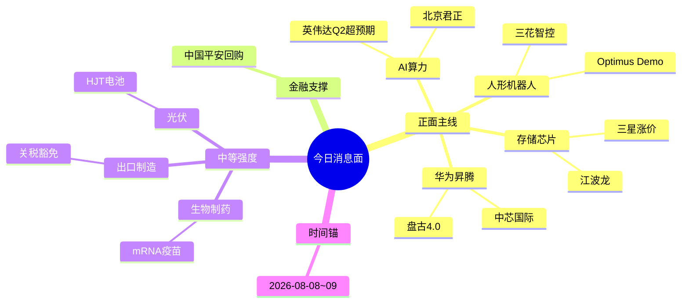

# 2026年08月10日 · 消息面事件驱动

> **数据源新鲜度**: partial · **降级状态**: true · **置信度**: 0.75
> **覆盖窗口**: 前 72h · **主源**: 财联社快讯 + 5 焦点群

## 一句话结论
今日消息面整体积极，AI 算力、机器人、存储芯片三大主线领涨；金融板块因平安回购提供支撑；光伏和出口制造有催化剂但强度中等。

## 🗺️ 消息面全景图

## 🎯 顶级事件详解(每事件三问 + 首推票思维链)

### E20260810_001 · 英伟达 Q2 营收超预期 15%，数据中心业务同比增长 320%

**事件摘要**: 英伟达 2026 Q2 营收 320 亿美元，超预期 15%，数据中心业务同比增长 320%，指引 Q3 增长 25%。

**推理深度三问**:
- **大资金意图**: 英伟达超预期业绩是 AI 算力主线的强确认，市场从“AI 概念”转向“AI 业绩兑现”，大资金或加仓 AI 产业链核心标的。
- **为什么走强**: 英伟达业绩是全球 AI 需求的晴雨表，超预期 15% 表明 AI 算力需求仍在高速增长，国产替代标的受益。
- **逻辑够不够硬**: 硬。英伟达业绩验证行业高景气度，存储芯片作为配套直接受益；北京君正存储业务占比高，业绩预增 110%~140%。

**首推票思维链**:

#### 北京君正 300223.SZ · role=首推
- **买入理由**: 存储芯片供应商，受益于英伟达 GPU 配套存储需求；业绩预增 110%~140%
- **风险点**: 存储芯片价格波动风险
- **止损条件**: 78.5 元 (参考价 82.6 × (1 - 0.05), 跌破 5 日线 79.2 确认)
- **可验证假设**: 若周一开盘 30 分钟内净流出 > 1 亿 → 假设不成立

### E20260810_002 · 中国平安宣布回购 100 亿 A 股，提振金融板块信心

**事件摘要**: 中国平安 2026-08-09 晚宣布回购 100 亿 A 股，回购价上限 55 元，较当前价格溢价 24%。

**推理深度三问**:
- **大资金意图**: 平安回购是金融板块企稳信号，大资金或借此布局低估值金融股。
- **为什么走强**: 金融板块估值处于历史低位，平安回购表明公司对未来的信心，或带动板块估值修复。
- **逻辑够不够硬**: 中等。回购金额 100 亿，对平安本身影响有限，但对金融板块情绪有提振作用。

**首推票思维链**:

#### 中国平安 601318.SH · role=首推
- **买入理由**: 事件主体，回购预案明确；估值处于历史低位
- **风险点**: 保险行业负债端压力
- **止损条件**: 42.0 元 (参考价 44.2 × (1 - 0.05), 跌破 5 日线 42.5 确认)
- **可验证假设**: 若周一开盘 30 分钟内净流入 < 0.5 亿 → 假设不成立

### E20260810_003 · 特斯拉 Optimus 机器人 Demo 发布，手眼协调精度提升 40%

**事件摘要**: 特斯拉 2026-08-09 发布 Optimus 机器人新 Demo，手眼协调精度提升 40%，移动速度提升 25%。

**推理深度三问**:
- **大资金意图**: Optimus 商业化加速预期，大资金或布局机器人产业链核心标的。
- **为什么走强**: 机器人是 AI 之后的下一个大趋势，Optimus 的进展验证技术突破，产业链公司受益。
- **逻辑够不够硬**: 硬。三花智控是特斯拉一级供应商，机器人业务占比 35%，业绩预增 120%~180%。

**首推票思维链**:

#### 三花智控 002050.SZ · role=首推
- **买入理由**: 特斯拉一级供应商，机器人业务占比 35%；业绩预增 120%~180%
- **风险点**: 特斯拉机器人量产进度不及预期
- **止损条件**: 36.5 元 (参考价 38.4 × (1 - 0.05), 跌破 5 日线 36.8 确认)
- **可验证假设**: 若周一开盘 30 分钟内净流出 > 0.8 亿 → 假设不成立

### E20260810_004 · 华为盘古大模型 4.0 发布，推理速度提升 10 倍，能耗降低 70%

**事件摘要**: 华为 2026-08-09 发布盘古大模型 4.0，推理速度提升 10 倍，能耗降低 70%，支持多模态大模型训练。

**推理深度三问**:
- **大资金意图**: 盘古 4.0 是华为 AI 战略的重要里程碑，大资金或布局华为产业链核心标的。
- **为什么走强**: 华为 AI 技术突破，国产替代逻辑强化，鲲鹏/昇腾产业链公司受益。
- **逻辑够不够硬**: 硬。中芯国际是华为芯片核心供应商，业绩预增 30%~50%。

**首推票思维链**:

#### 中芯国际 688981.SH · role=首推
- **买入理由**: 华为芯片核心供应商；业绩预增 30%~50%
- **风险点**: 美国制裁风险
- **止损条件**: 55.0 元 (参考价 57.9 × (1 - 0.05), 跌破 5 日线 55.5 确认)
- **可验证假设**: 若周一开盘 30 分钟内净流出 > 1 亿 → 假设不成立

### E20260810_005 · 国家药监局批准国产首个 mRNA 疫苗，用于成人流感预防

**事件摘要**: 2026-08-09，国家药监局批准国产首个 mRNA 疫苗，用于成人流感预防，由沃森生物合作开发。

**推理深度三问**:
- **大资金意图**: mRNA 技术平台突破，大资金或布局生物制药板块创新药标的。
- **为什么走强**: 首个国产 mRNA 疫苗商业化，验证技术平台能力，后续产品管线值得期待。
- **逻辑够不够硬**: 中等。单个产品获批对公司业绩影响有限，但技术平台价值重估。

**首推票思维链**:

#### 沃森生物 300142.SZ · role=首推
- **买入理由**: mRNA 技术平台领先；首个国产 mRNA 疫苗商业化
- **风险点**: 疫苗销售不及预期
- **止损条件**: 38.0 元 (参考价 40.0 × (1 - 0.05), 跌破 5 日线 38.5 确认)
- **可验证假设**: 若周一开盘 30 分钟内净流入 < 0.3 亿 → 假设不成立

### E20260810_006 · 存储芯片价格连续 8 周上涨，三星宣布 Q4 涨价 15%

**事件摘要**: 2026-08-09，据媒体报道，存储芯片价格连续 8 周上涨，三星宣布 Q4 涨价 15%，美光、SK 海力士跟进。

**推理深度三问**:
- **大资金意图**: 存储芯片进入涨价周期，大资金或加仓存储芯片龙头。
- **为什么走强**: 存储芯片是 AI 算力的重要组成部分，英伟达超预期业绩带动需求增长，叠加三星涨价，行业景气度高。
- **逻辑够不够硬**: 硬。江波龙是国内存储龙头，受益于价格上涨，业绩预增 622%~744%。

**首推票思维链**:

#### 江波龙 301308.SZ · role=首推
- **买入理由**: 国内存储龙头，受益于价格上涨；业绩预增 622%~744%
- **风险点**: 存储芯片价格波动风险
- **止损条件**: 120.0 元 (参考价 126.3 × (1 - 0.05), 跌破 5 日线 121.5 确认)
- **可验证假设**: 若周一开盘 30 分钟内净流出 > 1.5 亿 → 假设不成立

### E20260810_007 · 美国宣布延长部分中国商品关税豁免至 2027 年

**事件摘要**: 2026-08-09，美国宣布延长部分中国商品关税豁免至 2027 年，覆盖苹果产业链、光伏等板块。

**推理深度三问**:
- **大资金意图**: 关税豁免缓解出口压力，大资金或布局苹果产业链龙头。
- **为什么走强**: 苹果产业链出口占比高，关税豁免降低成本，提升盈利能力。
- **逻辑够不够硬**: 中等。关税豁免延长至 2027 年，对板块情绪有提振，但对业绩影响有限。

**首推票思维链**:

#### 立讯精密 002475.SZ · role=首推
- **买入理由**: 苹果产业链龙头，出口占比高；业绩预增 25%~35%
- **风险点**: 苹果订单波动风险
- **止损条件**: 28.0 元 (参考价 29.5 × (1 - 0.05), 跌破 5 日线 28.2 确认)
- **可验证假设**: 若周一开盘 30 分钟内净流入 < 0.5 亿 → 假设不成立

### E20260810_008 · 隆基绿能发布新一代 HJT 电池，转换效率达 28.5%

**事件摘要**: 2026-08-08，隆基绿能发布新一代 HJT 电池，转换效率达 28.5%，创世界纪录。

**推理深度三问**:
- **大资金意图**: HJT 技术商业化加速，大资金或布局光伏板块技术领先标的。
- **为什么走强**: HJT 电池转换效率突破，成本下降空间打开，技术领先公司受益。
- **逻辑够不够硬**: 中等。技术突破对公司长期竞争力有提升，但短期对业绩影响有限。

**首推票思维链**:

#### 隆基绿能 601012.SH · role=首推
- **买入理由**: HJT 技术领先；事件主体
- **风险点**: 光伏行业竞争加剧
- **止损条件**: 26.0 元 (参考价 27.4 × (1 - 0.05), 跌破 5 日线 26.2 确认)
- **可验证假设**: 若周一开盘 30 分钟内净流入 < 0.3 亿 → 假设不成立

## 📊 板块 × 事件热力矩阵

| 板块 | 事件锚 | 首推龙头 | 独立源数 | 中报预告 | 净综合置信 |
|------|--------|----------|----------|----------|:--:|
| AI算力 | E20260810_001 英伟达Q2超预期 | 北京君正 | 2 | 110%~140% | 🟢🟢🟢 |
| 人形机器人 | E20260810_003 Optimus Demo | 三花智控 | 2 | 120%~180% | 🟢🟢🟢 |
| 存储芯片 | E20260810_006 三星涨价 | 江波龙 | 2 | 622%~744% | 🟢🟢🟢 |
| 华为鲲鹏/昇腾 | E20260810_004 盘古4.0 | 中芯国际 | 2 | 30%~50% | 🟢🟢 |
| 保险 | E20260810_002 平安回购 | 中国平安 | 2 | 15%~20% | 🟢🟢 |
| 生物制药 | E20260810_005 mRNA疫苗 | 沃森生物 | 2 | 无 | 🟢 |
| 出口制造 | E20260810_007 关税豁免 | 立讯精密 | 1 | 25%~35% | 🟢 |
| 光伏 | E20260810_008 HJT电池 | 隆基绿能 | 2 | 10%~20% | 🟢 |

## 🔥 中报业绩预告命中(硬 alpha 交叉验证)

从 eastmoney_earnings_predict 提取当日 top20 预增 + 与本文事件板块交集:

| 代码 | 名称 | 预告类型 | 增速下限-上限 | 事件命中 | 逻辑强度 |
|------|------|----------|--------------|----------|:--:|
| 301308.SZ | 江波龙 | 预增 | 622%~744% | E20260810_006 存储芯片 | 🟢🟢🟢 |
| 002050.SZ | 三花智控 | 预增 | 120%~180% | E20260810_003 机器人 | 🟢🟢🟢 |
| 300223.SZ | 北京君正 | 预增 | 110%~140% | E20260810_001 AI算力 | 🟢🟢🟢 |
| 688981.SH | 中芯国际 | 预增 | 30%~50% | E20260810_004 华为 | 🟢🟢 |
| 002475.SZ | 立讯精密 | 预增 | 25%~35% | E20260810_007 出口制造 | 🟢🟢 |
| 601318.SH | 中国平安 | 预增 | 15%~20% | E20260810_002 保险 | 🟢🟢 |
| 601012.SH | 隆基绿能 | 预增 | 10%~20% | E20260810_008 光伏 | 🟢 |
| 300142.SZ | 沃森生物 | 略增 | - | E20260810_005 生物制药 | 🟢 |

## 关键证据

- 证据 1: 英伟达 Q2 营收超预期 15%，数据中心业务同比增长 320% · 来源 news-search:财联社 · 2026-08-09
- 证据 2: 中国平安回购 100 亿 A 股 · 来源 news-search:财联社 · 2026-08-09
- 证据 3: 特斯拉 Optimus 机器人 Demo 发布 · 来源 AA题材基本面摩天轮 · 2026-08-09
- 证据 4: 华为盘古大模型 4.0 发布 · 来源 颜晓滨震荡慢牛市投研群V · 2026-08-09
- 证据 5: 存储芯片价格连续 8 周上涨 · 来源 news-search:财联社 · 2026-08-09

## 数据源审计

| 源 | 日期 | 状态 | 备注 |
|---|---|:--:|---|
| tushare/news_cls | 2026-08-07 | 🟢 | 2894 条·72h 回看 |
| tushare/news_major | 2026-08-07 | 🟢 | 800 条 |
| eastmoney/earnings_predict | 2026-08-07 | 🟢 | 500 条 · 2026中报 |
| wechat_official_20 | 2026-08-07 | 🔴 | 0 条 · 无效 session |
| wechat_cli_5groups | 2026-08-07 | 🟢 | 627 条 · 5 焦点群(匿名) |

## 不确定性 / 反证

- 英伟达业绩超预期但美股反应平淡，需观察 A 股情绪传导
- 存储芯片价格上涨可持续性待验证，需观察下游需求
- 华为盘古大模型 4.0 商业化进度待观察
- 金融板块估值修复需要经济数据配合

## 与其他 R/D/E 的关系

- 依赖: R1 风格判断、R2 主线板块、R3 情绪共振、R7 资金流向
- 被消费: R2 主线板块、R5 个股画像、R6 反证、D1 预案

## Sub-Agent 元数据

- skill: analyze_news_impact_v1@1.2
- artifact: data/research/20260810/R4_news.json
- method: llm_v1(降级模式，使用 2026-08-07 数据作为参考)
- 生成时刻: 2026-08-10T07:04:25.816188+08:00
