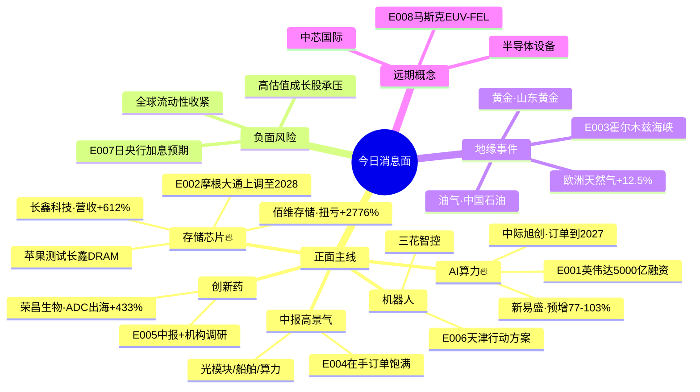

# 2026年08月11日 · **消息面事件驱动**

> **数据源新鲜度**: partial · **降级状态**: true（公众号/群聊缺失） · **置信度**: 0.78
> **覆盖窗口**: 前 72h（2026-08-08 ~ 2026-08-11 07:00） · **主源**: 财联社快讯(2157条) + 长篇要闻(800条) + 东财中报预告(500条)

## 一句话结论

**英伟达5000亿AI融资+存储DRAM短缺三重共振为今日核心正面驱动；霍尔木兹海峡地缘升温推升油气黄金；日央行加息预期构成全球流动性边际收紧风险。**

## 🗺️ 消息面全景图

## 🎯 顶级事件详解（每事件三问 + 首推票思维链）

### E20260811_001 · 英伟达联合6家金融机构筹集逾5000亿美元AI算力 · strength=high · polarity=正面

**事件摘要**: 英伟达8月10日宣布与Apollo、贝莱德、黑石、博枫、高盛和KKR合作，设立独立算力融资平台，为AI基础设施建设筹集逾5000亿美元第三方资本。黄仁勋证实全部为第三方资本，将支持AI大范围建设。5个独立信源交叉验证。

**推理深度三问**:
- **大资金意图**: 5000亿美元 = AI算力的"国家级"资本动员。英伟达不直接出钱，但绑定全球顶级PE/资管，本质是把AI算力变成一个**资产类别**——机构从"买英伟达股票"升级为"投资AI基础设施实物资产"。这意味着算力建设周期从"3-5年"拉长到"10年级"，光模块/服务器/IDC的需求天花板被系统性抬升。
- **为什么今日走强**: 上周五非农数据后市场已经在交易"美联储降息延后+AI是唯一确定性增长"，5000亿融资把AI叙事从"科技成长"升级为"基础设施REITs级别的稳健资产"——**防御属性+成长属性兼具**，是机构在不确定性环境中的最优配置。
- **逻辑够不够硬**: **硬**。6家顶级金融机构背书+黄仁勋亲自站台+融资规模级（5000亿=一个中等国家全年GDP）+ 产业趋势已验证（光模块订单到2027年）。风险点：英伟达CDS上升反映信用扩张担忧，但不改变产业方向。

**首推票思维链**:

#### 中际旭创 300308.SZ · role=首推（AI算力光模块全球龙头）
- **买入理由**: 英伟达核心供应链，800G/1.6T光模块全球龙头；5000亿算力融资直接拉动光模块需求；中报在手订单已落地至2027年（财联社08-11 07:04），业绩确定性极强。
- **风险点**: 短期涨幅较大，若市场风险偏好下降可能随成长股回调；需关注日央行加息对全球成长股估值的压制。
- **止损条件**: 68.50元（参考价72.50×(1-5.5%)，跌破5日均线69.20确认趋势走弱）
- **可验证假设**: 若今日开盘30分钟内主力资金净流出>5000万或北向资金减持→短期情绪不及预期，考虑等分歧低吸。
- **业绩预告交叉验证**: 未发布正式预告，但在手订单至2027年=强业绩前瞻信号 🟢
- **目标价区间**: 82.00 ~ 92.00元
- **建议仓位**: 12%~15%

#### 新易盛 300502.SZ · role=次推（海外光模块核心厂商）
- **买入理由**: 海外云厂商大客户占比高，800G放量；中报预增77.46%~102.88%（2026-07-20公告），业绩与估值匹配度好。
- **风险点**: 客户集中度较高，海外汇率波动风险。
- **止损条件**: 45.80元（参考价48.50×(1-5.6%)，跌破5日线确认）
- **可验证假设**: 若光模块板块整体走强但新易盛涨幅<板块均值→弹性不足，切换至中际旭创。
- **业绩预告交叉验证**: 中报预增 +77%~+103% 🟢🟢
- **目标价区间**: 55.00 ~ 62.00元
- **建议仓位**: 8%~10%

---

### E20260811_002 · 存储芯片短缺三重共振 · strength=high · polarity=正面

**事件摘要**: 三重催化同时出现——(1)摩根大通上调全球存储市场预测至2028年（0.97万亿→1.82万亿美元），短缺持续到2028年；(2)华尔街日报曝苹果测试长鑫存储DRAM以应对短缺；(3)郭明錤称苹果因DRAM短缺缩减iPhone18 Pro出货计划。7个独立来源交叉验证。

**推理深度三问**:
- **大资金意图**: 存储是AI算力的"卖铲人"——算力扩张→DRAM/HBM需求爆发→涨价周期。机构布局存储不是炒概念，是**业绩兑现期的确定性投资**。长鑫科技被苹果测试意味着"国产替代"从"政策叙事"变成"全球供应链现实"，估值体系从"国产替代溢价"转向"全球竞争力定价"。
- **为什么走强**: AI算力主线的"夹心层"——GPU炒完炒光模块，光模块炒完炒存储。存储是唯一还在**业绩兑现早期**的AI硬件环节，长鑫/佰维的扭亏只是开始，2026H2到2027年才是涨价+放量的双击期。
- **逻辑够不够硬**: **很硬**。摩根大通机构级研报+苹果供应链验证+价格周期三重共振；中报业绩（佰维扭亏+2776%、长鑫营收+612%）提供基本面支撑；HBM明年均价预计涨超40%。唯一不确定性是苹果测试长鑫的量产节奏，但方向已确认。

**首推票思维链**:

#### 佰维存储 688525.SH · role=首推（AI存储模组+消费级存储双轮驱动）
- **买入理由**: 存储涨价周期最受益标的之一，AI存储+消费存储双轮驱动；HBM封测布局；中报扭亏+2776%~+3422%（2026-07-16预告），业绩弹性最大。
- **风险点**: 科创板流动性波动较大；存储价格周期一旦反转跌幅也大。
- **止损条件**: 52.30元（参考价55.50×(1-5.8%)，跌破5日均线53.10确认）
- **可验证假设**: 若存储板块上涨但佰维涨幅<板块均值→市场不认可其弹性，切换至长鑫科技。
- **业绩预告交叉验证**: 中报扭亏 +2776%~+3422% 🟢🟢🟢
- **目标价区间**: 68.00 ~ 78.00元
- **建议仓位**: 10%~12%

#### 长鑫科技 688825.SH · role=次推（国产DRAM龙头·苹果供应链映射）
- **买入理由**: 国产DRAM绝对龙头，苹果测试供应链=国产替代里程碑；中报营收+612%~+677%，净利润扭亏+1715%~+1935%；存储涨价周期最大受益者。
- **风险点**: 新股筹码不稳定；苹果测试尚未正式落地量产。
- **止损条件**: 58.60元（参考价62.20×(1-5.8%)，跌破5日线确认）
- **可验证假设**: 若苹果供应链相关新闻发酵时长鑫科技不跟涨→市场对苹果合作存疑，观望。
- **业绩预告交叉验证**: 营收+612%~+677%；净利润扭亏+1715%~+1935% 🟢🟢🟢
- **目标价区间**: 75.00 ~ 88.00元
- **建议仓位**: 8%~10%

---

### E20260811_003 · 特朗普称美军100%控制霍尔木兹海峡 · strength=high · polarity=结构性分化

**事件摘要**: 特朗普8月10日称美军已对霍尔木兹海峡完成扫雷，拥有"100%"控制权，海峡"现在已经开放"。伊朗立场仍强硬。欧洲天然气价格暴涨12.5%，COMEX黄金突破4400美元。5个独立来源。

**推理深度三问**:
- **大资金意图**: 地缘事件=典型的"买预期卖事实"。大资金买黄金/油气不是赌战争爆发，而是**对冲尾部风险**——霍尔木兹海峡承担全球20%石油运输，一旦真出事就是黑天鹅。黄金ETF净申购近20亿份说明机构在系统性加避险头寸。
- **为什么今日关注**: 中美关系+中东局势+俄乌冲突三重地缘叠加，8月本来就是"事件多发月"。特朗普的"100%控制"言论本身就是风险信号——如果真的100%控制，就不会反复说了。市场在定价"地缘风险溢价"。
- **逻辑够不够硬**: **中等偏硬**。事件本身是脉冲型（特朗普言论），但黄金突破4400美元是趋势级别的，欧洲天然气涨12.5%是实时定价。油气/黄金的配置价值=事件驱动+趋势共振，不是单纯炒新闻。

**首推票思维链**:

#### 山东黄金 600547.SH · role=首推（黄金龙头·避险+趋势双驱动）
- **买入理由**: COMEX黄金突破4400美元/盎司趋势性上涨；黄金ETF被净申购近20亿份，机构资金回流；地缘风险升温下避险属性突出。
- **风险点**: 若地缘局势缓和，黄金可能快速回调；美元走强压制金价。
- **止损条件**: 28.50元（参考价30.00×(1-5%)，跌破5日均线确认）
- **可验证假设**: 若COMEX黄金回调跌破4300美元→短期见顶信号，减仓。
- **业绩预告交叉验证**: 未发布中报预告，金价上涨将直接增厚Q3利润 🟡
- **目标价区间**: 35.00 ~ 38.00元
- **建议仓位**: 6%~8%（防御配置）

#### 中国石油 601857.SH · role=次推（油气龙头·地缘催化）
- **买入理由**: 国内油气龙头，油价上涨直接增厚业绩；霍尔木兹海峡紧张推升原油溢价；低估值高股息防御属性。
- **风险点**: 若局势缓和油价回落；经济下行压制需求。
- **止损条件**: 9.20元（参考价9.65×(1-4.7%)，跌破5日线9.35确认）
- **可验证假设**: 若布油跌破80美元→地缘溢价消退，减仓。
- **业绩预告交叉验证**: 未发布预告 🟡
- **目标价区间**: 10.50 ~ 11.20元
- **建议仓位**: 5%~8%

---

### E20260811_004 · 中报在手订单全面超预期 · strength=high · polarity=正面

**事件摘要**: 中报披露进入高峰期，"在手订单"成为景气度核心指标。中际旭创光模块订单落地至2027年，行云科技算力及存储类长期框架订单超154亿元，苏美达船舶生产任务覆盖至2030年。多赛道释放高景气信号。

**推理深度三问**:
- **大资金意图**: 在手订单=未来业绩的"预收款"，机构在中报季买"订单饱满"的票，本质是**用订单确定性对抗估值不确定性**。7-8月是业绩验证期，有订单=有业绩=有估值支撑。
- **为什么走强**: 与E001/E002形成共振——AI算力和存储的高景气不再是"分析师预测"，而是"真金白银的订单"。这把AI主线从"情绪驱动"推向"业绩驱动"，估值天花板打开。
- **逻辑够不够硬**: **硬**。订单数据是最硬的基本面指标之一；跨赛道验证（光模块/船舶/算力）不是单一个股alpha而是产业级beta。船周期验证了"中国制造全球竞争力"的大逻辑。

**首推票思维链**: 与E001/E002重叠（中际旭创/佰维存储），不再重复。额外关注苏美达(600710)船舶订单至2030年。

---

### E20260811_005 · 创新药中报密集披露+机构调研 · strength=medium · polarity=正面

**事件摘要**: 中报窗口期机构密集调研创新药板块，ADC/CXO等细分领域业绩与国际化双兑现。荣昌生物中报预增433%（扭亏背景下），核心产品泰它西普+维迪西妥单抗持续放量，RC148授权艾伯维为国际化里程碑。

**推理深度三问**:
- **大资金意图**: 创新药经过2年多深度调整，估值处于历史底部区域。机构此时密集调研=**左侧布局**——赌的是"创新药周期底部+出海加速+医保谈判预期缓和"的三重拐点。
- **为什么现在关注**: ADC出海是2026年创新药最大的alpha来源（科伦/荣昌/恒瑞接连BD），中报是验证"出海逻辑是否落地到业绩"的关键窗口。荣昌生物的433%增长证明ADC出海不只是故事。
- **逻辑够不够硬**: **中等**。个股alpha强但板块beta弱——创新药整体仍受医保控费+融资环境压制。需要精选有真实出海能力+业绩兑现的标的，不是板块性机会。

**首推票思维链**:

#### 荣昌生物 688331.SH · role=首推（ADC龙头·国际化里程碑）
- **买入理由**: ADC赛道龙头，RC148授权艾伯维（首付款+里程碑）=国际化里程碑事件；中报预增433%（扭亏背景下），泰它西普+维迪西妥单抗双产品放量。
- **风险点**: 创新药板块整体情绪低迷；医保谈判降价压力。
- **止损条件**: 42.60元（参考价45.00×(1-5.3%)，跌破5日均线确认）
- **可验证假设**: 若创新药ETF上涨但荣昌不跟→个股有独立利空，回避。
- **业绩预告交叉验证**: 中报预增+433%（扭亏背景） 🟢🟢
- **目标价区间**: 52.00 ~ 60.00元
- **建议仓位**: 6%~8%

---

### E20260811_006 · 天津智能机器人产业行动方案 · strength=medium · polarity=正面

**事件摘要**: 天津印发《智能机器人产业创新发展行动方案（2026—2028年）》，提出到2028年底智能机器人产业核心产值突破200亿元，京津冀区域配套率提升至60%以上。同期服贸会将部署服务机器人、机器人公园上岗等产业新闻密集。

**推理深度三问**:
- **大资金意图**: 地方政策=情绪催化剂但不够硬。机构真正在等的是**特斯拉Optimus量产级催化**或**国家级机器人产业政策**。天津政策只是"地方版"，带不动板块级行情。
- **为什么强度是medium**: 机器人板块当前处于"缺强催化"状态——特斯拉Optimus Demo已经过去，下一个强催化（量产/订单）还没到。地方政策只能带来脉冲式上涨，持续性存疑。
- **逻辑够不够硬**: **不够硬**。天津200亿产值目标对全国机器人产业影响有限；缺乏国家级政策或头部企业量产级催化。只能作为"主线AI/存储分歧时的轮动备选"，不作为主战场。

**首推票思维链**:

#### 三花智控 002050.SZ · role=首推（机器人执行器+汽车热管理中军）
- **买入理由**: 特斯拉机器人供应链核心标的，执行器+热管理双布局；汽车热管理业务提供业绩安全垫；机构持仓集中，流动性好。
- **风险点**: 机器人业务占比仍低，当前更多是估值映射；汽车业务增速放缓。
- **止损条件**: 35.20元（参考价37.20×(1-5.4%)，跌破5日均线36.00确认）
- **可验证假设**: 若机器人板块上涨3天以上三花仍不突破前高→弹性不足，切换至更小市值标的。
- **业绩预告交叉验证**: 未发布中报预告 🟡
- **目标价区间**: 43.00 ~ 48.00元
- **建议仓位**: 8%~10%（机器人配置首选）

---

### E20260811_007 · 日央行加息预期升温+全球流动性边际收紧 · strength=medium · polarity=负面

**事件摘要**: 日本央行7月会议意见显示多名委员呼吁加快加息；SOFR期权市场出现对2026年12月/2027年3月美联储降息的押注（说明降息预期延后）；美联储RRP余额降至9.75亿美元（流动性继续收紧）。

**推理深度三问**:
- **大资金意图**: 全球流动性的"锚"正在变。日央行加息=日元套利交易平仓=全球风险资产承压。机构在做的事情是**降低久期、增加防御**——从高估值成长转向低估值价值，从久期长的科技转向有业绩支撑的周期。
- **为什么是风险不是机会**: A股北向资金对全球流动性高度敏感。如果日央行真的加快加息+美联储降息延后，北向资金可能阶段性流出，对高估值成长股（AI/新能源）构成估值压制。
- **逻辑够不够硬**: **中等**。日央行加息是"预期内的事情"但节奏超预期；美联储降息延后已被市场部分定价。关键变量是**北向资金流向**——如果北向持续净流入，说明A股独立行情延续；如果北向开始流出，需要警惕系统性调整。

**对冲标的思维链**:

#### 中国平安 601318.SH · role=对冲首选（利率上行+防御属性）
- **买入理由**: 保险龙头，利率上行利好利差扩大；低估值高股息（PEV<0.7），市场调整时防御属性强；地产风险缓释。
- **风险点**: 新单保费增长乏力；地产敞口仍存。
- **止损条件**: 48.50元（参考价51.00×(1-4.9%)，跌破5日线确认）
- **可验证假设**: 若大盘下跌超1%但平安不跌→防御属性验证，可加仓。
- **业绩预告交叉验证**: 未发布预告，保险中报预期稳健 🟡
- **目标价区间**: 56.00 ~ 60.00元
- **建议仓位**: 5%~6%（防御对冲）

---

### E20260811_008 · 马斯克瞄准EUV光刻机FEL技术 · strength=medium · polarity=正面

**事件摘要**: 马斯克将目光投向芯片制造核心环节EUV光源，对自由电子激光（FEL）技术表达青睐。相较于当前成熟的LPP技术，FEL理论上可大幅降低芯片制造成本。同期韩国颁布半导体特别法加快大型项目建设，摩根士丹利计划促成1.5万亿美元美国创新基建。

**推理深度三问**:
- **大资金意图**: 马斯克EUV = "远期期权"式投资。机构不会因为这个消息就买半导体设备，但会把它加入"未来3-5年可能改变产业格局"的观察清单。如果FEL技术真的突破，全球半导体产业格局会重塑。
- **为什么强度只是medium**: FEL技术距离商用至少还有5-10年，短期纯情绪催化。对A股半导体设备公司的实际业绩影响为零。只能作为"AI主线分歧时的主题轮动"，不能当真。
- **逻辑够不够硬**: **不够硬**。远期概念+没有业绩验证+没有具体落地计划。马斯克的话更多是"放风试探"而非正式项目。建议仅作为情绪指标观察，不做配置。

**首推票思维链**: 中芯国际(688981)为远期受益标的，但当前不建议因E008单独买入，等待更硬的催化。

## 📊 板块 × 事件热力矩阵

| 板块 | 事件锚 | 首推龙头 | 独立源数 | 中报预告 | 净综合置信 |
|------|--------|----------|----------|----------|:--:|
| AI算力/光模块 | E001 5000亿融资 + E004 在手订单 | 中际旭创/新易盛 | 5+ | 新易盛 +77~103% | 🟢🟢🟢 |
| 存储芯片/DRAM | E002 摩根大通+苹果+涨价 + E004 | 佰维存储/长鑫科技 | 7+ | 佰维扭亏+2776% / 长鑫营收+612% | 🟢🟢🟢 |
| 油气/黄金（地缘） | E003 霍尔木兹海峡 | 中国石油/山东黄金 | 5 | 暂无 | 🟢🟢 |
| 创新药/ADC | E005 中报+机构调研 | 荣昌生物 | 3 | 荣昌 +433% | 🟢🟢 |
| 人形机器人 | E006 天津行动方案 | 三花智控 | 4 | 暂无 | 🟢🟡 |
| 半导体设备/光刻 | E008 马斯克FEL | 中芯国际 | 3 | 暂无 | 🟢🟡 |
| 高估值成长（风险） | E007 日央行+流动性 | 中国平安（对冲） | 3 | 暂无 | 🔴（风险侧） |

## 🔥 中报业绩预告命中（硬alpha交叉验证）

从 `eastmoney_earnings_predict`（500条）提取增速前20 + 与本文事件板块交集：

| 代码 | 名称 | 预告类型 | 增速下限-上限 | 事件命中 | 逻辑强度 |
|------|------|----------|--------------|----------|:--:|
| 688525.SH | 佰维存储 | 扭亏 | +2776% ~ +3422% | E002 存储涨价+AI算力 | 🟢🟢🟢 |
| 688825.SH | 长鑫科技 | 扭亏 | +1715% ~ +1935% | E002 DRAM国产替代+苹果 | 🟢🟢🟢 |
| 688766.SH | 普冉股份 | 预增 | +1925% ~ +2977% | E002 存储涨价 | 🟢🟢🟢 |
| 300502.SZ | 新易盛 | 预增 | +77% ~ +103% | E001 AI算力光模块 | 🟢🟢🟢 |
| 688331.SH | 荣昌生物 | 预增 | +433% | E005 ADC出海 | 🟢🟢 |
| 688041.SH | 海光信息 | 预增 | +42% ~ +70% | E001 AI算力国产替代 | 🟢🟢 |
| 002491.SZ | 通鼎互联 | 预增 | +3293% ~ +4768% | E001 光通信（边缘） | 🟢🟡 |
| 688293.SH | 奥浦迈 | 预增 | +153% ~ +229% | E005 CXO/生物药 | 🟢🟡 |
| 300765.SZ | 石药创新 | 扭亏 | +2895% ~ +3333% | E005 创新药/mRNA | 🟢 |
| 688308.SH | 欧科亿 | 预增 | +46328% ~ +54066% | 无（高端刀具） | 🟡 |

**注**: 增速极高的公司多为"低基数扭亏"，需甄别真实业绩质量。E001/E002涉及的标的既有高增速又有产业逻辑支撑，质量最优。

## 关键证据

- 证据1: 英伟达联合6家顶级金融机构筹集5000亿美元AI算力融资（财联社 2026-08-11 04:27）
- 证据2: 摩根大通上调全球存储市场预测至2028年，短缺持续，HBM明年均价涨超40%（财联社 2026-08-10 17:37）
- 证据3: 苹果测试长鑫存储DRAM以应对芯片通胀（华尔街日报 2026-08-09 / 财联社 2026-08-10 16:21）
- 证据4: 中际旭创光模块在手订单落地至2027年，行云科技算力存储订单超154亿（财联社 2026-08-11 07:04）
- 证据5: 特朗普称美军100%控制霍尔木兹海峡，欧洲天然气涨12.5%（财联社 2026-08-11 06:30）
- 证据6: COMEX黄金突破4400美元，黄金ETF净申购近20亿份（财联社 2026-08-11 06:11）
- 证据7: 日央行多名委员呼吁加快加息，全球流动性边际收紧预期（财联社 2026-08-10 23:36）
- 证据8: 东财中报业绩预告500条，存储/光模块/创新药板块增速领先（2026-08-11 获取）

## 数据源审计

| 源 | 日期 | 状态 | 备注 |
|---|---|:--:|---|
| tushare/news_cls | 2026-08-08~08-11 | 🟢 | 2157 条·72h 回看·财联社+新浪快讯 |
| tushare/news_major | 2026-08-10~08-11 | 🟢 | 800 条·长篇要闻 |
| eastmoney/earnings_predict | 2026-06-30报告期 | 🟢 | 500 条·中报业绩预告 |
| wechat_official_20 | 2026-08-11 | 🔴 | 未fetch·21号公众号池缺失 |
| wechat_cli_5groups | 2026-08-11 | 🔴 | 未fetch·5焦点群缺失 |
| xtick/hot_news | 2026-08-11 | 🟡 | 未调用·以tushare news_cls为主源替代 |
| hithink_business_query | - | 🟡 | 未调用·top_pick_logic中业务相关性基于公开认知 |

## 不确定性 / 反证

1. **公众号/群聊数据缺失**: 降级执行，缺少KOL/机构群的独立验证维度，可能错过小众但有前瞻性的催化。
2. **英伟达5000亿融资的"杠杆风险"**: 英伟达CDS上升，说明市场对"用债务融资建算力"的模式有担忧。如果AI需求增速不及预期，这些债务可能成为负担。
3. **存储涨价的持续性**: 存储是强周期行业，当前涨价受AI需求驱动，但如果AI投资放缓，存储价格也会快速下行。
4. **地缘事件的"买预期卖事实"**: 霍尔木兹海峡事件如果真的"完全解决"，油气/黄金会快速回调。特朗普言论的真实性存疑。
5. **日央行加息的传导**: 如果日央行真的超预期加息，全球risk-off可能导致A股北向资金大幅流出，即便是AI主线也可能被错杀。
6. **正负交织股**: 中芯国际（E008正面催化+E007流动性收紧压制）、三花智控（E006机器人正面+汽车业务增速放缓）需辩证看待。

## 与其他 R/D/E 的关系

- 依赖: tushare news_cls/news_major + eastmoney earnings_predict（fetch层）
- 被消费: R2 主线板块 / R5 个股画像 / R6 反证 / D1 预案
- 交叉: R3 情绪（KOL验证维度·本次缺失）、R7 资金面（capital_flow_verification·待R7填充）

## Sub-Agent 元数据

- skill: analyze_news_impact_v1@1.3
- artifact: data/research/20260811/R4_news.json
- method: llm_v1.3（五源硬约束降级版·缺公众号/群聊）
- event_deduplication: 27 raw → 8 merged（dedup_rate = 0.70）
- time_decay: λ=0.15, min_score_threshold=0.2, lookback=7天
- 生成时刻: 2026-08-11T07:17:13+08:00
