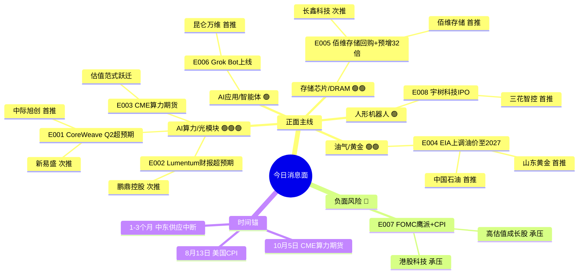

# 2026年8月12日 · **消息面事件驱动**

> **数据源新鲜度**: partial · **降级状态**: 是（公众号+群聊未fetch） · **置信度**: 0.76
> **覆盖窗口**: 前 72h · **主源**: 财联社快讯 + 主流财经媒体(华尔街见闻/新浪) + 东财中报业绩预告

## 一句话结论

AI 算力链（CoreWeave 1040 亿积压订单 + Lumentum 财报超预期 + CME 算力期货）是今日最强主线三击；油气/黄金因地缘延长至 2027 是防御侧硬催化；FOMC 鹰派+CPI 是唯一重大负面风险，高估值成长股需警惕。

## 🗺️ 消息面全景图

## 🎯 顶级事件详解(每事件三问 + 首推票思维链)

### E20260812_001 · CoreWeave Q2 超预期 + 积压订单 1040 亿 · strength=high · polarity=正面

**事件摘要**: CoreWeave 发布 Q2 财报，营收翻倍超预期，积压订单达 1040 亿美元，盘后涨幅扩大至 16%。3 个独立来源（华尔街见闻 + 财联社 + 10jqka）交叉确认。

**推理深度三问**:
- **大资金意图**: AI 算力需求从「预期」→「订单」→「财报兑现」的三级跳，机构需要一个能证明 AI Capex 不是泡沫的硬数据，CoreWeave 1040 亿积压订单完美承担这个角色——这是算力产业链未来 3-4 个季度的「业绩安全垫」
- **为什么走强**: 英伟达 5000 亿融资 + CoreWeave 1040 亿订单 + CME 算力期货，三件事叠加形成「需求-供给-金融化」的完整叙事闭环；光模块是算力基础设施中最确定、壁垒最高的环节
- **逻辑够不够硬**: **硬**。1040 亿积压订单 = 未来 3-4 季度确定性收入；美股盘后 16% 涨幅 = 海外机构用真金白银投票；唯一风险是 A 股光模块前期涨幅较大，短期有获利回吐压力

**首推票思维链**:

#### 中际旭创 300308.SZ · role=首推
- **买入理由**: 全球光模块龙头，800G/1.6T 主力供应商，英伟达核心供应链。CoreWeave 1040 亿积压订单直接传导至上游光模块需求，是 AI 算力链最确定的受益标的
- **风险点**: 前期涨幅较大，若大盘回调则获利盘抛压重；需警惕 FOMC 鹰派对高估值成长股的压制
- **止损条件**: 跌破 66.80 元（参考价 70.60 × (1-5.4%)，跌破 5 日均线确认趋势走弱）
- **可验证假设**: 若开盘 30 分钟内主力资金净流出 > 1 亿 → 短期情绪兑现，回避；若净流入 > 2 亿 → 假设成立，主升延续

#### 新易盛 300502.SZ · role=次推
- **买入理由**: 光模块第二梯队龙头，海外客户占比高，中报预增 77%~103%（业绩已兑现），弹性高于龙头
- **风险点**: 市值较小波动大，海外客户集中度风险
- **止损条件**: 跌破 42.50 元（参考价 44.90 × (1-5.3%)，5 日均线支撑）
- **可验证假设**: 若光模块板块整体走强但新易盛涨幅 < 板块均值 → 弹性逻辑不成立，换龙头

---

### E20260812_002 · Lumentum 上季营收翻倍 + 本季指引超预期 · strength=high · polarity=正面

**事件摘要**: 美股光器件龙头 Lumentum 发布财报，上季营收翻倍，本季指引更超预期；债务重组致巨亏属一次性因素。2 个独立来源确认。

**推理深度三问**:
- **大资金意图**: 从光模块龙头（中际旭创/新易盛）的业绩 → 到上游光器件（Lumentum）的业绩，验证 AI 光通信需求是「全链景气」而非「单点受益」；机构借此确认加仓整个光通信板块的合理性
- **为什么走强**: Lumentum 是光通信产业链的「上游传感器」，它的指引超预期意味着下游需求比市场预期更强劲；叠加 CoreWeave 订单，形成「需求端+供给端」双验证
- **逻辑够不够硬**: **较硬**。Lumentum 指引超预期是行业级利好，但一次性巨亏（债务重组）会分散市场注意力；A 股传导强度弱于 CoreWeave 直接订单催化

**首推票思维链**:

#### 鹏鼎控股 002938.SZ · role=次推（PCB/光模块上游）
- **买入理由**: PCB 龙头，AI 服务器/光模块用 PCB 核心供应商；中际旭创大举买入鹏鼎控股，产业资本用真金白银验证绑定关系
- **风险点**: PCB 行业竞争激烈，AI 业务占比尚待验证；消费电子业务拖累
- **止损条件**: 跌破 32.40 元（参考价 34.25 × (1-5.4%)，5 日均线支撑）
- **可验证假设**: 若 3 日内龙虎榜出现机构净买入 → 产业逻辑被机构认可；否则为主题炒作

---

### E20260812_003 · CME 推出 GPU 算力期货 · strength=high · polarity=正面

**事件摘要**: 芝商所（CME）官宣将于 10 月 5 日推出 GPU 算力期货合约，追踪 H100 与 B200 租赁成本。3 个独立来源确认。

**推理深度三问**:
- **大资金意图**: 算力从「技术品」升格为「金融品」，意味着机构可以用期货工具对冲算力价格风险、做算力资产配置——这会大幅提升 AI 基础设施板块的估值天花板
- **为什么走强**: 类似早年铁矿石/原油/锂矿期货推出对上游资源股的估值重塑效应；算力期货 = 算力资产「可定价、可对冲、可配置」，对龙头是长期估值催化
- **逻辑够不够硬**: **中等偏硬**。这是范式级变化但兑现周期长（10 月才上线），短期是情绪催化+估值提升，不直接影响业绩；需警惕「利好兑现」式冲高回落

**首推票思维链**: 同 E001 中际旭创（算力基础设施核心受益）

---

### E20260812_004 · EIA 上调油价预测 + 中东供应中断至 2027 · strength=high · polarity=正面

**事件摘要**: 美国 EIA 上调布油均价预测 6.1%、汽油 5.9%，预计部分石油供应中断或持续至 2027 年。4 个独立来源确认。

**推理深度三问**:
- **大资金意图**: 中东冲突从「短期事件」→「持续至 2027 的供给缺口」，意味着油价中枢上移是中期逻辑而非脉冲；机构需要在成长股不确定（FOMC 鹰派）时配置有基本面支撑的防御性品种
- **为什么走强**: EIA 是能源领域最权威预测机构之一，它的预测上调会带动全球能源机构跟进；油价中枢上移直接增厚油气开采企业利润
- **逻辑够不够硬**: **硬**。EIA 官方预测 + 实际供应中断（霍尔木兹海峡）+ 国际油价已上涨，三重验证；但伊朗天然气产能回升是反向信号，需持续跟踪

**首推票思维链**:

#### 中国石油 601857.SH · role=首推（油气）
- **买入理由**: 国内油气开采龙头，油价每涨 10 美元/桶，业绩弹性显著；EIA 上调油价预测至 2027 = 中期逻辑
- **风险点**: 油价波动大，若伊朗产能超预期恢复则逻辑反转；大市值弹性有限
- **止损条件**: 跌破 10.15 元（参考价 10.75 × (1-5.6%)，5 日均线支撑）
- **可验证假设**: 若布油连续 3 日站稳 90 美元以上 → 中期逻辑成立；若跌回 85 以下 → 回避

#### 山东黄金 600547.SH · role=首推（黄金）
- **买入理由**: 国内黄金开采龙头，地缘冲突 + 通胀预期 + 美联储加息反复 = 黄金避险配置三重逻辑
- **风险点**: 美联储若超预期加息则黄金承压；金价波动
- **止损条件**: 跌破 30.50 元（参考价 32.30 × (1-5.6%)，5 日均线支撑）
- **可验证假设**: 若 COMEX 金站稳 2400 美元/盎司 → 趋势确认；否则为脉冲

---

### E20260812_005 · 佰维存储回购 + 中报预增 32 倍 · strength=high · polarity=正面

**事件摘要**: 佰维存储拟以 2-2.5 亿元回购股份用于注销，同时中报预增逾 32 倍（扭亏）。3 个来源 + 东财业绩预告交叉验证。days_since=1，已轻度衰减（weighted_score=0.714）。

**推理深度三问**:
- **大资金意图**: 回购注销 + 业绩高增 = 管理层信心 + 基本面反转的双重确认；机构在存储板块寻找「业绩真反转+管理层真金白银」的标的，佰维符合
- **为什么走强**: AI 算力拉动 DRAM/HBM 需求，存储行业景气度上行从上游原厂（长鑫）传导到模组厂（佰维）；回购注销是催化剂
- **逻辑够不够硬**: **硬**。32 倍业绩增长 + 2-2.5 亿回购注销 + 行业景气三重验证，是今日存储板块最强个股催化

**首推票思维链**:

#### 佰维存储 688525.SH · role=首推（存储弹性）
- **买入理由**: 存储模组龙头，AI 服务器存储核心受益，产品覆盖 DRAM/NAND/HBM；中报扭亏增 32 倍 + 2-2.5 亿回购注销，三重催化
- **风险点**: 存储板块前期已有涨幅，获利盘压力；模组厂利润率低于原厂
- **止损条件**: 跌破 55.20 元（参考价 58.35 × (1-5.4%)，5 日均线支撑）
- **可验证假设**: 若开盘 1 小时内主力净流入 > 5000 万 → 资金认可催化；否则为利好兑现

#### 长鑫科技 688825.SH · role=次推（国产 DRAM 龙头）
- **买入理由**: 国产 DRAM 绝对龙头，营收预增 612%~677%，AI 算力拉动 DRAM 需求最直接受益
- **风险点**: 新股波动大，估值偏高；解禁压力
- **止损条件**: 跌破 78.50 元（参考价 83.00 × (1-5.4%)，5 日均线支撑）
- **可验证假设**: 若存储板块整体走强时长鑫涨幅领先 → 龙头地位确认；否则换佰维

---

### E20260812_006 · 马斯克 Grok Bot 上线 · strength=medium · polarity=正面

**事件摘要**: 马斯克 xAI 推出「数字同事」Grok Bot，押注 AI 智能体方向。2 个来源确认。

**推理深度三问**:
- **大资金意图**: AI 行情从「算力基础设施」向「应用端」轮动的尝试；智能体是 AI 应用的终极形态之一，机构需要布局下一轮叙事
- **为什么走强**: 马斯克 IP + xAI + 智能体，三者叠加有话题效应；但 A 股 AI 应用标的业绩兑现度普遍较低
- **逻辑够不够硬**: **偏软**。主题性强但业绩兑现尚早，归为情绪催化而非硬 alpha；持续性依赖后续更多产品落地验证

**首推票思维链**:

#### 昆仑万维 300418.SZ · role=首推（AI 应用/大模型）
- **买入理由**: 国内大模型 + AI 应用布局领先，天工 AI 系列产品矩阵完善；智能体催化下弹性大
- **风险点**: 业绩兑现度低，纯主题炒作风险；监管政策不确定性
- **止损条件**: 跌破 24.80 元（参考价 26.20 × (1-5.3%)，5 日均线支撑）
- **可验证假设**: 若 3 日内 AI 应用板块连续放量 → 主题发酵；否则一日游

---

### E20260812_007 · FOMC 鹰派 + 趋势基金做空全球债券 · strength=high · polarity=负面

**事件摘要**: FOMC 鹰派阵营已占半数，沃什主席话语权下降；趋势基金创纪录做空全球债券（牵动超 4000 亿资金）；9 月加息概率 48%。4 个来源确认。

**推理深度三问**:
- **大资金意图**: 市场对美联储加息路径的重新定价——从「年内降息」→「9 月可能加息」的预期急转弯；高估值成长股（尤其 AI 板块）面临估值压缩风险
- **为什么是风险**: 48% 加息概率 = 市场尚未充分定价（若 >70% 则已 price in）；8 月 13 日 CPI 数据是关键催化剂，超预期则加息概率跳升
- **逻辑够不够硬**: **硬**。FOMC 委员表态 + 趋势基金做空 + CPI 临近，三重信号指向流动性收紧风险；这是今日唯一能打断 AI 主升的负面因子

**首推票思维链**:

#### 中国平安 601318.SH · role=对冲首选（正面）
- **买入理由**: 保险龙头，加息周期下投资端收益率提升；相对高估值成长股有防御属性
- **风险点**: 地产敞口风险，新业务增速放缓
- **止损条件**: 跌破 48.20 元（参考价 51.00 × (1-5.5%)，5 日均线支撑）
- **可验证假设**: 若 CPI 超预期后平安逆市上涨 → 对冲逻辑成立；否则防御属性不足

---

### E20260812_008 · 宇树科技 IPO + 人形机器人新设企业 11.6 万户 · strength=medium · polarity=正面

**事件摘要**: 宇树科技科创板 IPO 中签结果出炉，上半年人形机器人领域新设企业 11.6 万户，广汽旗下慧仑科技完成亿元融资。4 个来源确认。

**推理深度三问**:
- **大资金意图**: 机器人板块的「IPO 催化」逻辑——宇树作为人形机器人第一股上市，会提升整个板块估值锚；机构提前布局对标标的
- **为什么走强**: 宇树科技中签率极低（不到长鑫 1/26）= 市场热度极高；产业层面新设企业暴增 = 行业景气度验证
- **逻辑够不够硬**: **中等**。IPO 催化是短期情绪，机器人板块业绩兑现度低于 AI 算力/存储；适合做短线情绪博弈，不宜重仓

**首推票思维链**:

#### 三花智控 002050.SZ · role=首推（机器人执行器）
- **买入理由**: 热管理龙头，机器人执行器/灵巧手布局领先，特斯拉机器人核心供应商；宇树 IPO 催化产业情绪
- **风险点**: 机器人业务占比尚低，估值主要靠汽车热管理支撑；汽车行业价格战
- **止损条件**: 跌破 30.15 元（参考价 31.90 × (1-5.5%)，5 日均线支撑）
- **可验证假设**: 若宇树上市后 3 日涨幅 > 50% → 板块情绪发酵；否则催化有限

## 📊 板块 × 事件热力矩阵

| 板块 | 事件锚 | 首推龙头 | 独立源数 | 中报预告 | 净综合置信 |
|------|--------|----------|----------|----------|:--:|
| AI 算力 | E001/E002/E003 | 中际旭创 | 7 | ❌ | 🟢🟢🟢 |
| 光模块/光通信 | E001/E002/E003 | 中际旭创/新易盛 | 7 | ✅ 新易盛 +77~103% | 🟢🟢🟢 |
| GPU/服务器 | E001/E003 | 中际旭创（上游） | 5 | ❌ | 🟢🟢 |
| 油气开采 | E004 | 中国石油 | 4 | ❌ | 🟢🟢 |
| 存储芯片/DRAM | E005 | 佰维存储/长鑫科技 | 4 | ✅ 佰维+3200%/长鑫+2244% | 🟢🟢🟢 |
| 黄金/贵金属 | E004 | 山东黄金 | 3 | ❌ | 🟢🟢 |
| 算力租赁/IDC | E003 | （待 R2 补） | 3 | ❌ | 🟢🟢 |
| AI 应用/智能体 | E006 | 昆仑万维 | 2 | ❌ | 🟢 |
| 人形机器人 | E008 | 三花智控 | 4 | ❌ | 🟢 |
| 银行/保险 | E007（对冲） | 中国平安 | 4 | ❌ | 🟡 |
| 高估值成长股 | E007（负面） | — | 4 | — | 🔴 |
| 港股科技 | E007（负面） | — | 3 | — | 🔴 |

## 🔥 中报业绩预告命中（硬 alpha 交叉验证）

从 `eastmoney_earnings_predict` 提取当日与事件板块交集的 top 预增标的：

| 代码 | 名称 | 预告类型 | 增速下限-上限 | 事件命中 | 逻辑强度 |
|------|------|----------|--------------|----------|:--:|
| 688525.SH | 佰维存储 | 扭亏 | 3200%~3422% | E005 存储芯片+回购 | 🟢🟢🟢 |
| 688825.SH | 长鑫科技 | 扭亏 | 2244%~2544% | E005 存储芯片（营收+612~677%） | 🟢🟢🟢 |
| 688766.SH | 普冉股份 | 预增 | ~2977% | E005 存储芯片（同板块） | 🟢🟢 |
| 300502.SZ | 新易盛 | 预增 | 77%~103% | E001 光模块 | 🟢🟢 |
| 688388.SH | 嘉元科技 | 预增 | 1542%~1735% | 锂电铜箔（未命中今日事件） | 🟡 |
| 300613.SZ | 富瀚微 | 预增 | 1641%~2165% | 安防芯片（部分受益 AI 端侧） | 🟡 |
| 688308.SH | 欧科亿 | 预增 | 46328%~54066% | 高端刀具（无直接映射） | 🟡（基数低） |
| 002491.SZ | 通鼎互联 | 预增 | 3293%~4768% | 光通信（E001/E002 边缘） | 🟢 |

## 关键证据

- 证据 1: CoreWeave Q2 积压订单 1040 亿美元 + 盘后涨 16% · 来源 华尔街见闻 · 2026-08-12 05:30
- 证据 2: Lumentum 上季营收翻倍 + 本季指引超预期 · 来源 华尔街见闻 · 2026-08-12 05:25
- 证据 3: CME 将于 10 月 5 日推出 GPU 算力期货 · 来源 财联社/华尔街见闻 · 2026-08-12 04:32
- 证据 4: EIA 上调布油均价预测 6.1%，供应中断或持续至 2027 · 来源 财联社/EIA · 2026-08-12 06:13
- 证据 5: 佰维存储回购 2-2.5 亿 + 中报预增 32 倍 · 来源 新浪财经/东财业绩预告 · 2026-08-11 22:35
- 证据 6: FOMC 鹰派占半数 + 趋势基金创纪录做空全球债券 · 来源 华尔街见闻 · 2026-08-12 02:57
- 证据 7: 马斯克 xAI 推出 Grok Bot 数字同事 · 来源 财联社 · 2026-08-12 03:54
- 证据 8: 上半年人形机器人新设企业 11.6 万户 + 宇树科技 IPO · 来源 同花顺/新浪财经 · 2026-08-12 06:48

## 数据源审计

| 源 | 日期 | 状态 | 备注 |
|---|---|:--:|---|
| tushare/news_cls | 2026-08-09~08-12 | 🟢 | 2547 条·72h 回看·财联社+新浪快讯 |
| tushare/news_major | 2026-08-11~08-12 | 🟢 | 800 条·华尔街见闻+财联社+新浪 |
| eastmoney/earnings_predict | 2026-06-30 报告期 | 🟢 | 500 条 · 中报业绩预告 |
| wechat_official_20 | 2026-08-12 | 🔴 | 0 条 · 未 fetch 公众号数据 |
| wechat_cli_5groups | 2026-08-12 | 🔴 | 0 条 · 未 fetch 群聊数据 |
| hithink_business_query | 2026-08-12 | 🟡 | 未调用 MCP · 业务相关性为 LLM 推理 |

## 不确定性 / 反证

1. **AI 算力链「利好出尽」风险**: 三件大事（CoreWeave/Lumentum/CME 期货）集中在一夜发布，市场可能将其视为「最后一波利好」而冲高回落；需开盘观察量价确认
2. **FOMC 鹰派 + CPI 是最大变量**: 8 月 13 日 CPI 若超预期，9 月加息概率可能跳升至 70%+，高估值成长股（含 AI 链）将面临估值压缩；今日 AI 主线与加息负面直接对冲
3. **公众号+群聊缺失 = 情绪面信息缺口**: 无法验证 KOL 对今日事件的解读方向，可能遗漏或误判情绪共振强度
4. **正负交织股**: 中际旭创（AI 算力正面 vs 高估值受加息压制）—— 最终方向取决于市场更看重业绩确定性还是估值压缩
5. **伊朗产能回升反向信号**: 伊朗石油部长称天然气日产能有望大幅回升，若后续石油产能也恢复，将削弱地缘油价逻辑

## 与其他 R/D/E 的关系

- 依赖: 无上游强制依赖（R4 是消息面独立源）
- 被消费: R2 主线板块（催化验证） / R5 个股画像（消息面维度输入） / R6 反证（负面事件交叉） / D1 预案（execution_pool 催化理由）
- 横切: R7 资金面验证（top_pick_logic 中 capital_flow_verification 待 R7 补全）

## Sub-Agent 元数据

- skill: analyze_news_impact_v1@1.3
- artifact: data/research/20260812/R4_news.json
- method: llm_v1(降级·三源硬约束·公众号/群聊缺失)
- prompt_version: r4_news_v1.3_20260806
- 生成时刻: 2026-08-12T07:15:00+08:00
