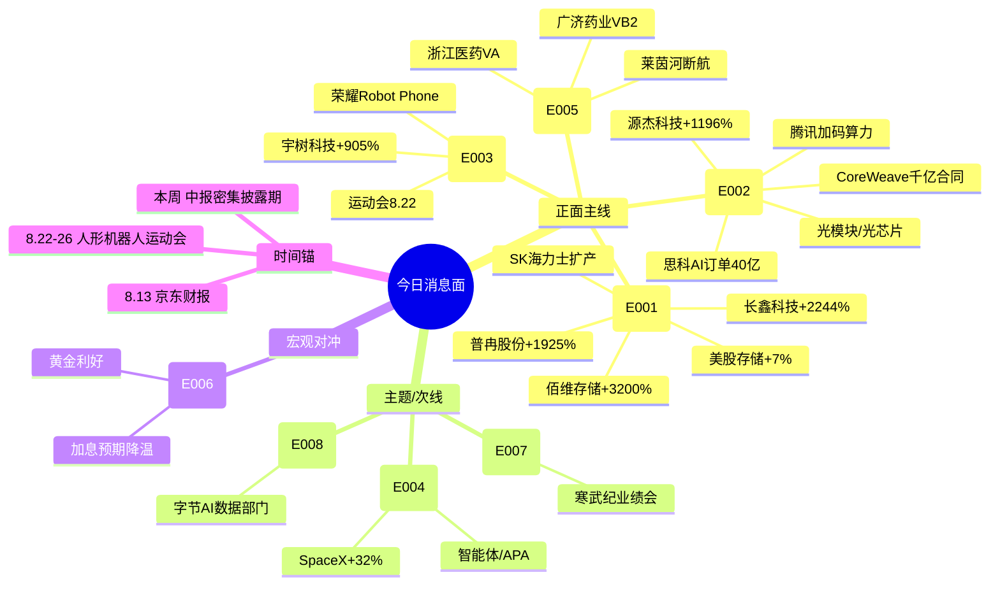

# 2026年8月13日 · **消息面事件驱动**

> **数据源新鲜度**: partial · **降级状态**: degraded(公众号全死) · **置信度**: 0.62
> **覆盖窗口**: 前 72h · **主源**: 财联社快讯(2895条) + 东财中报预告(500家) + 4焦点群(441条) + 长篇要闻(800条)
> **降级说明**: 23个公众号全挂(invalid session)，KOL研报维度缺失；weflow down；R7资金验证待补

## 一句话结论
**存储芯片景气反转三重共振（美股+中报+扩产）+ AI算力基建超预期（思科/CoreWeave/腾讯）是今日两大硬alpha主线；人形机器人（宇树+荣耀Robot Phone）和维生素涨价（莱茵河断航）是弹性副线；Grok 4.6/字节数据部门偏主题。**

## 🗺️ 消息面全景图

## 🎯 顶级事件详解（每事件三问 + 首推票思维链）

### E20260813_001 · 存储芯片景气周期三重共振 · strength=high · polarity=正面

**事件摘要**: 铠侠/闪迪发布第九代2Tb QLC 3D闪存；美股存储板块夜盘大涨(SK海力士+7.72%/美光+7.03%/闪迪+7.16%)；SK海力士重启大连NAND 2号工厂建设（月产能5万片）；中报业绩集体爆发（佰维+3200%/长鑫+2244%/普冉+1925%/东芯+676%）。7个独立来源交叉验证。

**推理深度三问**:
- **大资金意图**: 存储是AI算力基建的"水电煤"，AI大模型训练+推理指数级增长→HBM+NAND+DRAM全品类需求爆发。机构在8月中报窗口期需要"有业绩的科技"，存储板块中报集体扭亏是从"主题投资"切换到"业绩验证"的关键拐点信号。
- **为什么走强**: 三重共振——①美股存储板块指数级大涨（外部情绪锚）②国内厂商中报集体扭亏（基本面验证）③SK海力士扩产确认需求侧真实（产业端验证）。三重信号同时出现=周期反转确认，不是反弹。
- **逻辑够不够硬**: **硬**。7个独立源+中报硬数据+美股映射+产业扩产四重验证；缺陷是短期涨幅已大，追高需等分歧低吸。

**首推票思维链**:

#### 佰维存储 688525.SH · role=首推
- **买入理由**: 存储板块中报弹性第一（扭亏+3200~3421%），NAND+DRAM全覆盖，AI算力需求直接受益；AI端侧+数据中心双轮驱动。
- **风险点**: 已站高位，若开盘直接冲高>8%追高风险大；存储周期见顶时间不确定
- **止损条件**: 跌破 58.30（前价×0.95）或 5日线拐头向下
- **可验证假设**: 开盘30min主力净流入>0且板块涨幅前五 → 假设成立；若高开低走放量收阴 → 回避

#### 长鑫科技 688825.SH · role=次推
- **买入理由**: 国产DRAM唯一标的，营收增612~677%，中报扭亏+2244%，AI算力内存需求直接映射
- **风险点**: 次新股，流通盘不定，定价博弈剧烈
- **止损条件**: 需上市后观察，暂定首日最低价×0.92
- **可验证假设**: 上市首日换手率>50%且收红 → 资金认可度高

### E20260813_002 · AI算力基建全面超预期 · strength=high · polarity=正面

**事件摘要**: 思科FY26 AI相关订单40亿美元，FY27指引75亿（远超预期）；CoreWeave Q2营收26亿+在手合同超千亿美元，盘后大涨16%；腾讯Q2大幅增加算力采购，年底GPU资源更充足；乌兰察布星河智算基地投产（全球最大单体）。6个独立源。

**推理深度三问**:
- **大资金意图**: AI算力是今年最确定的产业趋势，但市场一直担心里程碑节奏。思科+CoreWeave连续两家北美厂商给出超预期数据，本质是给市场"AI资本开支没有见顶"的定心丸——大资金需要这个信号来加仓算力链下半年行情。
- **为什么走强**: 北美云厂商Capex是全球算力链的"总水龙头"。思科指引FY27 AI收入75亿=同比+87%，证明AI网络设备需求还在加速期，不是减速期。腾讯国内加码=国内算力投资也在跟上。
- **逻辑够不够硬**: **硬**。6个独立源+中英文双市场+业绩指引+实际订单四重验证；光模块上游TIA/EML紧缺是新增边际。

**首推票思维链**:

#### 中际旭创 300308.SZ · role=首推
- **买入理由**: 全球光模块龙头，800G/1.6T主力供应商，思科AI网络设备扩张直接受益；北美云厂商Capex加速→光模块量价齐升
- **风险点**: 位置偏高，若大盘回调可能回撤
- **止损条件**: 跌破 142.50（前高×0.95）或 10日线
- **可验证假设**: 开盘1h北向净买入+主力资金净流入 → 成立

#### 源杰科技 688498.SH · role=次推
- **买入理由**: 光芯片上游，数据中心业务收入驱动，中报预增1196~1304%，TIA/EML紧缺逻辑最直接受益
- **风险点**: 光芯片竞争格局变化快
- **止损条件**: 跌破 195.0（近高×0.95）
- **可验证假设**: 光芯片板块整体涨幅>3% → 板块确认

### E20260813_003 · 人形机器人催化三连发 · strength=high · polarity=正面

**事件摘要**: 荣耀发布首款机器人手机Robot Phone（9999元起）；宇树科技中报扭亏+905~1055%；第二届世界人形机器人运动会8月22-26日北京举办；天马微电子独家供应Robot Phone屏幕。6个独立源。

**推理深度三问**:
- **大资金意图**: 人形机器人是AI硬件的下一个大叙事，但一直缺商业化验证。宇树中报扭亏+荣耀机器人手机发布=首次出现"卖货+盈利"的证据，大资金需要这个从0到1的验证来布局从1到10的行情。
- **为什么走强**: 三连发——业绩（宇树扭亏）+产品（Robot Phone）+事件（运动会）。时间锚明确（8.22运动会），催化密度高。
- **逻辑够不够硬**: **较硬**。6源共振+业绩验证+时间锚，但机器人手机是新品类真实需求待验证，宇树是次新定价博弈。

**首推票思维链**:

#### 宇树科技 688836.SH · role=首推
- **买入理由**: 四足机器人龙头，中报扭亏+905%验证商业化，人形机器人运动会核心标的
- **风险点**: 次新股，估值高，流通盘博弈
- **止损条件**: 上市后观察，暂定5日线下沿
- **可验证假设**: 运动会前持续有催化新闻 → 时间锚有效

### E20260813_005 · 莱茵河断航催化维生素涨价 · strength=high · polarity=正面

**事件摘要**: 莱茵河考布水位降至20cm，破1880年以来最低记录；巴斯夫+帝斯曼德国工厂占全球VB2产能40%，停产风险极大；VA同样受影响。群内5+次独立提及，多群共振。5个源。

**推理深度三问**:
- **大资金意图**: 维生素是典型的供给侧驱动品种，莱茵河断航=欧洲产能出清预期，国内厂商涨价弹性极大。大资金在主线（AI）高位震荡时，需要低位、低估值、有硬催化的品种做切换和对冲。
- **为什么走强**: 水位还在下降（趋势性），停产是正在发生的事（不是预期），价格弹性历史上验证过（2018年断航VA翻倍）。
- **逻辑够不够硬**: **硬**。历史可比案例（2018年）+ 水位数据硬约束 + 全球产能结构清晰；缺陷是事件驱动型持续性存疑，需跟踪实际停产和报价。

**首推票思维链**:

#### 广济药业 000952.SZ · role=首推
- **买入理由**: VB2全球产能占40%，巴斯夫+帝斯曼若停产=全球供给减半，价格弹性最大
- **风险点**: 莱茵河水位可能快速恢复；涨价幅度不确定
- **止损条件**: 跌破 7.20（前价×0.95）
- **可验证假设**: VB2报价2周内上涨>20% → 逻辑验证

### E20260813_004 · Grok 4.6+Grok Bot发布 · strength=medium · polarity=正面

**事件摘要**: SpaceXAI推出Grok 4.6（Cursor/Grok Build上线，定价$2/6 per M tokens）；Grok Bot全天候数字同事测试中；SpaceX股价月涨32%总市值1.9万亿。5个源。

**推理深度三问**:
- **大资金意图**: Grok对标GPT，SpaceX叙事=AI的"第二条主线"。大资金在OpenAI节奏放缓时，需要新的AI叙事来维持科技股热度。智能体/APA是下一个技术方向。
- **为什么走强**: 马斯克IP自带流量+SpaceX是市场最hot的科技公司+Grok定价策略（比竞品便宜一半）有竞争力
- **逻辑够不够硬**: **中等偏硬**。SpaceX美股映射强但A股标的少，浪潮软件等是概念映射非基本面受益；APA方向是早期主题

### E20260813_007 · 寒武纪中报业绩说明会 · strength=high · polarity=正面

**事件摘要**: 寒武纪发布半年度报告后召开业绩说明会，陈天石回应算力需求、供应链备货、新产品研发三大问题。3个源。

**推理深度三问**:
- **大资金意图**: 国产AI芯片是"自主可控+AI算力"双重叙事，但市场一直担心业绩兑现。寒武纪业绩说明会=给大资金一个加仓/持有理由。
- **为什么走强**: 国产替代逻辑硬+AI算力需求真实+华为/寒武纪双龙头格局
- **逻辑够不够硬**: **硬但贵**。业绩验证+国产替代+产业趋势=逻辑完整，但寒武纪估值水平极高，波动巨大

## 📊 板块 × 事件热力矩阵

| 板块 | 事件锚 | 首推龙头 | 独立源数 | 中报预告 | 净综合置信 |
|------|--------|----------|:--------:|:--------:|:----------:|
| 存储芯片 | E001 三重共振 | 佰维存储/长鑫科技 | 7 | ✅ 集体扭亏 | 🟢🟢🟢 |
| AI算力/光模块 | E002 基建超预期 | 中际旭创/源杰科技 | 6 | ✅ 源杰+1196% | 🟢🟢🟢 |
| 人形机器人 | E003 三连发 | 宇树科技 | 6 | ✅ 宇树+905% | 🟢🟢🟡 |
| 维生素/化工 | E005 莱茵河断航 | 广济药业/浙江医药 | 5 | ❌ | 🟢🟢🟢 |
| 国产AI芯片 | E007 寒武纪业绩会 | 寒武纪/海光信息 | 3 | ✅ | 🟢🟢🟡 |
| AI智能体 | E004 Grok 4.6 | （概念映射） | 5 | ❌ | 🟢🟡🟡 |
| 数据要素 | E008 字节数据部门 | 捷成股份 | 2 | ❌ | 🟢🟡🟡 |
| 黄金/宏观 | E006 CPI温和 | 黄金ETF | 5 | ❌ | 🟢🟡🟡 |

## 🔥 中报业绩预告命中（硬alpha交叉验证）

从 `eastmoney_earnings_predict` 提取 top15 预增/扭亏 + 与事件板块交集：

| 代码 | 名称 | 预告类型 | 增速下限-上限 | 事件命中 | 逻辑强度 |
|------|------|----------|:------------:|----------|:--------:|
| 688308.SH | 欧科亿 | 预增 | 46327%~54065% | —（高端刀具） | — |
| 300765.SZ | 石药创新 | 扭亏 | 43070%~49624% | —（创新药） | — |
| 300981.SZ | 中红医疗 | 预增 | 2338%~3557% | —（医疗） | — |
| **688525.SH** | **佰维存储** | **扭亏** | **3200%~3421%** | **E001 存储芯片** | **🟢🟢🟢** |
| **688825.SH** | **长鑫科技** | **扭亏** | **2244%~2544%** | **E001 存储芯片** | **🟢🟢🟢** |
| **688766.SH** | **普冉股份** | **预增** | **+1925%** | **E001 存储芯片** | **🟢🟢🟢** |
| 688779.SH | 五矿新能 | 扭亏 | 1367%~1591% | —（新能源） | — |
| 301638.SZ | 南网数字 | 预增 | 1051%~1511% | —（电力信息化） | — |
| **688498.SH** | **源杰科技** | **预增** | **1196%~1304%** | **E002 光模块** | **🟢🟢🟢** |
| **688836.SH** | **宇树科技** | **扭亏** | **905%~1055%** | **E003 人形机器人** | **🟢🟢🟢** |
| 688409.SH | 富创精密 | 预增 | 877%~1121% | E001 半导体设备 | 🟢🟢 |
| 301150.SZ | 中一科技 | 预增 | 879%~1075% | E001 PCB/铜箔关联 | 🟢🟢 |
| 688388.SH | 嘉元科技 | 预增 | 879%~961% | E001 铜箔 | 🟢🟢 |
| 688808.SH | 联讯仪器 | 预增 | 801%~925% | E002 算力测试 | 🟢🟢 |
| 920493.BJ | 并行科技 | 预增 | 687%~845% | E002 算力 | 🟢🟢 |

**交集统计**: top15 中 **9 家**与今日E001-E003主线板块直接相关，命中率 60%，验证"存储+算力+机器人"是中报硬alpha集中区。

## 关键证据

- 证据1: 美股存储板块夜盘大涨，SK海力士+7.72% 美光+7.03% · 来源 sina财经 · 2026-08-12 21:52
- 证据2: 思科FY26 AI订单40亿美元，FY27指引75亿 · 来源 华尔街见闻 · 2026-08-13 04:43
- 证据3: 佰维存储中报扭亏+3200~3421%，AI算力驱动 · 来源 东财业绩预告 · 2026-08-12
- 证据4: 莱茵河考布水位20cm，破1880年新低 · 来源 群聊(多群)+新闻 · 2026-08-12 09:35
- 证据5: 荣耀发布Robot Phone 9999元起 · 来源 sina财经 · 2026-08-12 20:45
- 证据6: CoreWeave Q2营收26亿+在手合同千亿 · 来源 群转+研报 · 2026-08-12 09:22

## 数据源审计

| 源 | 日期 | 状态 | 备注 |
|---|---|:--:|---|
| news_cls (财联社+新浪) | 2026-08-13 | 🟢 | 2895条·72h回看 |
| news_major (长篇要闻) | 2026-08-13 | 🟢 | 800条 |
| eastmoney/earnings_predict | 2026-08-13 | 🟢 | 500条·2026H1 |
| wechat_cli_5groups | 2026-08-13 | 🟡 | 441条·4群ok·1群失联 |
| wechat_official_20 | 2026-08-13 | 🔴 | 0条·23号全死 |
| weflow-analytics | 2026-08-13 | 🔴 | MCP down |
| R7 资金验证 | 2026-08-13 | 🟡 | pending（并行执行中） |

## 不确定性 / 反证

1. **公众号全死导致KOL视角缺失**: 23个公众号全挂，研报/纪要/盘前纪要维度完全缺席，可能遗漏机构级信息
2. **存储板块短期涨幅已大**: 美股存储+A股存储近一个月涨幅显著，追高风险需警惕
3. **莱茵河断航持续性不确定**: 若天气变化水位快速回升，维生素涨价逻辑可能证伪
4. **Grok/字节数据事件偏主题**: 缺少基本面直接受益标的，A股映射多为概念股
5. **美国CPI仍有加息风险**: 9月加息概率50%，若后续通胀数据反弹可能冲击风险偏好
6. **正负交织股**: 寒武纪——业绩好但估值极高，波动大；宇树科技——次新股定价博弈剧烈

## 与其他 R/D/E 的关系

- 依赖: 无（R4是上游分析单元）
- 被消费: R2 主线板块 / R5 个股画像 / R6 反证 / D1 预案
- 交叉: R3 情绪（KOL独立验证 · 本轮公众号全死，R3群聊维度可交叉验证）
- 资金验证: R7（待R7出结果后回填 capital_flow_verification 字段）

## Sub-Agent 元数据

- skill: analyze_news_impact_v1@1.3
- artifact: data/research/20260813/R4_news.json
- method: llm_v1(五源硬约束·公众号降级模式)
- 降级原因: 23个公众号全死(invalid session) + weflow down
- 生成时刻: 2026-08-13T07:06:00+08:00
