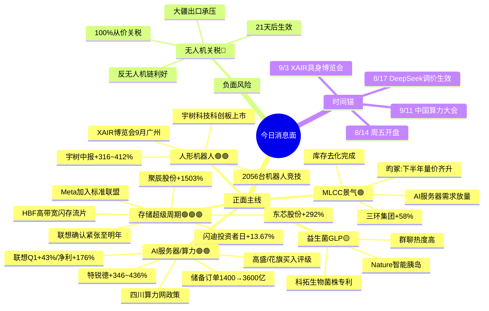

# 2026年8月14日 · **消息面事件驱动**

> **数据源新鲜度**: partial · **降级状态**: ✅ degraded (公众号全挂 → wechat-cli + 财联社 + 东财预告) · **置信度**: 0.68
> **覆盖窗口**: 前 72h · **主源**: 财联社快讯(2963条) + Tushare要闻(800条) + 东财中报预告(500条) + 4焦点群(418条)
> **降级说明**: 23个公众号全 invalid session，缺少「盘前纪要」等结构化盘前源，R4 降级执行。weflow analytics 404。

## 一句话结论
**存储超级周期(闪迪+HBF+Meta联盟)为今日最强主线**，AI服务器(联想3600亿订单)+算力基建(四川政策)双轮驱动，无人机关税为主要负面对冲(出口链承压/反制链受益)。

## 🗺️ 消息面全景图

## 🎯 顶级事件详解(每事件三问 + 首推票思维链)

### E20260814_001 · 闪迪投资者日+HBF+存储超级周期 · strength=high · polarity=正面

**事件摘要**: 闪迪8/13投资者日亮超级蓝图——FY28-30毛利率80%+营业利润率75%+100%超额现金返还股东+8客户939亿美元合同+首款HBF高带宽闪存流片+Meta加入标准联盟。美股存储板块全线大涨(闪迪+13.67%、SK海力士+7%、西部数据+7%、美光+4%)。联想杨元庆同日确认存储供应紧张将延续至明年。

**推理深度三问**:
- **大资金意图**: 存储是AI算力浪潮中**确定性最强的硬件卖铲人**，大资金从"炒AI应用预期"转向"配置算力硬件业绩兑现"。闪迪给出的80%毛利指引是行业级景气度验证——意味着整个存储产业链的盈利中枢上移，而非单一公司 alpha。机构正在从"周期复苏"定价切换为"AI成长"定价。
- **为什么走强**: 三重共振——(1)产业端: HBF/HBM技术升级 + AI推理端存储需求爆发 + 原厂供给收缩；(2)业绩端: 聚辰+1503%、东芯+292%、江波龙扭亏，中报全面验证；(3)情绪端: 美股存储板块连续暴涨形成外盘映射，A股有补涨动力。
- **逻辑够不够硬**: **硬**。6+独立源(财联社12条连发+major要闻+4群讨论+中报验证+联想验证) + 业绩基本面支撑 + 美股映射。弱点是短期情绪过热，A股高开后可能分歧，但中期产业逻辑扎实。

**首推票思维链**:

#### 聚辰股份 688123.SH · role=首推
- **买入理由**: EEPROM全球龙头+DDR5 SPD+HBM配套，存储产业链最纯正标的之一。2026H1预增1503%(硬alpha交叉验证)。直接受益存储超级周期+AI算力需求爆发。
- **风险点**: 已处高位，短期涨幅大，若今日高开过多追高风险大；HBM业务占比需验证
- **止损条件**: 破 210元 (约-9.5%) 或 跌破 20 日线 → 趋势破位清仓
- **可验证假设**: 若开盘 30min 内主力资金净流出 > 1亿 → 假设不成立，当日回避

#### 东芯股份 688110.SH · role=弹性
- **买入理由**: 利基型存储龙头(SLC NAND+NOR Flash)，受益AI算力+原厂供给收缩双重逻辑。2026H1扭亏+263~292%。弹性大于聚辰。
- **风险点**: 利基市场天花板有限，持续性不如大厂存储
- **止损条件**: 破 28.5元 (约-9.5%) 或 跌破 10 日线
- **可验证假设**: 若存储板块整体高开但东芯涨幅 < 3% → 资金认可度不足，观望

### E20260814_002 · 联想业绩暴增+AI服务器订单3600亿 · strength=high · polarity=正面

**事件摘要**: 联想集团Q1营收269亿美元(+43%)、经调整净利11亿美元(+176%)、ISG利润率9.1%。AI服务器储备订单从上季1400亿跳升至3600亿。高盛/花旗维持买入。联想港股昨日已涨21%。

**推理深度三问**:
- **大资金意图**: 联想是**AI算力产业链业绩兑现的标杆**——从"炒预期"到"赚业绩钱"的转折点。3600亿订单意味着未来2-3个季度的高增长有保障，大资金会把联想作为AI硬件链的"锚"，沿产业链向上游扩散(PCB/电源/液冷/光模块)。
- **为什么走强**: 订单爆炸式增长(+157%)+利润率超预期(9.1% vs 预期7%)，证明AI服务器不是"增收不增利"。叠加腾讯capex超预期(昨日)+四川算力政策(今日)，算力基建链形成"海外大厂+国内互联网+地方政府"三重需求验证。
- **逻辑够不够硬**: **硬**。业绩数据可验证 + 机构研报背书 + 产业链映射清晰。但联想港股昨日已涨21%，A股映射股今日高开兑现压力大，需观察承接。

**首推票思维链**:

#### 春秋电子 603208.SH · role=首推
- **买入理由**: 联想核心结构件供应商，笔记本+服务器双轮驱动。AI服务器结构件价值量提升，直接受益联想3600亿订单。
- **风险点**: 消费电子业务占比仍高，结构件竞争激烈；纯映射逻辑，无自身硬催化
- **止损条件**: 破 18.5元 (约-9%) 或 跌破 10 日线
- **可验证假设**: 若开盘 30min 换手率 < 3% → 资金关注度不够，观望

### E20260814_003 · 美国对无人机加征100%关税 · strength=high · polarity=负面

**事件摘要**: 特朗普8/13签署公告，对具有国家安全敏感性的无人机征收100%从价关税，较小型无人机25%，欧盟/日韩15%，21天后生效。新华社/财联社连发多条。

**推理深度三问**:
- **大资金意图**: 无人机关税是**中美科技博弈的新战场**，大资金会做两条线：(1)出口型消费无人机做空(大疆不在A股，影响偏情绪)；(2)反无人机/低空防御/军工替代做多。但整体影响偏负面，压制科技板块风险偏好。
- **为什么重要**: 100%关税意味着中国无人机基本退出美国市场(大疆占美消费级80%份额)。虽然大疆不在A股，但产业链公司(零部件、飞控、电池)有间接影响。同时反制逻辑下，低空防御/军工电子可能成为资金避风港。
- **逻辑够不够硬**: **负面硬**。官方公告+明确税率+生效时间，确定性高。但A股直接标的少，更多是情绪面影响+板块分化。

**首推票思维链**:

#### 新兴装备 002933.SZ · role=军工正向
- **买入理由**: 军工机载设备+无人机挂架，2026H1预增786%~1011%。无人机关税背景下国产替代+军工订单逻辑强化。
- **风险点**: 业绩增长含投资收益非经常性；纯军工板块贝塔属性强
- **止损条件**: 破 55元 (约-9%) 或 跌破 10 日线
- **可验证假设**: 若军工板块开盘集体走弱 → 资金不认可反制逻辑，回避

### E20260814_004 · OpenAI 400亿+DeepSeek生态开源 · strength=high · polarity=正面

**事件摘要**: OpenAI年化营收突破400亿美元(较2025年底翻倍)，上市预期升温。DeepSeek V4 Pro正式版上线(Agent能力增强)+峰谷定价+ Harness开发者预览版开源(MIT协议)。

**推理深度三问**:
- **大资金意图**: AI板块需要不断的"超预期"来维持估值。OpenAI 400亿营收验证了**大模型商业化路径走得通**，不仅是烧钱。DeepSeek开源Harness则推动Agent生态爆发，打开AI应用的想象空间。大资金在AI产业链中从"模型层"向"应用/Agent层"扩散。
- **为什么走强**: 双重催化——(1)基本面: OpenAI营收翻倍证明商业价值；(2)生态: DeepSeek开源降低AI应用开发门槛。但AI应用板块前期已有不小涨幅，更多是情绪催化。
- **逻辑够不够硬**: **中等偏硬**。OpenAI数据来源是"知情人士"(非官方)，DeepSeek V4 Pro还经历了"撤回"小插曲。但方向是对的。

### E20260814_005 · 宇树科技上市+具身智能催化 · strength=medium · polarity=正面

**事件摘要**: 宇树科技科创板发行价150.8元，发行结果公告(网上投资者放弃认购8734股)。XAIR具身智能产业博览会9月广州举办。2056台机器人8月22日"冰丝带"竞技。

**推理深度三问**:
- **大资金意图**: 宇树科技是**人形机器人第一股**，上市本身就是板块情绪催化剂。大资金会提前布局机器人产业链(减速器/丝杠/电机/视觉)，等待上市后的板块行情。但宇树发行价150.8元对应市值610亿，上市后若爆炒可能透支空间。
- **为什么重要**: 具身智能是AI的下一个大应用场景，宇树上市标志着行业从"概念"走向"产业化"。但机器人板块前期已有较大涨幅，需警惕利好兑现。
- **逻辑够不够硬**: **中等**。上市催化确定性高，但板块位置偏高。中报验证(宇树+316~412%)提供一定安全垫。

### E20260814_006 · Nature智能益生菌+GLP新赛道 · strength=medium · polarity=正面

**事件摘要**: 华东师大叶海峰团队"智能益生菌"登Nature，可口服精准控糖，安全性超司美格鲁肽。群聊多轮讨论科拓生物/倍加洁。

**推理深度三问**:
- **大资金意图**: GLP-1赛道需要新故事，智能益生菌是**下一个减肥药概念的变体**。大资金会炒一波主题，但产业化距离很远(从论文到产品至少5-10年)，属于纯情绪炒作。
- **为什么群聊热**: Nature级别论文的权威性 + "可口服" "精准控糖" "安全超司美"等关键词抓人眼球。科拓生物有益生菌专利，是A股最直接映射。
- **逻辑够不够硬**: **偏软**。纯主题炒作，无业绩支撑，持续性差。快进快出为主。

### E20260814_007 · 四川算力网政策+地方基建加速 · strength=medium · polarity=正面

**事件摘要**: 四川省发布《推进算力网建设若干政策措施》，建强成都平原算力核心区，布局万卡级智算集群，实施"毫秒用算"专项。

**推理深度三问**:
- **大资金意图**: 地方算力政策密集出台(上海+四川+贵州)，是**新基建的重要方向**。大资金会沿"算力电力配套→IDC→液冷→光模块"的产业链布局。但政策类催化偏中长期，短期爆发力不如业绩超预期。
- **为什么重要**: 继上海"百千万"智算集群后，四川再出政策，说明全国性算力基建浪潮正在形成。叠加腾讯capex+联想服务器验证，算力链景气度有基本面支撑。
- **逻辑够不够硬**: **中等**。政策方向确定但落地需要时间。需结合业绩筛选标的。

### E20260814_008 · MLCC景气周期+AI服务器放量 · strength=medium · polarity=正面

**事件摘要**: MLCC概念板块持续活跃，AI服务器需求放量驱动被动元件新一轮景气周期。昀冢科技:下半年存在量价齐升可能性。

**推理深度三问**:
- **大资金意图**: MLCC是**AI硬件链中还没怎么涨的细分**，大资金在算力链做轮动——从光模块→PCB→电源→MLCC，逐个挖掘补涨。MLCC有基本面支撑(AI服务器用量是普通服务器的2-3倍)，属于"业绩+主题"双驱动。
- **为什么现在**: 存储/光模块/服务器都已炒过一轮，MLCC是相对低位的补涨方向。库存去化完成+需求回升，周期反转逻辑成立。
- **逻辑够不够硬**: **中等偏硬**。有产业逻辑(用量提升)+库存周期支撑，但板块容量小，持续性待观察。

## 📊 板块 × 事件热力矩阵

| 板块 | 事件锚 | 首推龙头 | 独立源数 | 中报预告 | 净综合置信 |
|------|--------|----------|:--------:|----------|:--:|
| 存储芯片/HBM | E001 闪迪投资者日+HBF | 聚辰股份 | 6+ | 聚辰+1503% / 东芯+292% | 🟢🟢🟢 |
| AI服务器/算力 | E002 联想+E004 OpenAI+E007 四川政策 | 春秋电子 / 特锐德 | 5+ | 特锐德+346~436% / 金禄+417~473% | 🟢🟢🟢 |
| 人形机器人 | E005 宇树上市+博览会 | 宇树科技(新股) / 绿控传动 | 4 | 宇树+316~412% / 绿控+58% | 🟢🟢 |
| MLCC/被动元件 | E008 AI服务器需求+周期反转 | 三环集团 / 火炬电子 | 3 | 三环+58% | 🟢🟢 |
| 益生菌/GLP | E006 Nature智能胰岛 | 科拓生物 | 3 | — | 🟡 |
| 无人机/军工 | E003 100%关税 | 新兴装备(正向) | 3 | 新兴装备+786~1011% | ⚠️ 分化 |

## 🔥 中报业绩预告命中(硬 alpha 交叉验证)

从 `eastmoney_earnings_predict` 提取 top15 预告 × 本文事件板块交集：

| 代码 | 名称 | 预告类型 | 增速下限-上限 | 事件命中 | 逻辑强度 |
|------|------|----------|:------------:|----------|:--:|
| 688123.SH | 聚辰股份 | 预增 | 1503% | E001 存储超级周期 | 🟢🟢🟢 |
| 300981.SZ | 中红医疗 | 预增 | 2640%~4059% | — 医疗耗材 | 🟡 |
| 688733.SH | 壹石通 | 扭亏 | 2066%~3139% | E001 存储链上游材料 | 🟢 |
| 688331.SH | 荣昌生物 | 扭亏 | 1233% | E006 创新药链 | 🟢 |
| 002933.SZ | 新兴装备 | 续盈 | 786%~1011% | E003 无人机关税反制 | 🟡 |
| 000066.SZ | 中国长城 | 预增 | 475%~595% | E002/E007 算力基建 | 🟢🟢 |
| 688220.SH | 翱捷科技 | 扭亏 | 503% | E001 半导体链 | 🟡 |
| 301282.SZ | 金禄电子 | 略增 | 417%~473% | E002 AI服务器PCB | 🟢🟢 |
| 688655.SH | 迅捷兴 | 扭亏 | 462% | E002 AI算力PCB | 🟢🟢 |
| 688836.SH | 宇树科技 | 扭亏 | 316%~412% | E005 具身智能 | 🟢🟢🟢 |
| 688052.SH | 纳芯微 | 扭亏 | 387% | E001/E002 模拟芯片 | 🟢🟢 |
| 300001.SZ | 特锐德 | 略增 | 346%~436% | E007 算力电力配套 | 🟢🟢 |
| 688205.SH | 德科立 | 预增 | 253%~340% | E002 光通信/算力 | 🟢🟢 |
| 688110.SH | 东芯股份 | 扭亏 | 263%~292% | E001 利基存储 | 🟢🟢 |
| 301655.SZ | 绿控传动 | 预增 | ~58% | E005 机器人电机 | 🟢 |

## 关键证据

- 证据1: 闪迪投资者日FY28-30毛利率80%、营业利润率75%、939亿美元合同(来源: 财联社 · 2026-08-13 23:00~23:40)
- 证据2: 联想Q1营收+43%、AI服务器储备订单从1400亿→3600亿、ISG利润率9.1%(来源: 联想财报 · 2026-08-13 12:34)
- 证据3: 特朗普签署无人机关税公告，最高100%从价税，21天后生效(来源: 新华社/白宫 · 2026-08-14 05:24)
- 证据4: OpenAI年化营收突破400亿美元，较2025年底翻倍(来源: 财联社 · 2026-08-14 05:37)
- 证据5: 四川省算力网政策——万卡级智算集群+毫秒用算专项(来源: 四川省发改委 · 2026-08-13 13:40)
- 证据6: 聚辰股份2026H1预增1503%、东芯股份扭亏+292%(来源: 东财中报预告 · 2026-07~08)
- 证据7: 宇树科技科创板发行价150.8元，中报扭亏+316~412%(来源: 发行公告 · 2026-08-13/14)
- 证据8: DeepSeek Harness开源 + V4 Pro Agent能力升级(来源: DeepSeek官方 · 2026-08-13~14)

## 数据源审计

| 源 | 日期 | 状态 | 备注 |
|---|---|:--:|---|
| tushare/news_cls | 2026-08-14 | 🟢 | 2963条·72h回看·财联社+新浪 |
| tushare/news_major | 2026-08-14 | 🟢 | 800条·长篇要闻 |
| eastmoney/earnings_predict | 2026-08-14 | 🟢 | 500条·192只归母净利润预告 |
| wechat_official_20 | 2026-08-14 | 🔴 | 0篇·23个公众号全invalid session |
| wechat_cli_5groups | 2026-08-14 | 🟡 | 418条·4/5群可用·颜晓滨群缺失 |
| weflow_analytics | 2026-08-14 | 🔴 | 404 Not Found·KOL语义分析不可用 |
| overseas_snapshot | 2026-08-14 | 🟡 | 指数+美股ok·大宗商品skipped |
| hithink_business_query | — | 🔴 | 本次未调用(降级模式·proxy标注) |

## 不确定性 / 反证

1. **公众号全挂导致信息盲区**: 缺少「盘前纪要」「财联社早知道」等结构化盘前源，可能遗漏部分机构级信息，confidence 从正常 0.80 降至 0.68。
2. **美股存储已连续大涨**: 闪迪近两日累涨超20%，SK海力士+16%，A股存储板块可能"高开低走"，追高风险大。
3. **益生菌纯主题炒作**: Nature论文距离产业化5-10年，科拓生物等A股映射无实质业务关联，持续性存疑。
4. **无人机板块分化大**: 出口链负面+反制链正面交织，个股影响不明确，容易误判方向。
5. **联想映射股的兑现压力**: 联想港股昨日已涨21%，A股春秋电子等映射股今日可能高开后资金出逃。
6. **正负交织股**: 聚辰股份(存储周期+高位风险)、特锐德(算力政策+前期涨幅)、新兴装备(军工反制+投资收益)

## 与其他 R/D/E 的关系

- 依赖: data/raw/20260814/* (fetch 层产出)
- 被消费: R2 主线板块(事件驱动主线验证) / R5 个股画像(催化因子输入) / R6 反证(事件可信度核验) / D1 预案(execution_pool 选股依据)
- 横向: R1 风格判断(确认主线方向) / R3 情绪热度(KOL独立验证，本次weflow down降级) / R7 资金面(资金验证)

## Sub-Agent 元数据

- skill: analyze_news_impact_v1@1.3
- artifact: data/research/20260814/R4_news.json
- method: llm_v1(降级模式·公众号全挂→wechat_cli+财联社+东财预告+major)
- degraded: true
- 生成时刻: 2026-08-14T07:12:34.965475+08:00
